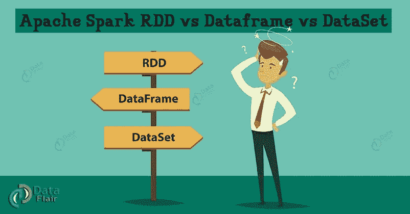

# 使用 PySpark 进行情感分析

> 原文：<https://towardsdatascience.com/sentiment-analysis-with-pyspark-bc8e83f80c35?source=collection_archive---------1----------------------->


Photo by [Chris J. Davis](https://unsplash.com/@chrisjdavis?utm_source=medium&utm_medium=referral) on [Unsplash](https://unsplash.com?utm_source=medium&utm_medium=referral)

Apache Spark 是我非常感兴趣但没有太多机会探索的工具之一。大多数时候，Pandas 和 Scikit-Learn 足以处理我试图建立模型的数据量。但这也意味着我还没有机会处理数 Pb 的数据，我希望为我面临真正大数据的情况做好准备。

我以前尝试过用 PySpark 进行一些基本的数据操作，但只达到非常基本的水平。我想在使用 PySpark 的过程中了解更多信息，更加得心应手。这篇文章是我为了更好地理解 PySpark 所做的努力。

Python 非常适合数据科学建模，这要归功于它众多的帮助实现数据科学目标的模块和包。但是，如果您处理的数据无法放入一台机器中，该怎么办呢？也许您可以在单台机器上实现仔细的采样来进行分析，但是使用像 PySpark 这样的分布式计算框架，您可以高效地实现大型数据集的任务。

Spark API 支持多种编程语言(Scala、Java、Python 和 R)。关于 Spark 的性能如何随运行它的语言而变化，存在争议，但是因为我一直使用的主要语言是 Python，所以我将重点讨论 PySpark，而不会过多地讨论我应该为 Apache Spark 选择什么语言。



Image courtesy of [DataFlair](https://data-flair.training/blogs/apache-spark-rdd-vs-dataframe-vs-dataset/)

Spark 通过其 API 提供了三种不同的数据结构:RDD、Dataframe(这不同于 Pandas data frame)、Dataset。对于这篇文章，我将使用 Dataframe 和相应的机器学习库 SparkML。我首先决定了我想要使用的数据结构，这是基于来自 Analytics Vidhya 的帖子的建议。Dataframe 比 RDD 快得多，因为它有关联的元数据(一些关于数据的信息)，这允许 Spark 优化查询计划可以从[原帖](https://www.analyticsvidhya.com/blog/2016/09/comprehensive-introduction-to-apache-spark-rdds-dataframes-using-pyspark/)中找到全面的介绍。

在 Databricks 上也有一个信息丰富的帖子，比较了 Apache Spark 的不同数据结构:“[三个 Apache Spark APIs 的故事:rdd、DataFrames 和 Datasets](https://databricks.com/blog/2016/07/14/a-tale-of-three-apache-spark-apis-rdds-dataframes-and-datasets.html) ”。

然后我发现，如果我想处理 Dataframe，我需要使用 SparkML 而不是 SparkMLLib。SparkMLLib 与 RDD 一起使用，而 SparkML 支持 Dataframe。

还有一点需要注意的是，我将使用笔记本电脑在本地模式下工作。本地模式通常用于原型、开发、调试和测试。然而，由于 Spark 的本地模式与集群模式完全兼容，本地编写的代码只需几个额外的步骤就可以在集群上运行。

为了在 Jupyter 笔记本中使用 PySpark，您应该配置 PySpark 驱动程序，或者使用一个名为 Findspark 的包，使 Spark 上下文在您的 Jupyter 笔记本中可用。您可以通过命令行上的“pip install findspark”轻松安装 Findspark。让我们首先加载一些我们需要的基本依赖项。

除了我将附上的简短代码块，你可以在这篇文章的末尾找到整个 Jupyter 笔记本的链接。

```
import findspark
findspark.init()
import pyspark as ps
import warnings
from pyspark.sql import SQLContext
```

任何 Apache 编程的第一步都是创建 SparkContext。当我们想要在集群中执行操作时，需要 SparkContext。SparkContext 告诉 Spark 如何以及在哪里访问集群。这是连接 Apache 集群的第一步。

```
try:
    # create SparkContext on all CPUs available: in my case I have 4 CPUs on my laptop
    sc = ps.SparkContext('local[4]')
    sqlContext = SQLContext(sc)
    print("Just created a SparkContext")
except ValueError:
    warnings.warn("SparkContext already exists in this scope")
```

我将在这篇文章中使用的数据集是来自“[感知 140](http://help.sentiment140.com/for-students/) ”的带注释的推文。它源于斯坦福大学的一个研究项目，我在之前的 Twitter 情感分析系列中使用了这个数据集。由于我已经在我之前的项目过程中清理了推文，我将使用预先清理的推文。如果你想更详细地了解我采取的清理过程，你可以查看我以前的帖子:“[用 Python 进行的另一次 Twitter 情绪分析——第二部分](/another-twitter-sentiment-analysis-with-python-part-2-333514854913)”。

```
df = sqlContext.read.format('com.databricks.spark.csv').options(header='true', inferschema='true').load('project-capstone/Twitter_sentiment_analysis/clean_tweet.csv')
type(df)
```


```
df.show(5)
```


```
df = df.dropna()
df.count()
```


在成功地将数据装载为 Spark Dataframe 之后，我们可以通过调用。show()，相当于熊猫。头部()。去掉 NA 之后，我们的 Tweets 只有不到 160 万条。我将把它分成三部分:培训、验证、测试。因为我有大约 160 万个条目，验证和测试集各有 1%就足够测试模型了。

```
(train_set, val_set, test_set) = df.randomSplit([0.98, 0.01, 0.01], seed = 2000)
```

## HashingTF + IDF +逻辑回归

通过我之前使用 Pandas 和 Scikit-Learn 进行情感分析的尝试，我了解到 TF-IDF 与 Logistic 回归是一个相当强的组合，并且表现出稳健的性能，与 Word2Vec +卷积神经网络模型一样高。所以在本帖中，我将尝试用 PySpark 实现 TF-IDF + Logistic 回归模型。

顺便说一下，如果你想知道更多关于 TF-IDF 是如何计算的细节，请查看我以前的帖子:“[用 Python 进行的另一个 Twitter 情感分析—第五部分(Tfidf 矢量器，模型比较，词法方法)](/another-twitter-sentiment-analysis-with-python-part-5-50b4e87d9bdd)”


```
from pyspark.ml.classification import LogisticRegression
lr = LogisticRegression(maxIter=100)
lrModel = lr.fit(train_df)
predictions = lrModel.transform(val_df)from pyspark.ml.evaluation import BinaryClassificationEvaluator
evaluator = BinaryClassificationEvaluator(rawPredictionCol="rawPrediction")
evaluator.evaluate(predictions)
```


0.86!那看起来不错，也许太好了。因为我已经在 Pandas 和 SKLearn 中使用相同的数据尝试了相同的技术组合，所以我知道使用逻辑回归的 unigram TF-IDF 的结果大约有 80%的准确性。由于详细的模型参数，可能会有一些细微的差异，但这看起来太好了。

通过查看 [Spark 文档](https://docs.databricks.com/spark/latest/mllib/binary-classification-mllib-pipelines.html),我意识到 BinaryClassificationEvaluator 所评估的默认情况下是 areaUnderROC。

对于二进制分类，Spark 不支持将准确性作为度量标准。但是我仍然可以通过计算匹配标签的预测数并除以总条目数来计算准确性。

```
accuracy = predictions.filter(predictions.label == predictions.prediction).count() / float(val_set.count())
accuracy
```


现在看起来似乎更合理，实际上，精确度比我从 SKLearn 的结果中看到的略低。

## 计数矢量器+ IDF +逻辑回归

还有另一种方法可以获得 IDF(逆文档频率)计算的词频。它是 SparkML 中的 CountVectorizer。除了特性(词汇表)的可逆性之外，它们在过滤顶级特性的方式上也有很大的不同。在 HashingTF 的情况下，这是由于可能的冲突而导致的维数减少。CountVectorizer 会丢弃不常用的标记。

让我们看看如果使用 CountVectorizer 而不是 HashingTF，性能是否会发生变化。


看起来使用 CountVectorizer 稍微提高了一点性能。

## n 元语法实现

在 Scikit-Learn 中，n-gram 的实现相当容易。当调用 TfIdf 矢量器时，可以定义 n 元语法的范围。但是对于 Spark 来说，就有点复杂了。它不会自动组合来自不同 n-gram 的特征，所以我不得不在管道中使用 VectorAssembler 来组合我从每个 n-gram 获得的特征。

我首先试图从一元、二元、三元模型中提取大约 16，000 个特征。这意味着我总共将获得大约 48，000 个特征。然后，我实现了卡方特征选择，将特征总数减少到 16，000 个。

现在我准备运行上面定义的函数。

```
%%time
trigram_pipelineFit = build_trigrams().fit(train_set)
predictions = trigram_pipelineFit.transform(val_set)
accuracy = predictions.filter(predictions.label == predictions.prediction).count() / float(dev_set.count())
roc_auc = evaluator.evaluate(predictions)# print accuracy, roc_auc
print "Accuracy Score: {0:.4f}".format(accuracy)
print "ROC-AUC: {0:.4f}".format(roc_auc)
```


精确度有所提高，但是您可能已经注意到了，拟合模型花了 4 个小时！这主要是因为 ChiSqSelector。

如果我首先从 unigram、bigram、trigram 中分别提取 5460 个特征，最终总共有大约 16000 个特征，而没有卡方特征选择，会怎么样？

```
%%timetrigramwocs_pipelineFit = build_ngrams_wocs().fit(train_set)
predictions_wocs = trigramwocs_pipelineFit.transform(val_set)
accuracy_wocs = predictions_wocs.filter(predictions_wocs.label == predictions_wocs.prediction).count() / float(val_set.count())
roc_auc_wocs = evaluator.evaluate(predictions_wocs)# print accuracy, roc_auc
print "Accuracy Score: {0:.4f}".format(accuracy_wocs)
print "ROC-AUC: {0:.4f}".format(roc_auc_wocs)
```


这给了我几乎相同的结果，略低，但差异在第四位。考虑到它只需要 6 分钟，我肯定会选择没有 ChiSqSelector 的模型。

最后，让我们在最终的测试集上尝试这个模型。

```
test_predictions = trigramwocs_pipelineFit.transform(test_set)
test_accuracy = test_predictions.filter(test_predictions.label == test_predictions.prediction).count() / float(test_set.count())
test_roc_auc = evaluator.evaluate(test_predictions)# print accuracy, roc_auc
print "Accuracy Score: {0:.4f}".format(test_accuracy)
print "ROC-AUC: {0:.4f}".format(test_roc_auc)
```


最终测试集的准确率为 81.22%，ROC-AUC 为 0.8862。

通过这篇文章，我用 PySpark 实现了一个简单的情感分析模型。尽管这可能不是 PySpark 的高级应用，但我相信让自己不断接触新环境和新挑战是很重要的。探索 PySpark 的一些基本功能确实引发了我的兴趣(没有双关的意思)。

我明天(2018 年 13 月 3 日)将参加 Spark 伦敦会议，主题是“Apache Spark:深度学习管道、PySpark MLLib 和流中的模型”。我迫不及待地想深入探索 PySpark 世界！！

感谢您的阅读，您可以通过以下链接找到 Jupyter 笔记本:

[https://github . com/tthustle sa/setiment _ analysis _ py spark/blob/master/opinion % 20 analysis % 20 with % 20 py spark . ipynb](https://github.com/tthustla/setiment_analysis_pyspark/blob/master/Sentiment%20Analysis%20with%20PySpark.ipynb)