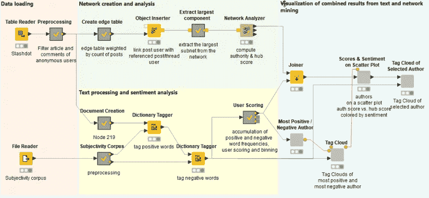

# 情绪和影响者

> 原文：<https://towardsdatascience.com/sentiment-influencers-1b43a9de0920?source=collection_archive---------22----------------------->

## 网络分析与情感分析相结合

几年前，我们开始了一场关于最大声的顾客是否真的像每个人——包括他们自己——认为的那样重要的辩论！客户服务部通常对最大声的抱怨者反应更快。这样方便吗？如何识别那些值得投入时间的抱怨者？

通过论坛帖子上的**情绪分析**,可以很容易地识别开心和不开心的用户。每个用户的影响程度也可以通过**影响得分**来衡量。有许多可用的影响分数。一个被广泛采用的是[中心性指数](https://en.wikipedia.org/wiki/Centrality)。这个用例的想法是将情绪测量与影响分数相结合，并以这种方式识别那些具有高度影响的不满的客户/用户。然后，支持时间和资源应该重新分配给最有影响力和最不满意的客户或用户。

# 数据集

最初的用例指的是新产品的发布，旨在收集 beta 用户的意见。由于公司的隐私政策，不可能共享原始数据集，我们用一个公开的类似数据集来代替它:Slashdot 新闻论坛。

[斜线圆点](https://developers.slashdot.org/)(有时缩写为“/”)是一个[社会新闻](https://en.wikipedia.org/wiki/Social_news)网站，创办于 1997 年，面向科技。用户可以发布不同主题的新闻和故事，并接收其他用户的在线评论。

Slashdot 数据集收集了许多子论坛的帖子和评论，如科幻、Linux、天文学等。大多数用户使用他们的用户名发帖或评论，而一些用户匿名参与。最大的分论坛围绕政治展开，包含来自总共约 24，000 名用户的约 140，000 条评论和 496 篇文章。出于本使用案例的目的，我们重点关注“政治”分论坛。

Slashdot 数据集中的用户不完全是客户。然而，当谈论政治时，我们可以将政治话题视为产品，并像对待产品一样衡量用户的反应。

每个新帖子都被分配了一个唯一的线程 ID。标题、子域、用户、日期、主题和正文都引用这个线程 ID。为每个带有评论标题、用户、日期和正文的评论创建一个新的数据行，并附加来自种子帖子的主题 ID、帖子标题、帖子用户、帖子日期和帖子正文。在图 1 中，您可以在左边看到种子帖子数据，在右边看到相应评论的数据。请注意，多个评论可能会引用同一个种子帖子。

Figure 1\. *SlashDot Dataset. Data from seed post on the left; data from related comments on the right*.

# 工作流程

在分析中，我们考虑了所有的非匿名用户。因此，第一步是删除用户名为“匿名”、为空、过长或没有文章 ID 的所有数据行。这发生在“预处理”元节点中。

Figure 2\. The upper part of the final workflow, referred to as “Network creation and analysis,” calculates influence scores. The lower part, labeled “Text processing and sentiment analysis”, measures the sentiment of each forum user. This workflow is available on KNIME EXAMPLES Server under: 08_Other_Analytics_Types/04_Social_Media/02_NetworkAnalytics_meets_TextProcessing.

## 影响分数

我们希望通过调查用户之间的联系，找出谁是最有影响力的用户。因此，我们的目标是构建一个网络对象来表示用户交互。

第一步是准备**边表**作为网络的基础。边缘表有一个源列(文章的作者)和一个目标列(参考文章的作者)。边缘表是由图 2 所示的最终工作流的上部分支中的“Create edge table”元节点构建的。在这里，一个左外部连接将所有文章作者(源)和所有参考作者(目标)放在一起，如果有的话。GroupBy 节点统计从源到目标的每个连接的出现次数。过滤掉所有自动连接，即用户自己回答。

边缘表现在准备好被转换成一个**网络对象**。对象插入器节点将源用户和目标用户转换为节点，并通过一条边将它们连接起来，连接出现的次数作为值。

之后，名为“提取最大组件”的元节点将网络拆分为所有相连的组件。子网络然后基于它们的边和节点的总数被分类，并且只有最大的子网络被保留用于进一步的分析。最后，第二网络分析器节点计算**中心和权威得分**。

网络分析器节点为社交媒体活动提供了一个很好的摘要。它在节点和边缘级别计算网络图上不同统计数据的数量。这种统计测量试图通过每个节点和边的连接数、它们的权重、它们的邻居、到它们邻居的距离以及类似的其他参数来建立每个节点和边的重要性。其中两个重要指标是中心和权威得分。

如[https://NLP . Stanford . edu/IR-book/html/html edition/hubs-and-authorities-1 . html](https://nlp.stanford.edu/IR-book/html/htmledition/hubs-and-authorities-1.html)中所述，hubs 和 authority 的概念植根于网页。有两种主要的网页作为*广泛主题搜索的结果*:

*   关于这个话题的权威信息来源(*当局*)
*   手工编制的链接列表，链接到关于该主题的权威网页。

中心本身并不是特定主题信息的权威来源，而是将您导向更权威的页面。中心/权威得分计算依赖于中心页面来发现权威页面。

为了计算中心和权限分数，网络分析器节点在 [JUNG (Java 通用网络/图)框架](http://jung.sourceforge.net/)中实现 [HITS 算法](https://en.wikipedia.org/wiki/HITS_algorithm)。

## 情感分析

现在我们想测量情绪，即根据积极和消极而不是权威来量化每个论坛用户。

图 2 中工作流的下部分支从每个论坛用户写的帖子或评论中提取文档列表。同时根据 [MPQA 主观性词典](http://mpqa.cs.pitt.edu/lexicons/subj_lexicon/)从英语词典中导入两个词表:负面词和正面词。所有文档中的单词都被两个字典标记器节点标记为阳性或阴性，这取决于它们是否匹配这两个列表中的任何单词。未加标签的单词被认为是中性的。

每个正单词被赋予+1 值，每个负单词被赋予-1 值，每个中性单词被赋予 0 值。通过对每个用户写的所有文档的所有单词值求和，我们计算出用户情感得分。

请注意，这里使用绝对词频计算用户情感得分，而不考虑使用的字数。对于具有较长文档的语料库，即具有更大的字数差异的语料库，相对频率可能更合适。

最后，情绪得分在(平均值+标准差)以上的论坛用户被认为是积极的；情绪得分低于(平均值—标准差)的论坛用户被认为是负面的；介于两者之间的所有其他用户都被认为是中立的。积极用户用绿色表示，消极用户用红色表示，中性用户用灰色表示。

## 把所有的放在一起

将所有这些放在一起，一个 Joiner 节点将 authority 和 hub 分数与作者的情感分数连接起来。

一个散点图(Javascript)节点位于包装的元节点“散点图上的分数和情绪”内，它通过 y 轴上的中心分数、x 轴上的权威分数以及作为颜色的情绪分数来绘制论坛用户。

请注意，用红色表示的最大声的抱怨者实际上没有什么权威，因此不能被认为是有影响力的人。因此，这个情节似乎违背了你应该倾听和纵容最具攻击性的抱怨者的普遍信念。还要注意，最权威的用户实际上是中立的。这种中立性很可能是其他用户信任他们的原因之一。

散点图(Javascript)节点生成的散点图视图是交互式的。通过单击视图顶部的“选择模式”按钮，可以通过单击选择散点图上的单个点，或者通过在点周围画一个矩形来选择一组点。

*Figure 3\. Authors as points on a scatter plot with authority score on the x-axis and hub score on the y-axis. Authors with a positive sentiment score, i.e. sentiment score > (average + std dev), are color coded green. Authors with a negative sentiment score, i.e. sentiment score < (average — std dev), are color coded red. Authors with sentiment score in between are labelled as neutral and depicted in gray. In the upper right corner, there are the buttons for zooming and selection. The circled button enables point/author selection. The bigger point in the plot is the point that has been selected by single-click.*

最终的工作流如图 2 所示，位于 KNIME EXAMPLES 服务器上的:*08 _ Other _ Analytics _ Types/04 _ Social _ Media/02 _ network Analytics _ meets _ text processing*

# 那么，我们做得怎么样？

论坛中的帖子和联系可以通过将它们简化为数字来进行分析，比如情感指标或影响力得分。在这篇博文中，它们一方面通过文本处理被简化为情感分数，另一方面通过网络图分析被简化为权威/中心分数。

这两种表示都产生有价值的信息。然而，当试图隔离最积极和最权威的用户以获得奖励以及最消极和最权威的批评者以获得损害控制时，这两者的结合被证明是无价的帮助。

# 承认

这篇博客文章是与[菲尔·温特斯](https://www.linkedin.com/in/philwinters/)、[基利安·泰尔](https://www.linkedin.com/in/kilianthiel/)和[托拜厄斯·科特](https://www.linkedin.com/in/tobiaskoetter/)合作的一个项目的总结。更多详细信息，请参见 KNIME 白皮书[“从社交媒体数据中创建可用的客户情报:网络分析与文本挖掘的结合”](https://www.knime.com/sites/default/files/knime_social_media_white_paper.pdf)。