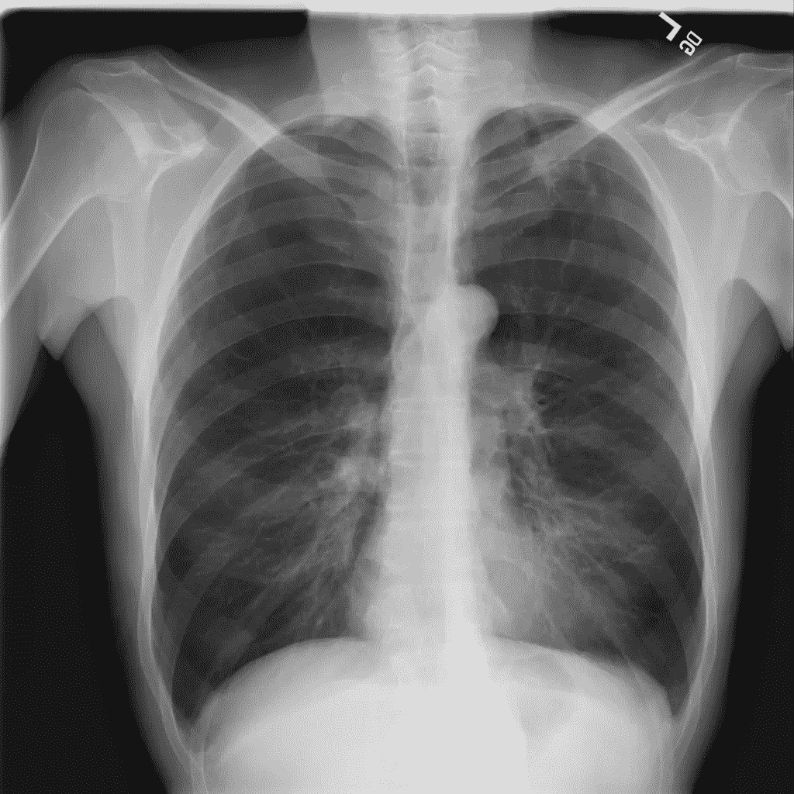

# 将医学艺术与人工智能分开

> 原文：<https://towardsdatascience.com/separating-the-art-of-medicine-from-artificial-intelligence-6582f86ea244?source=collection_archive---------2----------------------->

人工智能需要数据。理想情况下，数据应该是干净、可信的，最重要的是准确的。不幸的是，医学数据远非如此。事实上，医学数据有时远非干净，而是非常肮脏。

考虑一下简单的胸部 x 光片，这是一种很好的老式的胸部前后 x 光片。医学诊断军械库中历史最悠久的放射技术之一，在世界范围内被数十亿人使用。事实上，数量如此之多，以至于放射科医生很难跟上庞大的数量，有时[忘记阅读其中的 23，000 份](http://www.bbc.co.uk/news/uk-england-hampshire-42178069)。哎呀。

当然，如此受欢迎、屡试不爽的医学测试应该为训练放射学人工智能提供大量数据吧？显然有足够多的数据来进行一次像样的尝试，而且这项技术是如此的标准化和健壮，以至于肯定它只是在呼唤自动化？

A random anonymised chest X-ray taken from the NIH dataset. Take a look, and make a note of what you think you can see… there’s a test later.

不幸的是，有一个小而不方便的问题——人类。

人类放射科医生在解读胸部 x 光片和/或同意他们可以看到的发现方面非常糟糕，以至于数字图像附带的“报告”通常要么完全错误，要么部分错误，要么遗漏了信息。这不是人类的错…他们已经尽力了！当您的工作是在大约 30 秒内将数千个黑白像素处理成几个词的自然语言文本时，信息丢失和出现错误是可以理解的。撰写放射学报告是数据压缩的一种极端形式—您将大约 2 兆字节的数据转换为几个字节，实际上是以巨大的压缩比执行有损压缩。这就像试图通过一个 16K 的调制解调器播放一部电影，让某人用莫尔斯电码拍出正在发生的事情。更不用说这一切的主观性了。

不信我说放射科医生不好？让我们看看文献…

[Swingler 等人](https://www.ncbi.nlm.nih.gov/pubmed/16243870)表明，放射科医生在临床怀疑患有结核病的儿童 x 线片上发现淋巴结病变的总体敏感性为 67%，特异性为 59%。(这意味着他们只有大约 2/3 的时间发现*某些东西*，即使他们知道有问题，但只有一半以上的时间正确地找到了淋巴结。)

[Taghizadieh 等人](https://www.ncbi.nlm.nih.gov/pmc/articles/PMC4608340/)表明，放射科医生发现胸腔积液的灵敏度为 67%，特异性为 78%(肺部周围的液体——在 x 光片上呈白色固体，你会认为很难错过……)。

[奎克尔等人](https://www.ncbi.nlm.nih.gov/pubmed/12814015)发现有五分之一的病例漏掉了肺癌，尽管回想起来病变是完全可见的！在将近一半的病例中，癌症在随后的 x 光检查中至少两次被遗漏*。*

令人欣慰的是，研究确实表明医学训练使人比一般学生或外行人略胜一筹…

[萨提亚等人](http://www.clinmed.rcpjournal.org/content/13/4/349.long)显示，35%的非放射科初级医生无法区分心力衰竭和肺炎，18%无法诊断正常的 CXR，17%无法发现 3 厘米的右心尖肿块，55%无法识别慢性肺气肿的特征。高级临床医生在所有类别中表现更好。

起初，这可能看起来相当惊人！你可能会期望现代医学比在最多 2/3 的时间里把事情做对要好一点。嗯，实际上比那更糟…

放射科医生不仅不擅长写准确的 x 光胸透报告，而且在同样的 x 光胸透下，他们会写完全不同的报告。观察者之间的一致程度如此之低，真是可笑——一项研究显示, [kappa 值为 0.2](https://www.ncbi.nlm.nih.gov/pubmed/17923939) (0 是糟糕的，1 是完美的)。[另一项研究](http://www.sciencedirect.com/science/article/pii/S1413867011702483)只是放弃了，并得出结论说“在肺炎患者中，对胸部 x 光的解释，尤其是最小的细节，完全取决于读者。”我想，主观性就是主观性。

前几天，[我上了 Twitter](https://twitter.com/DrHughHarvey/status/942884561515630592) 进行了一个简单的(完全不科学的)实验来证明这一点。

我让放射科医生看一张胸部 x 光片(取自[匿名的 NIH 数据集](https://www.nih.gov/news-events/news-releases/nih-clinical-center-provides-one-largest-publicly-available-chest-x-ray-datasets-scientific-community))，并在推特上发布他们的报告作为回应。我提供了一个简短的捏造的病史，不针对任何特定的疾病(54 岁，不吸烟，两周气短，门诊病人)，以免他们对任何发现产生偏见。

大家表现如何？以下是一些回复示例:

就个人而言，人们的表现符合预期。他们做了一些正确的和一些可能不正确的观察，一些建议进一步用 ct 成像。但是人们同意吗？没有两个建议是完全相同的。有些很接近，但没有两份报告提到完全相同的发现或得出完全相同的结论。报告的发现范围从感染、腺病、高血压、肺气肿、癌症到肺结核。

然而，出现了一个总体趋势。如果你浏览所有的回复，就会发现某些发现比其他发现更容易被发现，包括左心尖结节、过度膨胀的肺和难以分辨的左心边界。我不知道这个胸部 x 光片的正确“读数”是什么(我甚至[自己也做了一次](https://twitter.com/DrHughHarvey/status/942886838800445440)，并给其他人写了一份不同的报告)，但我倾向于同意这三个主要发现。来自 NIH 数据集的标签是从原始报告中挖掘的“结节”和“肺炎”。可悲的是，没有后续的 CT 或进一步的临床信息，所以我们永远不会知道真相。

(顺便说一句，这个帖子有了不同的转变，来自其他行业的医生也加入进来，提供了他们自己相当幽默的观点。如果你想笑，我推荐你[读一读](https://twitter.com/DrHughHarvey/status/942884561515630592)！是的，放射科医生作为一个团队做得更好。唷！)

我发现令人着迷的是，通过简单地改变一些周围的元数据，报告是如何发生变化的。例如，如果我有一天抽 40 支烟的历史，那么这些报告会更关注肺气肿和肺癌，而不是可能的肺炎吗？如果我说病人是 24 岁而不是 54 岁呢？如果我说他们有α-1 抗胰蛋白酶缺乏症呢？如果这张胸透照片来自撒哈拉以南的非洲会怎样？那么肺结核会是最常见的报告发现吗？

对图像的解释受到各种外部因素的影响，包括患者的人口统计、历史和地理。对于更复杂的成像模式(如 MRI)或操作者依赖的模式(如超声),问题甚至更严重，其中观察者误差甚至更高。

为什么所有这些都很重要？如果胸透报告不太准确怎么办？图像还在，所以没有数据真正丢失，是吗？

当你开始使用书面报告来训练放射学人工智能学习如何解释图像时，问题很快变得明显。斯坦福大学的机器学习团队[已经完全做到了这一点](https://arxiv.org/abs/1705.02315)，使用了 108948 张从 NIH 免费获得的带标签的胸部 x 光片[。他们自豪地宣布他们的结果为](https://nihcc.app.box.com/v/ChestXray-NIHCC)[在发现肺炎方面胜过放射科医生](https://news.stanford.edu/2017/11/15/algorithm-outperforms-radiologists-diagnosing-pneumonia/)。现在，我完全支持前沿研究，我认为正是因为这个原因，像这样的数据集被公布于众是很好的…但我们必须非常小心我们如何解释基于这些数据的任何算法的结果，因为，正如我已经表明的那样，这些数据是不干净的。(我不是唯一的一个——请阅读[卢克·奥克登-雷纳博士的博客](https://lukeoakdenrayner.wordpress.com/2017/12/18/the-chestxray14-dataset-problems/)详细检查数据集。)

如果你给人工智能的数据质量和人类的一样低，怎么可能训练出比人类更好的人工智能呢？我觉得不是…

它归结为一个简单的事实——胸部 x 光报告从未打算用于开发放射学人工智能。它们只被认为是一种观点，一种解释，一种创造性的有教养的猜测。阅读胸透与其说是一门科学，不如说是一门艺术。胸透既不是最终的诊断测试，也不是第一次，它只是达到临床终点的一系列诊断步骤中的一部分。胸部 x 光片本身并不能代替地面真相。事实上，它唯一的真正目的是充当一种“分流”的形式——普遍的临床问题是“这里有什么我需要担心的吗？”。这就是 x 光胸透的价值所在——回答“我应该担心吗？”，而不是“诊断是什么？”。也许斯坦福大学的研究人员一直试图回答一个错误的问题…

如果我们要开发一种能够真正“阅读”胸部 x 光片的人工智能，那么未来的研究应该集中在三个方面:

1.  周围的元数据和找到一个地面真相，而不是依赖于一个人衍生的报告，没有产生数据挖掘的想法。理想的数据集应该包括所有患者的详细信息、流行病学、病史、血液测试、后续 CT 结果、活检结果、遗传学等。可悲的是，这种级别的验证匿名数据并不存在，至少不是机器阅读所需的格式。因此，基础设施应该投入到整理和验证这些元数据中，最少，最好是大规模的。
2.  数据集的细致标记。我的意思是，为了提供机器学习就绪的数据，使用经过专门培训的领域专家，煞费苦心地彻底注释图像。专家的一致意见，以及准确的元数据，将明显优于使用随机的单一读者报告。谢天谢地，这是一些更有声誉的放射学人工智能公司正在做的事情。是的，它既昂贵又费时，但如果要达到最终目标，这是必要的。这就是我称之为[的数据提炼过程](/ready-set-ai-preparing-nhs-medical-imaging-data-for-the-future-8e85ed5a2824)，具体来说就是从 B 级到 A 级的阶段。跳过这一步，你将永远无法击败人类的表现。
3.  标准化放射学语言。我的简单 Twitter 实验得到的许多回复使用不同的语言来描述大致相似的事情。例如,“实变”在很大程度上可以和“肺炎”互换。或者是？我们如何定义这些术语，什么时候应该用一个来代替另一个？人类语言存在巨大的不确定性，这延伸到了放射性语言。(放射科医生在医学界以其实践不确定性的技能而闻名，被称为“对冲”)。除非这种不确定性被消除，并且每一个可能的用例的术语都被认可，否则很难看到我们如何能走向数字天堂。正在努力引入一种标准化的语言( [RadLex](https://www.rsna.org/RadLex.aspx) )，然而执业放射科医生的接受速度很慢，而且相当零散。我不知道这个问题的答案是什么，但我知道问题是语言！

在我们完成所有这些之前，人工智能在胸部放射摄影中唯一真正有用的价值充其量是提供分类支持——告诉我们什么是正常的，什么是不正常的，并强调哪里可能不正常。只是不要试图声称人工智能可以明确地告诉我们异常是什么，因为它*不能比我们*做得更准确，因为数据是脏的，因为我们这样做了。

现在，让我们把模糊的思维和创造性的解释留给我们人类，把医学的“艺术”从“人工智能”中分离出来，并开始专注于产生大量干净的数据。

如果你和我一样对人工智能在放射学和医学成像领域的未来感到兴奋，并想讨论这些想法，请联系我们。我在推特@drhughharvey

如果你喜欢这篇文章，点击推荐并分享它会很有帮助。

*关于作者:*

*哈维博士是一名委员会认证的放射科医生和临床学者，在英国国民医疗服务体系和欧洲领先的癌症研究机构 ICR 接受过培训，在那里他两次获得年度科学作家奖。他曾在 Babylon Health 工作，领导监管事务团队，在人工智能支持的分诊服务中获得了世界第一的 CE 标记，现在是顾问放射科医生，皇家放射学家学会信息学委员会成员，以及人工智能初创公司的顾问，包括 Kheiron Medical。*