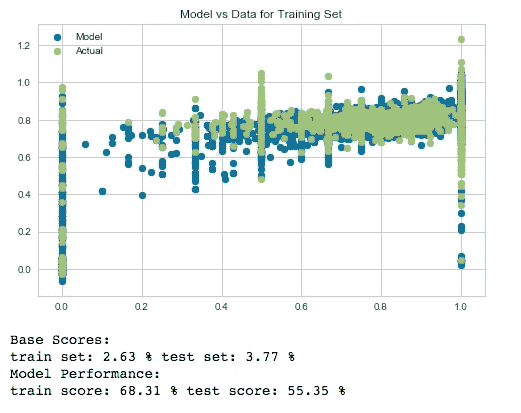
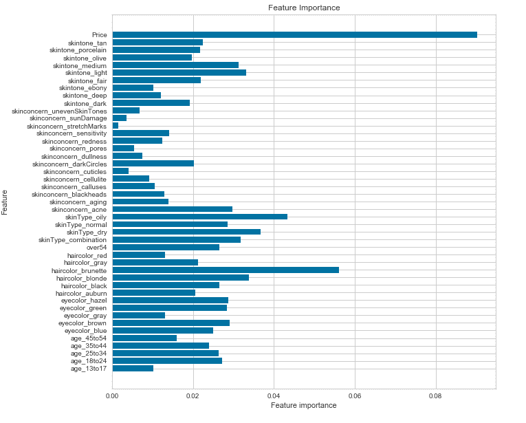

# 丝芙兰和数据科学—第二部分

> 原文：<https://towardsdatascience.com/sephora-and-data-science-part-2-70540c89a602?source=collection_archive---------18----------------------->

继续我之前关于 Sephora.com 产品和客户可视化的博文，在这篇博文中，我将分享我的项目中的一些实验和结果。如果你喜欢在早期的博客上阅读更多内容，它突出了我为这个项目所做的可视化，其中包括各种客户概况的箱线图，以及产品的价格和评级分布。

 [## 丝芙兰的数据可视化

### 对于我在熨斗学校的顶点项目，我决定把我对美丽世界的迷恋和…

medium.com](https://medium.com/datadriveninvestor/data-visualization-of-sephora-b2cc91b19b35) 

对于我的项目的机器学习部分，我想知道如果给定一些关于产品的特征，如客户资料或产品信息，是否会有可以从电子零售商的数千个数据点中辨别出的模式。我的第一个目标是预测评论者对某个产品的推荐百分比的回归，我的第二个目标是找出某个产品是高于还是低于平均评级的分类。

起初，我想看看价格本身是否会成为决定一个产品将获得多少推荐的重要因素。直觉来自一个简单的相关矩阵，它表明价格对产品的推荐数量有轻微的负面影响。

feature correlation matrix

然而，价格本身并不构成一个强大的功能。一个简单的价格回归产生的预测比随机猜测更糟糕。加入了额外的特征，如用户资料信息和价格，该模型成为预测推荐计数的更有效的模型。使用梯度推进回归器，该模型能够对推荐产品的用户百分比做出相对准确的预测。这些模型的特征是客户概要信息，而这个模型最强的特征是价格。

决定推荐百分比回归的最强特征是价格，然而，用户简档特征，如黑发头发评论者的数量，也对回归预测有很大影响。与随机猜测相比，训练和测试分数的均方误差也表现得非常有效。随机猜测预测正确的基线为 2.6%，然而，模型预测作为测试分数校正了 55.35%。

梯度推进是另一种集成方法。该算法利用弱预测器的集成，也称为简单决策树，以类似于其他 boosting 集成方法的分阶段方式，并通过允许优化任意可微分损失函数来概括它们。简单来说，它以迭代的方式将一群弱学习者或树组合成一个强学习者。迭代阶段的目标是最小化均方误差。因此，在学习的每个阶段，模型都会从早期阶段的错误中学习，并变得越来越适合所提供的样本。像许多集成方法一样，该算法也可能过拟合，但是，因为它依靠弱学习器来优化预测，所以它能够最小化对所提供的特定样本的过拟合。

你可以在我的 [Github](https://github.com/catherhuang/Sephora_rating_review_analysis) 上阅读更多关于我的项目和代码的信息。我的下一篇博客将会更深入地介绍我的项目的分类部分，在这个部分中，我使用了产品描述和成分的文本来预测一个产品的评级性能是高于平均水平，还是低于平均水平。