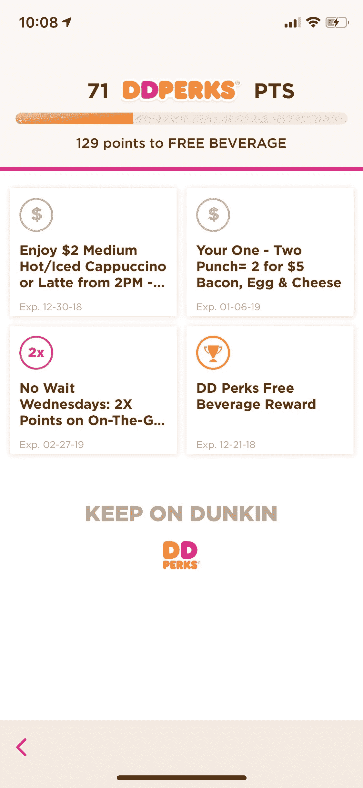
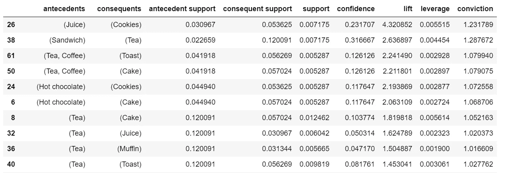

# 从数据中设定面包店的促销策略

> 原文：<https://towardsdatascience.com/setting-the-promotional-strategy-for-a-bakery-from-data-7e1cc93a2af?source=collection_archive---------10----------------------->

知道如何处理数据并提出正确的问题非常重要。在商业中，知道如何处理这些结果是至关重要的。第二步包括将图表、表格或统计数据从描述性的(“告诉我发生了什么”)转换为说明性的(“告诉我该怎么做”)。

出于这个原因，我们将经历一个基于数据发现来制定策略的项目。我们拥有的关于数据的唯一上下文是，它是来自面包店的交易数据。上面有号码、日期、时间戳和购买的物品。下面是一个快照:

> 我们的目标是增加已经在我们面包店销售给顾客的商品总量。

我们关注的是产品数量和收入，因为面包店通常有较高的固定成本和稳定的营业时间，这意味着增加对现有客户的高利润产品(如咖啡、面包、茶)的销售会带来更高的盈利能力，因为这些成本中的更多成本都可以在不增加劳动力、工时或空间的情况下得到弥补。如果我们有收入和盈利能力数据，我们可以在分析的基础上再增加一层，以模拟我们的战略对盈利能力的影响。

正如我将在下面的调查结果中详述的那样，我们实现该面包店目标的策略应该是:

1.  在工作日上午 12 点之前，我们应该为顾客选择的**热饮(茶、咖啡或热巧克力)和早餐(吐司、蛋糕、松饼)**提供捆绑折扣。
2.  在工作日的下午，我们应该提供:**买一个三明治，喝茶可以打五折**。
3.  周末，**购买任意两件商品，第三件商品打 7.3 折**。

*完整项目代码，* [*请点击此处*](https://github.com/jordanbean/bakery-strategy) *。*

**探索性数据分析**

让我们从更好地理解数据开始。具体来说，我们想知道按商品购买的频率，以及这一频率在一天中的不同时间会如何变化。我们可以将所有这些信息简洁地嵌入到交互式条形图中:

N*ote: For conciseness, I’ve limited to the top selling items for each time period.*

接下来，我们可以通过点击下图右上角的“播放”按钮来查看销售趋势。

显而易见，我们可以看到销售呈现出上升和下降的循环模式。让我们看看星期几能否解释这种差异:

事实上，看上面的两张图表，我们可以看到周末似乎可以解释大部分的价格上涨。

最后，我们将了解销售商品的数量如何随着一天中的时间、一周中的每一天以及一天中的每个小时而变化。

上述内容有助于我们进行剩余的分析，让我们了解最受欢迎的商品，以及这些商品在一天中的不同时间是如何变化的，并告诉我们应该制定一个策略，将一周中的不同日子和/或一天中的不同时间的销售差异考虑在内。

**设定策略**

现在我们对数据及其分布有了更好的理解，我们可以进入使用数据为决策提供信息的阶段。

在我们的战略发展中，有几个指导原则需要考虑:

*   我们希望增加出售的商品数量，以此来激励那些**不会购买的商品**。
*   我们应该考虑那些我们知道会改变客户与我们互动方式的变量(例如，一天中的时间和一周中的日期)。
*   最终输出应该提供如何行动的明确指示，为什么这一行动过程是可取的，它不应该对客户太混乱，也不应该对操作员太复杂。

通过交易数据，我们希望更好地理解下面的问题:**购买哪些商品会导致购买哪些其他商品？**

为了使这一点更加明确，我们想知道，例如，与任何顾客购买松饼的可能性相比，购买咖啡是否意味着顾客更有可能也购买松饼。

对于这类问题，有一种经过充分研究的方法，它被称为 Apriori 算法，它有三个主要组成部分:支持、信心和提升。

Apriori 帮助我们理解，对于一对物品，物品 2 被购买的频率(支持)，如果物品 1 被购买，物品 2 被购买的可能性(置信度)，以及在物品 1 被购买的情况下物品 2 被购买的比率的增加(提升)。

*(更多阅读，* [*这是一篇优秀的文章*](https://stackabuse.com/association-rule-mining-via-apriori-algorithm-in-python/) *)。*

考虑到这些，我们对如何解决这个问题有一些考虑:

1.  我们可以寻找这样的项目对，其中项目 1 具有高支持度(即频繁购买)，项目 2 具有低支持度，但是这两者具有高的组合寿命(购买项目 1 时，更频繁地购买项目 2)。
2.  我们可以寻找支持度较低但提升力较高的商品(例如，我们希望鼓励购买商品 1，这种商品不经常购买，但会引发其他购买)。
3.  我们可以寻找两种或两种以上经常单独购买，但不经常一起购买的产品，并将它们捆绑在一起，为客户提供更具吸引力的产品。

例如，我们将使用上述内容来考虑如何设置折扣(“以 50%的折扣购买项目 1 并获得项目 2”)或捆绑产品选项(“以低于项目 1 +项目 2 的价格获得项目 1 和项目 2”)。

同样，在日历层面，我们有几个问题需要考虑:

1.  我们是否应该尝试在历史上销售额较低的日子(即周中)提高销售额？
2.  我们是否应该在交易量已经较高的日子里尝试销售更多产品，因为我们的初始客户群较高(如周末)？
3.  知道我们的交易量每小时都不一样，我们是否应该以一天中的时间为目标？

让我们绕一小段路，看看这些概念是如何实现的。下面我分享了我的 Dunkin Donuts 应用程序的 DDPerks 屏幕截图。让我们看看他们在宣传什么，为什么:

首先，我们看到打折的卡布奇诺或拿铁，但只有当我在下午 2 点到下午 6 点之间去的时候，他们才试图鼓励在特定的时间窗口访问，否则(可能)会有较低的销售额。

第二，有两个早餐三明治的价格降低到了 5 美元> ***DD's 正在采用产品捆绑来增加总订单价值*。**

最后，如果我在周三使用他们的移动订购功能，可以获得 2 倍的积分。该公司鼓励某种类型的行为来展示产品功能，并可能更好地管理商店内的订单流。

此外，这些可能会根据位置和我与应用程序的交互进行个性化——我购买了什么以及购买的频率。如果你有这个应用程序，你的报价会有所不同吗？

**战略**

当评估 Apriori 算法的结果时，结合领域知识，我们可以采用以下策略:

1.  在工作日上午 12 点前，**以低于两者加起来的价格获得您选择的任何热饮(茶、咖啡或热巧克力)和早餐(烤面包、蛋糕、松饼)**。
2.  在工作日的下午，**买一个三明治，喝茶可以打五折。**
3.  周末，**买任意两件，第三件 33 折**。

***为什么？***

关于第一点，我们知道，在工作日早晨，几乎所有推动最高提升(销售比率增加)的购买都是热饮和早餐的组合(见下表)。因为我们的结果因饮料和食物类型而异，这个选项足够宽泛，不会限制选择，也不会缩小这个选项的市场。此外，我们知道至少 70%的早上交易都是购买热饮**，这给了我们强大的初始购买基础。**

Apriori results for weekday mornings

对于工作日的下午，我们希望刺激原本不会发生的购买行为。为此，我们将查看具有最高综合升力的项目。结果依次是茶、咖啡和三明治。下午，三明治和茶卖得很好，但它们不常一起买。茶占交易的 17%,三明治占 12%,但它们合起来仅占交易的 2.5%。因此，考虑到茶也很受欢迎，但不是在购买三明治时，我们想要创建购买三明治(更高价值的项目)。我们希望创造这种多产品购买，这在历史上一直是一个单一的购买。

最后，对于周末，我们发现，相对于平日，有更多的多购买交易，推动购买第三个项目。

> *周末前 10 大购物驱动因素中有 50%是两件商品的前因，相比之下，工作日早上的这一比例为 20%*

当有人已经买了两件东西，我们希望他们再买第三件，这在周末似乎更有可能。因此，我们可以想出一个朗朗上口、简单易懂的促销方式，比如“买两件，第三件打 33 折。”

Apriori results for weekends; note the 5 multi-item antecedents in the top 10.

**测量结果**

为了总结这些发现，我们希望实施这些策略，并在一段时间内测量结果。我们特别想看看上午平均门票大小的变化，下午组合茶和三明治的销售，以及周末每笔交易的商品数量。我们将寻找在每个细分市场中销售的商品数量是否有统计上的显著差异。

如果我们做到了，太好了！我们的策略奏效了，我们可以每隔几个月重新审视购买习惯和产品供应，以确定如何调整折扣和促销。

如果没有，没什么大不了的，我们可以重新设置为无折扣的基本情况，然后重新研究数据并与客户交谈。毕竟，[测试和学习](https://medium.com/stax-insights/test-and-learn-start-small-think-big-d7916bf6b34d)是在找到有效方法之前进行迭代和调整的重要方式。

即使它最初显示出积极的结果，战略和执行是持续的。我们不能因为它有效就假设它会永远有效。我们也不能因为它不起作用就认为它不是正确的行动方向。

**结论**

从分析转移到策略是具有挑战性的，因为你从确定的领域(“我看到这种情况发生”)转移到不确定的领域(“根据我看到的，我认为这种情况会发生”)。也就是说，在一个日益信息化的世界里，对批判性思维和数据解释的需求正在快速增长。

数据与领域专业知识和客户互动相结合，是一种经过检验的方法，可以为战略提供信念，并最终为从面包店到财富 500 强公司的每个人带来更好的业务成果。

如果您有任何想法或反馈，我希望在 jordan@jordanbean.com 或通过 [*LinkedIn*](http://www.linkedin.com/in/jordanbean/) *收到您的来信。*