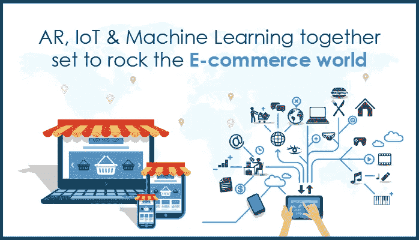
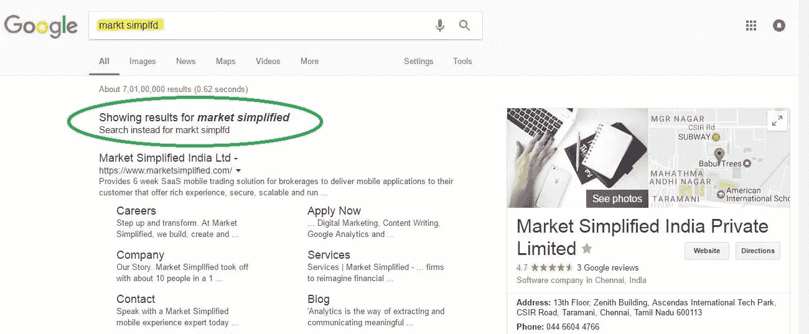

# 用机器学习塑造电子商务

> 原文：<https://towardsdatascience.com/shaping-up-e-commerce-with-machine-learning-d64fa7b2e546?source=collection_archive---------3----------------------->

机器学习和人工智能已经流行了几年，但这个概念正在优步科技领域之外迅速变得熟悉并引起好奇心。这是有充分理由的。

人工智能是机器能够以我们认为“智能”的方式执行任务的更广泛的概念。机器学习是人工智能的一个当前应用，它基于这样一个想法，即我们应该能够让机器访问数据，并让它们自己学习。

你可能知道也可能不知道，机器学习已经影响到你的日常生活，几乎无处不在。你肯定已经在亚马逊上看到过它的概念，以及它的“个性化产品建议”。脸书用面部识别软件给照片中的人做标记。另一方面，你将在亚马逊上看到的另一个新颖的想法是它的“Dash”按钮，这是通过一个叫做物联网的概念的应用而成为可能的。

为你的电子商店实现机器学习技术是一个相对较新的可能性。然而，在过去的几年里，它仍然很容易被大大小小的商店老板们买到。任何知名的网上商店都不会考虑放弃 ML 的好处。

这是一颗神奇的子弹，把猜测工作从无限的营销活动中抽离出来。想象一下你的商店变成了一个水晶球。

除了最初的设置，一旦收集到足够的数据来使用它的算法，你就会开始享受销售的增长。当然，您需要花时间进行一些微调和维护，并且您可能希望及时添加更多功能。但是根据你的市场和产品，你的收入可能会上升 5-20%。

实施它的技术就像雇用一个销售代表。只是这个销售代表是沉默的，完全看不见的，小心翼翼地不被注意。更重要的是，这位销售代表不仅总是彬彬有礼，还能节省客户的时间。他们会很高兴通过网站上的个性化搜索结果和推荐块更快地找到想要的产品。在销售代表的亲自推动下，客户肯定会增加购买。此外，保留率更高。

# **当今电子商务中最常见的用例:**

*   个性化产品建议
*   废弃购物车回收电子邮件
*   搜索建议
*   再营销和相似定位
*   动态定价

# 个性化产品建议

亚马逊大约 50-60%的页面元素由产品和广告组成，这些产品和广告由机器学习算法组合在一起，产生个性化的产品推荐。这些街区已经成为这个地方的自然组成部分，并且增加了巨大的价值。

# 废弃购物车回收电子邮件

通过实施废弃购物车回收电子邮件，有可能进一步增加您的销售额。您的客户在废弃购物车中的相同产品将在他们的收件箱中提供给他们，这是另一个“水晶球”式的时刻。这些电子邮件还可以包括与现场推荐模块相同的个性化产品建议。

2017 年第 3 季度 SalesCycle 的一些全球统计数据:

*   平均 76.8%的购物车被丢弃
*   客户点击了 31.4%的购物车恢复电子邮件
*   在这些被点击的电子邮件中，有 28.3%导致了销售
*   11.6%的访问者继续在网站上购物

# 再营销和相似定位

个性化的产品推荐可以更进一步，超越你的网站和他们的收件箱，到达客户那里。和跨多个设备。与现场购物建议和电子邮件重新营销一样，你可以根据访问者浏览过的产品来确定他们的个人目标。此外，你还可以根据长相相似的人群吸引新客户。

# 搜索建议

大型零售商有数百万份产品清单。以易贝为例，它有 8 亿多种产品。当你登陆一个网站开始搜索产品时，过滤可能会让你失败，因为仍然有太多的选项需要浏览。

如果你的产品目录那么大，机器学习就变得无价了。ML 将根据您的性别、年龄和购买历史等因素对搜索结果进行排名。在它的帮助下，搜索结果将个性化，而不仅仅是匹配你用过的短语。此外，它还具有类似于谷歌的功能，可以在你打字时提供实时建议。

# 动态定价

航空公司是第一个接受动态定价的，比如瑞安航空。价格一天变化多次，所以如果你没有在第一次访问时预订，一旦你回到网站，你可能会遇到新的价格。价格波动可能意味着赢或输，取决于供求关系。

# ML 如何在后台工作？

既然我们已经讨论了可能的使用案例，我们将很快看看引擎盖下，个性化和预测实际上是如何发生的。机器学习是一个概念，计算机算法通过无数次接触这些问题来解决问题，目的是找到解决方案。

ML 算法背后的逻辑是什么？通俗地说，

如果一个计算机程序在某类任务 T 和性能测量 P 上的性能(由 P 测量)随着经验 E 而提高，则称该程序从经验 E 中学习

如果你有点熟悉谷歌搜索的工作方式，那么你知道你会得到基于无限复杂算法的结果。这些考虑到你的位置，语言，以前的搜索历史和许多其他参数。就其核心性质而言，机器学习是类似的。它运行在智能和自我学习的预测 API 上。

机器学习分为三种类型:

*   **监督学习**意味着期望的结果已经很清楚，样本数据已经标注了正确的答案。然后对算法进行“训练”，当输入新数据时，ML 会根据过去的经验给出结果。
*   **无监督学习**意味着算法没有得到带有正确答案的预先标记的数据。例如，如果给定 ML 来随着时间分析一种语言，则算法开始检测模式。
*   **强化学习**类似于无监督学习。没有提供带标签的数据，但分析后对结果进行了分级，这加强了预期的结果。

经过验证的结果表明，实施 ML 和 AI 后，收入至少会增加 60%。

新的电子商务浪潮和数据驱动的营销方法预示着电子零售商的新阶段。将持续评估当前状态。如果技术不再是限制因素呢？您的组织能够以多快的速度调整其策略以适应单个客户的需求？