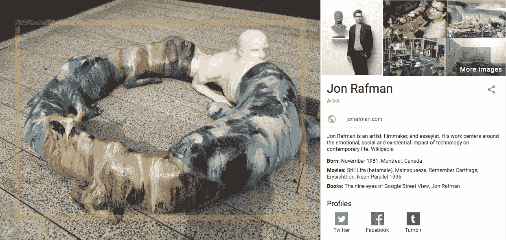
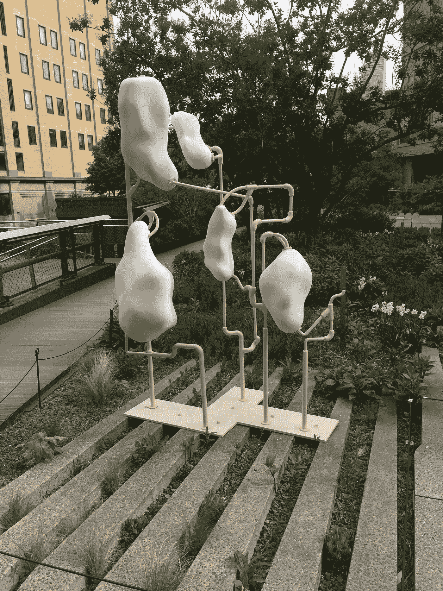
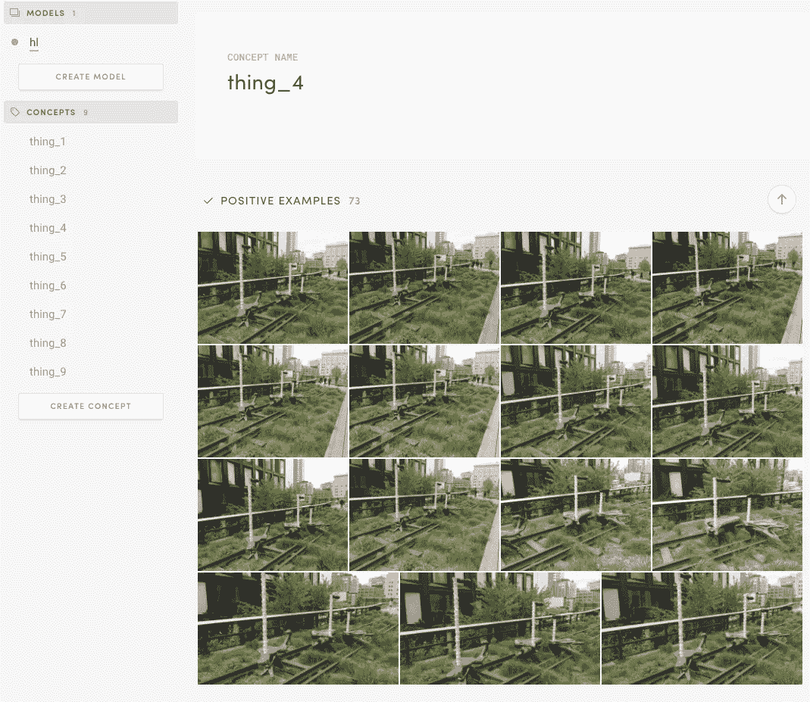
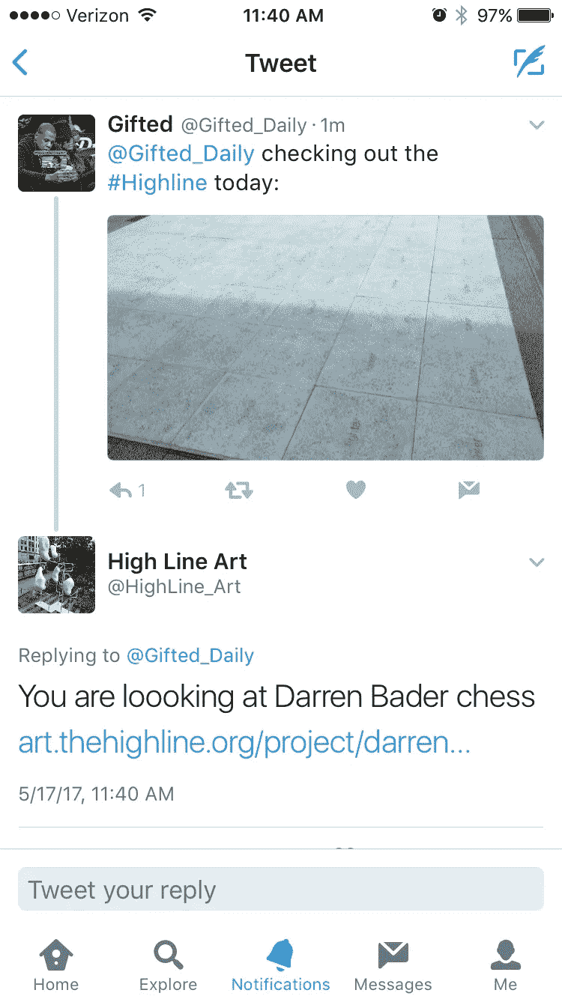
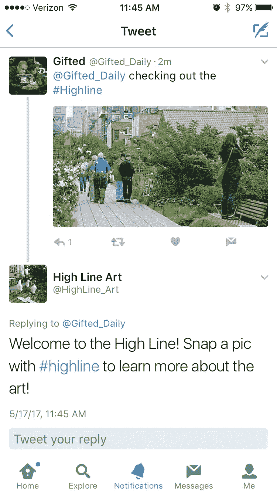

# Shazam 高架线

> 原文：<https://towardsdatascience.com/shazam-the-high-line-3090cb7c9fed?source=collection_archive---------5----------------------->

高铁每年有超过 400 万游客。今年春天，高线画廊举办了他们最新的艺术展览，[突变](http://art.thehighline.org/project/mutations/)。我们认为这将是一个尝试新概念的完美项目，Shazam for Objects。 [HBO 的《硅谷》以他们最近的《Shazam for Food》报道了这一点](https://www.engadget.com/2017/05/15/not-hotdog-app-hbo-silicon-valley/)。所以，让我们为艺术建造一个 Shazam，把高线的突变作为我们的试点项目。

这个概念很简单，拍一张艺术品的照片，查看更多关于艺术家和艺术品的信息。

# **构建工具**

首先，我们需要训练一个模型来识别每一件艺术品。

An example of the images we used to train the model

我们已经用 Clarifai 的定制模型训练为客户项目构建了定制模型，并得到了一些鼓舞人心的结果，所以我们将使用它来创建分类器。下一步是收集训练数据来训练高线模型。分类器需要每个艺术品的标记图像。

Clarifai’s Custom Model Visual Interface

我们通过走高线并对每件艺术品拍摄大量照片来收集训练数据。我们训练了模型，经过一些简单的调试，我们能够对大多数艺术品进行 90%以上的可靠分类。

Prediction confidence is shown in the top right of this image

既然我们的分类器正确地识别了艺术品，我们需要为人们建立一个用户界面来使用分类器。

# **使其成为产品**

最好的平台是像 Shazam 这样的独立增强现实应用程序，但我不想只为高端产品下载应用程序。让我们使用一个现有的平台，人们将在那里分享他们的照片。我们将使用 Twitter 来证明这个概念。如果一个人用# HighlineNYC 标签发推文，我们将运行定制模型，看看他们是否在寻找突变，如果是，是哪一块。Instagram 会是一个很好的平台，但他们的 API 对此限制太多。

正确鉴定艺术品，应该归还什么？现在，我们将回复作品的名称、艺术家以及您可以在哪里找到更多信息。这里的可能性无穷无尽，令人兴奋。在这种情况下，你必须真正专注，否则你会迷失在巨大的可能性中。

返回的信息格式(对于我们简短的文本和一个网址)将根据产品的平台而改变。例如，根据我们的经验，Twitter 中的链接工作得很好，因为它们可以将用户连接到比 140 个字符多得多的信息，或者使用脸书信使，最好为用户返回带有按钮的结构化卡片。一个专用的应用程序可以让你定制这一切。

# 尝试一下

让我们试试我们的新模型，在推特上发布关于在#Highline 或# HighlineNYC 查看这种新艺术的消息:

看来成功了！它认出了[丹·巴德的装置棋](http://art.thehighline.org/project/darrenbader/)。如果它不能识别艺术品会发生什么？我们通知用户，他们可以拍摄一张图片来了解更多信息:

厉害！那么下一步是什么？我们还可以用这个模型做什么？

# 扩展产品

该产品运行良好。艺术在视觉上足够独特，以至于分类器可以用很少的训练资源来识别它。这可以很容易地在其他装置、画廊和博物馆中重现。

有大量贴有标签的公共艺术品。我们不会一一列举，但这里有一个例子:

因此，Shazam for Art 很容易构建，并且能够以一种相当顺畅的方式接触到用户。我们还能建造什么？

# 下一步是什么？

Shazam for art 是一个有趣的开始，但是一旦你能够识别现实世界中的物体，你还可以做更多的事情。如果我们想要游戏化和个性化的高线体验呢？

艺术家可以将他们的作品扩展到物理空间之外，成为个性化的互动体验。如果你能玩一个异步人类象棋的互动游戏会怎么样。你可以拍一张棋盘的照片，它会告诉你下一步该怎么走。你拍下自己移动的照片，最后你可以把所有的照片拼接成一场漫长的夏季象棋比赛。

接下来…我们使用我们定制的计算机视觉和高线新突变装置来构建互动游戏。

**第二部分将于本周晚些时候发布。**