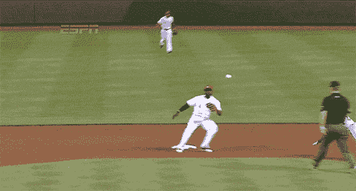
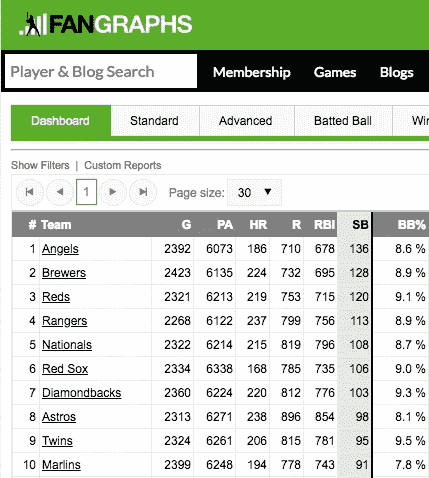
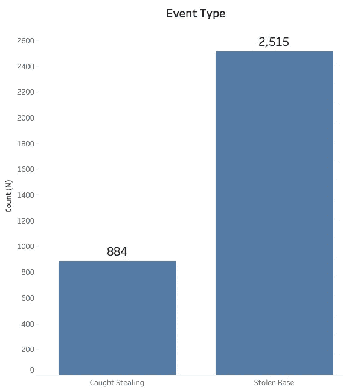
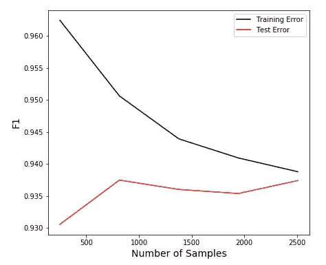
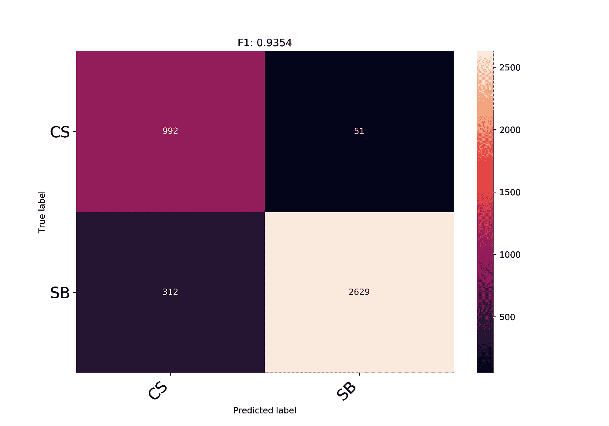
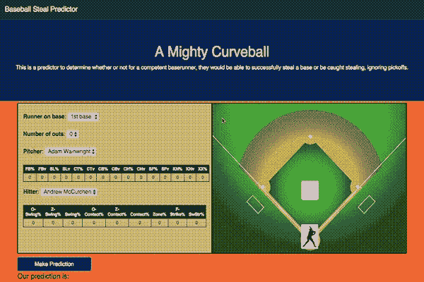

# 你应该去争取吗？使用 MLB 数据的基础窃取预测器

> 原文：<https://towardsdatascience.com/should-you-go-for-it-a-base-steal-predictor-using-mlb-data-6087a206ff66?source=collection_archive---------13----------------------->

棒球运动中最令人兴奋的事情之一是偷垒。如果跑垒者计时正确，会有两种结果:


或者他们不…



有时甚至会发生令人惊奇的事情。


Those moves by Jayson Werth

偷垒是一场精心策划的赌博，游戏的形势决定了成功的机会。要决定是否去做，需要跑垒员和经理的正确判断，这种判断只能从打了几十年的高水平棒球中获得。然而，如果只需点击一个按钮就能做出这个决定，那会怎么样呢？我决定为我的第三个 [Metis](https://www.thisismetis.com/) 项目建立一个预测模型，并创建了一个 [Flask app](https://agile-stream-33883.herokuapp.com/) ，部署在 Heroku 上。

# 数据

## 获取数据:

为了建立这个模型，我需要许多偷垒情况及其结果的例子。幸运的是 [Kaggle](https://www.kaggle.com/sportradar/baseball) 有这样一个由 Sportsradar 提供的数据集。这个 MLB 数据集托管在谷歌的 Bigquery 平台上，包含了 2016 赛季每一场比赛的信息。我最终将这些数据上传到 PostgreSQL 服务器，因为初始数据集包含 760，000 多行和 145 个要素，这对于加载到本地内存来说太大了。

在探索这个数据集的过程中，最初的一个怪癖是试图只提取基本窃取事件。最初，我试图通过在描述中对“steal”进行通配符搜索来找到它们:

```
 SELECT *  
  FROM baseball  
  WHERE description LIKE '%steal%';
```

但是这个查询太小了，因为它只返回了 500 个条目。例如，2017 年 MLB 赛季有:



The total of the top 10 teams was 1098 SB (stolen bases).

所以只有 500 个整数太低了。深入挖掘，我发现多个偷垒事件在描述中遗漏了信息。因此，我最终使用以下命令来查询偷窃事件:

```
 SELECT *
    FROM baseball
    WHERE rob1_outcomeid LIKE '%CS%'
    OR rob1_outcomeid LIKE '%SB%'
    OR rob2_outcomeid LIKE '%CS%'
    OR rob2_outcomeid LIKE '%SB%'
    OR rob3_outcomeid LIKE '%CS%'
    OR rob3_outcomeid LIKE '%SB%';
```

由于每个 rob(跑垒者)都有一个结果 id，通过寻找“SB”(偷垒)或“CS”(偷垒被抓)的出现，我就能够抓住偷垒事件。

有了 145 个特征，每个剧本都有很多可用的信息。虽然这些特征中有很多最终都不具有预测性，但有几个特征我认为是有信息的，但不能反映实时情况。例如，关于投球类型、投球速度和投球位置的信息对跑垒员来说非常有用。这些特征将允许跑垒者估计他们到达下一个垒大约需要多少时间。然而，在现实世界中，跑步者或管理者无法获得这些信息，所以我决定在模型中限制这些特征。

作为替代，我将来自[方图](https://www.fangraphs.com/)的玩家统计数据加入我的数据集。具体来说，我利用了投手[的投球类型分布统计数据](https://www.fangraphs.com/leaders.aspx?pos=all&stats=pit&lg=all&qual=y&type=4&season=2015&team=0)作为投球类型和速度的代理，而击球手[的平板训练统计数据](https://www.fangraphs.com/leaders.aspx?pos=all&stats=bat&lg=all&qual=y&type=5&season=2015&month=0&season1=2015&ind=0&team=0&rost=0&age=0&filter=&players=0)作为投球位置的代理。这反映了跑垒员如何根据他们过去的倾向猜测投手会投出什么球。

## 数据清理:



虽然 Sportsradar 的数据很全面，但我仍然需要清理数据。该数据集包含 760，000+个条目，我必须对其进行过滤，以仅过滤出基本的盗窃事件。我取消了任何摘球活动或季后赛活动。我的推理是，偷球不同于普通的偷球，季后赛的行为也不同于常规赛的行为。这些数据削减留给我 3000+基地盗事件。许多功能，如游戏 ID，出席，venueName 也被排除在外，因为我觉得他们不会预测。

## 数据插补:

除了子集之外，还有一些条目缺少投手或击球手的统计数据。当所列的投手或击球手从 Fangraphs 统计中缺失时，就会发生这种情况。由于数据集的年份差异(2016 年与 2015 年)，这是意料之中的。假设有 2016 年的球员没有参加 2015 年的比赛是合理的(比如菜鸟)。为了解释这些缺失值，我最终用从训练数据中计算出的相应中值来输入这些特征。

## 特征生成:

有了大量的分类变量，我最终不得不虚拟化许多特征，使它们能够被我的模型解释。在这样做的时候，我确保不会陷入[虚拟变量陷阱](https://en.wikipedia.org/wiki/Dummy_variable_(statistics)) (DVT)。例如，为了确定击球手的惯用手，我创建了一个列“is_hitter_R ”,而不是两个列，因为这将落入该数据集的 DVT 中(只有一个击球手是双手并用的)。

我使用的另一种特征工程涉及 box-cox 变换。许多玩家统计特征不是正态分布和紧密分组的，所以为了纠正这一点，我应用了 box-cox 变换，其中每个特征都用优化的 lambda 进行了变换。

# 建模:

## 优化指标:

作为一名经理，这个应用程序可以尝试优化多个可能的指标。首先是最大化基础抢断的数量(最小化错误否定)，然而这样的策略可能太冒险，因为那可能导致太多出局。第二是尽量减少被抓住的偷窃事件(尽量减少误报)，但是这种策略可能过于被动，没有利用可能的得分机会。相反，我决定对 F1 进行优化，这将带来一个平衡的方法


## 型号选择:

在用其他模型进行实验后最大化 F1 时，两个模型表现最好:逻辑回归(LR)和梯度推进树


这两个模型最终在训练集上获得了相似的 F1 分数。因此，我选择 LR 模型有两个原因:LR 模型的特征重要性更容易解释，LR 模型的运行时间更快。如果我试图部署一个实时应用程序，后者会很重要。

## 功能重要性:

从 LR 模型来看，这些是每个结果最重要的特征:


*BC refers to the box-cox representation of the feature*

最主要的特征是跑垒员是否在一垒。在所有特征中，它的预测性似乎是第二接近的两倍。这在物理上是有意义的，因为一垒上的跑垒员在其他任何一个垒上都有更好的机会去偷一垒。

## 模型性能:

我的 LR 车型的测试 F1 成绩是 0.924。与测试分数的微小差异意味着我的模型对新数据概括得很好，没有过度拟合。学习曲线强化了这一点:



在完整数据集上重新训练模型，它能够生成以下混淆矩阵:



最终 F1 分数为 0.9354，模型性能正好介于训练和测试 F1 分数之间。解释这些结果的一种方法是将被抓到的偷窃(CS)事件的数量等同于本可以被挽救的运行次数。对于模型能够分类的 922 个 CS 事件，节省的运行的大概估计是 123 个运行。我利用了我在网上找到的这个回合[表](https://www.nssl.noaa.gov/users/brooks/public_html/feda/datasets/expectedruns.html)来翻译每一次抢断尝试的比赛情况(除以 2 是保守的)。

有了这个模型，我还构建了一个交互式 Flask 应用程序，它可以根据用户选择的输入进行预测，如图所示



如果你想自己玩，你可以在这里访问

# 未来工作:

虽然我最终得到了一个工作模型，但是如果我想进一步扩展这个项目，我可以实现一些改进:

*   **多名跑垒员**:用目前的模型，只能准确预测单个跑垒员事件。虽然如果有多个跑垒员，它可以预测盗垒的成功，但这种预测不能解释多次出局。
*   **跑垒员信息**:我的模型目前没有考虑跑垒者的能力。因此，我想包括跑垒者的跑垒统计数据。可以利用的一些统计数据是一个跑垒员前一年偷垒的数量，以及像他们 40 码冲刺时间这样的指标。
*   **更多数据**:我相信获取更多数据将有助于极大地改进这个模型。如果我从其他 MLB 赛季获得数据来纠正 CS 和 SB 事件之间的不平衡，我相信我会发现更多的预测特征。

这个模型和 Flask 应用程序的代码和数据可以在我的 [Github repo](https://github.com/alan-j-lin/stealingbases_classification) 获得。