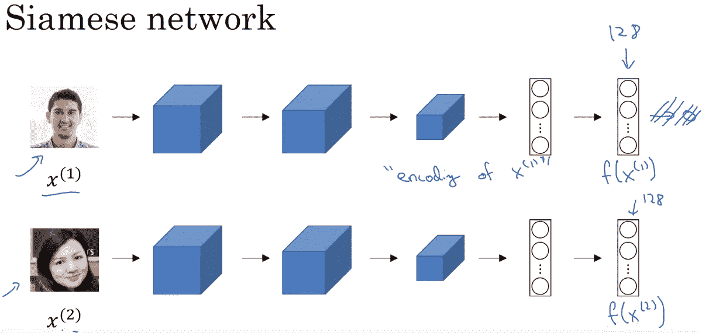
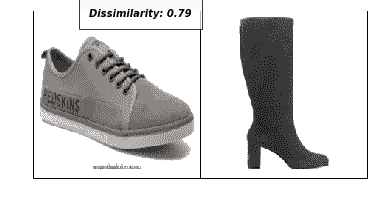
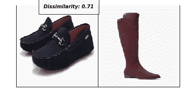
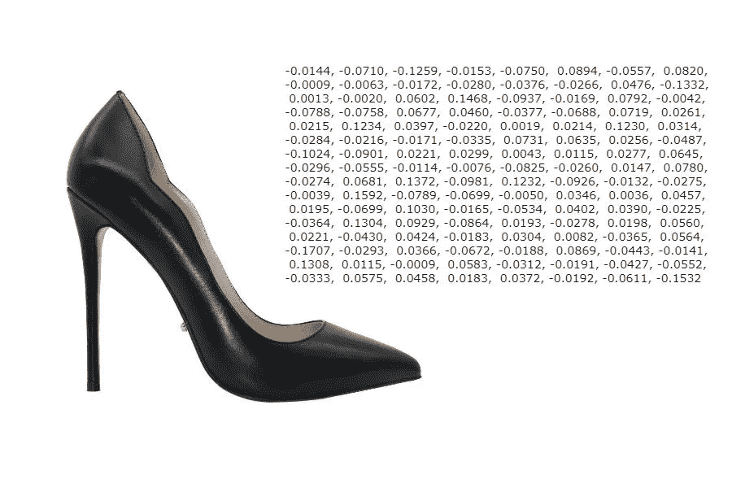
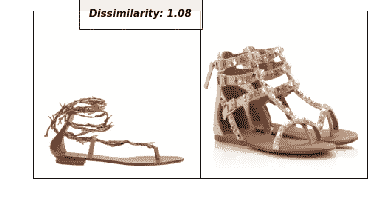
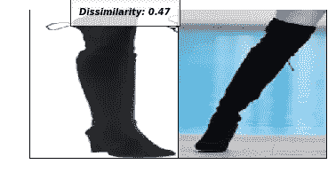
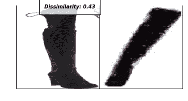
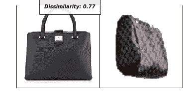
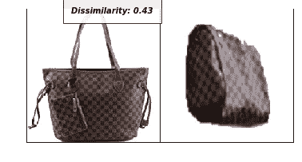

# 暹罗网络和斯图尔特·威茨曼靴子

> 原文：<https://towardsdatascience.com/siamese-networks-and-stuart-weitzman-boots-c414be7eff78?source=collection_archive---------14----------------------->

在之前的一篇文章中，我写了如何使用 R-CNN 模型来检测和分割出第二阶段模型要使用的衣服。在他的文章中，我用 Pytorch 暹罗神经网络建立了一个第二阶段模型的例子。这个想法是，通过结合这两个模型，你可以获取一个原始图像，只分割出衣服，然后将这些衣服与衣服项目数据库进行匹配，以找到类似的项目。

因此，这篇文章的第一部分将重点放在建立暹罗网络上，在接近结尾时，我将展示一个使用我的细分模型的输出的例子，以及暹罗网络如何从鞋子推广到它从未见过的其他物品。

# 什么是暹罗网络，我们为什么要关心？

暹罗式网络的目标不是对对象进行分类，而是确定项目是相似还是不同。这些真的可以是任何东西。[脸书用它们进行面部识别](https://research.fb.com/publications/deepface-closing-the-gap-to-human-level-performance-in-face-verification/)，最初的应用是[签名验证](https://papers.nips.cc/paper/769-signature-verification-using-a-siamese-time-delay-neural-network.pdf)，我已经用它们来看[艺术家风格](https://medium.com/@michaelsugimura/stylistic-fingerprints-of-artists-with-siamese-convolutional-neural-networks-2c0ab2188770)和[游戏角色](/project-pendragon-an-ai-bot-for-fate-grand-order-23f51b6e3268)。

你通过初始化两个网络“塔”来训练暹罗网络，其中你保持它们的权重相等，并通过每个塔馈送输入来进行成对比较。通过最小化相似输入之间的距离和最大化不相似输入之间的差异，训练网络来确定呈现给它的两个对象是相同还是不同。

Image of a siamese architecture for facial recognition by Andrew Ng in his deep learning course

暹罗网络没有回答经典的分类问题，X 是什么？相反，它们回答了这个问题，物体 X 和 Y 相似吗？

也就是说，我认为有理由问，如果你可以训练一个标准网络来进行这些识别，为什么还要费心去构建一个连体结构来进行成对比较呢？

作为回应，暹罗网络有许多我认为非常有用的特性。最主要的一点是，他们能够超越他们所受的训练进行归纳，能够分辨出他们不一定接触过的不同阶层之间的差异。另一个特性是，由于它们可以推广到没有被明确训练过的类，暹罗网络不需要每次被要求观察新事物时都被重新训练。

下面看一些网络认为相似然后又不同的鞋子的例子。

Lower scores indicate similarity, so the network finds these to be similar! I guess these could be similar?

在上面的例子中，模型为每只鞋生成嵌入，并且嵌入之间的欧几里德距离很小。所以网络认为这些鞋子相当相似。

Higher score and yep, these are dissimilar

# 技术实现

在这篇文章中，我用 Pytorch 在 jupyter 笔记本上建立了我的暹罗网络。我使用了一个自定义数据集函数，从头开始训练网络，并在笔记本上进行测试。

> 在 github [这里](https://github.com/sugi-chan/shoes_siamese/blob/master/Siamese-clothes.ipynb)随意查看笔记本

我从网上收集了 220 张鞋子的图片，并把它们分成不同的款式。我用了 6 个类别“鞋跟”、“靴子”、“便鞋”、“凉鞋”、“运动鞋”、“平底鞋”。暹罗网络基本上是通过展示几双鞋来训练的，它必须判断这两幅图像是否来自同一类别。

jupyter 笔记本中的 SiameseNetworkDataset 类本质上是通过索引引用给定的图像，并将它与数据集中的另一个图像配对。它返回图像对和目标 0 或 1，这取决于它们是否匹配。在训练过程中，该数据集被调用来生成样本，并显示了暹罗网络的另一个有用特征，其中数据集的有效大小远高于其实际大小。在这种情况下，我有 200 个左右的训练图像，所以当你选择第一个图像时，有 199 个其他图像与之配对。所有这些都是有效的成对比较，可以在训练中使用。总的来说，暹罗网络的这一特点让你可以用很少的数据来训练它们，但更多的数据仍然更好。

对比损失函数本质上测量两个输出之间的欧几里德距离，并相应地调整它们，以使相似图像之间具有更短的距离，同时增加不同输入之间的距离。

These are dissimilar

训练循环运行了 50 个纪元，在我的 Nvidia 1080 GPU 机器上完成可能需要一个小时。

# 很酷…但是有点不实用？

我同意这一点。实际上，必须对数据库中的所有内容进行成对比较是非常不切实际的。例如，如果你有数百万张图片，你会在几个小时或几天内找到匹配，这太可怕了。因此，我们需要找到一种方法，使用暹罗网络的专业化来确定相似性，这种方法并不可怕。

退一步说，在机器学习的许多领域，我们发现如果我们能够以一种有意义的方式浓缩样本的表示，它可以极大地帮助我们的分析。原始图像非常大，即使将彩色图像调整到 224x224 像素，也意味着要浏览 15 万个值(224x224x3)。你也可以把它们描述为非常稀少，就什么信息对我们真正重要而言。因此，如果您可以创建一个有用的嵌入来在一个不太复杂的空间中表示该图像，那么您可以使用其他方法/模型非常快速地匹配相似的图像。

暹罗网络允许你很好地扮演这个角色，创建图像的嵌入，因为它们被优化以确定相似性。您可以输入 150K 的原始图像值，并获得 128 个值的输出嵌入(这是我的网络输出向量的长度)。然后，当您将该图像与另一个图像进行比较时，您可以看到输出嵌入的 128 个值是多么相似。

举个例子，拿下面这张鞋子的图片，通过暹罗网络传递。鞋子作为一个 224x224x3 的数组输入，并作为一个长度为 128 的向量输出。我觉得这个挺优雅的！

Example of output embedding of an image of a high heeled shoe. I am unsure what the 128 values map to, but to me that does not really matter because they turn out to be quite effective.

在大规模环境中，您可以使用一个经过训练的暹罗网络来提取数据库中所有图像的特征嵌入，然后您可以构建其他模型或应用其他方法来匹配该数据库。这利用了这样的事实，即通过暹罗网络馈送的相似图像也将具有相似的嵌入，并且这扩展到它从未暴露的图像/类，并且仍然为相似的图像产生相似的嵌入。

# 讨论暹罗网络结果

我已经展示了这个网络的一些成功之处，但是展示它的局限性也很重要。因为这个网络是在一个非常小的数据集上训练的，所以在很多情况下它仍然不能很好地评估。

These are similar which is good

These should also be similar but they are not

While these are not super similar, they rate more similarly than I think they should

这三个例子展示了这个网络的一些弱点，这些弱点是在一小组图片上训练出来的。随着更多的数据和更长的训练时间，这些问题可能会得到解决。

另一个问题是，图像在技术上可能是相似的，但是从不同的角度看将会返回不同的结果。这个问题在像面部识别这样的情况下得到解决，其中向模型提供人脸的多个角度以进行优化，从而允许模型处理侧视图或部分障碍。在下图中，我将每个人都标记为“游手好闲者”，因此从技术上讲，它们应该是相似的，但是模型将它们评估为完全不同

我发现的另一个有趣的事情是，当我使用边界框而不是来自 Mask R-CNN 模型的分段靴子时，它实际上与靴子的分段图像非常相似。这可能是因为背景相当干净，但如果这在其他图像中是一致的，这意味着您可能不需要全掩模 R-CNN 模型，并且可以使用较轻重量的对象检测模型并使其表现良好。如果这是一个持续的趋势，这是一个很酷的发现！

然而，我跑题了，这篇文章的目的是要说明，你可以在第一阶段模型中分割图像，将它传递给第二阶段的暹罗网络，然后将它与一些已知的图像进行匹配。虽然这个网络很小，有一些问题需要改进，但在结合我的 Mask R-CNN 图像分割模型进行测试时，它仍然表现很好，因此无需进一步讨论…

# 欢迎来到丛林！

例如，如果一家公司希望能够从用户那里获取一幅野外图像，并将他们商店中与图像中的服装相似的商品返回给用户。给一个像下面这样的原始图像供料是相当困难的，因为在这个图像中有大量的“噪声”。在这种情况下，噪音意味着除了衣服以外的任何东西。即使您能够对图像中不同类型的服装进行分类，也很难在没有首先定位到这些商品的情况下返回良好的相似商品。

因此，为了解决信噪比问题，你可以使用一个图像分割模型，就像我的客户训练的[多类掩模 R-CNN 模型](/stuart-weitzman-boots-designer-bags-and-outfits-with-mask-r-cnn-92a267a02819)。它穿过图像并定位到衣服上。

然后，您可以使用这些生成的图像掩码只返回衣服项目。

最后一步是打电话给我在这篇文章中概述的关于这些物品的暹罗网络，这样你就可以寻找类似的已知服装物品。

为了便于说明，这里有一个使用这些成对比较的例子。左边的鞋子可以代表我们正在测试的已知鞋子中的图像，右边的鞋子是从上面的原始输入图像中提取的靴子。

这第一对图像没有很好的分数，所以我们会说它们不相似。

在这种情况下，您可以在数据库中返回 Stuart Weitzman 的靴子，它与原始输入图像中模型上看到的靴子相似，也是 Stuart Weitzman 的靴子。

# 超越他们的训练

我已经说过，暹罗网络是有用的，因为它们有能力超越他们所受的训练进行归纳。因此，为了展示这一点，在我运行分割模型的原始图像中，还有一个方格手袋。由于我从原始图像中提取了这个手提包，所以我决定进行一些测试，并发现经过鞋子训练的暹罗网络在寻找类似的包时表现良好。

第一个图像右边是提取的手提包图像，左边是与之匹配的黑色手提包。该网络发现他们很不相似，得分为 0.77

现在看第二张图片。我们再一次在右边找到了提取的手提包，在左边我在网上找到了一个格子手提包的图片。该模型将这些评估为具有 0.43 的相异分数，这意味着它认为它们相当相似。

这最后一点是一个很酷的小测试，我不确定我在一小组图像上训练的暹罗网络是否能够通过。我猜它有助于方格图案使包相当独特。然而，这仍然说明了暹罗网络可以推广到它们没有明确训练过的图像类型的想法。

# 结束语

在这篇文章中，我介绍了什么是暹罗网络，为什么它们有用，我是如何建立这个网络的，以及如何使用一个网络作为第二阶段的模型来让你将来自野外的图像中的物品与衣服库中的物品进行匹配。

这篇文章结合我以前的图像分割文章，展示了如何建立一个可能的完整的端到端深度学习管道，以解决各种领域中一些非常真实的商业问题，而不仅仅是服装。它甚至不一定是我在这里展示的具体型号。

对于第一阶段的模型，您可能不需要完整的图像分割模型，可能只需要一个简单的对象检测模型就可以了。这将使训练更快，因为建立对象检测数据集比建立完整的图像分割数据集更容易。

在第二阶段，我展示了一个暹罗网络如何有助于构建特性嵌入。我真的很喜欢暹罗网络如何能够进行超出其训练范围的概括，但你可以使用一个经过训练的模型来完成这项任务，该模型可以对特定领域的图像进行分类，然后重新调整它的用途以进行特征提取。就我个人而言，我喜欢在这里使用暹罗网络，因为它被明确地训练来进行相似性比较，而不是重新利用另一个模型来做这项工作。