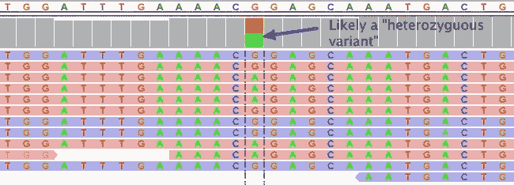
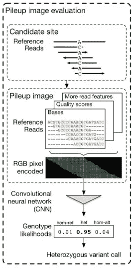
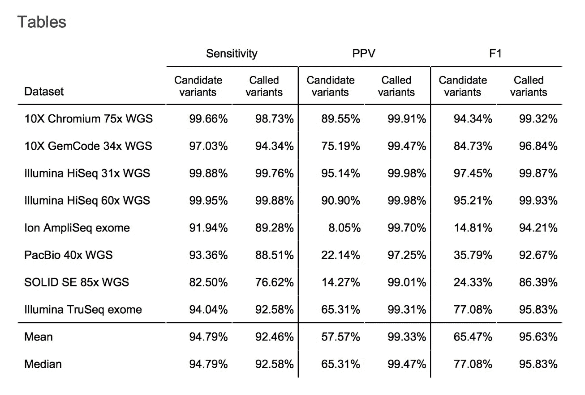
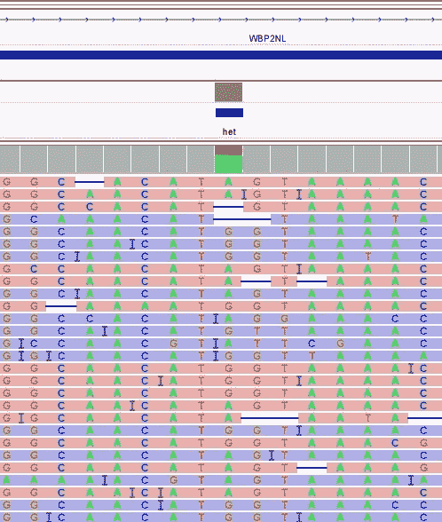
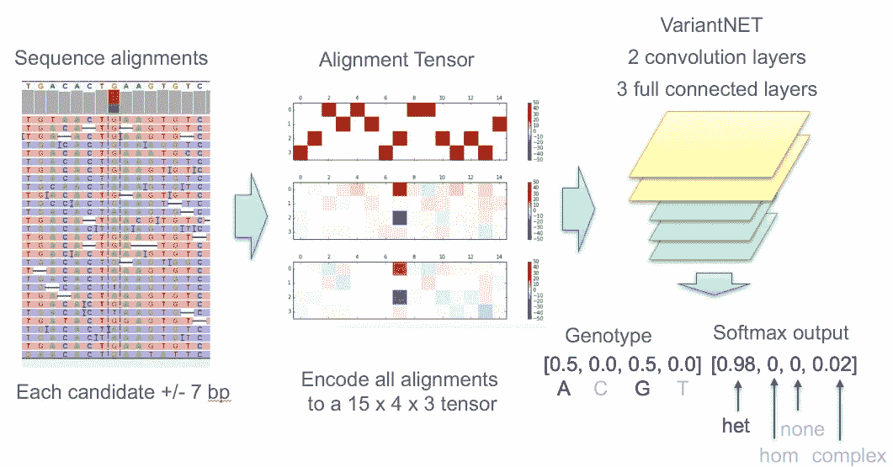

# 张量流基因组变异调用的简单卷积神经网络

> 原文：<https://towardsdatascience.com/simple-convolution-neural-network-for-genomic-variant-calling-with-tensorflow-c085dbc2026f?source=collection_archive---------1----------------------->

# 生物技术创业公司中的人工智能/机器学习

毫无疑问，使用深度神经网络的最新进展的快速发展已经改变了我们可以解决从图像识别到基因组学的各种问题的方式。许多创业公司([Viome](http://www.cnbc.com/2017/05/24/viome-a-biotech-start-up-woos-watson-ai-star-from-ibm.html)/[CZ bio hub](https://czbiohub.org/technology/)/[Deep Genomics](https://www.oreilly.com/ideas/deep-learning-meets-genome-biology))都强调在他们的研究和产品中使用“人工智能/机器学习”。硅谷其他相对“大”的生物技术初创公司，如 [Verily](https://verily.com) 、 [Calico](https://www.calicolabs.com/news/2016/08/17/) 和 [Grail](http://www.xconomy.com/san-francisco/2016/02/10/top-engineer-behind-googles-rise-will-lead-grail-in-cancer-test-quest/) 要么由 Alphabet 资助，要么与谷歌有着深厚的联系。

当然，这些公司将专注于应用机器学习、深度神经网络和对他们可以收集的大量数据进行挑战性的统计分析(通过各种来源的投资)。).Google Research 还发表了一篇论文[，介绍了使用 Google 内部计算能力从 DNA 序列数据中进行单核苷酸多态性(SNP)调用的“deep variant”](http://www.biorxiv.org/content/early/2016/12/14/092890)，并将其作为云服务[提供](https://cloud.google.com/genomics/v1alpha2/deepvariant)。

在一家为基因组学提供研究仪器([单分子实时 DNA 测序仪](http://www.pacb.com/smrt-science/smrt-sequencing/))的公司工作，并负责分析基因组学数据和算法开发的日常工作，“DeepVariant”的工作当然吸引了我们的注意。这项工作令人印象深刻，使一般设计的神经网络(Inception v2)的东西，它不是最初设计的。

虽然我已经在生物信息学领域工作了 10 多年，但我在“变异体呼叫”这个子领域工作不多。变体呼叫的算法和工具集中于从测序数据中识别基因组之间的微小差异。在过去的几年里，我主要致力于“从头”重建基因组，即在没有基因组先验知识的情况下构建基因组序列。然而，最近，我开始对现代机器学习工具和理论感兴趣，特别是人工神经网络(ANN)的形式。把解决一些小问题作为一个练习可能是一个很好的练习，所以我最近考虑把变体调用作为 ANN 的一个应用。

# 什么是变体调用？

基因组学中的“变异体调用”是什么？人类基因组大约有 60 亿个字母。如果你觉得基因组像一本书，那就是一本由“A”、“C”、“G”、“T”60 亿个字母组成的书。现在，每个人都有自己独特的基因组。然而，科学家发现人类基因组的大部分是相同的。随着[人类基因组计划](https://www.genome.gov/10001772/all-about-the--human-genome-project-hgp/)，科学界构建了[一套序列](https://www.ncbi.nlm.nih.gov/grc/human)作为人类基因组“参考”，作为基因组分析工作的基础书籍。每个人的 DNA 测序技术提供了信息，例如，书中的一小段文字，可以用来识别每个人的基因组“书”与参考书的差异，而不是每次从头开始重写书。

有了人类基因组参考，科学家和商业服务提供商就可以对短 DNA 片段进行测序，并将这些片段读数“映射”到参考，从而识别这些微小的差异。由于不需要像从头开始的方法那样从零开始重建基因组序列，这是一种更容易和更便宜的方法来获得一些有用的遗传信息。虽然这种方式更便宜，但也存在一些问题。如果有一些更个人化的特定 DNA 序列不在参考文献中，那么在将读数分配给参考文献的作图过程中会导致错误。参考文献中也有许多相同或接近相同的序列。如果一个读数不包含一些“独特的”签名，那么我们不知道在哪里放置读数。还有排序错误。不是所有我们从序列发生器得到的读数都是 100%准确的。

基本上，为了正确地称呼变体，我们需要确定(1)一个读数在基因组中的正确位置，(2)作图读数与参考读数之间的正确比对，以及(3)用于从比对中识别变体的正确统计。通常情况下，(1)和(2)由“基因组比对器”或“基因组映射器”负责。比如“ [bwa](https://github.com/lh3/bwa) ”就是恒力研发的一款流行的基因组比对仪。一旦我们绘制了 DNA 片段阅读图谱，生物信息学从业者可以通过生成一些“堆积”视图(见下文)来可视化它们。在大多数情况下，序列数据与参考数据的差异是明显的。通过一些简单的计数算法，我们将有一个合理的好的变体调用程序。与此同时，基因组和生物信息学过程会引入人为因素，结合测序错误，[使得可靠的变异调用相对棘手](https://academic.oup.com/bioinformatics/article-lookup/doi/10.1093/bioinformatics/btu356)。

A “pile-up” view of DNA fragment reads for a heterozyguous variant G to A

如果你阅读“DeepVariant”预印本，你可以看到作者为“[精密度 FDA 真相挑战](https://precision.fda.gov/challenges/truth)”竞赛开发了这项工作。我认为挑战的一个目标是建立一个标准的评估变量集，以便人们可以用它来测试变量调用管道和算法。挑战赛的组织者为那些变异体生成了一个“[高质量变异体](https://www.ncbi.nlm.nih.gov/variation/tools/get-rm/use/#hq_variants)”数据集，这些变异体可以在阅读参考作图过程不是问题的那些区域中用多种测序技术调用。这些数据集用于评估不同调用算法的质量。

# 使用 CNN (Inception v2)进行变体调用

The architecture of the DeepVariant caller

DeepVariant 预印本展示了它如何使用谷歌的 DNN 基础设施来制作一个赢得 PrecisionFDA 挑战的变体调用程序。我不认为我能在这里进入 DeepVariant 方法的更多细节。在此期间，概念相当简单。正如我们在上面的堆积图中看到的，大多数情况都很简单，但也会有一些困难的情况。在一些复杂的比对情况下，大多数时候，仔细查看比对视图的人可以比一些简单的算法更好地调用变体。如果这样的图像可能包含从那些模糊的变体调用情况中获得的适当信息，那么对于图像分类工作良好的神经网络将可能能够在调用那些变体方面做得更好，而手动编码的算法可能不能很好地捕捉一些边缘情况。

作者将潜在候选变体的序列比对数据转换成“堆积”图像。不同的颜色和 alpha 通道用于编码阅读序列，根据碱基质量和阅读链。他们使用挑战组织者在人类基因组中识别的几乎所有高置信度变体调用来训练神经网络，并将调用的变体分为三类:[纯合变体、杂合变体和无变体](https://en.wikipedia.org/wiki/Zygosity)。预印本中的表格总结了评估结果:

Evaluation Results from the DeepVariants preprint

DeepVariant 在 Variant 调用许多不同的排序数据类型时表现出良好的性能。然而，正如作者在预印本中指出的，当使用图像分类器进行基因组变异调用时，这将是次优的。在将序列数据转换为图像的过程中，可能会丢失许多有价值的信息。使用单分子测序，错误率可能会更高。人们已经可以从视觉上看到单分子测序的堆积图像与短阅读测序的图像有很大不同。由于单分子技术的不同性质，这种堆积图像可能无法捕获用于单分子测序的正确信息。

An example of pile-up image from single molecule sequencing data.

在过去的几个月里，我一直在用 Tensorflow 构建神经网络模型，用于各种测序相关的分析。虽然我通常不怎么研究变异体调用问题，但我认为作为一个小练习来测试它是有用的，以查看我们是否可以通过对神经网络学习的数据进行编码，从单分子 DNA 测序数据中调用变异体。

# 一个更简单的用于变体呼叫的 CNN

不同的 DNA 测序方法有不同的错误模式。在单分子 DNA 测序中，由于没有放大信号的化学步骤，人们得到微弱的原始信号。此外，单分子 DNA 测序通常通过实时观察单分子事件来完成。在 DNA 片段阅读中，我们得到了额外的碱基或者错过了一些碱基。我们称这样的错误为“插入-删除”错误。目前大多数单分子技术都比其他的镜头读取技术有更高的错误率。然而，单分子技术允许我们读取很长的 DNA 片段。相比之下，通常单分子技术读取 DNA 的时间是非单分子 DNA 测序技术的 10 到 100 倍。更多的错误使许多事情变得更具挑战性。另一方面，较长的 DNA 片段读数有助于解决歧义，因为较长的 DNA 片段可能包含基因组中独特的信息。我们将能够正确地识别一个读数来自基因组的什么地方。

“indel”错误的影响是，它使比对(DNA 阅读片段与参照片段之间的碱基对碱基对应)“更模糊”。因此，关于变体的信息可能不集中在变体位点，而是分散开来。像 DeepVariant 一样，如果我们能够以简洁的方式收集变异位点以外的信息，神经网络将能够使用这些额外的信息进行更好的分类。我们也没有像谷歌那样的资源来训练一个大的神经网络模型。我们能不能制造一个小的神经网络变体呼叫者，可以使用有限的资源来训练它？

事实上，使用 Google 的 Tensorflow 构建一个用于变体调用的小型卷积神经网络并使用有限的资源训练一个小型神经网络是非常简单的。我构建了一个快速原型，我称之为“ [VariantNET](https://github.com/pb-jchin/VariantNET) ”。我们不生成对齐堆积图像，并使用大型图像分类器 CNN 进行变体调用。我们将比对信息总结成三个 15×4 的矩阵。我们首先做一些简单的统计来建立一个候选变量列表。对于每个候选物，我们在两侧添加 7 个碱基侧翼碱基。包括变异候选位点，我们同时考虑参考文献中的 15 个碱基。

对于每个位置，我们使用[独热码](https://en.wikipedia.org/wiki/One-hot)来生成矩阵。也就是说，对于每个位置，我们跟踪“A”/“C”/“G”和“T”每个基数的 4 个计数。一个矩阵追踪编码参考序列的基线和通过一个位置支持的阅读数。另外两个 15×4 矩阵追踪测序数据和参考之间的差异。一个矩阵被设计用于追踪序列数据中所有碱基的差异，另一个矩阵集中于参考序列中缺失的碱基。我们认为这种总结比排列堆积图像更能简明地捕捉有用的信息。例如，如果读数中有一个额外的碱基，它通常只是堆积图像中的一个简单标记，我们可能会丢失关于额外碱基是哪种 DNA 核苷酸的信息。

VariantNET for variant calling

对于每个候选变体站点，一个 15 乘 4 乘 3 形状的“张量”被发送到一个几乎令人尴尬的[简单卷积神经网络](https://github.com/pb-jchin/VariantNET/blob/master/variantNet/vn.py#L28) (2 个卷积+ maxpool 层，后面是 3 个全连接+丢弃层)用于变体调用。我们设计网络输出，将候选人称为“杂合变异体”、“纯合变异体”、“非变异体”或“复合变异体”。除了对候选位点的变异类型进行分类，变异网络还被训练来预测可能的变异碱基。我们使用这种更简单的 CNN 进行变体呼叫的初步实验结果显示，在最小调整的情况下，具有相当[好的性能](https://github.com/pb-jchin/VariantNET/blob/master/jupyter_nb/demo.ipynb)。在示例中，我们只使用了一个小的训练集。当使用来自 21 号染色体的预先识别的变异体调用时，训练通常运行不到 10 分钟。我们在 22 号染色体上测试预测，我们通常得到 98%以上的召回率和 PPV。由于我们没有对比对进行任何优化，也没有使用除 PacBio 测序仪生成的碱基之外的任何其他信息，因此进一步优化可以使其达到更高的变体调用准确性也就不足为奇了。

# 下一步是什么？

我还没有进行更大规模的变异调用实验，所以现在还没有直接的比较。导致学术论文撰写的全面评估可能需要一段时间。我还没有做那件事的计划。我认为这个小练习已经表明，假设错误不是系统性的，可以使用小的神经网络而不是大的神经网络来提高更多噪音测序数据的变体呼叫准确性。

VariantNET 可能处理大多数孤立的 SNP 呼叫。当附近有变体或者变体是小的 indel 时，那么我们当前将变体调用放入“复杂变体”桶中。这可能并不理想。对于那些复杂的变异体，像 VariantNET 这样的分类器可以起到增加候选体附近确实有变异体的置信度的作用。我们可以为最终的变体调用产生从头共识，以避免由阅读和参考之间的较大差异引起的比对假象。

我确信还有其他人也在研究使用神经网络进行变异调用。无论如何，使用 ANN 进行变体调用似乎是显而易见的事情。幸运的是，正如我们在这里展示的，我们可能不需要大型机器来完成这项工作。我们使用非常简单的神经网络和来自测序读数的非常少的信息，但是我们在第一次尝试中获得了相当好的结果。令人兴奋的是，除了碱基之外，结合其他有用的信息和使用更好的预处理算法可以进一步提高变体调用的质量。我不确定此刻我会沿着这条线做多少工作。然而，如果任何读者对一些讨论感兴趣，请让我知道。这是一个有趣的东西，结合了当今的两个热门话题:机器学习和基因组学！！

# 附言

感谢 [**亚历山大·巴甫洛夫加里宁**](https://twitter.com/alxndrkalinin) 指出他们对当前生物学和医学深度学习技术现状的伟大而全面的综述论文:[http://www.biorxiv.org/content/early/2017/05/28/142760](http://www.biorxiv.org/content/early/2017/05/28/142760)，里面有很多有用的信息和讨论。我强烈推荐。