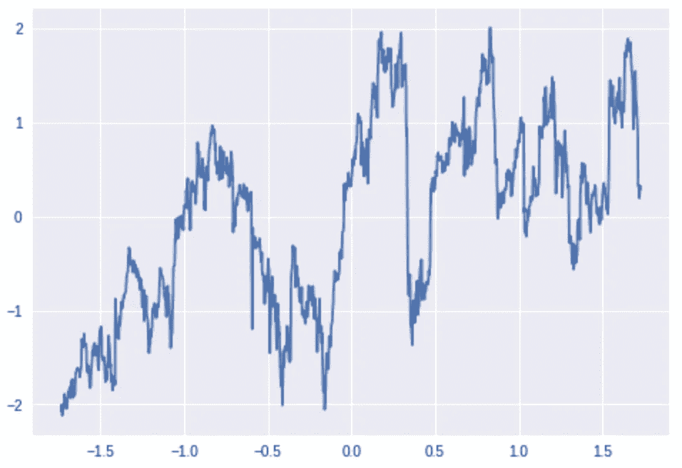
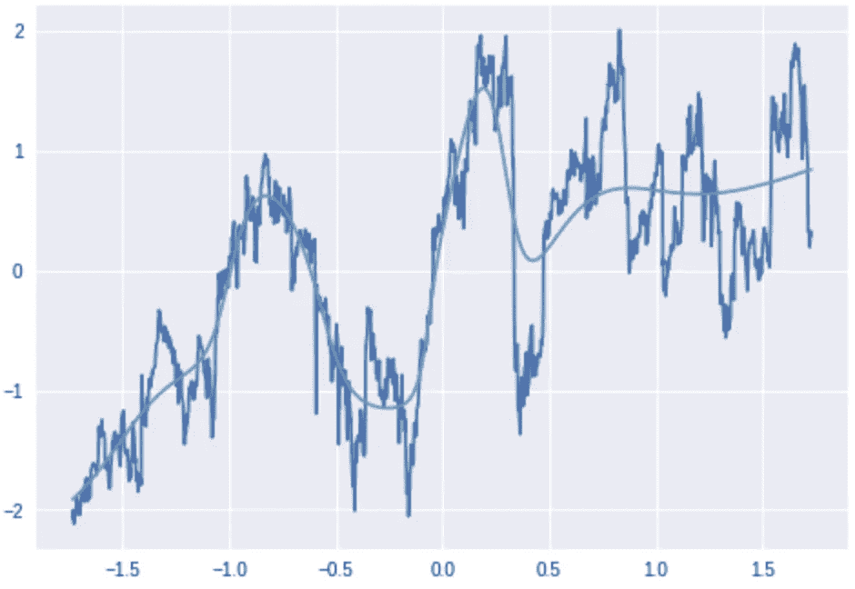
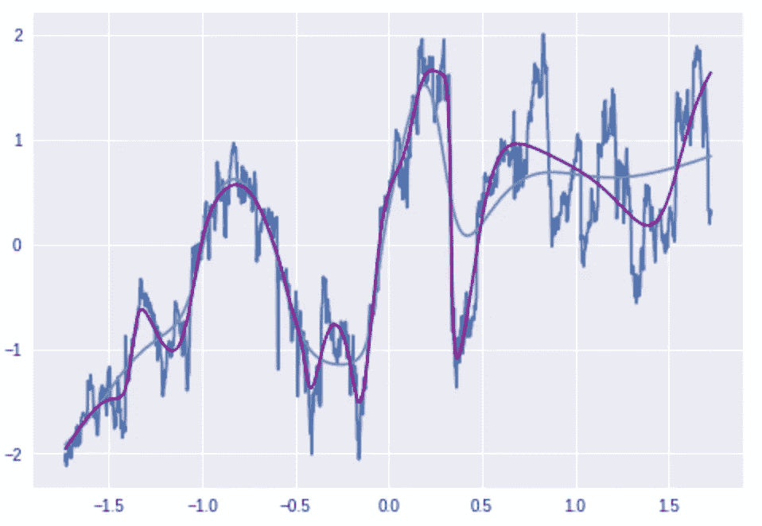
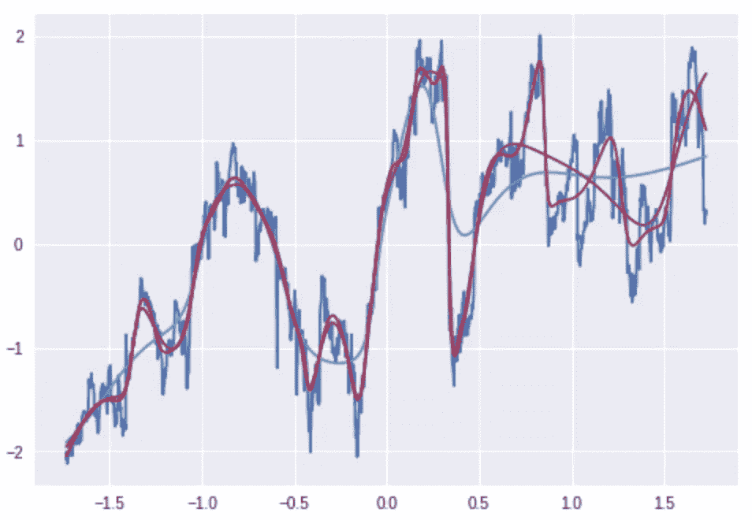

# 用 Python 中的 ML 进行简单的股票价格预测——ML 学习指南

> 原文：<https://towardsdatascience.com/simple-stock-price-prediction-with-ml-in-python-learners-guide-to-ml-76896910e2ba?source=collection_archive---------2----------------------->


# 介绍

机器学习的一个最突出的用例是“金融科技”(为那些不是时髦词汇爱好者的人准备的金融科技)；其中很大一部分在股票市场。在过去 50 年的大部分时间里，金融理论家和数据科学家被用来理解市场，以增加投资回报。然而，由于问题的多维性质、系统的规模以及随时间的内在变化，即使有传统数据分析工具的帮助，人类也难以解决这个问题。然而，随着机器学习应用中最近进步的开始，该领域已经发展到利用非确定性解决方案“学习”正在发生的事情，以便进行更准确的预测。

在本文中，我将演示一个简单的股票价格预测模型，并探索“调整”该模型如何影响结果。这篇文章旨在易于理解，因为它是一个介绍，所以更高级的读者可能需要忍受我。

# **第一步:选择数据**

机器学习和预测建模中最重要的步骤之一是收集好的数据，执行适当的清理步骤并认识到局限性。

在这个例子中，我将使用一只股票 Zimmer Biomet(股票代码:ZBH)的股价数据。只需前往 finance.yahoo.com，搜索所需的股票。一旦你进入所需股票的主页，只需导航到“历史数据”标签，输入你想包含的日期范围，然后选择“下载数据”我选择了 5 年，但是你可以选择你想要的时间。

现在我们有了数据，让我们继续看看我们有什么。只需在 Excel 中打开文件。


看起来我们这里有些好东西。您可能会注意到所有的字段都是数值，除了那个讨厌的日期值…我们需要解决这个问题。我们要传递到模型中的值需要采用最容易理解的格式。因此，我们需要执行一些“数据预处理”步骤。在我们的例子中，我们将在 1 后面插入一个新列，命名为“日期值”，并将第 1 列中的所有日期复制到第 2 列中。然后选择所有数据，并将类型从“日期”更改为“文本”结果应该如下所示:


好了，现在把文件保存为“choose_a_name.csv”(确保是 a)。csv”而不是 excel 默认格式之一)。

在我们开始之前，让我们谈谈限制。您会注意到，我们提供给这个模型的唯一数据是日期和价格。在历史价格之外，还有许多外部因素影响价格。高度稳健的模型可能利用外部数据，如新闻、一年中的时间、社交媒体情绪、天气、竞争对手的价格、市场波动、市场指数等。这是一个非常基础的模型，但是随着时间的推移，你可以学习建立一个对整个市场更加“了解”的模型的技巧。话虽如此，我们继续吧。

# 第二步:选择模型

现在我们已经清理了数据，我们需要选择一个模型。在这种情况下，我们将使用神经网络来执行回归函数。回归将在一个连续的尺度上产生一个数值，与可用于分类工作的模型相反，这将产生一个分类输出。在这种情况下，我们试图预测股票在任何一天的价格(如果你试图赚钱，这一天还没有发生)。

为了建立我们的模型，我们将使用 TensorFlow…嗯，一个叫做 TFANN 的简化模块，代表“TensorFlow 人工神经网络”为了做到这一点，我们将使用 Google Colab。如果你不熟悉 Colab，只需导航到 colab.research.google.com，这是一个*免费的*虚拟 python 笔记本环境。(对于那些将要跟进但不知道自己在做什么的人，只需将下面的代码复制粘贴到一个“单元格”中，然后在创建新的单元格并复制更多代码之前点击 run)。

# 步骤 3:构建模型

首先我们需要安装 TFANN。打开一个新的 Colab 笔记本(python 3)。Colab 有许多无需安装即可访问的库；但是，TFANN 不在其中，因此我们需要执行以下命令:

```
!pip install TFANN
```

现在让我们导入我们的依赖项:

```
import numpy as np
import matplotlib.pyplot as mpl
from sklearn.preprocessing import scale
from TFANN import ANNR
from google.colab import files
```

NumPy 将用于我们的矩阵运算，Matplotlib 用于图形，sykit-learn 用于数据处理，TFANN 用于 ML goodness，google.colab 文件将帮助我们将数据从本地机器上传到虚拟环境。

现在我们需要导入已经处理过的数据。为此，我们将执行以下命令，这将为我们提供一个窗口来上传。csv 文件。

```
files.upload()
```

很简单，对吧？

您现在有一个包含该文件的虚拟文件夹。如果你不相信我，执行下面的命令，它将打印当前目录下的文件名。

```
!ls
```

现在我们终于可以进入这个项目的核心部分了。执行以下命令:

```
#reads data from the file and ceates a matrix with only the dates and the prices 
stock_data = np.loadtxt('ZBH_5y.csv', delimiter=",", skiprows=1, usecols=(1, 4))
#scales the data to smaller values
stock_data=scale(stock_data)
#gets the price and dates from the matrix
prices = stock_data[:, 1].reshape(-1, 1)
dates = stock_data[:, 0].reshape(-1, 1)
#creates a plot of the data and then displays it
mpl.plot(dates[:, 0], prices[:, 0])
mpl.show()
```

您应该会得到一个漂亮的图形，如下所示:



请注意，y 轴上的刻度不再是美元，x 轴上的刻度不再是任意的整数日期值。我们缩小了数据规模，以使学习过程更加有效。尝试编写一些代码，将 y 轴的刻度返回到美元，将 x 轴的刻度返回到年！

现在，我们需要构建模型。在这种情况下，我们将使用*一个*输入和输出神经元(输入日期，输出价格),并将有*三个*隐藏层，每层 25 个神经元。每一层都有一个“tanh”激活功能。如果你不理解这些概念，请随时谷歌一下，然后回来，理解神经网络原理的基础知识将对你的进步非常有帮助。

```
#Number of neurons in the input, output, and hidden layers
input = 1
output = 1
hidden = 50
#array of layers, 3 hidden and 1 output, along with the tanh activation function 
layers = [('F', hidden), ('AF', 'tanh'), ('F', hidden), ('AF', 'tanh'), ('F', hidden), ('AF', 'tanh'), ('F', output)]
#construct the model and dictate params
mlpr = ANNR([input], layers, batchSize = 256, maxIter = 20000, tol = 0.2, reg = 1e-4, verbose = True)
```

我们现在已经初始化了模型，并准备好训练！

# 步骤 4:训练模型

```
#number of days for the hold-out period used to access progress
holdDays = 5
totalDays = len(dates)
#fit the model to the data "Learning"
mlpr.fit(dates[0:(totalDays-holdDays)], prices[0:(totalDays-holdDays)])
```

一旦训练完成，我们可以执行以下命令来看看我们做得如何。

```
#Predict the stock price using the model
pricePredict = mlpr.predict(dates)
#Display the predicted reuslts agains the actual data
mpl.plot(dates, prices)
mpl.plot(dates, pricePredict, c='#5aa9ab')
mpl.show()
```



不算太差！但是我们可以做得更好。

让我们考虑一些可以增加模型逼真度的方法。我们可以把这个想成“我们可以转动什么旋钮”来调整我们的模型。首先是简单地降低误差容限。

第一次试验，误差容限设定为. 2；然而，我们可以把它降低到一个更小的数字，比如说 0.1，让我们试一试！

只需进行以下更改。请注意，我还更新了变量的名称，以便我们已经创建/观察的值不会改变。当然这不是最有效的方法，但我相信你可以创造一个更好的方法！

```
#Number of neurons in the input, output, and hidden layers
input2 = 1
output2 = 1
hidden2 = 50
#array of layers, 3 hidden and 1 output, along with the tanh activation function 
layers = [('F', hidden2), ('AF', 'tanh'), ('F', hidden2), ('AF', 'tanh'), ('F', hidden2), ('AF', 'tanh'), ('F', output2)]
#construct the model and dictate params
mlpr2 = ANNR([input2], layers, batchSize = 256, maxIter = 10000, tol = 0.1, reg = 1e-4, verbose = True)
```

使用以下命令再次运行该模型，我们会得到新的结果:

```
holdDays = 5
totalDays = len(dates)
mlpr2.fit(dates[0:(totalDays-holdDays)], prices[0:(totalDays-holdDays)])
```

一旦它完成训练:

```
pricePredict2 = mlpr2.predict(dates)
mpl.plot(dates, prices)
mpl.plot(dates, pricePredict, c='#5aa9ab')
mpl.plot(dates, pricePredict2, c='#8B008B')
mpl.show()
```



更好看！如你所见，喜欢容错…嗯…降低了误差。所以你可能想知道“为什么不把误差设置成一个非常小的数字呢？”这将是一个很好的问题。继续自己尝试，重新执行刚才运行的代码，将公差设置为 0.05。您将观察到的是，您使用的最大迭代次数将在执行达到所需的错误级别之前停止执行。那么，为什么不增加最大迭代次数呢？嗯，问题出在给定的模型参数上。模型本身有局限性，我们构建的模型的最低可实现误差可能只有 0.8(我还没有为这个模型检查过这一点)。在这种情况下，添加多少次迭代都没有关系，无论运行多少次迭代，模型的结构都不会产生更好的结果。它只是被封顶了。

这里要问的下一个逻辑问题是“我们如何改变模型以达到更大的误差？”这就是我们将要探索的！

模型有所谓的“超参数”这些是管理模型的参数，它们定义了如何创建模型。改变这些可以给我们更好(或者更差)的结果。示例包括:每个隐藏层中的神经元数量、隐藏层的数量、激活函数等。

我们的目标是“调整”这些超参数，以实现比我们的第一个模型更低的误差容限。在我看来，最简单的方法就是增加隐藏层中神经元的数量。我绝不是这个主题的主要知识来源，但我敢说，增加神经元的数量和/或隐藏层的数量可以提高模型表示给定数据的抽象级别。所以让我们试试吧！

将每个隐藏层中的神经元数量从 50 增加到 100，并将容差设置为 0.075:



好多好多！橙色线是最新的预测。请注意，它比上一个模型更好地跟踪了最近的价格。

我认为我们创造了一个很好的模式，我对结果很满意！但是这个项目可以继续学习更多关于超参数的知识。尝试改变激活功能，除了“tanh”，或者增加一个额外的层。

要添加另一层，请参考这行代码:

```
layers = [('F', hidden), ('AF', 'tanh'), ('F', hidden), ('AF', 'tanh'), ('F', hidden), ('AF', 'tanh'), ('F', output)]
```

通过在输出节点前添加另一个层(“AF”，隐藏)、(“AF”，“tanh”)来添加一个附加层。这将在层被馈送到下一层之前添加该层和应用于该层的激活函数。

```
layers = [('F', hidden), ('AF', 'tanh'), ('F', hidden), ('AF', 'tanh'), ('F', hidden), ('AF', 'tanh'),('F', hidden), ('AF', 'tanh'), ('F', output)]
```

或者，也许你想在每一个隐藏层有不同数量的神经元，减少它们是一种常见的方法。以下示例在输出之前从 100 个节点逐渐减少到 25 个节点:

```
layers = [('F', 100), ('AF', 'tanh'), ('F', 50), ('AF', 'tanh'), ('F', 25), ('AF', 'tanh'), ('F', output)]
```

所以，你有它！一个关于机器学习和神经网络的简单介绍，你可以在家里用大约一个小时免费完成！

我要感谢 Nicholas T. Smith，他的模型影响了这篇文章的创作。

最后，如果您有任何问题、意见、建议或顾虑，请随时联系我们！