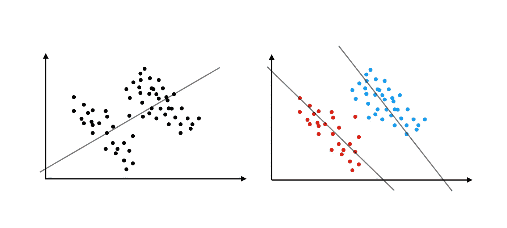

# 辛普森悖论与数据解释

> 原文：<https://towardsdatascience.com/simpsons-paradox-and-interpreting-data-6a0443516765?source=collection_archive---------0----------------------->

## 通过数据找到正确视图的挑战

统计学家、布莱奇利公园的前密码分析师爱德华·休·辛普森在 1951 年的一篇技术论文中描述了以他的名字命名的统计现象。辛普森悖论突出了我最喜欢的关于数据的事情之一:对真实世界的良好直觉的需要，以及大多数数据是一个更大、更复杂的领域的有限维表示。数据科学的艺术是透过数据来看，使用和开发方法和工具来了解隐藏的现实。辛普森悖论展示了怀疑和解释现实世界数据的重要性，以及试图从单一数据角度看整个故事而将更复杂的事实过于简化的危险。

这个悖论相对来说很简单，对于没有受过统计训练的观众来说，它常常是一个混淆和误导的原因:

> **辛普生悖论:** 将数据分组时出现的一种趋势或结果，当数据合并时，这种趋势或结果会逆转或消失。

辛普森悖论最著名的例子之一是加州大学伯克利分校的性别偏见。1973 学年开始时，加州大学伯克利分校的研究生院录取了大约 44%的男性申请人和 35%的女性申请人。故事通常是这样的，学校因性别歧视被起诉，尽管这实际上不是真的。然而，学校确实害怕诉讼，所以他们让统计学家彼得·比克尔查看了这些数据。他的发现令人惊讶:在 6 个部门中，有 4 个部门在统计上有明显的性别偏见，偏向女性，而在其余 2 个部门没有明显的性别偏见。比克尔的团队发现，女性倾向于申请总体录取比例较小的部门，这一隐藏变量影响了被录取申请人比例的边际值，从而逆转了数据整体中存在的趋势。从本质上讲，当比克尔的团队改变他们的数据观点来解释学校被分成几个系时，结论发生了逆转！

A visual example: the overall trend reverses when data is grouped by some colour-represented category.

辛普森悖论会让决策变得困难。我们可以尽可能地对我们的数据进行审查、重组和重新采样，但是如果从所有不同的分类中可以得出多个不同的结论，那么选择一个分组来得出我们的结论，以便获得洞察力和制定策略，这是一个微妙而困难的问题。我们需要知道我们在寻找什么，并选择最好的数据观点来公平地呈现事实。让我们考虑一个简单的商业例子。

# 草莓 vs 桃子

假设我们在软饮料行业，我们试图在我们生产的两种新口味中进行选择。我们可以对这两种口味的公众意见进行抽样调查——假设我们选择这样做，在一个繁忙的地区为每种口味设立两个抽样摊位，并在每个摊位询问 1000 人是否喜欢这种新口味。

我们可以看到，80%的人喜欢“罪恶的草莓”，而只有 75%的人喜欢“热情的桃子”。所以“罪恶的草莓”更有可能是更受欢迎的口味。

现在，假设我们的营销团队在进行调查时收集了一些其他信息，例如品尝饮料的人的性别。如果我们按性别划分数据会发生什么？

这表明 84.4%的男性和 40%的女性喜欢“罪恶的草莓”，而 85.7%的男性和 50%的女性喜欢“热情的桃子”。如果我们停下来想一想，这似乎有点奇怪:根据我们的样本数据，一般来说，人们更喜欢“罪恶的草莓”，但男性和女性分别喜欢“热情的桃子”。这就是辛普森悖论的一个例子！我们的直觉告诉我们，当一个人的性别未知时，无论是男性还是女性都喜欢的味道也应该是他们喜欢的，但奇怪的是，发现这不是真的——这是悖论的核心。

## 潜伏的变数

当存在将数据分割成多个独立分布的隐藏变量时，就会出现辛普森悖论。这样一个隐藏变量被恰当地称为**潜伏变量**，它们通常很难识别。幸运的是，在我们的软饮料例子中，情况并非如此，我们的营销团队应该很快就能发现品尝新口味的人的性别正在影响他们的看法。

解释这一悖论的一种方法是考虑潜在变量(性别)和一点概率论:

P(喜欢草莓)= P(喜欢草莓|男人)P(男人)+ P(喜欢草莓|女人)P(女人)

800/1000 = (760/900)×(900/1000) + (40/100)×(100/1000)

P(喜欢桃子)= P(喜欢桃子|男人)P(男人)+ P(喜欢桃子|女人)P(女人)

750/1000 = (600/700)×(700/1000) + (150/300)×(300/1000)

我们可以把性别的边际概率(P(男人)和 P(女人))看作是权重，在“罪恶的草莓”的情况下，导致总概率明显偏向男性观点。虽然在我们的“热情的桃子”样本中仍然存在隐藏的男性偏见，但它并不那么强烈，因此女性意见的更大比例被考虑在内。这导致一般人群偏好这种风味的边际概率较低，尽管当在样本内分开时，每种性别更可能偏好这种风味。

对正在发生的事情的想象:

Each coloured circle represents either the men or women that sampled each flavour, the position of the centre of each circle corresponds to that group’s probability of liking the flavour. Notice that both groups lie further to the right (have higher probability) for liking Peach. As the circles grow (i.e. sample proportions change) we can see how the marginal probability of liking the flavour changes. The marginal distributions shift and switch as samples become weighted with respect to the lurking variable (sex).

在这个例子中，我们的发现是非常不确定的，因为根据我们的营销团队想要实现的目标，选择任何一种数据观点都是有权衡的。考虑分组并意识到我们的发现是不确定的，这比得出一个不确定的结论对我们的业务更有用，报告这一点是正确的，这样我们就可以回到绘图板，重新取样并计划一项更深入的研究，以产生真正的洞察力。

# 我们参考哪些数据？

在一些实验中，我们的样品的加权可能是由于我们的取样方法中的一些误差。事实上，我们上面构建的软饮料示例在生成随机样本方面存在固有缺陷。知道我们看到的是糟糕的采样数据，还是真实的悖论，这一点绝对重要。然而，如果我们实际上尽了最大努力来生成一个独立和无偏见的样本，但最终仍然处于类似的情况下，会怎么样呢？从一个有产品的企业的角度来看:不管我们的抽样方法如何，我们的产品对某些人口统计数据更有吸引力，这将反映在我们的数据中，并可能表现为一个潜在的变量。在前面提到的加州大学伯克利分校的研究中，女性更有可能选择的部门就是这种情况。

If only choosing the right data-viewpoint were so easy.

有了直觉，就有可能通过探索性的数据分析发现潜伏的变量。然后，我们必须决定是将数据分成单独的分布，还是将数据组合在一起。正确的决定完全取决于具体情况，这也是为什么数据科学存在于数学/统计学、计算机科学和商业/领域知识的交叉点的部分原因:我们需要了解我们的数据，更重要的是，我们想要从我们的数据中得到什么，以便选择采取哪种方法。在我们的软饮料商业例子中，我们决定报告我们的发现是不确定的，尽管顾客最初似乎更喜欢“罪恶的草莓”味道。在加州大学伯克利分校的研究中，按系划分和解释数据是合乎逻辑的，因为没有系外的入学竞争。如果我们想知道医院的存活率；我们也许应该把数据分开，看看带着不同疾病来到医院的分类人群。这将有助于我们做出明智的决定，哪家医院最适合特定的病人，这可能是我们最关心的问题。在每种情况下，关键是解释与底层领域相关的数据，并采取最合适的数据观点。

这是一个总结——感谢阅读！

*如果你喜欢这篇关于辛普森悖论和通过数据观点解读数据的文章，请随时联系我(* [*汤姆·格里格*](https://medium.com/u/de201d936fa2?source=post_page-----6a0443516765--------------------------------) *)了解任何想法或疑问！*