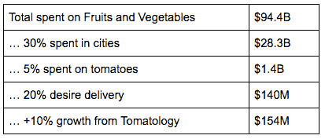

# 评估:为您的企业进行市场评估

> 原文：<https://towardsdatascience.com/sizing-up-market-sizing-for-your-business-c569e45730ef?source=collection_archive---------0----------------------->

## 你知道你的市场规模吗？了解市场规模可以帮助你计算出你的企业相对于市场有多大，以及它有多大的潜力。以下是计算市场规模的方法。

## 你的市场有多大？

投资者在投资你的企业之前首先考虑的事情之一是你的市场有多大。你的总潜在市场(TAM)是指如果你的企业拥有 100%的市场份额——如果每一个潜在客户都是你公司的客户，并且你没有竞争对手，那么理论上你的企业会有多大。这是一个重要的考虑因素，因为市场越大，企业就越大！

显然，很少有企业会接近 100%的市场份额，TAM 是用来比较不同企业的标准，而不是衡量特定企业的标准。如果你正在考虑投资一家 TAM 为 1000 万美元的公司和另一家 TAM 为 1 亿美元的公司，后一家公司更有潜力，因为它的市场更大。如果你假设一个成功的企业可能拥有他们 TAM 的 10%(比 100%更现实)，那么比较这些企业就变得更容易了，因为 100 万美元< $10M.

But how do you figure out your TAM? What if you are a new business who does not yet understand fully who your customers will be? What if you are in a new market that is growing and changing every day?

This week we’ll cover techniques and considerations for sizing your TAM. Specifically:

*   **第 2 部分—** 自上而下的市场规模
*   **第 3 部分—** 自下而上的市场评估
*   **第 4 部分—** 使用可比数据
*   **第 5 部分—** 评估新市场

正如你将看到的，市场规模的确定需要你大量的创造力，因为你需要做出许多假设来进行估算。接下来，我们将从自上而下的市场规模估算开始。

**从顶部开始**

我们评估您的潜在市场总量(TAM)的第一种方法是自上而下的分析。顾名思义，在自上而下的分析中，我们将从最大可能的规模估计开始，并使用关于我们的业务和市场的信息和假设来减少它。

举个例子，让我们假设我们想要开始一个名为 ***番茄学*** 的新业务，按需提供番茄。番茄学的市场有多大？我们将从今天消费者在食品上的花费开始。

有许多公开的市场数据来源，特别是在美国，新的 Data.Gov 倡议提供了大量关于商业规模的原始数据。你可以找到从[国家贸易数据](https://catalog.data.gov/dataset/us-international-trade-in-goods-and-services)到[父母在孩子身上花了多少钱](http://catalog.data.gov/dataset/expenditures-on-children-by-families)的一切信息。劳工统计局发布了一份年度消费者支出调查(CES ),它告诉我们平均每个家庭每年在水果和蔬菜上花费 751 美元，在美国每年总共花费 944 亿美元。

不是每个购买水果和蔬菜的人都想要按需购买或者送货上门。事实上，只有在大城市开设植物学课程才有意义。大约 30%的人口(根据消费电子展)生活在大城市，所以我们假设只有 30%的销售可以由番茄学服务。这将我们的估计降低到 283 亿美元。

此外，并不是所有购买的水果和蔬菜都是西红柿！根据美国农业部的数据，只有 5%是西红柿(在美国被法律归类为蔬菜)。这就把我们的估计降低到了 14 亿美元。

当然，不是每个人都会按需订购他们的西红柿！超市总会有一些市场份额，所以我们假设 20%的家庭会按需订购番茄。这使我们的估价达到了 1 . 4 亿美元。

最后，我们的商业模式假设当西红柿直接送到你家门口时，消费者会购买更多的西红柿！我们的预期是番茄消费量增长 10%。这使我们的估价增加到 1 . 54 亿美元。

我们自顶向下分析的一个简短版本可能如下所示:

对于一个真正的自上而下的分析，你会在更严格的假设下继续这个过程，尽可能得到最精确的市场规模。显然，如果您错过了任何重要的假设，那么使用这种技术您会高估您的 TAM。这就是为什么，接下来，我们将讨论自底向上的估计！

***(注*** *: Tomatology 是个很烂的主意。然而，如果你基于这个想法开始创业，我希望你能信任我。)*

**努力向上**

虽然自上而下的市场规模估算通常很容易做到，但它可能会产生误导。你真能到达整个市场吗？即使你能做到，你要花多少钱？好消息是，自下而上的市场规模让我们对这些因素有了一个清晰的认识。

要做一个自下而上的分析，你要从你业务的基本单位(你的产品、价格、客户)开始，并估计你能把这些单位扩大到多大。

回到我们公司的例子， ***番茄学*** (番茄按需配送！)，一个自下而上的市场评估需要从西红柿的价格开始，在我的地区，一个大西红柿的价格大约是 1 美元。我们当地的客户调查告诉我们，消费者每周去一次市场，会买 3 个西红柿。这意味着普通消费者每年会购买 150 美元的西红柿。

我们能接触到多少消费者？根据商业广告、广告牌和其他渠道的效果，我们的营销主管认为我们可以在我们的家乡加利福尼亚州奥克兰市接触到大约 35，000 个家庭。这使我们的估价达到了 530 万美元。

最后，我们将假设根据我们的运营计划和可用资本，我们可以扩展到前 30 个城市。这给了我们 110 万个家庭的观众，总计 1 . 56 亿美元。

我们自底向上分析的简短版本可能如下所示:

这就像我们的自上而下模型一样，简单而真实的自下而上模型将包括更多的步骤来获得更好的估计。

请注意，我们的自下而上模型忽略了一些重要因素，如我们需要多长时间才能接触到消费者、客户流失率以及是否存在竞争。请记住，我们正在努力确定我们的潜在市场总量，这只是我们的市场潜力。您的商业计划中的市场现实将需要解决这些其他问题，并确定您的 TAM 中真正可实现的百分比。

现在我们有了自上而下和自下而上的市场规模估算经验，我们在估算市场规模时选择哪一个呢？明天继续收听，答案可能会让你大吃一惊！

在过去的几天里，我们回顾了自上而下和自下而上的市场评估方法。基于你作为方法的一部分所做的假设，它们都有优点和缺点。

那么，我应该使用自顶向下还是自底向上呢？

都是。就其本身而言，自上而下或自下而上的分析都不能给你一个完整的描述。自上而下隐藏了接触不同客户群的困难，而自下而上则假设在你知道如何接触的客户群中总会有更多的客户。

当你的自上而下和自下而上的模型彼此一致时，你对你的市场规模有一个很好的估计。这可能需要更新你的假设来达成一致，但是这些更新应该是积极的改进，使最终的估计更加准确。这相当于将你的作业与朋友的作业进行比较，看你是否得到了相同的答案。

幸运的是，我们对番茄学*【自上而下】和自下而上的模型，我们假设按需番茄交付的领导者，大致同意约 1 . 5 亿美元的市场规模。如果你没有那么幸运，重新检查你的假设，看看差距可能在哪里。如果你不能让这两个评估一致，那么你的市场或你的业务可能会出现根本性的问题。*

***还有一件事…***

*使用**可比数据**，我们可以对我们的估计更有信心。可比公司是指在商业模式、产品类型或市场地位上与你相似的公司。一个好的比较对象是一家已经具有一定规模的公司，并且为你将要服务的相同客户提供服务(现在和将来)。*

*对于 Tomatology，我们假设的按需番茄交付的领导者，比较对象可能包括:*

*   *Instacart*
*   *亚马逊生鲜*
*   *装箱*
*   *邮戳*

*通过观察这些可比企业的规模，你可以确定你的估计是否现实。如果你的市场估值是$1B，但是没有一家现有的同类公司的收入超过 1000 万美元，那么你可能高估了这个市场的潜力(或者你有一个发展这个市场的聪明方法！).如果你的估值是 1 亿美元，而你的一些可比公司的业务是 2 亿美元，那么你可能有点太小了。把它作为你估价的第三次检查！*

*接下来，我们将看看如何确定新市场的规模，这些市场没有现有客户或任何可比较的客户。这需要我们变得更有创造力！*

***未来是朦胧的，请再试一次。***

*虽然在我们讨论了所有这些之后，市场规模的确定看起来很简单，但是更有趣的市场是那些还不存在的市场。这些都是新的市场，由不断变化的消费者需求、技术创新或资源可用性的变化创造。新市场缺少我们在之前的规模估算练习中使用的所有输入！*

*不要害怕，你仍然可以估计一个新市场的规模，尽管会不太准确。为此，你需要做出更大胆的假设。*

*让我们假设 ***番茄学*** (我们假设的按需番茄配送公司)陷入困境，因为消费者没有像我们估计的那样按需购买番茄。所以，我们想出了一种新产品，叫做番茄苹果，是番茄和苹果的杂交品种。但是苹果的市场规模有多大呢？今天没有人购买它们，所以我们不能使用我们目前使用的自上而下或自下而上的方法。*

*或者我们可以吗？*

*即使苹果还不存在，消费者每天还是会购买其他食物。新产品要么会成为现有产品的替代产品，要么会为消费者目前不再购买的产品创造新的需求。了解您的产品属于哪个类别很重要，因为每个类别的尺寸都不同:*

***替代产品**:替代产品的市场评估与现有产品的市场评估完全相同。你只需为你要取代的产品确定市场规模，并假设你的新产品能取代多少市场。*

***新需求**:新需求评估更加困难，需要你了解你的潜在客户现在有多少购买力，有多少钱可以花在新的东西上。这也是为什么新产品往往将更富裕的客户群定位为奢侈品(iPhone、特斯拉等。)因为这些顾客有更大的购买力，因此有能力购买新的东西。*

*在了解你的业务潜力和你能创造的价值时，确定你的市场规模是重要的一步。这也是一个有用的练习，可以帮助你理解在发展业务时需要克服的主要障碍。如果你在评估你的市场时遇到任何问题，请给我写信。*

*喜欢这个系列吗？在[数据驱动每日档案页面](http://outlier.ai/datadrivendaily/)查看类似内容。*