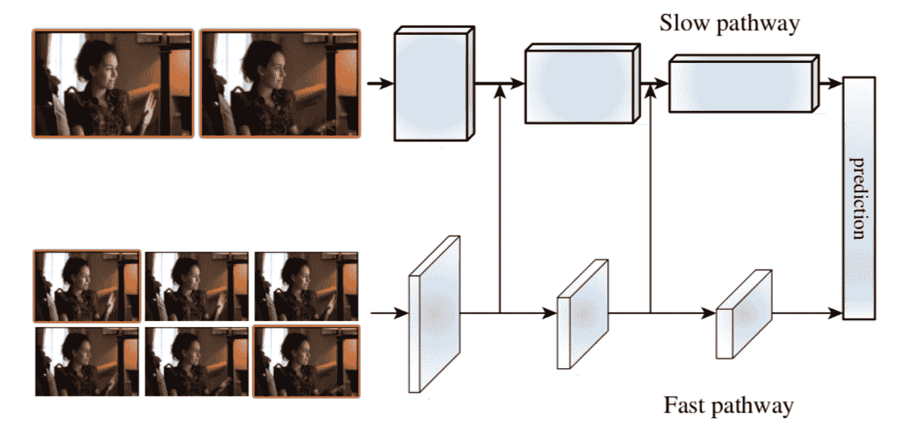
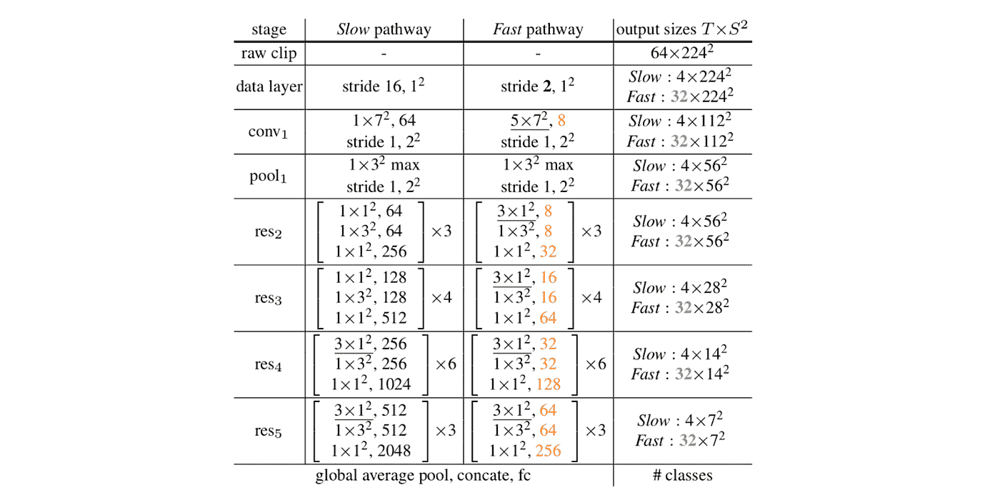
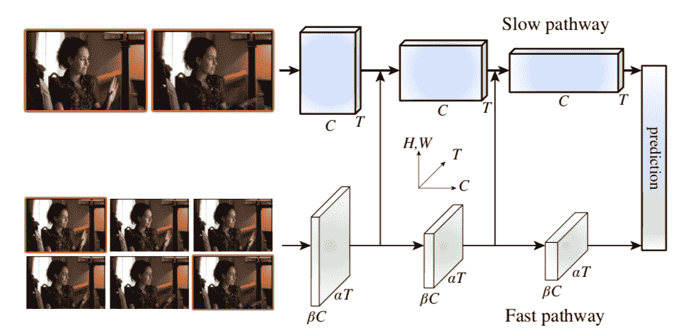

# SlowFast 解释道:双模 CNN 用于视频理解

> 原文：<https://towardsdatascience.com/slowfast-explained-dual-mode-cnn-for-video-understanding-8bf639960256?source=collection_archive---------11----------------------->

## 受灵长类视觉机制启发的最先进的深度学习架构

检测图像中的对象并对其进行分类是一项比较著名的计算机视觉任务，因 2010 年的 ImageNet 数据集和挑战而普及。虽然 ImageNet 已经取得了很大进展，但视频理解仍然是一项令人烦恼的任务——分析视频片段并解释其中发生的事情。尽管最近在解决视频理解方面取得了一些进展，但当代算法仍远未达到人类水平的结果。

来自脸书人工智能研究公司 SlowFast 的一篇新的[论文](https://arxiv.org/pdf/1812.03982.pdf)提出了一种分析视频片段内容的新方法，在两个流行的视频理解基准上实现了最先进的结果——Kinetics-400 和 AVA。该方法的核心是在同一视频片段上使用两个并行卷积神经网络(CNN)——一个慢速路径和一个快速路径。

作者观察到，视频场景中的帧通常包含两个不同的部分——帧中完全不变或变化缓慢的静态区域，以及指示当前正在发生的重要事情的动态区域。例如，一个飞机起飞的视频将包括一个相对静态的机场，一个动态对象(飞机)在场景中快速移动。在两个人见面的日常场景中，握手通常是快速和动态的，而场景的其余部分是静态的。

因此，SlowFast 使用慢速、高清晰度 CNN(快速路径)来分析视频的静态内容，同时并行运行快速、低清晰度 CNN(慢速路径)，其目标是分析视频的动态内容。该技术部分受到灵长类动物视网膜神经节的启发，其中 80%的细胞(P 细胞)以低时间频率工作，并识别精细细节，约 20%的细胞(M 细胞)以高时间频率工作，并对快速变化做出反应。类似地，在 SlowFast 中，慢速路径的计算成本是快速路径的 4 倍。

High-level illustration of the SlowFast network. (Source: [SlowFast](https://arxiv.org/pdf/1812.03982.pdf))

## SlowFast 如何工作

慢速和快速路径都使用 3D ResNet 模型，一次捕获几帧并对其运行 3D 卷积运算。

慢速路径使用大的时间步幅(即每秒跳过的帧数) **τ** ，通常设置为 16，允许每秒大约 2 个采样帧。快速路径使用小得多的时间步幅τ/α，α通常设置为 8，允许每秒 15 帧。通过使用明显更小的通道尺寸(即回旋宽度；使用的滤波器数量)，通常设置为慢信道大小的⅛。快速通道的通道尺寸标记为 **β** 。更小的信道大小的结果是，尽管具有更高的时间频率，快速路径比慢速路径需要少 4 倍的计算。

An example instantiation of the SlowFast network. The dimensions of kernels are denoted by {T×S², C} for temporal (T), spatial (S), and channel © sizes. Strides are denoted as {temporal stride, spatial stride ^ 2}. The speed ratio (frame skipping rate) is α = 8 and the channel ratio is 1/β = 1/8\. τ is 16\. The green colors mark *higher* temporal resolution, and orange colors mark *fewer* channels, for the Fast pathway. The lower temporal resolution of the Fast pathway can be observed in the data layer row while the smaller channel size can be observed in the conv1 row and afterward in the residual stages. Residual blocks are shown by brackets. The backbone is ResNet-50\. (Image & Description from [SlowFast](https://arxiv.org/pdf/1812.03982.pdf))

High-level illustration of the SlowFast network with parameters (Image: [SlowFast](https://arxiv.org/pdf/1812.03982.pdf))

**横向连接**
如直观图示所示，来自快速通道的数据通过整个网络的横向连接被馈入慢速通道，从而允许慢速通道知道来自快速通道的结果。单个数据样本的形状在两个路径之间是不同的(Fast 是{αT，S，βC}而 Slow 是{T，S，αβC})，需要 SlowFast 对快速路径的结果执行数据转换，然后通过求和或串联将其融合到慢速路径中。

本文提出了三种数据转换技术，实践证明第三种是最有效的:

1.  时间到通道:将{αT，S，βC}重塑并转置为{T，S，αβC}，意思是将所有α帧打包到一帧的通道中。
2.  时间间隔采样:简单地从每α帧中采样一帧，所以{αT，S，βC}变成{T，S，βC}。
3.  时间步长卷积:对具有 2βC 输出通道的 5×12 内核执行 3D 卷积，步长= α。

有趣的是，研究人员发现，双向横向连接，即也将慢通路馈入快通路，不会提高表现。

**结合路径**
在每个路径的末端，SlowFast 执行全局平均池，这是一个旨在降低维度的标准操作。然后，它连接两个路径的结果，并将连接的结果插入到完全连接的分类层中，该分类层使用 Softmax 对图像中发生的动作进行分类。

## **数据集**

SlowFast 在两个主要数据集上进行了测试 DeepMind 创建的 Kinetics-400 和谷歌创建的 AVA。虽然两个数据集都包括视频场景的注释，但它们略有不同:

*   Kinetics-400 包括来自数十万个 YouTube 视频的 10 秒钟短场景，有 400 种人类动作(例如握手、跑步、跳舞)，每种动作都在至少 400 个视频中出现。
*   AVA 包括 430 个 15 分钟的带注释的 YouTube 视频，有 80 个原子视觉动作。每个动作都被描述并位于一个边界框内。

## **结果**

SlowFast 在两个数据集上都取得了最先进的结果。在 Kinetics-400 中，它比最佳前 1 名分数高出 5.1% (79.0%对 73.9%)，比最佳前 5 名分数高出 2.7% (93.6%对 90.9%)。它还在新的 Kinetics-600 数据集上取得了最先进的结果，该数据集类似于 Kinetics-400 数据集，但有 600 种人类行为，每种行为都在至少 600 个视频中出现。

对于 AVA 测试，SlowFast 研究人员首先使用了一种版本的[更快的 R-CNN](https://arxiv.org/abs/1506.01497.pdf) 对象检测算法，结合现成的人员检测器，提供了一组感兴趣的区域。然后，他们在动力学数据集上对 SlowFast 网络进行预训练，最后在感兴趣的区域上运行它。结果是 28.3 [地图](https://medium.com/@jonathan_hui/map-mean-average-precision-for-object-detection-45c121a31173)(平均精度中值)，比 AVA 最先进的 21.9 地图有了巨大的进步。值得注意的是，比较的结果也在 Kinetics-400 和 Kinetics-600 上进行了预训练，与之前的结果相比，SlowFast 没有特别的优势。

有趣的是，该论文将仅慢速和仅快速网络的结果与组合网络进行了比较。在 Kinetics-400 中，慢速仅获得 72.6%的前 1 名成绩和 90.3%的前 5 名成绩，而快速仅获得 51.7%的前 1 名成绩和 78.5%的前 5 名成绩。

这表明，尽管两种途径的得分都明显低于最先进的得分，但慢速和快速途径的组合允许对屏幕上发生的事情有更深入的了解。在 AVA 数据集上观察到了类似的结果。

## **计算**

与标准 ResNet 实现相比，SlowFast 在计算方面更轻，在慢速网络中需要 20.9 GFLOPs 才能达到收敛，在快速网络中需要 4.9 GFLOPs，而在同一数据集上的普通 3D ResNet-50 基线中需要 28.1 至 44.9 GFLOPs。

## **实施细节**

SlowFast 是在 PyTorch 中实现的，并且将是开源的。

## **结论**

SlowFast 提出了一种新颖而有趣的视频理解方法，利用了真实世界场景的直观结构，并从生物机制中获得了一些灵感。该论文表明，模型的进一步优化，如使用更深的 ResNet 或应用其他已建立的计算机视觉技术，可以获得更好的结果，并进一步提高我们使用软件理解现实世界情况的能力。

*要了解最新的深度学习研究，请订阅我在* [*LyrnAI*](https://www.lyrn.ai) 上的简讯