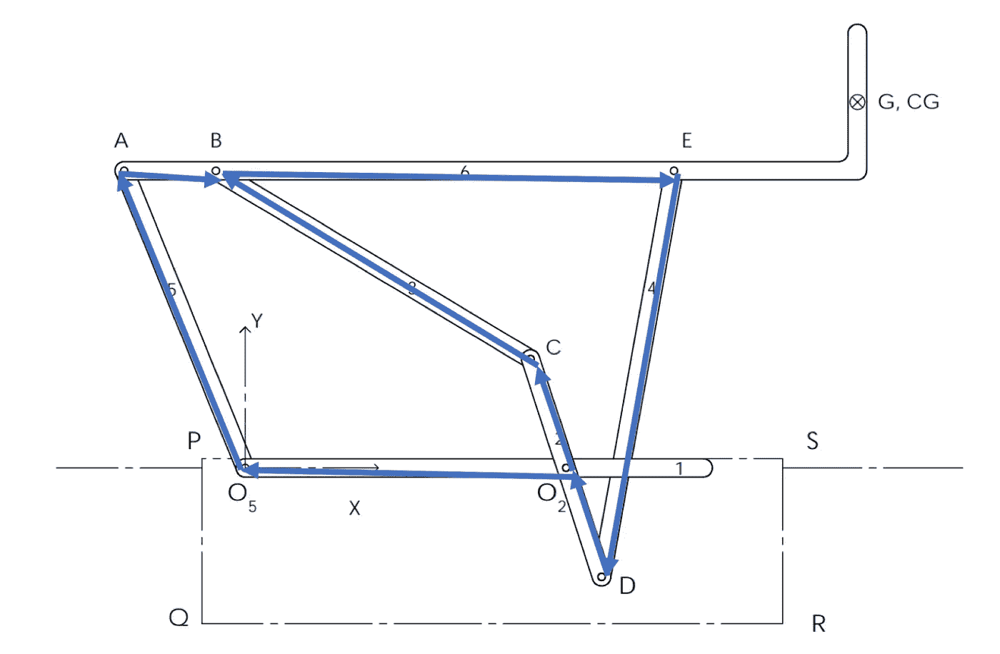
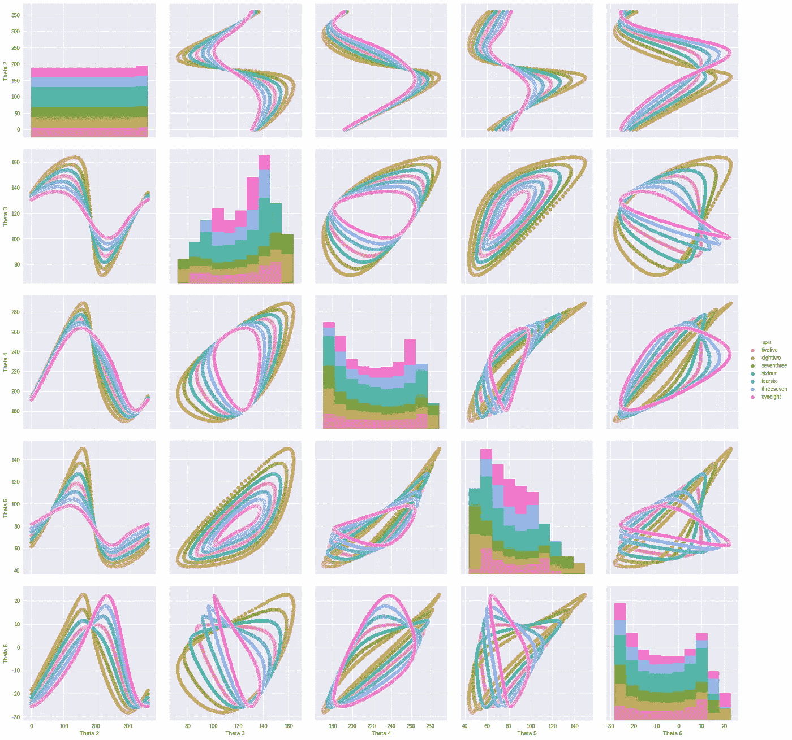
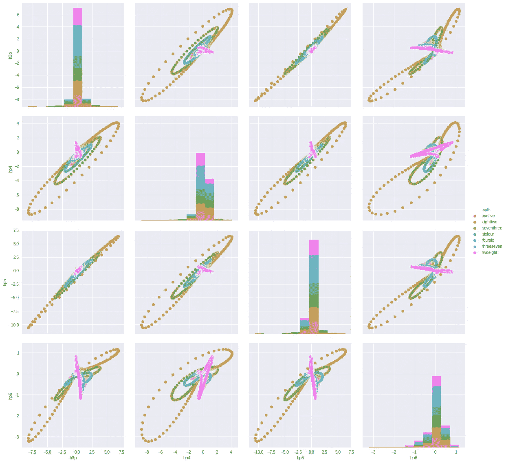
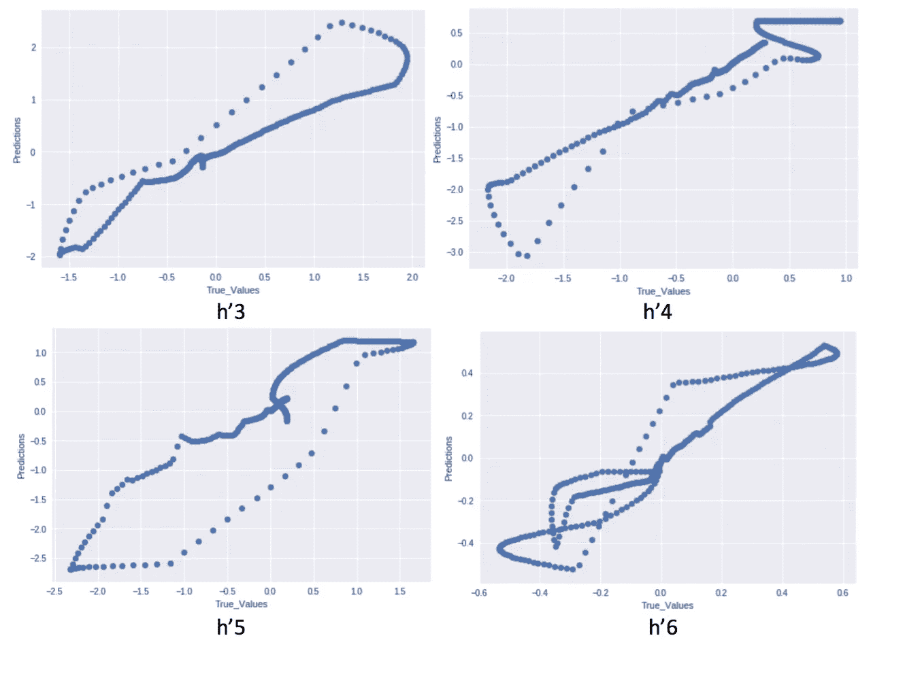
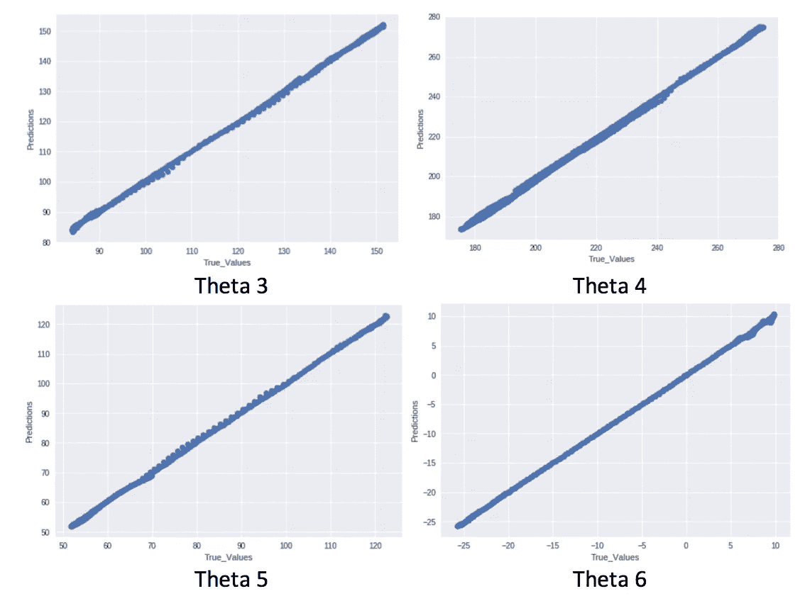
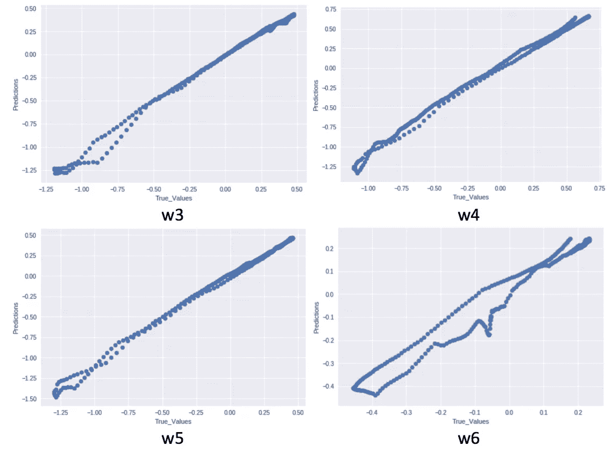

# 小步预测

> 原文：<https://towardsdatascience.com/small-steps-a-experimental-case-for-compound-prediction-2555cdcec78f?source=collection_archive---------18----------------------->

## 复合预测的一个实验案例

揭示变量之间的抽象非线性关系是机器学习提供的效用。然而，从已知输入直接跳到抽象相关的期望值会产生最准确的结果吗？在一系列更密切相关的变量可以首先被预测并反馈到模型中以预测最终产出的情况下会发生什么？

假设这种方法的一般结果是很棘手的。一方面，传统的工程方法表明，复合误差、不确定性和多次预测迭代的舍入将导致输出预测的不准确性增加。然而，输入和输出变量之间的关系越抽象，机器学习模型就越难准确预测输出，尤其是在有多种可能的输入情况并且模型没有过度拟合的情况下。也许简单地进行实验是最好的。

为了从实验上检验这一概念，有必要获得具有数学上精确的输入和输出的数据。为此，我使用了一个六连杆机构的运动学数据，该数据是针对输入角度以及沿着其中一个杆的特定销的位置(枢轴位置)而迭代计算的。这些数据既有越来越抽象相关的变量，也有已知的输出。

正在讨论的机制如下:

Vector loops based on which the mechanism’s kinematics are analyzed

在这种情况下，DC 杆的角度旋转了一整圈，以计算每个位置的运动系数(一阶和二阶)、角度和角速度(1 度增量)。对沿着条形 DC 的销 O2 的不同位置重复该过程，同时保持条形 DC 的总长度。

运动学变量之间的一般关系如下:

分析这两种方法精度的过程包括预测一阶运动系数(h’)。第一种方法，姑且称之为“复合预测”方法，包括顺序计算θ、h、w 以及随后的 h’值。第二种方法，让我们称之为“巨大的飞跃”方法，包括使用上面给出的最终关系中的变量直接预测 h′。

# 数据可视化

为了直观显示运动变量的复杂性，可以参考下列图表(按照抽象程度增加的顺序，按照顺序求解的顺序)。

Linkage angles with respect to the input angle Theta 2

First order kinematic coefficients ( h ) with respect to input angle Theta 2

Angular velocities (w) with respect to input angle Theta 2 and input angular velocity w_1 (1 rad/s).

First order kinematic coefficients ( h ) with respect to input angle Theta 2 and input angular velocity w_1 (1 rad/s)

# 模型设置

对于这个实验，有必要创建一个在两种情况下都保持不变的模型。在不同情况下改变模型会产生太多的变量，以至于无法根据最终结果得出结论。由于这是一个回归任务，但也是非线性的，所以我选择使用神经网络(Scikit 中的 MLPRegressor 为了简单起见而学习)。手动优化模型参数后，我决定采用 150，75，25，10 的锥形隐藏层模式，以“relu”作为激活函数，500 个连续时期的截止容差为. 000010，最大迭代次数为 10，000 次。

两种情况下的培训设置；然而，会有很大的不同。“巨大飞跃”方法将在数学求解最终结果所需的最少数量的输入变量上进行训练。“复合预测”方法将基于中间变量(θ，然后是一阶运动系数(h 值)，然后是角速度(w 值)，然后是二阶运动系数(h '值)的连续预测来求解。

# 结果

提醒一下，两种情况下的输出变量都是 h'3、h'4、h'5 和 h'6。此外，平均 R 值(决定系数)将用于比较结果。

让我们从分析“巨大飞跃”预测案例的结果开始:

Second order kinematic coefficients predicted based on input theta 2 and link lengths

可以看出，这些预测并不那么精确。它们确实显示了一个具有合理累积准确性的总体趋势；不过波动比较大。这些结果不适合任何工程任务，并且不是最佳的。

现在，让我们看看复合预测方法在整个预测过程中的结果。

Predicted values of theta based on link lengths and input Theta 2

First order kinematic coefficients ( h ) predictions based on link lengths, input theta 2, and theta prediction values

Angular velocities ( w ) based on link lengths, predicted theta values and first order coefficients

Second order kinematic coefficients ( h’ ) based on link lengths, predicted theta values, first order coefficients, and angular velocities

# 讨论

基于决定系数，“复合预测”方法的结果远比“巨大飞跃”方法更准确(平均 R 为 0.9773 对 0.8745)。尽管基于预测值进行预测会产生复合误差，但这是事实。给定必要的输入参数，输入和输出变量之间的关系对于“巨大飞跃”方法中使用的当前模型来说简直太抽象了。另一方面，该模型足够稳健，能够对中间变量进行准确的顺序预测，最终达到对最终产出的准确预测。

我想承认这些结果有一些局限性；虽然，这远远不是一个完整的列表。首先，网络的大小在案例之间没有改变。也许如果对用于“巨大跳跃”方法的网络进行足够的调整，它将具有更好的准确性。第二，测试规模只有几千个数据点，拥有更多可能会改善结果。第三，网络参数是通过几次反复试验选择的，决不是要理解为这个特定任务的最佳网络。第四，决定系数可能不是给定模型有效性的最佳衡量标准。

# 结论/TLDR

我希望通过这篇文章和小实验传达的是，可能有这样的情况，即做出更小、更简单的预测，直到最终的预测，这是一个值得探索的策略！例如，预测土地的价值、建筑物的价值、家具/器具的价值等，而不是基于一堆指标来预测房子的价值。然后根据这些值进行最终预测。

我并不打算把这个测试的结果作为一般规则来传达，只是作为一个发人深省的例子来提出这个问题，以便进行更深入、更详细的探索。

如有任何问题，请联系我们。此外，如果有人想要数据集，请给我发消息，我可以让它可用。