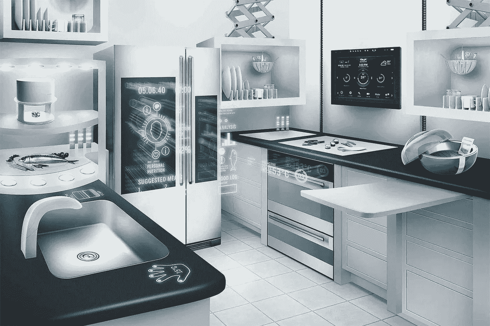

# 2017 年智能家居状况

> 原文：<https://towardsdatascience.com/smart-homes-safety-stability-and-trust-4ff1e270b2ee?source=collection_archive---------1----------------------->

Shiny sparkly hyper-futures always turn people off. This looks like the childless home of an Alpha class in Gattaca.

## 智能家居仍然是一个年轻的类别，但它反映了数字化、连接性、效率和安全性的深刻趋势。对于平台领导者来说，进一步殖民家园也是一场漫长的游戏。更有趣的是，这可能是对我们正在出现的气候危机的必要回应。然而，随着这一类别的成熟，在建立信任和价值方面存在巨大挑战。

虽然我们似乎正在走向智能结构的未来，这些智能结构能够感知其居民，并积极地模拟和管理他们的需求以及房屋的物理需求，但智能家居的全面承诺尚未实现，可能需要十年才能实现任何有意义的存在。

**市场**

分析师估计，到 2020 年，该市场的价值将在 500 亿美元至 1500 亿美元之间——这是一个相当广泛的分布，现在包括 wifi 扬声器和 Alexa 语音助手等产品，但大多数都没有集成的家庭管理系统。一个支持 Spotify 的 wifi 扬声器几乎算不上物联网，也无助于家庭的智能。类似地，使用智能手机控制照明也只不过是界面更新。因此，值得注意的是，“智能家居”的标签正逐步被“互联”和“智能”所取代。

> 不进行大规模的改造和更强的人工智能，更便宜的公用事业账单和知道你是谁的房间的承诺仍然遥不可及。

目前的智能家居市场由安全和娱乐主导，这两者都不是新的类别，而且都主要依赖于愚蠢的技术。从战略上讲，安全性是构建更多服务的支柱和(希望)收入渠道。娱乐主要是由集成了流媒体音乐服务(如 Spotify)的无线扬声器驱动的。

在这些部分之后是连接的固定装置，如照明、门铃和锁，以及各种传感器。这些往往服务于更高端的早期采用者和技术极客。也有一些利基交钥匙家庭自动化供应商，主要迎合富裕的技术人员，但普通人不太关心不均衡的未来。

不进行大规模的改造和更强的人工智能，更便宜的公用事业账单和知道你是谁的房间的承诺仍然遥不可及。然而，智能家居的愿景继续推动着双方的市场，朝着未来努力，在未来，家居可以主动降低我们的水电费，管理我们的废物循环，简化我们的时间表，个性化我们的娱乐，保护我们的家庭，保护我们的健康和福祉。

**玩家**

消费物联网和智能家居市场一直很大&很分散，但现在显示出顶级平台玩家越来越占据主导地位。市场可以分为三组提供商:有线服务、网络巨头和第三方设备制造商。

> 目前的市场更多的是由供应和愿景主导，而不是需求。

在美国，美国电话电报公司的 Digital Life & Comcast 的 Xfinity line 各自销售基于其现有集线器构建的智能家居解决方案，主要销售支持第三方设备生态系统的远程监控安全选项。这一策略主要是让人们呆在他们的客厅中心，并通过一些不久的将来的机器用户来对冲电话用户的下降。值得注意的是，威瑞森停止了自己的智能家居努力，转而支持其合作伙伴 Nexia。

网络巨头们也在用他们的网络中心占领客厅，但像亚马逊、谷歌和三星这样的数据驱动提供商更有兴趣把它们作为进入他们的云的入口。他们推销娱乐解决方案，如互联网接入、音乐流媒体和灯光控制，吸引互联网用户，而不是有线电视和电信公司的电视用户。

> 从历史上看，苹果的这种试探性姿态是一个信号，表明他们认为这个类别还不成熟。

亚马逊与 Alexa 的区别在于，它的语音界面带有 API。他们的平台主要是你家的百货商店，并增加了按需仪表盘按钮。谷歌通过 Nest 和 Nest Cam 追求家庭设施管理和安全，最近推出了其 Alexa 竞争对手 home，据传将宣布一个家庭安全解决方案。他们提供了一个与谷歌无处不在的数据机器紧密相连的高端技术产品系列。三星已经采取了一种围绕众多传感器类型构建的模块化方法——一种更实惠、更独特的产品，迎合了想要为家庭安装仪器的修补匠。

值得注意的是，苹果拥有 HomeKit，这是一个用于数据管理和可视化的开发平台。他们没有制造品牌设备，更喜欢依赖第三方供应商，如飞利浦 Hue 照明系统。从历史上看，苹果的这种试探性姿态是一个信号，表明他们认为这个类别还不成熟。

虽然互操作协议主要集中在少数几个标准上，但 M&A 的活跃表明了巨大的机会。事实上，目前的市场更多地是由供给和愿景主导，而非需求。

**驱动程序和启用程序**

消费物联网设备的爆炸式增长得到了资金容易获得的创新者的支持，这些创新者能够获得廉价而强大的组件和全球制造链。这是一系列试验，试图看看什么是坚持。设备出现了寒武纪大爆发，但几乎没有全面整合。大部分人还是看不到价值。

> 这是向家庭行为剖析迈出的一步，这对于提供有意义的个性化服务是必要的，但也开始让人感到侵扰和潜在的危险。

采用的主要障碍是成本和不便。随着市场证明价值，组件成本将稳步下降，但在深度学习解决方案投入使用之前，不便将是一个障碍。这种解决方案将利用声音、视觉、数据 API 和训练有素的分类器，而不需要给你的家重新布线。

从主电流中通过算法提取设备特征的能力已经显示出前景。这可以使学习系统通过电器监控来优化能源使用，对水和 HVAC 有类似的模型。由 GE 和 LG 等公司领导的烤箱等联网电器开始获得预测性维护能力，但大型电器可能每 10 年才更新一次，因此存在翻新障碍。

像 Nest Cam 这样的门口摄像头开始接受机器视觉生物识别。这是向家庭行为建档迈出的一步，这是提供有意义的个性化服务所必需的，但也开始感觉到侵扰和潜在的危险，这取决于服务提供商的数据卫生。

Toto 提供了一种可以进行简单代谢分析的马桶，但改造升级周期又是一个障碍。大多数房主永远不会更换他们的陶瓷马桶，如果他们这样做，他们可能不会选择在房子的墙壁之外分享他们最隐私的数据。

> 随着家庭面临更直接的经济和环境压力，更积极的气候变化可能会推动更多的采用。

解决方案还需要更加灵活和本地化，以应对区域压力，特别是在全球变暖和气候变化重塑环境条件的情况下。例如，一些家庭需要控制空气质量，防止灰尘侵入和过敏原，而其他家庭可能需要优化水的收集。随着家庭面临迫在眉睫的经济和环境压力，更积极的气候变化可能会推动更多的采用。

这一切都在持续的当前转移更多的能力(和责任)回到边缘。电力、食物和水的集中管理不如分散、局部和自我维持的管理可行。

> 这一切都在持续的当前转移更多的能力(和责任)回到边缘。

为了实现显著的市场渗透，互联解决方案将需要成为新住宅的一部分。正如建筑法规引领绿色发展一样，将更多联网设施引入新住宅也是必要的(人们可能会认为太阳能渗透率是联网家庭解决方案需求的一个指标)。改造之路只能走这么远，如果有承包商参与，许多人不会在意。然而，我们只能通过修复现有的大量住房来减少能源浪费。因此，广泛的增长将由要求下一代节能电器的进步建筑规范下的新住宅引领，随后是翻新的竞争和监管压力。

**挑战**

有许多挑战应该贯穿于产品策略中。这些问题包括漏洞和入侵、恶意软件和僵尸网络、关键服务中的漏洞、对隐私和数据所有权的担忧、无利可图的遗留平台的衰退以及平台所有者规定条款和服务的能力。这些都是在住房拥有率下降和西方经济增长降温的背景下制定的。未来的家很可能不再是乌托邦式的幻想，而是更注重性价比。

> 随着市场的增长，如何处理数据和用户如何管理信任将是一个巨大的挑战。

一个基本的挑战是可用性。机械锁很容易使用，电灯开关也一样。拿起智能手机，进行身份验证，启动应用程序，浏览菜单来开灯，并不是一种持久的替代方式。因此，飞利浦色调水龙头，但许多供应商仍然只是使基本任务更加困难。

比可用性更深的是，家是建立在信任和安全之上的。增加连接性为世界打开了更多的孔，正如最近婴儿监视器被网络不满者攻击的故事所显示的那样。同样， [Defcon 用一个伪造的客人 ID 击败了八月锁](https://www.cnet.com/news/august-smart-lock-hacked/)。在采用率足够高以提供有趣的攻击面之前，漏洞通常不会被发现。更多的用户引来更多的入侵。

如何处理数据和用户如何管理信任是一个巨大的挑战。亚马逊的 Alexa 是一个电子商务前端，在你家里有一只耳朵(而且[它可以被传唤作证指控你](http://www.snopes.com/2017/02/23/amazon-subpoena-alexa-data-murder/))。Alexa 团队的创始人之一，【Nikko Strom 说“我们收到了数量惊人的数据，我们可以对其进行处理。”这是关于信任:你希望公司在你的房子里攫取更多的土地份额吗？许多用户不会采用将数据传输到第三方的互联家庭解决方案。

> 这是跨服务生态系统分布功能的一个非常真实的结果:所有权、访问和责任越来越多地在用户和提供商之间共享，并有硬 EULAs 来描述它们。

此外，企业数据所有权已经超出了修复和修补的范围。在制造商禁止他们在现场进行自己的维修后，农民们正在从乌克兰下载非法黑客软件，以便快速修复他们连接的 John Deere 拖拉机。随着采用的增长和用户开始理解其品牌锁定的含义，这种情况将在互联家庭领域出现。

这种水平的读写能力正在慢慢被那些被锁在系统之外或者面临功能被弃用的用户所了解。一位智能家居用户最近发布了他们家中加湿器漏水的图片，因为网络证书过期了。

这是跨服务生态系统分布功能的一个非常真实的结果:所有权、访问和责任越来越多地在用户和提供商之间共享，并有硬 EULAs 来描述它们。商业领袖们首先考虑的是如何将他们的平台更深地融入我们的生活。第二，关于如何帮助我们在一些增值能力。

> 家庭必须带来稳定，而变化威胁着这种稳定。

这给我们带来了最大的挑战:家庭必须带来稳定，而变化威胁着这种稳定。庇护所、安全、家庭、隐私、营养、休息——忽视这些或试图改变这些品质或无意中改变这些品质的技术将会失败。

**向前看(略)**

在发达经济体，房屋和建筑正朝着更高效、更自动化的未来缓慢前行。未来的互联家庭解决方案将由两个相互冲突的引擎形成:个人授权和平台锁定。它们将拥有更多传感功能，与现有设施和设备的耦合更紧密，与用户配置文件和时间表的集成更紧密，以及复杂的深度学习系统，可以对机器和居民进行观察、分类、建模、预测、管理和推荐。许多这些功能将由服务提供商远程管理和维护，他们的目标和责任与用户不同。

> 未来的互联家庭解决方案将由两个相互冲突的引擎形成:个人授权和平台锁定。

不能有效地将信任传递到家庭中的供应商将会失败，他们公开的失败将会抑制市场的采用。一个强大的差异化优势将通过将功能和数据完全保留在现场来增强家庭及其成员的能力——这是大多数数据优先服务提供商无法想象的。

创新者正试图解决由一系列深层潮流驱动的需求:在 VUCA 世界中寻找安全和稳定；加速人类世的气候混乱；提高家居效率以更好地管理资源和财务开销的需求；我们通过数字网络的无处不在的连通性，以及我们的日程、责任和关系的数字化；智能手机让我们期待直接、易用的界面和功能，以及跨界面点的配置文件和偏好的连续性。

但是家的变化是缓慢的——它是包裹在信任和安全周围的基础设施，嵌入在冰冷的建筑规范和繁琐的成本结构中。这仍然是一个有远见的长期游戏，有许多障碍要克服。