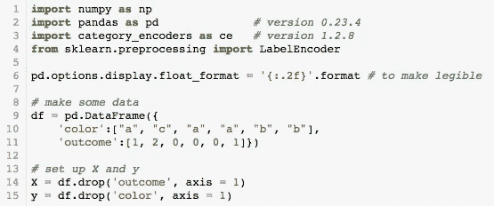
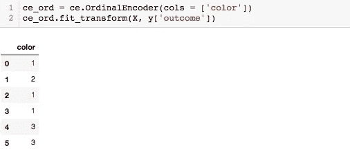
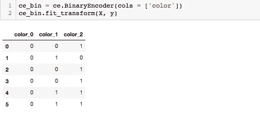
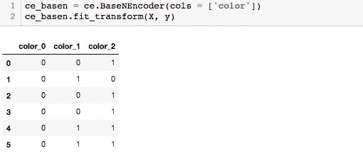
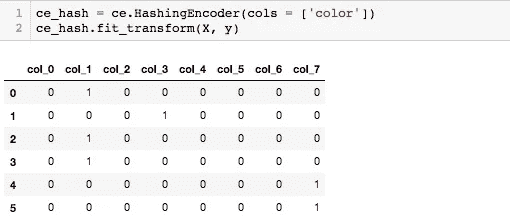

# 为机器学习编码分类数据的更智能方法

> 原文：<https://towardsdatascience.com/smarter-ways-to-encode-categorical-data-for-machine-learning-part-1-of-3-6dca2f71b159?source=collection_archive---------0----------------------->

## [实践教程](https://towardsdatascience.com/tagged/hands-on-tutorials)

## 探索类别编码器

更好的分类数据编码意味着更好的模型性能。在本文中，我将向您介绍来自[类别编码器包](http://contrib.scikit-learn.org/categorical-encoding/index.html)的各种编码选项，用于 Python 中的 scikit-learn 机器学习。


Enigma for encoding

# TL；DR；

当您有可能提供值的名义数据或序号数据时，请使用类别编码器来提高模型性能。

对于名义列，尝试 OneHot、Hashing、LeaveOneOut 和 Target 编码。避免对高基数列和基于决策树的算法使用 OneHot。

对于序数列，请尝试 Ordinal (Integer)、Binary、OneHot、LeaveOneOut 和 Target。赫尔默特、求和、倒向差和多项式不太可能有帮助，但如果你有时间或理论上的理由，你可能想试试它们。

对于回归任务，Target 和 LeaveOneOut 可能不会很好地工作。

# 路标


Map

在这篇文章中，我将讨论术语、一般用法和五个经典编码选项:序数、一个热点、二进制、BaseN 和散列。在未来，我可能会评估贝叶斯编码器和对比编码器与统计假设测试的根源。🚀

在[早先的一篇文章](/7-data-types-a-better-way-to-think-about-data-types-for-machine-learning-939fae99a689)中，我认为我们应该将数据分类为七种类型之一，以便更快地建立更好的模型。以下是七种数据类型:

无用—对机器学习算法无用，即—离散
标称—无顺序组—离散
二元—非此即彼—离散
序数—有顺序组—离散
计数—出现次数—离散
时间—有时间成分的循环数—连续
区间—无时间成分的正数和/或负数—连续

在这里，我们关心的是名义数据和序数数据的编码。具有名义数据的列中的值无法以任何有意义的方式排序。名义数据通常是一位热码(又名哑元)编码，但有许多选项可能对机器学习有更好的表现。


Rank

相反，序数数据可以按等级排序。概括地说，顺序数据可以用三种方式中的一种进行编码，但我认为可以肯定地说，它的编码通常没有经过仔细考虑。

1.  可以假设它与区间数据足够接近(值之间的幅度相对相等)，从而可以这样对待它。社会科学家一直用李克特量表做这个假设。例如，“从 1 到 7，1 表示极不可能，4 表示既不可能也不太可能，7 表示极有可能，您向朋友推荐这部电影的可能性有多大？”这里，3 和 4 之间的差以及 6 和 7 之间的差可以合理地假设为相似。
2.  它可以被视为名义数据，其中每个类别与另一个类别没有数字关系。您可以尝试一键编码和其他适用于名义数据的编码。
3.  这两个数字之间的差异可以忽略不计。你可以用不同的编码来训练你的模型，看看哪种编码效果最好。

在这个系列中，我们将看看从版本 1.2.8 开始的分类编码器 11 编码器。* *更新:版本 1.3.0 是截至 2019 年 4 月 11 日 PyPI 上的最新版本。**

这些编码方法中有许多在统计界有不止一个名字，有时一个名字可能意味着不同的事情。我们将遵循类别编码器的用法。

非常感谢[威尔·麦金尼斯](http://www.willmcginnis.com/2015/11/29/beyond-one-hot-an-exploration-of-categorical-variables/)创建和维护这个包。它很大程度上来源于 StatsModel 的 [Patsy 包](https://patsy.readthedocs.io/en/latest/API-reference.html)，而 Patsy 包又是基于这个 [UCLA 统计参考](https://stats.idre.ucla.edu/r/library/r-library-contrast-coding-systems-for-categorical-variables/)。

对分类信息进行编码的方式有无数种。类别编码器中的那些对于大多数用途应该是足够的。👍

# 快速小结

下面是分类编码器函数的列表，包括它们的描述和它们最适合编码的数据类型。

## 经典编码器

第一组五个经典编码器可以在一列(序数)到 *k* 列(OneHot)的连续嵌入信息上看到。对于机器学习从业者来说，这些编码非常有用。

***序数*** —通过 *k* 将字符串标签转换为整数值 1。序数。
***OneHot*** —每个值对应一列，用于与所有其他值进行比较。名词，序数。
***二进制*** —将每个整数转换成二进制数字。每个二进制数字占一列。一些信息丢失，但维度更少。序数。
***BaseN*** —序数、二进制或更高级编码。名词，序数。没有增加多少功能。大概避免。
***哈希***——像一个热点但维度更少，一些信息因碰撞而丢失。名词，序数。
***Sum****—就像 OneHot 一样，除了一个值在所有列中保持不变并编码为-1。*

## *对比度编码器*

*五个对比度编码器都有多个问题，我认为这些问题使得它们不太可能对机器学习有用。对于在列中找到的每个值，它们都输出一列。他们的[陈述意图](http://www.willmcginnis.com/2015/11/29/beyond-one-hot-an-exploration-of-categorical-variables/)如下。*

***【反转】* —将某个级别的因变量平均值与之前所有级别的因变量平均值进行比较。
***后向差异*** —将某一级别的因变量平均值与前一级别的因变量平均值进行比较。
***多项式*** —正交多项式对比。k=4 级的多项式编码所采用的系数是分类变量中的线性、二次和三次趋势。**

## **贝叶斯编码器**

**贝叶斯编码器在其编码中使用因变量的信息。它们输出一列，可以很好地处理高基数数据。**

*****目标*** —使用 DV 的均值，必须采取措施避免过度拟合/响应泄漏。名词，序数。用于分类任务。
***leave one out****—类似目标但避免污染。名词，序数。用于分类任务。
***weight of evidence****—v 1.3 新增，2019 年 4 月 11 日[单据](http://contrib.scikit-learn.org/categorical-encoding/)中未记录。这个方法在[这个帖子](https://www.listendata.com/2015/03/weight-of-evidence-woe-and-information.html)里有解释。
***詹姆斯-斯坦*** —即将在 v1.4 中发布，此处用代码[描述。
***M-估计量*** —即将在 v1.4 中发布。在此](https://github.com/scikit-learn-contrib/categorical-encoding/blob/master/category_encoders/james_stein.py)的代码[中描述。简化的目标编码器。](https://github.com/scikit-learn-contrib/categorical-encoding/blob/master/category_encoders/m_estimate.py)****

## **使用**

**类别编码器遵循与 scikit-learn 的预处理器相同的 API。它们有一些额外的便利，例如能够轻松地将编码器添加到管道中。此外，如果向编码器传递数据帧，它将返回一个 pandas 数据帧。以下是二进制编码的代码示例:**

**我们将在未来的实现中解决一些问题。但是如果您熟悉 scikit-learn 的 API，您应该能够直接进入前五种。**

**请注意，默认情况下，所有类别编码器都会自动估算缺失值。但是，我建议您在编码之前自己填充缺失的数据，这样您就可以测试几种方法的结果。我计划在下一篇文章中讨论输入选项，所以如果你想确保不会错过，请在 Medium 上关注 [me](https://medium.com/@jeffhale) 。**

# **术语**

**你可能会看到评论者互换使用以下术语:*维度*、*特征*、*向量*、*系列*、*自变量*和*列*。我也会:)同样，你可能会看到*行*和*观察*互换使用。**

**k 是数据列中唯一值的原始数量。*高* *基数*意味着很多唯一值(一个大的 *k)* 。包含数百个邮政编码的列是高基数特性的一个例子。**

****

**High cardinality theme bird**

***高维度*是指一个矩阵有多个维度。高维度伴随着维数灾难——关于这个话题的详细讨论可以在[这里](http://www.visiondummy.com/2014/04/curse-dimensionality-affect-classification/)找到。其要点是，高维度需要大量的观测数据，并经常导致过度拟合。**

****

**A wand to help ward off the Curse of Dimensionality**

***稀疏*数据是一个相对于其他值有很多零的矩阵。如果您的编码器转换您的数据，使其变得稀疏，一些算法可能无法很好地工作。稀疏性通常可以通过标记来管理，但许多算法并不能很好地工作，除非数据是密集的。**

****

**Sparse**

# **深入分类编码器**

**事不宜迟，我们来编码吧！**

## **序数**

**OrdinalEncoder 将每个字符串值转换为整数。列中的第一个唯一值变为 1，第二个变为 2，第三个变为 3，依此类推。**

**当您用 OrdinalEncoder*拟合 _ transform*时，编码前的实际值不会影响它的变化。第一个值可能是 10，第二个值可能是 3。现在他们将分别是 1 和 2。**

**如果列包含名义数据，在使用 OrdinalEncoder 后停止是个坏主意。您的机器学习算法会将变量视为连续的，并假设值在有意义的范围内。相反，如果您有一个值为 *car、bus、*和 *truck* 的列，您应该首先使用 OrdinalEncoder 对这个名义数据进行编码。然后使用一种适用于名义数据的方法再次对其进行编码，我们将在下面探讨这种方法。**

**相反，如果您的列值确实是有序的，这意味着分配给每个值的整数是有意义的。作业要用心做。假设您的列中有字符串值“第一”、“第三”和“第二”。应该通过向 OrdinalEncoder 传递一个字典列表将这些值映射到相应的整数，如下所示:**

```
**[{"col": "finished_race_order", 
  "mapping": [("First", 1), 
              ("Second", 2), 
              ("Third", 3)]
}]**
```

**下面是所有代码示例的基本设置。你可以在[这个 Kaggle 内核](https://www.kaggle.com/discdiver/category-encoders-examples)获得完整的笔记本。**

****

**这是未转换的 X 列。**

****

**下面是将*颜色*列值从字母转换成整数的 OrdinalEncoder 代码。**

****

**所有的字符串值现在都是整数。**

**Scikit-learn 的 OrdinalEncoder 和 Category Encoder 的 OrdinalEncoder 做的事情差不多，但是不太用户友好。Scikit-learn 的编码器不会返回熊猫数据帧。相反，如果您传递一个 DataFrame，它将返回一个 NumPy 数组。它还输出从 0 开始的值，而 OrdinalEncoder 默认输出从 1 开始的值。**

**在 pandas 中，您可以通过将字符串值映射到整数来完成序号编码。但是一旦你知道如何使用分类编码器，那就是额外的工作了。**

## **OneHot**

**一键编码是处理标称数据，也可能是序数数据的经典方法。在 Kaggle 的[机器学习教程系列](https://www.kaggle.com/dansbecker/using-categorical-data-with-one-hot-encoding)中，它被称为“分类数据的标准方法”。也有[名](https://stats.stackexchange.com/questions/308916/what-is-one-hot-encoding-called-in-scientific-literature) *哑*编码、*指示符*编码，偶尔还有*二进制*编码。是的，这是令人困惑的。😉**

****

**That’s one hot sun**

**独热编码器为每个值创建一列，以便与所有其他值进行比较。对于每个新列，如果一行包含该列的值，则该行获得一个 *1* ，如果不包含，则获得一个 *0* 。它看起来是这样的:**

****

***color_-1* 实际上是一个无关的列，因为它都是 0——没有变化，它没有帮助你的模型学习任何东西。它可能是为缺失值设计的，但是在类别编码器的 1.2.8 版本中，它没有任何用途。**

**独热编码可以执行得非常好，但是新特征的数量等于 *k，*唯一值的数量。如果数据集具有高基数要素，这种要素扩展会造成严重的内存问题。对于基于决策树的算法来说，一位热编码数据也可能是困难的——参见这里的讨论。**

**熊猫 [GetDummies](https://pandas.pydata.org/pandas-docs/stable/generated/pandas.get_dummies.html) 和 scikit-learn 的 [OneHotEncoder](http://scikit-learn.org/stable/modules/generated/sklearn.preprocessing.OneHotEncoder.html) 函数执行与类别编码器 OneHotEncoder 相同的角色。我发现分类编码器 OneHotEncoder 更好用一些。**

## **二进制的**

**二进制编码可以被认为是一位热编码器和散列编码器的混合体。Binary 比 one-hot 创建更少的功能，同时保留列中值的一些唯一性。它可以很好地处理高维有序数据。**

****

**Binary**

**它是这样工作的:**

*   **如果类别还不是数字形式的，则由 OrdinalEncoder 进行编码。**
*   **然后这些整数被转换成二进制代码，例如 5 变成 101，10 变成 1010**
*   **然后，该二进制字符串中的数字被拆分到单独的列中。因此，如果一个序号列中有 4–7 个值，那么将创建 3 个新列:一个用于第一位，一个用于第二位，一个用于第三位。**
*   **每个观察值都以二进制形式跨列编码。**

**它看起来是这样的:**

****

**第一列没有方差，所以它对模型没有任何帮助。**

**只有三个层次，嵌入的信息就变得混乱了。有许多碰撞，模型不能从特征中收集很多信息。如果一列只有几个值，就对它进行一次热编码。**

**相比之下，当列的基数较高时，二进制确实会大放异彩——例如，美国的 50 个州。**

**二进制编码比一键编码创建的列少。它的内存效率更高。它还减少了较高基数的维数问题的机会。**

**对于序号数据，大多数在序号形式下彼此接近的值将在新列中共享许多相同的值。很多机器学习算法可以学习到特征是相似的。二进制编码对于高基数的序数数据来说是一种不错的折衷。**

**如果你已经成功地使用了二进制编码，请在评论中分享。对于名义数据，具有更细粒度控制的哈希算法通常更有意义。**

## **巴森**

**当 BaseN *base = 1* 时，它基本上与一个热编码相同。当 *base = 2* 时，基本上与二进制编码相同。麦金尼斯[说](http://www.willmcginnis.com/2016/12/18/basen-encoding-grid-search-category_encoders/)这种编码器，“实际上，这增加了很少的新功能，很少有人在实际问题中使用基数-3 或基数-8 或除了序数或二进制以外的任何基数。”**

****

**Base 3**

**BaseN 存在的主要原因是可能使网格搜索更容易。您可以将 BaseN 与 scikit-learn 的 G*ridsearchv 一起使用。*然而*，*如果您要使用这些编码选项进行网格搜索，您可以将编码器作为 scikit-learn 管道的一部分，并将选项放在您的参数网格中。我看不到使用 BaseN 的令人信服的理由。如果你有，请在评论中分享。**

****

**BaseNEncoder 的默认基数是 2，相当于 BinaryEncoder。**

## **散列法**

**哈希编码器实现了[哈希技巧](https://medium.com/value-stream-design/introducing-one-of-the-best-hacks-in-machine-learning-the-hashing-trick-bf6a9c8af18f)。它类似于一键编码，但是新的维度更少，并且由于冲突会丢失一些信息。除非有大量重叠，否则冲突不会显著影响性能。关于散列技巧和选择输出特征数量的指南的精彩讨论可在[这里](https://booking.ai/dont-be-tricked-by-the-hashing-trick-192a6aae3087)找到。**

**这是序数栏，再次提醒一下。**

****

**这是带输出的哈希编码器。**

****

***n_components* 参数控制扩展列的数量。默认为八列。在我们有三个值的示例列中，缺省值导致五列全是 0。**

**如果将 *n_components* 设置为小于 *k* ，则编码数据提供的值会有一点减少。你的维度也会更少。**

**您可以将自己选择的哈希算法传递给 HashingEncoder 默认是 *md5* 。哈希算法在一些 Kaggle [竞赛](https://blog.myyellowroad.com/using-categorical-data-in-machine-learning-with-python-from-dummy-variables-to-deep-category-66041f734512)中非常成功。如果您有高基数特性，那么值得尝试为名义数据和序数数据使用哈希编码。👍**

# **包装**

****

**Exercise break**

**目前就这些。这里有一个回顾和建议何时使用编码器。**

**对于名义列，尝试 OneHot、Hashing、LeaveOneOut 和 Target 编码。避免高基数列的 OneHot。**

**对于序数列，请尝试 Ordinal (Integer)、Binary、OneHot、LeaveOneOut 和 Target。赫尔默特、求和、倒向差和多项式不太可能有帮助，但如果你有时间或理论上的理由，你可能想试试它们。**

**贝叶斯编码器可以很好地完成一些机器学习任务。例如，Owen Zhang 使用留一编码方法在一个 [Kaggle 分类挑战](https://www.slideshare.net/OwenZhang2/tips-for-data-science-competitions)中表现良好。**

*** 2019 年 4 月更新:我更新了这篇文章，以包括关于即将推出的编码器的信息，并修改了结论。****

**我写的是数据科学、 [Python](https://memorablepython.com) 、 [SQL](https://memorablesql.com) 和 DevOps。查看我的其他文章，如果你对这些感兴趣，请点击这里关注我。😀**

**[](https://dataawesome.com)**

**感谢阅读！**