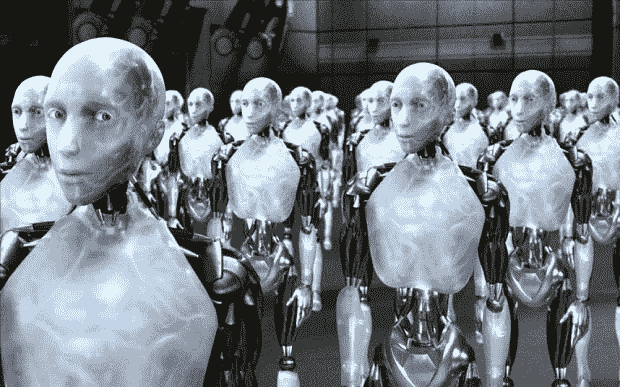
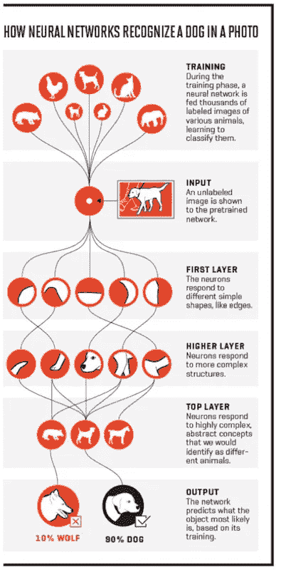
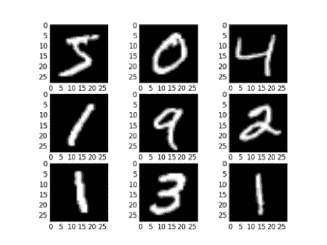

# 那么 AI 有什么新的？三十年后，我决定参加人工智能进修课程，这就是我的发现

> 原文：<https://towardsdatascience.com/so-whats-new-in-ai-i-decided-to-take-an-ai-refresher-course-thirty-years-later-b4c7ae077cc4?source=collection_archive---------3----------------------->

## 我毕业时获得了人工智能学位，当时相当于一部 iPhone 的计算能力的成本是 5000 万美元。很多事情都变了，但令人惊讶的是，很多事情还是老样子。

## 停止疯狂！

W 当我今天早上醒来，在 Flipboard 上查看我的 AI 故事每日新闻时，我觉得我应该继续睡觉。很明显，我们所知的世界即将终结。在我大约三分之一的个性化新闻文章中，人工智能标题清晰响亮。以下是其中的一些:

> 人工智能专家列出了人工智能的真正危险
> 
> 限制人工智能的缺点
> 
> 新报告概述了人工智能的一些反乌托邦元素
> 
> 关于新兴人工智能风险的新报告描绘了一个严峻的未来
> 
> 埃隆·马斯克退出人工智能伦理研究小组
> 
> AI 会奴役人类吗？可能不会，但它可能会在自动取款机上抢劫你
> 
> NatWest 雇佣“数字人”Cora 与客户聊天，并帮助解决简单的银行业务
> 
> 人工智能是对文明的威胁吗？

当像[斯蒂芬·霍金](https://www.youtube.com/watch?v=fFLVyWBDTfo/)和[埃隆·马斯克](https://www.theguardian.com/technology/2014/oct/27/elon-musk-artificial-intelligence-ai-biggest-existential-threat/)这样的聪明人说，我引用他的话，“全人工智能的发展可能会导致人类的灭亡”和“人工智能是我们最大的生存威胁”时，我有什么资格反驳。当享誉全球的管理咨询公司麦肯锡(McKinsey)在全球首席执行官中引起广泛关注时，它坚定地表示，“我们估计，全球劳动力市场上人们被雇佣从事的所有活动中，约有一半可能会实现自动化”，那么，假设我们都注定要失败似乎也不无道理。



[The Telegraph newspaper reports that experts believe robots will take over most jobs within 30 years](https://www.telegraph.co.uk/news/science/science-news/12155808/Robots-will-take-over-most-jobs-within-30-years-experts-warn.html).

但简而言之，我相信这是很多媒体头条抓取废话。为什么我有资格对这个话题发表意见？自从我从苏塞克斯大学获得人工智能和计算机科学学位后，我已经观察人工智能三十多年了。这要追溯到人们认为 AI 意味着人工授精的时代。任何在人工智能历史的许多篇章中生活、呼吸和工作过的人，都对最近的说法抱有一定程度的怀疑。

## **艾是历史上非常寒冷的冬天**

自从人工智能出现以来，它就一直处于反复无常的状态。在 70 年代，80 年代，90 年代，甚至是 21 世纪初，大规模的宣传和投资围绕着人工智能迅速展开，随后被降级到内陆地区，因为预期总是远远达不到。在 20 世纪 90 年代初，试图找到一份拥有人工智能学位的工作是一条通往失业的必经之路。我不得不将自己重塑为一名地理信息系统(GIS)工程师。至少 GIS 使用了人工智能算法，如两个地点之间的最短路线和知识表示技术。但我的许多人工智能专业的毕业生都无法通过他们的教育选择来成就事业，除非他们进入学术界或研究领域。

但是现在有些事情真的不同了。人工智能可能真的开始兑现它的承诺了。人工智能已经悄悄进入我们的日常生活，通过技术实现了许多日常服务:

*   **亚马逊 Alexa** ，这个价值 49 美元的冰球，坐在我们的厨房里，它能理解我在说什么，而且通常会给我合理的答案。它的语音转文本识别真的很好。你应该看看相关的应用程序，它发现了许多不知情的青少年，他们问了 Alexa 可疑的问题，不知道这些问题都被转换成文本供他们的父母查看。
*   **脸书**非常擅长面部识别。每天都有数十亿用户上传数百万张照片。脸书扫描这些照片，找出人脸，然后给他们起名字。由于隐私法的原因，这一功能在欧洲并不常见，但这项技术正在大规模地做一些通常属于人类的事情。
*   谷歌最近展示了其 DeepMind AlphaGo 团队，计算机可以在古老的围棋比赛中击败世界最佳选手。这在几年前被认为是不可能的，因为游戏中的移动数量超过了宇宙中的原子数量。但他们的深度神经网络已经能够自我学习击败世界最佳的策略。

人工智能正在为各种服务提供动力，从聊天机器人和虚拟代理到智能机器人和自动驾驶汽车。所有这些都是人工智能的例子，表明计算机可以完成通常需要人类智能的活动，如视觉感知或语音识别，决策，以及在复杂的世界中感知和导航。

## **我们生活在一个指数增长的世界里**

当我学习人工智能时，课程包括语音识别、自然语言处理、视觉识别、机器学习、神经网络和推理。我记得一份试卷给我们出了一个难题，如何检测汽车牌照。我编写了第一个神经网络来解决旅行推销员问题——如何找到十个地理位置之间的最短驾驶距离。我记得有一个长期项目是给一台机器编程，学习如何进行数学推理。但当时真的感觉我们离日常生活中可以使用的东西还很远。这些节目真的很慢。数据集非常小。这些系统不能从一个话题概括到另一个话题。而所谓的人工智能**强调** **人工**高于智能。

但是有些事情已经改变了。很难想象 iPhone 只有十几岁。很难想象一个没有脸书的世界。很难想象一个世界，如果我需要找到一些信息，我不会搜索谷歌。计算能力和数据的指数级增长使得数字世界成为可能。这推动了人工智能的转变。一些有趣的事实证明了我们指数世界的力量:

*   如果自 1971 年以来，一辆汽车的速度与计算芯片的速度一样快，那么它的行驶速度将达到每小时 420，000，000 英里。
*   如今的数据存储比 1993 年便宜了 28，450 英镑。
*   据估计，到 2020 年，地球上 70 亿人口中的每一个人每秒都会产生 1，700，000 字节的数据。这相当于这个星球上的每个人每秒钟都会发出 100 多封没有图片的电子邮件。

据说全球 80%的数据都是近两年才产生的。在物联网、移动设备、工业传感器、健身设备和社交媒体活动的推动下，这一数字将继续呈指数级增长。我不得不查找一个 **Zettabyte** 的大小(10 的 21 次方)，因为据估计，到 2020 年将会产生 44 Zettabytes 的数据。

这个指数级的世界已经产生了看起来可行的人工智能应用。在过去的三年里，随着面部识别的进步，图像识别的错误率已经从 28%下降到 7%。语音识别率已经下降到人类的准确性领域。


Error rates for recognising images have dropped from 28% to 7% over the past few years. Courtesy of [Benedict Evans](https://medium.com/u/78c5166b8328?source=post_page-----b4c7ae077cc4--------------------------------)


And similarly speech recognition error rates have dropped precipitously from 26% to 4%. This is approaching human levels.

## **谷歌免费提供尖端的机器学习软件 tensor flow**

但是还有其他的事情在发生。以前写软件做机器学习之类的事情真的很难。机器学习是指计算机能够自己学习，而不必像你写软件时那样被明确告知规则。

考虑深度神经网络，它是驱动最新一轮人工智能歇斯底里的基础技术。根据大脑神经元的松散模型，下面的示意图显示了一个深度神经网络，它可以学习识别狗的图片，并区分类似的动物，如狼或猫。



A deep neural network that learns to identify pictures of dogs from other animals. The program is not told what features differentiate the animals but rather learns for itself from seeing thousands of examples. Courtesy of [Fortune](http://fortune.com/ai-artificial-intelligence-deep-machine-learning/).

在所谓的监督训练中，神经网络被输入许多动物的图片。向神经网络展示一张物体的图片，并告诉它是否是一只狗。深度神经网络由神经元层组成，这些神经元层代表关于对象的越来越多的抽象。第一层发现基本的视觉特征，如线条边缘或纹理或颜色。然后，更高的层次开始将这些放在一起，以看到更全面的特征，如鼻子或爪子或腿或尾巴。然后最高层把它们放在一起“看”一匹马、一只狗或一只狼。在所有这些情况下，机器在看到许多训练示例后，已经自己学习了模式。它能以 90%的准确率识别一张照片是狗还是狼。

这种神经网络软件的非凡之处在于，机器没有被告知动物之间的区别，而是自己学习。升起机器！

编写软件来做到这一点真的很难。让机器识别物体、单词或句子将花费我好几个月的时间，即便如此，结果也是有限的。三十年前，我们没有足够的计算机能力来进行多层次的学习，而是只有一个层次，而且我们只有很小的数据集。

今天，谷歌是世界上最大的人工智能公司。它能够吸引该学科中最优秀和最聪明的头脑。他们正在研究自动驾驶汽车、语音识别、智能推理、海量搜索和大多数经典的人工智能问题。他们已经免费提供他们的人工智能软件来驱动他们的服务**是免费的！ [**TensorFlow**](https://www.tensorflow.org/) 现在是一个开源软件项目，它从谷歌获得了最好的人工智能软件库，并允许社区使用它。**

## **你可以在几分钟内设置一个机器学习程序——你不是天才！**

**这个 TensorFlow 软件不仅代表了人工智能和机器学习的艺术水平，而且使用起来也相对简单。正如最近在 [KDnuggets](https://www.kdnuggets.com/2018/02/neural-network-ai-simple-genius.html) 的一篇文章标题是“*神经网络 AI 很简单。所以……别再假装自己是天才了。*情有可原。但现实是，在黄金时间做 AI 确实需要工作和专业知识。然而，建立并运行一个神经网络演示几乎是小菜一碟。**

**我最喜欢的软件库是 [**Keras**](https://keras.io/) ，也是免费的。它涵盖了 Tensorflow 和其他机器学习引擎，使构建和训练神经网络变得更加简单。**

****

**A combinaton of Keras and TensorFlow is a great toolkit to start machine learning programming.**

**人工智能学生学习的第一个程序是 MNIST。这是一个让机器从视觉上学习手写数字 0 到 9(如下)之间的区别的任务。一台计算机被展示 6 万幅图像样本，并学会识别这些数字的视觉差异。**

****

**使用 Keras，下面的代码是您构建和训练深度神经网络所需的全部内容——这是一个**卷积**神经网络，特别适合视觉识别。这些机器学习识别数字的准确率达到 99.6%。**

**Keras 中的编程步骤如下灰框所示。理解具体的代码指令并不重要，重要的是要注意实现程序只需要五个主要的概念性步骤。**

1.  **加载 Keras 的软件库以及矩阵和向量数学**

```
import numpyfrom keras.datasets import mnistfrom keras.models import Sequentialfrom keras.layers import Densefrom keras.layers import Dropoutfrom keras.layers import Flattenfrom keras.layers.convolutional import Conv2Dfrom keras.layers.convolutional import MaxPooling2Dfrom keras.utils import np_utilsfrom keras import backend as KK.set_image_dim_ordering('th')
```

**2.设置随机数**

```
# fix random seed for reproducibilityseed = 7numpy.random.seed(seed)
```

**3.加载 60，000 幅图像的训练数据，并将其存储在正确形成的矩阵和向量中**

```
# load data(X_train, y_train), (X_test, y_test) = mnist.load_data()# reshape to be [samples][pixels][width][height]X_train = X_train.reshape(X_train.shape[0], 1, 28, 28).astype('float32')X_test = X_test.reshape(X_test.shape[0], 1, 28, 28).astype('float32')
```

**4.构建输入和输出数据，以便用于培训**

```
# normalize inputs from 0-255 to 0-1X_train = X_train / 255X_test = X_test / 255# one hot encode outputsy_train = np_utils.to_categorical(y_train)y_test = np_utils.to_categorical(y_test)num_classes = y_test.shape[1]
```

**5.建立模型，对数据进行训练，并输出数据的准确性**

```
def baseline_model():# create modelmodel = Sequential()model.add(Conv2D(32, (5, 5), input_shape=(1, 28, 28), activation='relu'))model.add(MaxPooling2D(pool_size=(2, 2)))model.add(Dropout(0.2))model.add(Flatten())model.add(Dense(128, activation='relu'))model.add(Dense(num_classes, activation='softmax'))# Compile modelmodel.compile(loss='categorical_crossentropy', optimizer='adam', metrics=['accuracy'])return model# build the modelmodel = baseline_model()# Fit the modelmodel.fit(X_train, y_train, validation_data=(X_test, y_test), epochs=10, batch_size=200, verbose=2)# Final evaluation of the modelscores = model.evaluate(X_test, y_test, verbose=0)print("CNN Error: %.2f%%" % (100-scores[1]*100))
```

**[这个程序是机器学习掌握的教程](https://machinelearningmastery.com/handwritten-digit-recognition-using-convolutional-neural-networks-python-keras/)。**

**为了证明它有多简单，我喜欢这个由@datitran 用 TensorFlow 写的[浣熊探测器](/how-to-train-your-own-object-detector-with-tensorflows-object-detector-api-bec72ecfe1d9/)。这个程序使用 TensorFlow 最新的库进行对象检测。**

****

**A racoon detector built on TensorFlow’s object detector APIs.**

## ****人工智能将成为无处不在的赋能工具包****

**在过去的几个月里，我一直在卷起袖子，把手弄得很脏，为神经网络编程。一天下午，我突然有一种似曾相识的感觉，随后恍然大悟。**

**大约三十年前，第一个商业 SQL 关系数据库出现在 IBM、Ingres 和 Oracle 等公司。数据库将储存、管理和分析以表格形式组织的数据。它们本身并没有给最终用户带来任何明显的好处，但它们是一套技术和工具，让**的企业能够创造出无穷无尽的应用。如今，我很难想象全球有哪家公司没有由关系数据库以及现在的非 SQL 数据库支持的应用程序。它已经成为无处不在的 T4，它们所能实现的应用数量仅仅是想象力极限的函数。****

**同样，今天人工智能市场的发展正受到难以置信的强大和可访问的人工智能工具包和技术的推动。这些工具包允许构建无限的应用程序。DeepIndex 允许你查看近 300 个人工智能应用，其中大部分都是用这些工具包构建的。**

**这些工具可以轻松地用于实现有价值的应用程序，这意味着在未来几年，我们甚至可能不会谈论人工智能和机器学习，因为它将如此普遍，并融入所有技术的结构中。**

## ****人工智能将在数千个用例中证明真正的经济价值****

**我现在想知道人工智能的经济价值。因此，我在过去几个月里绘制了数百个人工智能用例，并查看了数百家人工智能公司以及大量的技术工具包和框架。我想知道人工智能现在是如何在公司各部门、公司和行业中使用的。我想知道人工智能是否有真正的价值。我很难确定未来几年不会使用人工智能的单一功能和行业。**

**虽然今天人工智能的许多企业应用都处于规划和实验阶段，但人工智能的商业应用将从帮助更好地管理和分析企业数据财富开始。机器学习在发现海量数据集中的模式方面非常出色。它的应用将使公司增加收入，降低成本，提高生产力，改善产品和服务。机器学习真正擅长的一些任务包括:**

*   ****识别视觉模式**,例如识别场景中的人脸和物体，在视觉上检测生产线上的缺陷，在病理切片上发现癌症标记，或从检查照片中估计汽车的损坏程度，或确定品牌标志何时被无证使用。**
*   ****预测**，例如哪些客户可能流失，哪些消费者最有可能转变为付费客户，或者确定何时应该更换零件以提供预测性维护。或者预测哪些信用卡交易可能是欺诈。或者一个人会根据别人的推荐喜欢哪些电影。以及我们网络中的哪些活动违反了网络安全。**
*   ****语音和自然语言处理**，例如自动筛选和排列简历或确定客户的情绪，以帮助呼叫中心代理更好地响应客户。**

**当然，围绕传感和反应技术有一整套用例，如机器人和自动驾驶汽车。**

## ****那么谁来从 AI 身上赚钱呢？****

**在检查人工智能使用案例时，很明显我们现在正进入一个真正的人工智能黄金时代。成千上万的新公司都在竞相抢占他们的份额。我将把我的分析留到另一篇论文中，但有几个关键主题似乎表明了**经济** **价值**正在向何处转移:**

*   ****数据**是 AI 的关键。要训练机器变得聪明，拥有数据训练集至关重要。拥有数据集的人处于有利地位。几年前，优步(Alibaba)或 AirBnB 等新贵可以颠覆整个行业，而现在，一些价值和权力转移回了现有企业。谁能比拥有大量承保索赔历史数据的保险公司更好地利用人工智能呢？这家金融服务公司对消费者的购买行为了如指掌？或者是用户搜索信息最多的搜索公司？**
*   **全球科技巨头正在为人工智能领域的领导地位展开军备竞赛。据 CBInsights 报道，2016 年科技巨头在人工智能领域的投资超过 200 亿美元。谷歌可以说是世界上最大的人工智能公司。但它正与亚马逊、微软和 IBM 争夺主导地位。人工智能初创公司几乎没有机会颠覆这些巨头关注的人工智能基础设施和平台。很少有创业公司会在云计算上比微软花费更多或更聪明，或者比谷歌的张量处理单元建立更好的人工智能芯片，或者比亚马逊建立更好的物体识别软件库。**
*   ****国家**也在进行人工智能军备竞赛。[中国并不羞于在 AI](https://www.forbes.com/sites/alexkonrad/2017/05/30/kai-fu-lee-sees-china-ai-advantage/#4d9f43ea1969/) 问题上发出自己的声音。它认为自己比美国具有结构性优势，包括更具支持性的监管框架(特别是在数据隐私和使用方面)，其政府支持的人工智能生态系统包括对不断增长的技术和工程人才的巨额投资，以及大规模的数据和可用性。中国的 AI 公司比如百度或者 Face++真的很好，有海量的数据集。中国人指出，他们的移动市场是美国的 3 倍，移动支付是美国的 50 倍，这是一个巨大的数据优势。**
*   ****人工智能初创企业**比比皆是，但它们需要获得独特的数据集、深厚的领域知识、雄厚的资金以及吸引日益紧缺的人工智能人才的能力。这不是一个车库里的应用程序会改变世界的案例。2016 年，VC 和 PE 对人工智能公司的投资超过 60 亿美元，其中大部分是机器学习横向应用。**

**人工智能的淘金热开始了。但是看起来越来越像是最大的公司和国家将获得经济价值的最大份额。**

## ****最后的反思——学习人工智能既容易又难****

**在过去的几个月里，我决定休假去研究人工智能。我真的很想弄清楚什么是真实的，什么不是。了解人工智能的现状在很大程度上是一个大数据问题。关于正在发生的事情的信息量、种类和速度是巨大的。这反映了一个真正蓬勃发展的行业。跟上最新的人工智能研究、技术、工具、初创公司、用例就像从消防水管喝水一样。如果你在谷歌上搜索神经网络，你会看到 140 万篇文章。随着 d *eep 神经网络，胶囊网络，卷积网络，LSTM，BatchNorm* ，*激活函数，随机梯度下降，降维，嵌入，辍学，残差网络，Keras，Tensorflow，递归神经网络(RNNs)，残差网络，数据角力，Python，内核，前馈，监督 Vs 非监督*等等的首字母缩略汤，很容易变得不知所措。互联网已经被证明是能够找到信息的真正繁荣，但问题是有太多的信息。**

**所以我决定回到**学校**。我需要回到一所受信任和尊重的学校的教室，这所学校以其教学法而闻名。那我做了什么？我报名参加了一个大型开放式在线学习课程(MOOCs)。我选择了吴恩达教授的 [Coursera 深度学习课程](https://www.coursera.org/specializations/deep-learning/)，他是斯坦福大学的兼职教授，曾在谷歌和百度工作。他是一位出色的教师，了解人工智能的教学方法。成本仅仅是我的时间和月费，比你的星巴克咖啡还少。MOOCs 已经**民主化**教育，这是大约三十年前我第一次上人工智能课程以来的一个巨大变化。**

**在线课程既有趣又有挑战性。我发现它们重新激活了我大脑中的部分区域，在那里，我的导数和微积分、大规模维度矩阵和向量空间、编程(现在是 Python)和机器学习算法的知识出人意料地处于休眠状态。它回来了。几十年后，这种材料变得异常熟悉。编程肯定比以前容易得多——有数百个库处理所有困难的部分。**

## **事情越是变化，它们就越是一成不变**

**我会对工作场所产生真正的影响，但我们应该忽略这种夸张。工作岗位最终会被取代，但在很大程度上，人工智能将被证明是生产力的繁荣。是的，人工智能确实令人担忧，比如黑客攻击的数字风险，自主无人机远程攻击等物理风险，以及虚假宣传和国家监控带来的政治风险。但是，这些机器还远远没有达到真正取代我们的普通智能水平。当今天的神经网络学习猫和狗之间的视觉差异时，它不具备人类那样的概括和持有这些动物的任何概念的能力。它不知道它们还活着。他们是宠物。应该轻轻地抚摸它们。他们应该得到食物。他们有感情。它知道的很少。**

**三十年前，我们研究了一般智力和狭义智力的概念。一般智力还有很长的路要走，但是狭窄已经有了很大的改善。人工智能真正改变的是，工具、技术和算法真的进化了。现在大规模实现人工智能要容易一百倍甚至更多倍。而且便宜很多。现在人工智能的经济机会很大，令人兴奋。淘金热正在进行，经济利益将再次被少数人和大多数人攫取。**

**但是如果你问我三十年来发生了什么变化。一切都变了，但从概念上来说，并没有什么真正的改变。**

****作者** **作者** [西蒙·格林曼](https://medium.com/u/828eed16d402?source=post_page-----b4c7ae077cc4--------------------------------)**

**我热爱技术以及如何将技术应用于商业领域。我很幸运地在互联网早期共同创立了[MapQuest.com](http://www.mapquest.com)服务，并继续利用技术来发展、创新和改造公司和行业。我目前经营着自己的咨询公司 [DigitalInnovators.a](https://digitalinnovators.ai/) 帮助董事会和高管让他们的公司实现人工智能。**

**如果你喜欢这首曲子，我希望你能按下拍手按钮👏所以其他人可能会偶然发现它。你可以[直接给我发电子邮件](mailto:sgreenman@digitalinnovators.ai)或[在 LinkedIn](https://www.linkedin.com/in/simongreenman/) 或 [twitter](https://twitter.com/sgreenman/) 上找到我，或在 [Simon Greenman](https://medium.com/u/828eed16d402?source=post_page-----b4c7ae077cc4--------------------------------) 上关注我。**