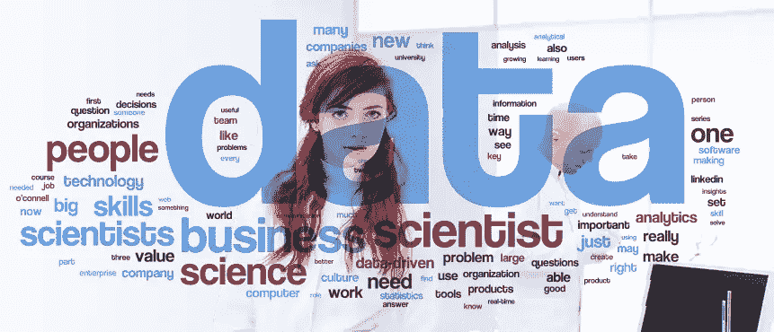

# 所以你将管理一个数据科学团队

> 原文：<https://towardsdatascience.com/so-youre-going-to-manage-a-data-science-team-31f075809ffd?source=collection_archive---------0----------------------->

我见过你们这些人不会相信的事情。仪表板上着火的数据透视表。r 脚本在 Hadoop 集群附近的黑暗中闪闪发光。

但是(很抱歉鲁特格尔·哈尔剽窃了他的精彩独白)我也看到了很多数据科学是通过技术实现的——首先没有将人或流程考虑在内，我想我应该提出一些源于我引导客户和合作伙伴通过这些水域的经验的想法。

作为一名崭露头角的企业人类学家，(恢复中的)技术总监和国际[养猫人](https://www.cshlpress.com/pdf/LabDyn.pdf)，我经常惊讶于对技术技能和工具的重视程度，而不是实际建立一个有效的团队。

作为一名训练有素的工程师(尽管有明显的量化倾向)，我对让数据科学团队成功所需的技术、技能组合甚至数据类型的意见非常着迷，因为实际上很少有关于哪些是关键因素的硬数据。

因此，我将从所涉及的技术和科学后退一步，看看*流程*应该如何工作，以及不管你的背景如何，在管理数据科学团队时应该考虑的一些事情。

# 人员、流程、技术

几年前，我(被我的前首席技术官)反复灌输*卓越是一个过程*，这句格言一直伴随着我，因为他指的是个人和团队成长意义上的“卓越”,而不是利用科技炒作或搭乘[六适马](https://en.wikipedia.org/wiki/Six_Sigma)列车。

请注意，工具和技术*至关重要，但你必须放眼全局。*

以深度学习为例: [Tensorflow](https://www.tensorflow.org/) 可能是目前的首选库，但 [Keras](https://keras.io/) 会给你一个更好的抽象，也让你利用 [CNTK](https://www.microsoft.com/en-us/cognitive-toolkit/) 作为后端，并可能在迭代问题时获得更快的周转，所以我认为它应该是你(和你的团队)需要投资的更高级的工具。

如果你从长远来看，从纯统计/回归方法到 RNNs 的整个过程意味着一个深刻的承诺，不仅是学习它们背后的科学，而且是理解它们在你必须解决的一系列挑战中的位置。

相信我，选择工具并不是你需要首先解决的问题——你应该首先解决的是你的团队，然后是团队运作的环境。

# 第一个错误

组织(和管理者)犯的第一个错误是*认为向你汇报的数据科学家就是你的整个团队*。

无论人们对[矩阵管理](https://en.wikipedia.org/wiki/Matrix_management)和跨职能团队的需求谈论了多少，人类都有一种将人(和事物)分类到漂亮整洁的箱子里的自然倾向，当你必须激励和推动人们时，就会涉及到额外的偏见——毕竟，作为一名经理，你的主要职责是确保你被分配的团队团结一致地工作，在数据科学领域(尤其是在该领域的新公司)，也需要证明你的价值。

我的意思是*团队的价值*——你可能凭借自己的能力成为一名奇才，但你的工作是确保你的团队能够实现目标，并且在你的直接下属内部和外部都清楚地定义了目标和期望。

所以你的*实际的*团队由各种各样的利益相关者组成——产品所有者、管理层，以及(同样重要的)*技术角色中的其他每个人，*因为你所做的事情(以及你所获得的洞察力)不可避免地会影响业务的其余部分，以及它是如何构建/实现/部署的等等。您并不存在于真空中，而是您拥有的数据(或者，更多情况下，没有)和业务需要改进的数据之间的管道(我在这里有意避免逆向流动，即当业务要求您改进已经实现的东西时)。

在大数据炒作期间，我以前见过非常类似的事情发生，我们成功解决这一问题的方法是通过建立人员“小组”来解决每个具体问题-每个小组由通常的三人组成，即数据科学家(通常是您的直接下属)、实施者(可能是也可能不是)和领域专家(通常是产品所有者或业务利益相关者)。

我使用上面的术语“实现者”,因为根据您正在处理的问题，问题域可能需要:

*   数据转换的快速迭代(在这种情况下，您可以用开发人员或 DBA 来担当这个角色)
*   整合数据可视化(前端开发人员或设计人员)
*   或者弄清楚如何大规模部署模型(架构师或开发人员)

不管是哪种方式，最终结果都是，在更正式的组织中，你会发现自己不得不与管理同行混合和匹配时间表，因此，如果你能清楚地沟通总体目标是什么，以及应对特定挑战需要什么样的技能，这将会有所帮助。

# 从里到外都不辜负这个角色

你有丰富的实践经验，你的团队尊敬你，你让自己参与关于架构、特性工程、算法选择和模型评估的各种讨论——这很好，除了*管理与此无关。*

管理一个团队需要你走出自己的舒适区，处理好优先事项，遵守截止日期，指导人们的职业生涯，以及在商业环境中领导人们和交付成果所带来的所有混乱、不科学的问题。

这里最重要的是避免成为[冒名顶替综合症](https://en.wikipedia.org/wiki/Impostor_syndrome)的牺牲品——记住，你得到这份工作是有原因的，对吗？成为一名经理并不意味着你停止做科学工作——事实上，你可能会比你通常做的*更多的*科学工作(但在更高的层次上),仅仅因为你需要了解你的扩展团队在做什么，识别陷阱或障碍，并把人们引向正确的方向。

要做到这一点，你需要学会如何有效地沟通——不仅仅是在团队内部，还要在团队外部，而且经常是与没有相同背景(技术或其他)的人沟通。

# 将流程落实到位

随着工作的到来和你所有的豆荚排好队，你的团队开始建立一个挑战的管道来通过(通常有多个子挑战，因为你开始钻事情)。那么，你如何将这些挑战分配给你的团队，同时让每个人都开心呢？

在我们解决这个问题之前，我们需要后退一步，想想人们最有可能如何度过他们的时间。

在扩大数据科学团队的规模时，基本上有两个约束，它们都归结为时间:理解问题和制定解决方案所花费的时间，以及实施和推广它所花费的时间。

实际上，通常发生的情况是:

*   你的团队 80%的时间将花在挖掘数据的意义上:搜寻数据集、做 ETL 和做初始特性选择。到目前为止，第一部分是工作中最不吸引人的部分，但它与人类对数据和问题领域获得直观感受的需求非常契合，因此*你应该置身事外。*无论如何，每天都要站起来(如果这是你的事情)，和团队坐在一起讨论他们在做什么，但是当被要求/需要时，尽量只利用你自己的专业知识——不要微观管理人们，而是帮助他们从长远角度出发，把他们正在做的事情变成可重复的过程。
*   剩下的 20%的时间通常花在弄清楚如何让你的数据和模型对公司的其他人可用上——这是大多数数据科学团队忽略的地方。

碰巧的是，交付数据科学比生成报告和仪表板有更多的*。所以你(作为一个经理)应该期望花费*大量的*时间(在早期可能高达 80%),检查上面的 20%,并与你的团队合作，将他们所做的转化为可重复的、可度量的过程，或者通过利用持续集成工具来比较迭代之间的模型，或者通过定义检查和平衡:什么特性被添加到了模型中？它在新数据集上的表现如何？考虑到您的数据(或业务流程)的更新速度，它多久会过时？*

*一个好的经理知道在“快速失败”方法和不仓促行事之间要取得平衡——尽一切可能让人们去尝试新方法(这是让人们开心的一个重要部分),但是定义你要用来衡量结果的尺度——我们是否从新模型或工具中获得更快的周转？它是否在不影响性能的情况下表现得更好？我们是否获得了诸如自动消除偏差或防止过度拟合之类的附带好处？*

*根据您的公司、资源和流程，开始时可能需要相当长的时间，但这里的想法是，当您开始交付解决方案时，您*将*构建一组其他人将使用的 API、基础架构或数据集，为它们定义路线图，并对它们进行迭代——因此您与其他团队构建的桥梁在这里将是无价的。*

# *用科学发展你的团队！*

*很快，你就会发现谁有解决特定问题的诀窍或专业知识。然而，不要把看起来像钉子的东西都分配给他们，*把这些人和以前从未做过的人配对*。*

*让他们拓宽视野，再一次把它变成一个可重复的过程，同时也把它展示给他们的同伴。一定要介入引导讨论，但要记住，个人成长来自于学习新的东西*和*并将它们传递下去，如果每个人都清楚这些过程，并且如果他们将这些过程视为工作的一个组成部分，那么你的团队将会更加有效(和快乐)。*

*不要因为效率而陷入流程中，或者为了自己的利益而开始计算 KPIs 相反，把*流程看作是给你们所有人正在做的工作增加结构*(因此意味着什么),并从[改善](https://en.wikipedia.org/wiki/Kaizen)手册中吸取经验。*

# *让数据科学成为公司文化的一部分*

*一旦其他一切就绪，确保组织理解您的团队角色的最佳方式包括走出团队——这意味着再次利用您的沟通技巧:*

*   *在其他团队中培养一种以数据为中心的文化，让他们明白这并不是真的要存储大量的原始数据，而是要确保你拥有的数据集能够被清楚地识别，并且容易获取(在这方面有关于个人身份信息和适当的数据卫生的常见警告)。*
*   *就可以以最小的开发/集成开销进行交换的通用数据表示(或桥格式)达成一致，并就其他团队访问您的团队生成的训练模型的 API 达成一致。*
*   *解决真正困难的问题，比如从面向批处理的流程转移到事件流。欺诈检测、推荐引擎和其他业务所依赖的主要工具需要即时访问数据，而且(从经验来看)无论从技术上还是从业务角度来看，没有什么比处理流数据更好的了。*
*   *了解企业想要什么。没有什么是真正必要的，实际上是不可能的(即使考虑到最近围绕数据科学的大肆宣传，这似乎很难)，并且会有很多人耐心地引导人们回到可行性领域，但请记住，你被选为经理是因为你擅长建立桥梁，在所有方面。*

# *最重要的是，不要害怕——你仍然在做数据科学*

*即使上面的一些在一开始对你来说并不自然，也不要担心。你会没事的，只要你不断地重新训练你自己的心智模式，让你知道你的团队(和你)在大局中所扮演的角色。*

*请放心，您将能够花费大量时间进行实际的数据科学研究，即使只是因为上述概述的大多数业务和团队相关方面的发展比您预期的要慢得多——没有优化人类组织的梯度下降算法，而且，从各方面考虑，我认为这是一件好事。*

**(本文* [*原载于 LinkedIn*](https://www.linkedin.com/pulse/so-youre-going-manage-data-science-team-rui-carmo) *)**