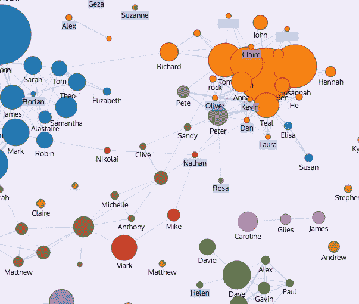
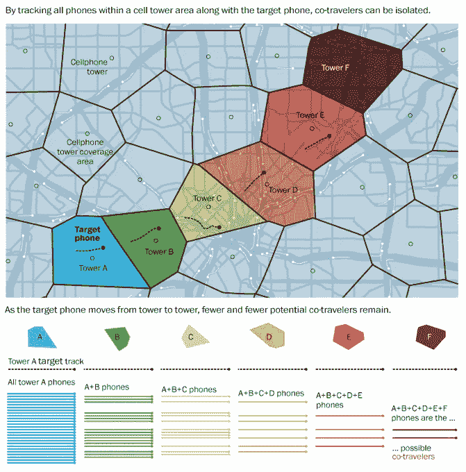

# 社交网络数据:Twitter vs FB vs Google vs 其他所有人

> 原文：<https://towardsdatascience.com/social-network-data-twitter-vs-fb-vs-google-vs-everyone-else-830ea0291c86?source=collection_archive---------3----------------------->

这是关于技术如何塑造我们的社会联系的三篇系列文章中的第三篇。第一篇文章试图让你相信我们的在线和离线社交网络非常重要。第二篇概述了一些 T2 策略，设计者可以用来设计更好的社交网络。

如果我是你的朋友，谁拥有这些信息？脸书说我们中的任何一个都可以向世界展示我们的友谊。但是这让许多脸书用户感到惊讶，所以他们[不断报告这是一个安全漏洞](https://news.ycombinator.com/item?id=7832385)。关于我们社会互动的信息提出了独特的挑战。

这篇文章着眼于社交网络数据的来源，并对它们的质量、可用性和道德合法性进行评级。我的博士研究使用了 Twitter，但我已经用脸书数据、引用网络和离线网络做了工作。我还怀疑谷歌坐拥有史以来最有价值的社交网络信息，即使它不知道如何处理这些信息。

# 推特

Twitter 非常适合研究:默认情况下它是公开的，平台很乐意与用户分享(有限的)数据。它也有一种“城市广场”的氛围，是一个讨论当今重大问题的地方。

在我的博士学位中，[我开发了一个工具](http://localnets.org)，它使用 Twitter 数据来帮助地方政府改善和定位他们的服务。有一个问题，正如[布兰克所说](http://journals.sagepub.com/doi/abs/10.1177/0894439316671698):

> 英国的推特用户比其他互联网用户更年轻、更富有、受教育程度更高，而其他互联网用户又比离线的英国人更年轻、更富有、受教育程度更高

类似的情绪在英国以外也是如此。在整个研究过程中，我已经意识到了这个问题。作为回应，我有两个论点:1)有数据总比没有数据好，所有的数据都有偏差，2)年轻人与当地政治无关，所以他们是一个可以接触到的好群体。

即便如此，Twitter 对更富裕、更有权力的人的过度描绘总是让它感到力不从心。社会的某些部分是“难以触及的”，如此难以参与，以至于几乎任何试图增加参与的系统都会失败。长期失业的人、不讲英语的人、露宿者——这些群体将需要不同的、可能是高度资源密集型的方法来增加他们的民主参与。一个让他们失望的系统不一定是完全失败的，如果它可以服务于其他不那么严重的弱势群体。尽管有这种逻辑，Twitter 在大多数时候确实是最有优势的。也有少数例外，可能为以后的工作指明方向。例如，对于行动不便的人或者不喜欢面对面交流的人来说，Twitter 是一种政治包容的手段。

Twitter 的另一个问题是让计算机处理数据。直觉上，推文应该对软件来说是高度易读的，包含非常丰富的元数据的简短文本——时间、地点、作者、标签、@提及。这还不是故事的全部。也许部分是因为推文的简洁性，有意义的推文活动分散在多条消息、讽刺性的转发、用户简介、图片中的文本、子推等上下文信息中。这些对计算机来说很难理解。

尽管有这些缺点，你会猜想 Twitter 应该是一个令人惊叹的研究平台。但是你多久能从 Twitter 数据中看到真正惊人的见解呢？感觉有点累了。

数据政治:Twitter 可能有各种各样的政治问题，但就数据而言，它非常透明:(本质上)一切都是公开的。当然，有些人会在公共场合说一些事情，并希望他们没有这样做。我认为任何保护人们免受这种危险的系统都是幼稚和家长式的。Twitter 非常明确，你的推文是公开的——这是 Twitter 服务的核心部分——我不认为这有什么道德问题。(虽然跟我提过很多次。)

**数据质量:**不完整，不具有人口统计学代表性，我的猜测是，将 Twitter 数据与其他来源结合起来将是其未来最丰富的应用。

**数据可用性:** Twitter 有一个可爱的 API(一个获取数据的计算机可读接口)。

# 脸谱网

脸书是最大的社交网络，所以你可能会猜测它一定有最好的数据。我想你可能错了。脸书的许多手势——也许尤其是“表示友好”——都以一次性乏味著称。脸书的原始友谊数据可能只不过是谁和谁一起上学的列表。(大多数情况下——我知道脸书有一些小众社区，它们编码了不同的关系。)Facebook Messenger 的互动可能更能表明有意义的社会关系——但话说回来，它可能只是告诉你他们最亲密朋友的相对较短的名单。

脸书[提供了一个页面](https://www.facebook.com/ads/preferences/?entry_product=ad_settings_screen)，在这里你可以看到他们对你的了解。我最近让一些学生使用这个工具，并告诉全班他们觉得它有多准确。从你在报纸上听到的，每个人都会被脸书的窗户送到你的潜意识里。事实上，大约一半的学生认为它有相当准确的信息，另一半认为它基本上是错误的。

**数据质量:**未知。很多人——包括营销公司和脸书本身——都有动机让人们觉得脸书的数据比实际情况要好。 [WhoTargets。Me](http://whotargets.me) 是一个监测脸书政治广告的项目，在英国 2017 年大选前，我们看到了许多针对性很差的广告。这不一定直接反映 FB 的社交网络数据，但它可能是指示性的。

数据政治:绝大多数脸书用户不知道脸书有什么数据，也不知道如何浏览其隐私设置。众所周知，脸书也因其与俄国的关系而成为政治猜疑的对象。合法性不足。

数据可用性:脸书是一个有围墙的花园。几乎不可能在它上面建造任何东西。你可以要求用户安装一个 Chrome 插件，我们在 [WhoTargets.me](http://whotargets.me) 项目上就是这么做的。不过，大多数情况下，研究人员都被脸书拒之门外。

# 谷歌

My Gmail network, visualised. Whose data is this for me to publish? (I’ve obscured uncommon names)

如果脸书没有强大的社交网络数据，谁有呢？Gmail。电子邮件是冗长、耗时的交流方式:它们是昂贵的信号。他们代表了各种各样的网络联系，不仅仅是你的朋友:专业的，社会的，甚至是与银行，能源供应商等的客户关系。Gmail——为此做好准备——拥有大量来自非 Gmail 账户持有人的网络数据。即使你不使用 Gmail，你一半的电子邮件(和相关的网络数据)[仍然会被谷歌](https://mako.cc/copyrighteous/google-has-most-of-my-email-because-it-has-all-of-yours)处理掉。如果电子邮件中的一个人有 Gmail 帐户，Gmail 可以看到收件人的完整列表。一个使用 Gmail 的自由职业者可以将整个公司结构的社交结构泄露给 Gmail(假设你的公司还没有使用 Google Apps……)。

**数据质量:**大概难以置信。

数据政治:谷歌的历史有些清白。它没有被指控选举了特朗普。很多人都有过这样的经历:在脸书分享的内容超过了他们的预期，而在谷歌上分享的却更少。他们甚至试图在 Google +平台上使用他们的社交网络数据，但是失败了——可能主要是因为实施而不是隐私政治。

**数据可用性:**与脸书不同，Gmail 的社交网络数据并非完全无法获取。我使用麻省理工学院的[沉浸*工具*生成了上面的可视化效果。用户必须给出明确的许可，正如他们应该做的那样。](https://immersion.media.mit.edu/viz)

# 所有其他的

我想强调几个不太明显的社交网络数据来源。一个有趣的例子是同路人数据——来自位置数据的社交网络数据。

Co-traveller analysis carried out by the NSA. (via the [Washington Post](https://www.washingtonpost.com/world/national-security/nsa-tracking-cellphone-locations-worldwide-snowden-documents-show/2013/12/04/5492873a-5cf2-11e3-bc56-c6ca94801fac_story.html?utm_term=.9b4d8d74c56d))

即使你有一群人非常好的位置数据，也很难知道他们是在互动，还是只是站得很近。除非你从统计学的角度来看:即使有非常低分辨率的位置数据，你也可以开始对社交互动做出强有力的推断，只要你有足够的位置数据点来工作。这里有很多很好的贝叶斯分析要做，但直觉很简单——如果两个人经常在不同的地方彼此靠近，他们可能认识彼此。

上面的信息图是为了解释美国国家安全局如何使用同路人分析来秘密跟踪潜在目标。但是你也可以在人们的许可下使用它，如果你建立了一个他们可以信任的平台，并且提供了一个合适的有说服力的提议。

最后，我想提一下学术引用网络，这是我和我的 [Who Cites 一起工作的。项目](https://whocites.com/)。学术引用占据了一个特别有趣的伦理位置。学术研究几乎总是由国家支付部分费用，因此公开相关数据似乎是合理的。它还有可能揭示关于谁应该与谁一起工作，以及谁的工作最有影响力的有用信息。这与[非市场合作(公共资源)](https://medium.com/@jimmytidey/design-strategies-for-better-social-networks-276398ea1fe)的更广泛的想法一致，[科利·多克托罗](http://boingboing.net/2017/09/14/platform-socialism.html)很好地概括了这一点。

# 摘要

在三篇文章中(第一篇[第一篇](https://medium.com/@jimmytidey/design-choices-are-shaping-our-social-connections-designers-need-to-take-responsibility-f9526201eb49)和第二篇[这里)，我试图解释我在博士期间学到的一些东西。用非论文的语言写出来，对帮助我理清我认为我已经学到的东西，并思考下一步该去哪里有着难以置信的帮助。我已经感觉到另一个帖子，这次是关于道德的，即将到来…](https://medium.com/@jimmytidey/design-strategies-for-better-social-networks-276398ea1fe)