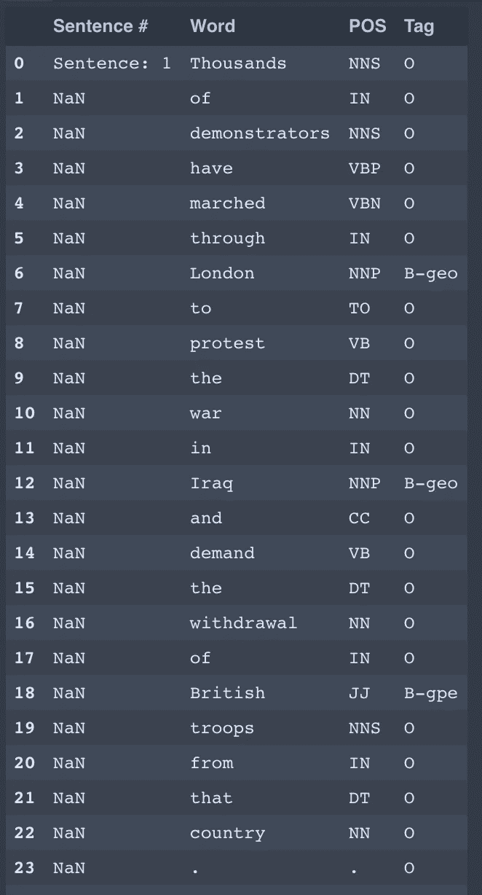
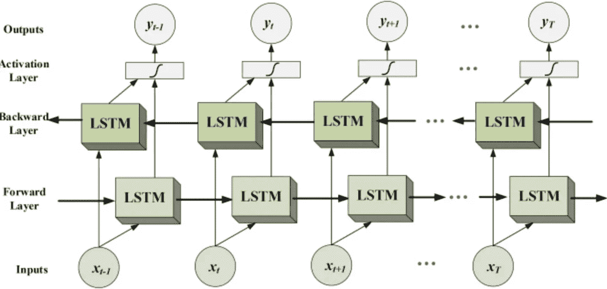

# 用 sequence 2 序列模型求解 NLP 任务:从零到英雄

> 原文：<https://towardsdatascience.com/solving-nlp-task-using-sequence2sequence-model-from-zero-to-hero-c193c1bd03d1?source=collection_archive---------6----------------------->


今天我想解决一个非常流行的 NLP 任务，叫做[命名实体识别](https://en.wikipedia.org/wiki/Named-entity_recognition) (NER)。简而言之，NER 是一项从一系列单词(一个句子)中提取命名实体的任务。例如，给出这样一句话:

> "吉姆在 2006 年购买了 300 股 Acme 公司的股票."

我们想说“Jim”是一个人，“Acme”是一个组织，“2006”是时间。

为此，我将使用这个公开可用的 Kaggle [数据集](https://www.kaggle.com/abhinavwalia95/entity-annotated-corpus)。这里我将跳过所有的数据处理代码，把重点放在实际的问题和解决方案上。你可以在这个[笔记本](https://github.com/shudima/notebooks/blob/master/NER.ipynb)里看到完整的代码。在这个数据集中，有许多实体类型，如 Person (PER)、organization(ORG)和其他，对于每个实体类型，有两种类型的标签:“B-SOMETAG”和“I-SOMETAG”。b 代表实体名称的开始，I-代表该实体的延续。因此，如果我们有一个像“世界卫生组织”这样的实体，相应的标签将是`[B-ORG, I-ORG, I-ORG]`

以下是数据集中的一个示例:

```
import pandas as pd
ner_df = pd.read_csv('ner_dataset.csv')
ner_df.head(30)
```



所以我们得到一些序列(句子)，我们想预测每个单词的“类”。这不是像分类或回归这样简单的机器学习任务。我们得到一个序列，我们的输出应该是一个大小相同的**序列**。

有很多方法可以解决这个问题。在这里，我将执行以下操作:

1.  建立一个非常简单的模型，将这项任务视为每个句子中每个单词的分类，并将其作为基准。
2.  使用 Keras 建立序列对序列模型。
3.  讨论衡量和比较我们结果的正确方法。
4.  在 Seq2Seq 模型中使用预先训练的手套嵌入。

请随意跳到任何部分。

# **词汇包和多类分类**

正如我之前提到的，我们的输出应该是一系列的类，但是首先，我想探索一种有点幼稚的方法——一个简单的多类分类模型。我希望将每个句子中的每个单词视为一个单独的实例，并且对于每个实例(单词)，我希望能够预测其类别，即 O、B-ORG、I-ORG、B-PER 等中的一个。这当然不是建模这个问题的最佳方式，但是我想这样做有两个原因。我想在尽可能保持简单的同时创建一个基准，我想展示当我们处理序列时，序列到序列模型工作得更好。很多时候，当我们试图模拟现实生活中的问题时，并不总是清楚我们正在处理的是什么类型的问题。有时我们试图将这些问题建模为简单的分类任务，而实际上，序列模型可能会好得多。

正如我所说的，我将这种方法作为基准，并尽可能保持简单，因此对于每个单词(实例)，我的特征将只是单词向量(单词包)和同一句子中的所有其他单词。我的目标变量将是 17 个类中的一个。

```
def sentence_to_instances(words, tags, bow, count_vectorizer):
    X = []
    y = []
    for w, t in zip(words, tags):
        v = count_vectorizer.transform([w])[0]
        v = scipy.sparse.hstack([v, bow])
        X.append(v)
        y.append(t)

    return scipy.sparse.vstack(X), y
```

所以给出这样一句话:

> “世界卫生组织称已有 227 人死于禽流感”

我们将得到每个单词的 12 个实例。

```
the             O
world           B-org
health          I-org
organization    I-org
says            O
227             O
people          O
have            O
died            O
from            O
bird            O
flu             O
```

现在我们的任务是，给定句子中的一个单词，预测它的类别。

我们的数据集中有 47958 个句子，我们将它们分为“训练”和“测试”集:

```
train_size = int(len(sentences_words) * 0.8)train_sentences_words = sentences_words[:train_size]
train_sentences_tags = sentences_tags[:train_size]
test_sentences_words = sentences_words[train_size:]
test_sentences_tags = sentences_tags[train_size:]# ============== Output ==============================Train: 38366 
Test: 9592 
```

我们将使用上面的方法将所有的句子转换成许多单词的实例。在`train`数据集中，我们有 839，214 个单词实例。

```
train_X, train_y = sentences_to_instances(train_sentences_words,           
                                          train_sentences_tags, 
                                          count_vectorizer)print 'Train X shape:', train_X.shape
print 'Train Y shape:', train_y.shape# ============== Output ==============================
Train X shape: (839214, 50892)
Train Y shape: (839214,)
```

在我们的`X`中，我们有 50892 个维度:一个是当前单词的热点向量，一个是同一句子中所有其他单词的单词包向量。

我们将使用梯度推进分类器作为我们的预测器:

```
clf = GradientBoostingClassifier().fit(train_X, train_y)
predicted = clf.predict(test_X)
print classification_report(test_y, predicted)
```

我们得到:

```
 precision  recall    f1-score   support

      B-art       0.57      0.05      0.09        82
      B-eve       0.68      0.28      0.40        46
      B-geo       0.91      0.40      0.56      7553
      B-gpe       0.96      0.84      0.90      3242
      B-nat       0.52      0.27      0.36        48
      B-org       0.93      0.31      0.46      4082
      B-per       0.80      0.52      0.63      3321
      B-tim       0.91      0.66      0.76      4107
      I-art       0.09      0.02      0.04        43
      I-eve       0.33      0.02      0.04        44
      I-geo       0.82      0.55      0.66      1408
      I-gpe       0.86      0.62      0.72        40
      I-nat       0.20      0.08      0.12        12
      I-org       0.88      0.24      0.38      3470
      I-per       0.93      0.25      0.40      3332
      I-tim       0.67      0.15      0.25      1308
          O       0.91      1.00      0.95    177215

avg / total       0.91      0.91      0.89    209353
```

好吃吗？很难说，但看起来没那么糟。我们可能会考虑几种方法来改进我们的模型，但这不是本文的目标，正如我所说，我希望保持它是一个非常简单的基准。

但是我们有一个问题。这不是衡量我们模型的正确方法。我们获得了每个单词的精确度/召回率，但是它没有告诉我们任何关于**真实**实体的事情。这里有一个简单的例子，给定同一个句子:

> 世界卫生组织称已有 227 人死于禽流感

我们有 3 个带有 ORG 类的类，如果我们只正确预测了其中的两个，我们将获得 66%的单词准确率，但是我们没有正确提取“世界卫生组织”实体，所以我们对**实体**的准确率将是 0！

稍后我将在这里讨论一种更好的方法来度量我们的命名实体识别模型，但是首先，让我们构建我们的“序列对序列”模型。

# 序列对序列模型

先前方法的一个主要缺点是我们丢失了依赖信息。给定一个句子中的单词，知道左边(或右边)的单词是一个实体可能是有益的。不仅当我们为每个单词构建实例时很难做到这一点，而且我们在预测时也无法获得这些信息。这是使用整个序列作为实例的一个原因。

有许多不同的模型可以用来做这件事。像隐马尔可夫模型(HMM)或条件随机场(CRF)这样的算法可能工作得很好，但在这里，我想使用 Keras 实现一个递归神经网络。

要使用 Keras，我们需要将句子转换成数字序列，其中每个数字代表一个单词，并且，我们需要使所有的序列长度相同。我们可以使用 Keras util 方法来实现。

首先，我们拟合一个`Tokenizer`，它将帮助我们将文字转化为数字。仅将其安装在`train`装置上非常重要。

```
words_tokenizer = Tokenizer(num_words=VOCAB_SIZE, 
                            filters=[], 
                            oov_token='__UNKNOWN__')
words_tokenizer.fit_on_texts(map(lambda s: ' '.join(s),                      
                                 train_sentences_words))word_index = words_tokenizer.word_index
word_index['__PADDING__'] = 0
index_word = {i:w for w, i in word_index.iteritems()}# ============== Output ==============================
print 'Unique tokens:', len(word_index)
```

接下来，我们将使用`Tokenizer`创建序列，并填充它们以获得相同长度的序列:

```
train_sequences = words_tokenizer.texts_to_sequences(map(lambda s: ' '.join(s), train_sentences_words))
test_sequences = words_tokenizer.texts_to_sequences(map(lambda s: ' '.join(s), test_sentences_words))train_sequences_padded = pad_sequences(train_sequences, maxlen=MAX_LEN)
test_sequences_padded = pad_sequences(test_sequences, maxlen=MAX_LEN)print train_sequences_padded.shape, test_sequences_padded.shape
# ============== Output ==============================
(38366, 75) (9592, 75)
```

我们可以看到在`train`集合中有 38，366 个序列，在`test`中有 9，592 个序列，每个序列中有 75 个标记。

我们也想做一些类似于我们的标签的事情，我在这里跳过代码，和以前一样，你可以在这里找到它。

```
print train_tags_padded.shape, test_tags_padded.shape# ============== Output ==============================
(38366, 75, 1) (9592, 75, 1)
```

我们在`train`集合中有 38366 个序列，在`test`中有 9592 个序列，每个序列中有 17 个**标签**。

现在我们已经准备好构建我们的模型了。我们将使用双向**长短期记忆** ( **LSTM** )层，因为它们被证明对此类任务非常有效:

```
input = Input(shape=(75,), dtype='int32')emb = Embedding(V_SIZE, 300, max_len=75)(input)x = Bidirectional(LSTM(64, return_sequences=True))(emb)preds = Dense(len(tag_index), activation='softmax')(x)model = Model(sequence_input, preds)
model.compile(loss='sparse_categorical_crossentropy',
              optimizer='adam',
              metrics=['sparse_categorical_accuracy'])
```

让我们看看这里有什么:

我们的第一层是`Input`，它接受形状向量(75，)并匹配我们的`X`变量(在训练和测试中，我们的每个序列中有 75 个标记)。

接下来，我们有了`Embedding`层。这一层将把我们的每一个符号/单词转换成一个 300 大小的密集向量。可以把它想象成一个巨大的查找表(或字典),用标记(单词 id)作为关键字，用实际的向量作为值。该查找表是可训练的，即，在模型训练期间的每个时期，我们更新那些向量以匹配输入。

在`Embedding`层之后，我们的输入从长度为 75 的向量变成了大小为(75，300)的矩阵。75 个标记中的每一个现在都有一个大小为 300 的向量。

一旦我们有了这个，我们可以使用`Bidirectional LSTM`层，对于每个单词，它将在句子中双向查看，并返回一个状态，这将有助于我们稍后对单词进行分类。默认情况下，`LSTM`层将返回一个向量(最后一个)，但是在我们的例子中，我们希望每个令牌都有一个向量，所以我们使用`return_sequences=True`

它看起来像这样:



这一层的输出是一个大小为(75，128)的矩阵— 75 个记号，一个方向 64 个数字，另一个方向 64 个数字。

最后，我们有一个`Time Distributed Dense`层(当我们使用`return_sequences=True`时，它变成了`Time Distributed`

它获取`LSTM`层输出的(75，128)矩阵，并返回所需的(75，18)矩阵——75 个标记，每个标记的 17 个标记概率和一个`__PADDING__`的标记概率。

使用`model.summary()`方法很容易看出发生了什么:

```
_________________________________________________________________
Layer (type)                 Output Shape              Param #   
=================================================================
input_1 (InputLayer)         (None, 75)                0         
_________________________________________________________________
embedding_1 (Embedding)      (None, 75, 300)           8646600   
_________________________________________________________________
bidirectional_1 (Bidirection (None, 75, 128)           186880    
_________________________________________________________________
dense_2 (Dense)              (None, 75, 18)            627       
=================================================================
Total params: 8,838,235
Trainable params: 8,838,235
Non-trainable params: 0
_________________________________________________________________
```

您可以看到我们所有的层及其输入和输出形状。此外，我们可以看到模型中的参数数量。你可能注意到我们的嵌入层有最多的参数。原因是我们有很多单词，我们需要为每个单词学习 300 个数字。在这篇文章的后面，我们将使用预先训练的嵌入来改进我们的模型。

让我们训练我们的模型:

```
model.fit(train_sequences_padded, train_tags_padded,
          batch_size=32,
          epochs=10,
          validation_data=(test_sequences_padded, test_tags_padded))# ============== Output ==============================
Train on 38366 samples, validate on 9592 samples
Epoch 1/10
38366/38366 [==============================] - 274s 7ms/step - loss: 0.1307 - sparse_categorical_accuracy: 0.9701 - val_loss: 0.0465 - val_sparse_categorical_accuracy: 0.9869
Epoch 2/10
38366/38366 [==============================] - 276s 7ms/step - loss: 0.0365 - sparse_categorical_accuracy: 0.9892 - val_loss: 0.0438 - val_sparse_categorical_accuracy: 0.9879
Epoch 3/10
38366/38366 [==============================] - 264s 7ms/step - loss: 0.0280 - sparse_categorical_accuracy: 0.9914 - val_loss: 0.0470 - val_sparse_categorical_accuracy: 0.9880
Epoch 4/10
38366/38366 [==============================] - 261s 7ms/step - loss: 0.0229 - sparse_categorical_accuracy: 0.9928 - val_loss: 0.0480 - val_sparse_categorical_accuracy: 0.9878
Epoch 5/10
38366/38366 [==============================] - 263s 7ms/step - loss: 0.0189 - sparse_categorical_accuracy: 0.9939 - val_loss: 0.0531 - val_sparse_categorical_accuracy: 0.9878
Epoch 6/10
38366/38366 [==============================] - 294s 8ms/step - loss: 0.0156 - sparse_categorical_accuracy: 0.9949 - val_loss: 0.0625 - val_sparse_categorical_accuracy: 0.9874
Epoch 7/10
38366/38366 [==============================] - 318s 8ms/step - loss: 0.0129 - sparse_categorical_accuracy: 0.9958 - val_loss: 0.0668 - val_sparse_categorical_accuracy: 0.9872
Epoch 8/10
38366/38366 [==============================] - 275s 7ms/step - loss: 0.0107 - sparse_categorical_accuracy: 0.9965 - val_loss: 0.0685 - val_sparse_categorical_accuracy: 0.9869
Epoch 9/10
38366/38366 [==============================] - 270s 7ms/step - loss: 0.0089 - sparse_categorical_accuracy: 0.9971 - val_loss: 0.0757 - val_sparse_categorical_accuracy: 0.9870
Epoch 10/10
38366/38366 [==============================] - 266s 7ms/step - loss: 0.0076 - sparse_categorical_accuracy: 0.9975 - val_loss: 0.0801 - val_sparse_categorical_accuracy: 0.9867
```

我们在测试集上获得了 98.6%的准确率。这个准确度并不能告诉我们太多，因为我们的大多数标签都是“0”(其他)。我们希望像以前一样看到每个类的精度/召回率，但是正如我在上一节中提到的，这也不是评估我们模型的最佳方式。我们想要的是一种方法，看看有多少不同类型的**实体**我们能够正确预测。

# 序列对序列模型的评估

当我们处理序列时，我们的标签/实体也可能是序列。正如我之前所展示的，如果我们有“世界卫生组织”作为真正的实体，预测“世界卫生组织”或“世界卫生”可能会给我们 66%的准确性，但两者都是错误的预测。我们希望将每个句子中的所有实体包装起来，并与预测的实体进行比较。

为此，我们可以使用优秀的 [seqeval](https://github.com/chakki-works/seqeval) 库。对于每个句子，它寻找所有不同的标签并构造实体。通过对真实标签和预测标签进行操作，我们可以比较真实的实体值，而不仅仅是单词。在这种情况下，没有“B-”或“I-”标签，我们比较的是实体的实际类型，而不是词类。

使用我们的预测值，这是一个概率矩阵，我们希望为每个句子构建一个具有原始长度(而不是我们所做的 75)的标签序列，以便我们可以将它们与真实值进行比较。我们将对我们的`LSTM`模型和我们的单词包模型都这样做:

```
lstm_predicted = model.predict(test_sequences_padded)lstm_predicted_tags = []
bow_predicted_tags = []
for s, s_pred in zip(test_sentences_words, lstm_predicted):
    tags = np.argmax(s_pred, axis=1)
    tags = map(index_tag_wo_padding.get,tags)[-len(s):]
    lstm_predicted_tags.append(tags)

    bow_vector, _ = sentences_to_instances([s], 
                                           [['x']*len(s)], 
                                           count_vectorizer)
    bow_predicted = clf.predict(bow_vector)[0]
    bow_predicted_tags.append(bow_predicted)
```

现在我们准备使用`seqeval`库来评估我们的两个模型:

```
from seqeval.metrics import classification_report, f1_scoreprint 'LSTM'
print '='*15
print classification_report(test_sentences_tags, 
                            lstm_predicted_tags)
print 
print 'BOW'
print '='*15
print classification_report(test_sentences_tags, bow_predicted_tags)
```

我们得到:

```
LSTM
===============
             precision    recall  f1-score   support

        art       0.11      0.10      0.10        82
        gpe       0.94      0.96      0.95      3242
        eve       0.21      0.33      0.26        46
        per       0.66      0.58      0.62      3321
        tim       0.84      0.83      0.84      4107
        nat       0.00      0.00      0.00        48
        org       0.58      0.55      0.57      4082
        geo       0.83      0.83      0.83      7553

avg / total       0.77      0.75      0.76     22481

BOW
===============
             precision    recall  f1-score   support

        art       0.00      0.00      0.00        82
        gpe       0.01      0.00      0.00      3242
        eve       0.00      0.00      0.00        46
        per       0.00      0.00      0.00      3321
        tim       0.00      0.00      0.00      4107
        nat       0.00      0.00      0.00        48
        org       0.01      0.00      0.00      4082
        geo       0.03      0.00      0.00      7553

avg / total       0.01      0.00      0.00     22481
```

差别很大。你可以看到，弓模型几乎不能预测任何正确的事情，而 LSTM 模型做得更好。

当然，我们可以在 BOW 模型上做更多的工作，并获得更好的结果，但总体情况是清楚的，序列到序列模型在这种情况下更合适。

# 预训练单词嵌入

正如我们之前看到的，我们的大多数模型参数都是针对`Embedding`层的。训练这一层非常困难，因为有许多单词，而训练数据有限。使用预先训练好的嵌入层是很常见的。大多数当前的嵌入模型使用所谓的“分布假设”,该假设认为相似上下文中的单词具有相似的含义。通过建立一个模型来预测给定上下文中的单词(或者反过来)，他们可以产生单词向量，这些向量很好地代表了单词的含义。虽然这与我们的任务没有直接关系，但使用这些嵌入可以帮助我们的模型更好地表示单词，以实现其目标。

从简单的共现矩阵到复杂得多的语言模型，还有其他方法来构建单词嵌入。在[这篇](/creating-words-embedding-using-deep-neural-network-image-classifier-ae2594d3862d)的帖子中，我试图使用图像来构建单词嵌入。

这里我们将使用流行的[手套](https://nlp.stanford.edu/projects/glove/)嵌入。Word2Vec 或任何其他实现也可以工作。

我们需要下载它，加载单词向量并创建嵌入矩阵。我们将使用这个矩阵作为嵌入层的不可训练权重:

```
embeddings = {}
with open(os.path.join(GLOVE_DIR, 'glove.6B.300d.txt')) as f:
    for line in f:
        values = line.split()
        word = values[0]
        coefs = np.asarray(values[1:], dtype='float32')
        embeddings[word] = coefsnum_words = min(VOCAB_SIZE, len(word_index) + 1)
embedding_matrix = np.zeros((num_words, 300))
for word, i in word_index.items():
    if i >= VOCAB_SIZE:
        continue
    embedding_vector = embeddings.get(word)
    if embedding_vector is not None:
        embedding_matrix[i] = embedding_vector
```

现在来看看我们的模型:

```
input = Input(shape=(75,), dtype='int32')emb =  Embedding(VOCAB_SIZE, 300,                             
                embeddings_initializer=Constant(embedding_matrix),
                                           input_length=MAX_LEN,
                                           trainable=False)(input)x = Bidirectional(LSTM(64, return_sequences=True))(emb)preds = Dense(len(tag_index), activation='softmax')(x)model = Model(sequence_input, preds)
model.compile(loss='sparse_categorical_crossentropy',
              optimizer='adam',
              metrics=['sparse_categorical_accuracy'])model.summary()# ============== Output ==============================
_________________________________________________________________
Layer (type)                 Output Shape              Param #   
=================================================================
input_2 (InputLayer)         (None, 75)                0         
_________________________________________________________________
embedding_2 (Embedding)      (None, 75, 300)           8646600   
_________________________________________________________________
bidirectional_2 (Bidirection (None, 75, 128)           186880    
_________________________________________________________________
dropout_2 (Dropout)          (None, 75, 128)           0            
_________________________________________________________________
dense_4 (Dense)              (None, 75, 18)            627       
=================================================================
Total params: 8,838,235
Trainable params: 191,635
Non-trainable params: 8,646,600
_________________________________________________________________
```

一切都和以前一样。唯一的区别是，现在我们的嵌入层有恒定的不可训练的权重。您可以看到，总参数的数量没有变化，而可训练参数的数量要少得多。

让我们来拟合模型:

```
Train on 38366 samples, validate on 9592 samples
Epoch 1/10
38366/38366 [==============================] - 143s 4ms/step - loss: 0.1401 - sparse_categorical_accuracy: 0.9676 - val_loss: 0.0514 - val_sparse_categorical_accuracy: 0.9853
Epoch 2/10
38366/38366 [==============================] - 143s 4ms/step - loss: 0.0488 - sparse_categorical_accuracy: 0.9859 - val_loss: 0.0429 - val_sparse_categorical_accuracy: 0.9875
Epoch 3/10
38366/38366 [==============================] - 138s 4ms/step - loss: 0.0417 - sparse_categorical_accuracy: 0.9876 - val_loss: 0.0401 - val_sparse_categorical_accuracy: 0.9881
Epoch 4/10
38366/38366 [==============================] - 132s 3ms/step - loss: 0.0381 - sparse_categorical_accuracy: 0.9885 - val_loss: 0.0391 - val_sparse_categorical_accuracy: 0.9887
Epoch 5/10
38366/38366 [==============================] - 146s 4ms/step - loss: 0.0355 - sparse_categorical_accuracy: 0.9891 - val_loss: 0.0367 - val_sparse_categorical_accuracy: 0.9891
Epoch 6/10
38366/38366 [==============================] - 143s 4ms/step - loss: 0.0333 - sparse_categorical_accuracy: 0.9896 - val_loss: 0.0373 - val_sparse_categorical_accuracy: 0.9891
Epoch 7/10
38366/38366 [==============================] - 145s 4ms/step - loss: 0.0318 - sparse_categorical_accuracy: 0.9900 - val_loss: 0.0355 - val_sparse_categorical_accuracy: 0.9894
Epoch 8/10
38366/38366 [==============================] - 142s 4ms/step - loss: 0.0303 - sparse_categorical_accuracy: 0.9904 - val_loss: 0.0352 - val_sparse_categorical_accuracy: 0.9895
Epoch 9/10
38366/38366 [==============================] - 138s 4ms/step - loss: 0.0289 - sparse_categorical_accuracy: 0.9907 - val_loss: 0.0362 - val_sparse_categorical_accuracy: 0.9894
Epoch 10/10
38366/38366 [==============================] - 137s 4ms/step - loss: 0.0278 - sparse_categorical_accuracy: 0.9910 - val_loss: 0.0358 - val_sparse_categorical_accuracy: 0.9895
```

准确度变化不大，但正如我们之前看到的，准确度不是正确的衡量标准。让我们以正确的方式对其进行评估，并与我们之前的模型进行比较:

```
lstm_predicted_tags = []
for s, s_pred in zip(test_sentences_words, lstm_predicted):
    tags = np.argmax(s_pred, axis=1)
    tags = map(index_tag_wo_padding.get,tags)[-len(s):]
    lstm_predicted_tags.append(tags)print 'LSTM + Pretrained Embbeddings'
print '='*15
print classification_report(test_sentences_tags, lstm_predicted_tags)# ============== Output ==============================LSTM + Pretrained Embbeddings
===============
             precision    recall  f1-score   support

        art       0.45      0.06      0.11        82
        gpe       0.97      0.95      0.96      3242
        eve       0.56      0.33      0.41        46
        per       0.72      0.71      0.72      3321
        tim       0.87      0.84      0.85      4107
        nat       0.00      0.00      0.00        48
        org       0.62      0.56      0.59      4082
        geo       0.83      0.88      0.86      7553

avg / total       0.80      0.80      0.80     22481
```

好多了，我们的 F1 成绩从 76 分提高到了 80 分！

# 结论

序列到序列模型是许多任务的非常强大的模型，如命名实体识别(NER)、词性(POS)标记、解析等等。有许多技术和选项来训练它们，但最重要的是知道何时使用它们以及如何正确地建模我们的问题。