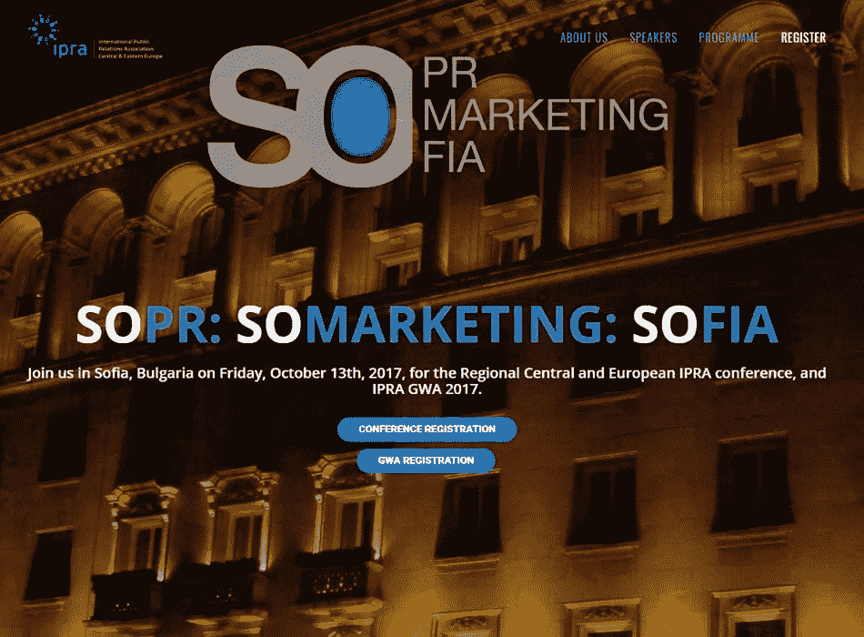
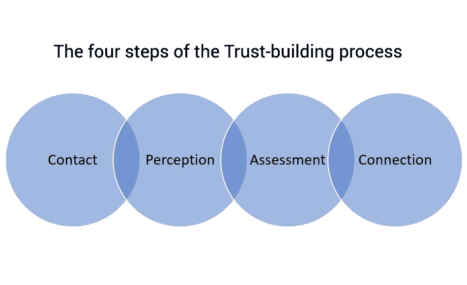
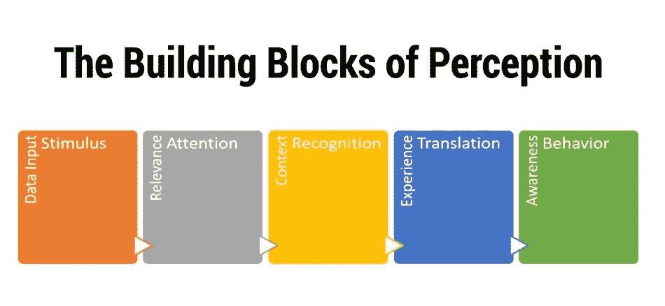
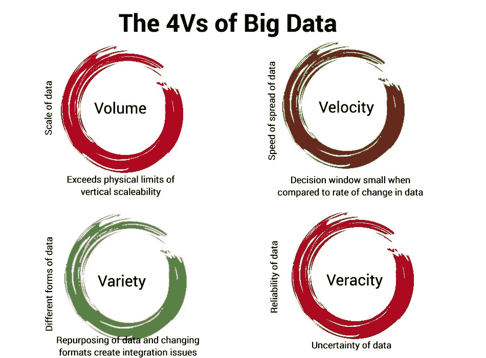
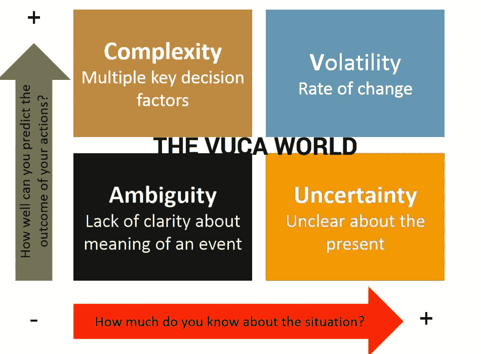

# SOPR:公共关系和狙击手思维挑战

> 原文：<https://towardsdatascience.com/sopr-public-relations-and-the-sniper-mind-challenge-c37f7223a849?source=collection_archive---------3----------------------->

公共关系一直被认为是一种与魔鬼的交易，目的是扩大你的营销范围，维护你的声誉。这个行业总是被外人视为编造故事的大师或炒作的兜售者，但 21 世纪“假新闻”的困扰以及社论和 T2 付费媒体之间界限的模糊，对这个行业几乎没有帮助。

[媒体的碎片化](https://www.fastcompany.com/40414956/heres-why-the-pr-industry-is-failing)和公关有时对所有可用渠道发送垃圾信息的盲从，加上对其[可信度](http://smallbusiness.chron.com/challenges-public-relations-21st-century-61155.html)的挑战，这影响了[信任度](https://www.prweek.com/article/1339167/pr-dock-nearly-70-per-cent-general-public-does-not-trust-industry)，产生了一个可能难以解决的多维挑战。

与此相反，由国际公共关系协会在保加利亚索非亚举办的 SOPR 会议和颁奖典礼绝不是一件严肃的事情。我的任务是向来自 27 个国家的与会者讲述“狙击手思维”及其对现代公关专业人士的影响，我概述了当前的形势，并重点讲述了活跃在商界的每个人感受到的差异。

20 分钟很难做多少事。因此，任何演讲者所能希望的是将关键信息传达出去，并希望它能融入听众的感知和他们对问题的意识，从而引发新的思维过程。在这一点上，我并不失望。

公共关系(PR)正在发生变化，这种变化是由专业人士而不是他们的客户主导的。为了理解为什么这很重要，我需要描绘一个更广阔的图景。

一切都是数据。一直都是。当数据传到我们手中的渠道受到限制时，我们对自己认为观察到的现实的感知也受到限制。这使得一切公式化。例如，在 60 年代杰罗姆·麦卡锡(Jerome McCarthy)提出 4Ps 产品、价格和促销之前，市场营销就一直遵循同样的规定性方法。

那些 4p 今天已经被经验、无处不在(或每一个地方)、交换(价值)和传福音的 4e 所取代。

从一种营销口号到另一种营销口号的转变是市场最基本层面——消费者——转变的直接结果。

消费者因技术而赋能，通过设备而联系，比以往任何时候都更知情、更具移动性和更有发言权，他们已经打破了传统的条块分割的孤岛，这种孤岛允许他们通过一对多、自上而下的模式进行营销。他们的注意力和忠诚度要么失去了，要么被共同的价值观、赋予他们生活意义的能力以及在他们需要的时候帮助他们做一些有用的事情的方法所赢得。

> 所有这些都很重要，因为它是由数据驱动的，这使得一切都可以测量。如果可以衡量，就可以量化，如果可以量化，就可以改进。

在这个极具挑战性的环境中，信任和感知是一切的基础。

信任是任何关系交换发生的必要条件，信任本身由接触、感知、评估、联系这四个步骤组成。

这些步骤中的每一步本身都相对脆弱。谨慎、努力和真实性在实现这一切的过程中起着关键作用。就其本身而言，它们需要意识、明确理解的认同感、共同的价值观和同理心。

感知的出现需要五个组成部分:刺激、注意力识别、翻译、行为，每一部分都与一个特定的、直接相关的属性相关联。

所有这些都很重要，因为它是由数据驱动的，这使得一切都可以测量。如果可以衡量，就可以量化，如果可以量化，就可以改进。

# 大数据的问题

然而，数据本身并不是没有问题。作为大数据特征的四个向量:数量、速度、多样性和准确性在处理它们时带来了独特的挑战。它们中的每一个都以自己的方式延伸到我们现代分析和理解数据向我们揭示的确切内容的能力的极限。

碰巧的是，并非只有商界感受到了这一挑战。自上世纪 90 年代以来，美国陆军战争学院一直在教导学生，他们现在是在一个由波动性、不确定性、复杂性和模糊性所支配的 VUCA 世界中运作。

对于那些没有立即建立联系的人来说，大数据的 4v 与 VUCA 世界的组成部分完全对应。数据在每个上下文中可能有不同的标签，但它的行为是相同的，因为它响应相同的动态。

# 公共关系的新角色

这使我们回到 SOPR 会议。现代公共关系专业人士生活在大数据的 4V 世界和军事的 VUCA 世界中，他们被夹在面临危机、需要传播信息并迫切希望让自己的声音被听到的客户和越来越抵制自上而下的广播和宣传的观众之间。

为了适应挑战，这个行业正在发生变化。在我的主题演讲后，我与之交谈的人都非常清楚他们角色的微妙之处。需要温和地引导他们的客户远离谎言，走向真正的交流。他们都非常清楚以一种与其价值观和观念产生共鸣并创造信任的方式与观众建立联系的必要性。

简而言之，他们意识到公共关系正在从简单的传播信息和宣传形象转变为交流共同的价值观和创造客户与受众之间的共同接触点。

当一个对通信至关重要的行业认识到挑战，并开始缓慢的审慎变革过程时，商业乃至政治世界从 20 世纪向 21 世纪的转变就有了真正的希望，比预期的要快得多。

[狙击思维:消除恐惧，应对不确定性，做出更好的决定](https://goo.gl/HDSfHL)可以在亚马逊或任何书店买到。

[你可以在这里阅读样本章节。](https://read.amazon.com/kp/embed?preview=newtab&linkCode=kpe&ref_=cm_sw_r_kb_dp_.lBaAbNFBHZYB&asin=B071D416TV&reshareId=ZM181NWT5JQB8GM3F6FK&reshareChannel=system)

*原载于*[*davidamerland.com*](https://davidamerland.com/seo-blog/1191-sopr-public-relations-and-the-sniper-mind-challenge.html)*。*