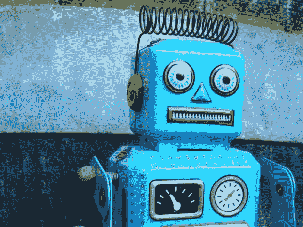

# 抱歉，华生，但我没被打动

> 原文：<https://towardsdatascience.com/sorry-watson-but-im-not-impressed-4b07332ec6f9?source=collection_archive---------9----------------------->

当我最喜欢的聊天应用程序(我自己和超过 10 亿其他人都在使用)自己决定何时使用自动完成功能，何时不使用它时，我会对机器学习、人工智能或任何你更喜欢使用的术语印象深刻。目前，它的性能远远没有达到我认为的真正智能，因为它甚至无法判断我在用哪种语言聊天(尽管聊天会话的语言通常取决于我在聊天的人，因此这应该是所谓智能系统的一个可靠提示)。显然，我可以关闭自动完成功能，以避免一种语言中的单词被另一种语言中完全不相关的单词自动完成(就我希望看到它们出现在那里而言)，但在某些情况下——例如，当输入 3 个字符后，20 个字符的单词的正确建议出现了——我肯定很乐意使用自动完成功能。

当然，已经有一些基于机器学习的令人印象深刻的表现——比如 IBM 的沃森击败了最好的人类危险游戏选手，或者谷歌的 DeepMind 在棋盘游戏 Go 中获胜。但这些基本上都是只会一招的小马。这些系统在完成一项特定任务时非常强大，但在大多数其他任务中或多或少是无用的。我在某个地方听过一个非常惊人的对比(如果我记得是从谁那里听来的，我会把它归功于作者),那就是一个 9 岁的孩子炫耀从书本中获得的事实知识，但缺乏必要的生活经验来将其用于任何体面的用途。

另一方面，人类的智慧通常表现为在一系列事情上表现优秀。让我感到惊讶的是，向计算机解释(就编程而言)一些大多数人认为相对容易的任务是多么困难。因为我经常使用数据库，所以让我给你举一个这个领域的具体例子:在一个在线购物的数据库中，数据是由客户填写的，你不可避免地会得到一些记录，其中这个人的名字填写在应该包含姓氏的字段中，反之亦然。网上购物者的首要任务是获得他们想要的任何东西，而不是数据库卫生。对于人类来说，大多数名字/姓氏的转换都很容易发现，但是创建一个具有可比水平的计算机算法所需要的努力通常比简单地让人类手动完成要大得多——当然，除非数据库非常大。

这是否意味着我认为一个真正聪明的华生永远不会存在？当然不是，但我也不认为它真的就在眼前。人工智能和机器学习正在取得巨大进展；有趣的事情正在自然语言处理等领域发生；我欢迎所有这些领域的突破。然而今天，我可能还没有被打动。但是对于普通人来说，也需要几年时间才能在很多事情上达到优秀的水平。

*为了您的方便，您可以访问 https://janvanhaver.com/*