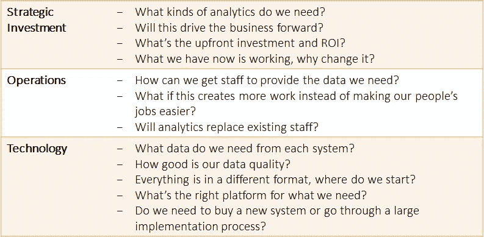

# 听起来很简单，为什么不是每个人都这么做呢？

> 原文：<https://towardsdatascience.com/sounds-simple-enough-so-why-isnt-everybody-doing-it-9a70764e5d57?source=collection_archive---------4----------------------->

*实时。数据驱动。分析。如果数据无处不在，每个人都在使用它，那你为什么没有呢？为什么如此多的组织仍然依赖静态、过时的报告来做出决策？*

如今，实时数据似乎无处不在。早间新闻正在分享最新突发事件的观众视频，随着前方交通堵塞，我们早上开车去上班的路线可以在几秒钟内改变，零售商可以在我们了解自己之前预测我们将要购买的东西。在一个完美的世界中，管理层将关注财务状况、运营瓶颈和客户需求变化的实时快照，并能够及时发现新出现的风险，以预防意外事件，而不是对意外事件做出反应并从中恢复。许多公司已经将分析纳入他们的决策过程；那不是分析学吗？概括地说，主要区别如下:

对于许多组织来说，从大型复杂的组织到小型灵活的组织，甚至是我们当中精通技术和分析的公司，真正的障碍仍然存在。细微差别各不相同，但归结起来有三个主要挑战:1)战略投资，2)运营，3)技术。如果没有组织所有级别的支持和正确的实施策略，即使是最好的组织也会失败。那么真正阻碍我们的是什么呢？通常，正是回答类似下面的问题阻止了组织推进分析。

在我接下来的文章中，请关注关于克服这些障碍的想法和技巧。