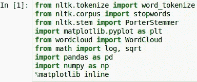
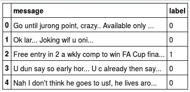

# 从零开始使用 Python 中的垃圾邮件分类器

> 原文：<https://towardsdatascience.com/spam-classifier-in-python-from-scratch-27a98ddd8e73?source=collection_archive---------1----------------------->

我们都面临着收件箱里垃圾邮件的问题。让我们用 python 构建一个垃圾邮件分类程序，它可以判断给定的消息是否是垃圾邮件！我们可以用概率论中一个简单而有力的定理来达到这个目的，这个定理叫做贝耶定理。它在数学上表示为

Baye’s Theorem

# 问题陈述

我们有消息 m = (w *1* ，w *2* 。。。。，w *n* ，其中(w *1* ，w *2* 。。。。，w *n* 是消息中包含的一组唯一单词。我们需要找到

如果我们假设一个单词的出现独立于所有其他单词，我们可以将上述表达式简化为

为了分类，我们必须确定哪个更大

## 1.正在加载依赖项

我们将使用 NLTK 来处理消息，使用 WordCloud 和 matplotlib 来实现可视化，使用 panases 来加载数据，使用 NumPy 来生成列车测试拆分的随机概率。

## 2.正在加载数据

我们不需要“未命名:2”、“未命名:3”和“未命名:4”列，因此我们将其删除。我们将列“v1”重命名为“label”，将“v2”重命名为“message”。在“label”列中，“ham”被替换为 0，“spam”被替换为 1。最后我们得到以下数据框架。

## 3.列车-测试拆分

为了测试我们的模型，我们应该将数据拆分为训练数据集和测试数据集。我们将使用训练数据集来训练模型，然后在测试数据集上对其进行测试。我们将使用 75%的数据集作为训练数据集，其余的作为测试数据集。对这 75%数据的选择是均匀随机的。

## 4.可视化数据

让我们看看哪些是垃圾邮件中重复最多的单词！为此，我们将使用 [WordCloud](https://github.com/amueller/word_cloud) 库。

这导致以下结果

不出所料，这些消息大多包含“FREE”、“call”、“text”、“铃声”、“奖金申领”等词语。

类似地，ham 消息的单词 cloud 如下:

## 5.培训模式

我们将实现两种技术:单词包和 TF-IDF。我将逐一解释。让我们首先从 Bag 的话开始。

**预处理** : **在开始训练之前，我们必须对消息进行预处理。首先，我们将把所有的字符都变成小写。这是因为“free”和“FREE”的意思相同，我们不想把它们当作两个不同的词。**

然后，我们对数据集中的每个消息进行标记化。标记化是将消息拆分为若干部分并丢弃标点符号的任务。例如:

[https://nlp.stanford.edu/IR-book/html/htmledition/tokenization-1.html](https://nlp.stanford.edu/IR-book/html/htmledition/tokenization-1.html)

像“去”、“去”、“去”这样的词表示同样的活动。我们可以用一个单词“go”来代替所有这些单词。这就是所谓的词干。我们将使用[波特斯特梅尔](https://tartarus.org/martin/PorterStemmer/)，这是一个著名的词干算法。

然后，我们继续删除停用词。停用词是那些在任何文本中出现频率极高的词。例如像“the”、“a”、“an”、“is”、“to”等词。这些单词没有给我们任何关于课文内容的信息。因此，如果我们从文本中删除这些词，应该没有关系。

可选:您也可以使用 n 元语法来提高准确性。截至目前，我们只处理了 1 个字。但是当两个词在一起时，意思就完全变了。例如，“好”和“不好”的意思是相反的。假设一个文本包含“不好”，把“不好”看作一个标记比“不好”和“好”更好。因此，当我们将文本分割成两个(或更多)单词的标记时，有时准确性会得到提高。

**单词袋**:在单词袋模型中，我们找到了“词频”，即每个单词在数据集中出现的次数。因此对于单词 w，

和

**TF-IDF** : TF-IDF 代表词频-逆文档频率。除了术语频率之外，我们还计算逆文档频率。

例如，数据集中有两条消息。“hello world”和“hello foo bar”。TF('hello ')是 2。IDF('hello ')是 log(2/2)。如果一个词出现的次数很多，说明这个词给出的信息少。

在这个模型中，每个单词都有一个分数，即 TF(w)*IDF(w)。每个单词的概率计算如下:

**加法平滑**:那么如果我们在测试数据集中遇到一个不是训练数据集的一部分的单词呢？在这种情况下，P(w)将为 0，这将使 P(spam|w)未定义(因为我们必须除以 P(w ), P(w)为 0。还记得公式吗？).为了解决这个问题，我们引入了加法平滑。在加法平滑中，我们在分子中添加一个数字α，并在分母中添加α乘以概率所在的类别数。

使用 TF-IDF 时

这样做是为了使任何单词的最小概率现在应该是一个有限的数。分母中的加法是使垃圾邮件中单词的所有概率的总和为 1。

当α= 1 时，称为拉普拉斯平滑。

## 6.分类

为了对给定的消息进行分类，我们首先对其进行预处理。对于处理后的消息中的每个单词 w，我们找到 P(w|spam)的乘积。如果训练数据集中不存在 w，我们将 TF(w)取为 0，并使用上述公式找到 P(w|spam)。我们将这个乘积乘以 P(垃圾邮件),得到的乘积就是 P(垃圾邮件|消息)。同样，我们找到 P(ham|message)。无论这两个概率中哪一个更大，相应的标签(spam 或 ham)都被分配给输入消息。请注意，我们不是按照公式中给出的 P(w)来除。这是因为两个数字都将除以这个数，这不会影响两者之间的比较。

## 7.决赛成绩

## 资源

1.  数据集:[https://www.kaggle.com/uciml/sms-spam-collection-dataset](https://www.kaggle.com/uciml/sms-spam-collection-dataset)
2.  [http://machine learning . wustl . edu/ml papers/paper _ files/icml 2003 _ rennie STK 03 . pdf](http://machinelearning.wustl.edu/mlpapers/paper_files/icml2003_RennieSTK03.pdf)
3.  标记化:[https://NLP . Stanford . edu/IR-book/html/html edition/token ization-1 . html](https://nlp.stanford.edu/IR-book/html/htmledition/tokenization-1.html)
4.  词干:[https://NLP . Stanford . edu/IR-book/html/html edition/stemming-and-lemma tization-1 . html](https://nlp.stanford.edu/IR-book/html/htmledition/stemming-and-lemmatization-1.html)
5.  停用词:[https://NLP . Stanford . edu/IR-book/html/html edition/dropping-common-terms-stop-words-1 . html](https://nlp.stanford.edu/IR-book/html/htmledition/dropping-common-terms-stop-words-1.html)
6.  [https://www.youtube.com/watch?v=PrkiRVcrxOs](https://www.youtube.com/watch?v=PrkiRVcrxOs)
7.  链接到代码:[https://github.com/tejank10/Spam-or-Ham](https://github.com/tejank10/Spam-or-Ham)