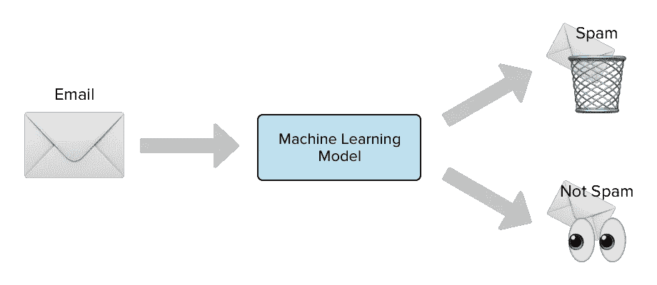
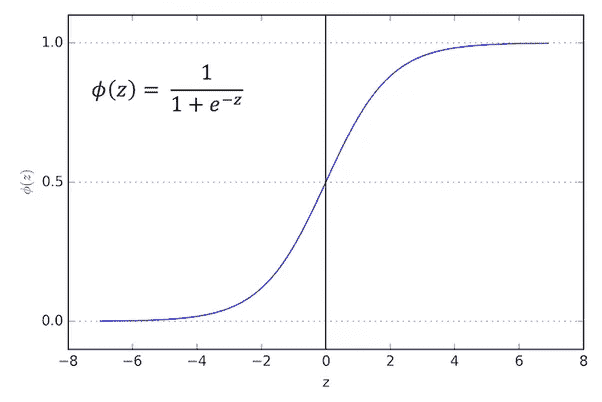

# 基于逻辑回归的垃圾邮件检测

> 原文：<https://towardsdatascience.com/spam-detection-with-logistic-regression-23e3709e522?source=collection_archive---------2----------------------->


[Source](https://www.vsmail.vn/tai-sao-phai-su-dung-email-doanh-nghiep/)

我还记得我上机器学习课的第一天。第一个用来解释机器学习如何工作的例子是“垃圾邮件检测”。我认为在大多数机器学习课程中，导师都提供了相同的例子，但是，在多少课程中，你实际上实现了这个模型？我们讨论机器学习如何参与垃圾邮件检测，然后继续讨论其他事情。

# 介绍

这篇文章的目的是逐步了解垃圾邮件过滤器的工作原理，以及它是如何让每个人的生活变得更轻松的。此外，下次当你看到一封“你中了彩票”的邮件而不是忽略它时，你可能更愿意将其报告为垃圾邮件。



Courtesy : Google images([Medium post](https://medium.com/analytics-vidhya/email-spam-classifier-using-naive-bayes-a51b8c6290d4))

上面的图像给出了垃圾邮件过滤的概述，每天都有大量的电子邮件到达，一些进入垃圾邮件，其余的留在我们的主收件箱中(除非你定义了进一步的类别)。中间的蓝框——机器学习模型，它是如何决定哪些邮件是垃圾邮件，哪些不是。

在我们开始讨论算法和代码之前，后退一步，尝试将垃圾邮件检测的简单解释与每月活跃的 Gmail 帐户(大约 10 亿)联系起来。这幅画看起来很复杂，不是吗？让我们来了解一下 gmail 是如何对大量账户进行过滤的。

# Gmail 垃圾邮件检测

我们都知道谷歌拥有的数据，显然不是纸质文件。他们有维护客户数据的数据中心。在 Google/Gmail 决定将电子邮件分为垃圾邮件或非垃圾邮件类别之前，在它到达您的邮箱之前，数据中心有数百条规则适用于这些电子邮件。这些规则描述了垃圾邮件的属性。Gmail/Google 使用的垃圾邮件过滤器有几种常见类型

***【公然拦截】-*** 甚至在邮件到达收件箱之前就将其删除。

***批量邮件过滤器-*** 该过滤器帮助过滤通过其他类别但却是垃圾邮件的邮件。

***类别过滤器-*** 用户可以定义自己的规则，根据具体内容或电子邮件地址等对邮件进行过滤。

***空发件人处置-*** 处置所有没有 SMTP 信封发件人地址的邮件。记得当你收到一封电子邮件说，“没有送到 xyz 地址”。

***空发件人报头标签验证-*** 通过检查安全数字签名来验证消息。

有一些方法可以避免垃圾邮件过滤，直接把你的邮件发送到收件箱。要了解更多关于 Gmail 垃圾邮件过滤器的信息，请观看来自谷歌的这个信息视频。

# 创建垃圾邮件检测器:预处理

继续我们的目标，创建我们自己的垃圾邮件检测器。让我们来谈谈上图中间的那个蓝盒子。这个模型就像一个小孩，除非你告诉这个小孩，盐和糖的区别，否则他/她不会认出来。类似的想法，我们应用在机器学习模型，我们告诉模型什么样的电子邮件可以是垃圾邮件或不是垃圾邮件。为了做到这一点，我们需要从用户那里收集数据，并要求他们过滤一些垃圾邮件或非垃圾邮件。


Kaggle Spam Detection Dataset

上图是为垃圾邮件研究收集的带标签电子邮件的快照。它包含一组由 5，574 封电子邮件组成的英文消息，根据合法(ham)或垃圾邮件进行标记。

现在我们有了带有标记的电子邮件的数据——垃圾邮件或非垃圾邮件，我们下一步应该做什么？我们需要训练机器，让它足够聪明，能够自己对电子邮件进行分类。但是，机器无法读取完整的声明并开始对电子邮件进行分类。这里我们将需要使用我们的 NLP 基础知识(查看我的上一篇博客)。

我们将首先对消息文本进行一些预处理，如删除标点符号和停用词。

```
**def** text_preprocess(text):
    text = text.translate(str.maketrans('', '', string.punctuation))
    text = [word **for** word **in** text.split() **if** word.lower() **not** **in**  stopwords.words('english')]
    **return** " ".join(text)
```

一旦预处理完成，我们将需要对数据进行矢量化——即收集每封电子邮件中的每个单词及其频率。矢量化将生成一个矩阵。

```
vectorizer = TfidfVectorizer("english")
message_mat = vectorizer.fit_transform(message_data_copy)
message_mat
```

该向量矩阵可用于创建训练/测试分割。这将帮助我们训练模型/机器变得智能，并测试其结果的准确性。

```
message_train, message_test, spam_nospam_train, spam_nospam_test = train_test_split(message_mat, message_data['Spam/Not_Spam'], test_size=0.3, random_state=20) 
```

# 选择模型

现在我们有了训练测试分割，我们需要选择一个模型。有大量的模型，但是对于这个特殊的练习，我们将使用逻辑回归。为什么？

一般当有人问，什么是逻辑回归？你告诉他们什么——哦！这是一种算法，用于将事物分为两类(大多数情况下)，即使用二分变量测量结果。但是，逻辑回归如何将事物分类成类似于- **二项式** (2 个可能值)、**多项式** (3 个或更多可能值)和**序数**(处理有序类别)的类别。在这篇文章中，我们将只关注二项式逻辑回归，即模型的结果将分为两类。

## 逻辑回归

根据维基百科的定义，

> *逻辑回归通过* ***估计*****概率*** *使用* ***逻辑函数*** *来衡量分类因变量与一个或多个自变量之间的关系。****

*从定义来看，逻辑函数在分类中起着重要的作用，但是我们需要理解什么是逻辑函数，以及它如何帮助估计在一个类中的概率。*

**

*Courtesy — Google image([Quora post](https://www.quora.com/Why-is-logistic-regression-considered-a-linear-model))*

*上图中提到的公式称为逻辑函数或 Sigmoid 函数，曲线称为 Sigmoid 曲线。Sigmoid 函数给出了一条 S 形曲线。当 z → ∞时，Sigmoid 函数的输出趋于 1，当 z→∞时，输出趋于 0。因此，Sigmoid/logistic 函数产生的因变量的值将始终位于[0，1]之间，即属于一个类别的概率。*

# *系统模型化*

*对于垃圾邮件检测问题，我们已经标记了邮件，但我们不确定新的传入邮件。我们需要一个模型来告诉我们一条消息是垃圾邮件还是非垃圾邮件的概率。假设在本例中，0 表示负类(没有垃圾邮件), 1 表示正类(有垃圾邮件),我们将使用逻辑回归模型。*

```
***from** **sklearn.linear_model** **import** LogisticRegression
**from** **sklearn.metrics** **import** accuracy_score

Spam_model = LogisticRegression(solver='liblinear', penalty='l1')
Spam_model.fit(message_train, spam_nospam_train)
pred = Spam_model.predict(message_test)
accuracy_score(spam_nospam_test,pred)*
```

*因此，我们首先定义模型，然后拟合训练数据，这一阶段称为训练您的模型。一旦训练阶段结束，我们就可以使用测试分割来预测结果。为了检查我们的模型的准确性，我们可以使用准确性得分度量。此指标将预测结果与获得的真实结果进行比较。运行上述代码后，我们获得了 93%的准确率。*

*在某些情况下，93%可能是一个不错的分数。为了获得更准确的结果，我们可以对收集到的数据做很多其他的事情，比如词干化和长度标准化。*

# *摘要*

*正如我们看到的，我们使用以前收集的数据来训练模型，并预测新收到的电子邮件的类别。这表明以正确的方式标记数据的重要性。一个错误会让你的机器变得愚蠢，例如，在你的 gmail 或任何其他电子邮件帐户中，当你收到邮件时，你认为这是一封垃圾邮件，但你选择忽略它，可能下次当你看到那封邮件时，你应该报告它是一封垃圾邮件。这个过程可以帮助很多其他人，他们收到了相同类型的电子邮件，但不知道什么是垃圾邮件。有时错误的垃圾邮件标签也会将真正的电子邮件移到垃圾邮件文件夹中。所以，在你给一封邮件贴上垃圾邮件或非垃圾邮件的标签之前，你必须小心。*

# *参考:*

1.  *[Kaggle 垃圾邮件检测数据集](https://www.kaggle.com/uciml/sms-spam-collection-dataset/data)*
2.  *[Github 回购](https://github.com/SharmaNatasha/Machine-Learning-using-Python/blob/master/Classification%20project/Spam_Detection.ipynb)*
3.  *[自然语言处理—主题建模](https://hackernoon.com/nlp-101-topic-modeling-for-humans-part-1-a030e8155584)*
4.  *[Gmail 垃圾邮件检测](https://www.quora.com/How-does-Gmail-spam-detection-work-1)*