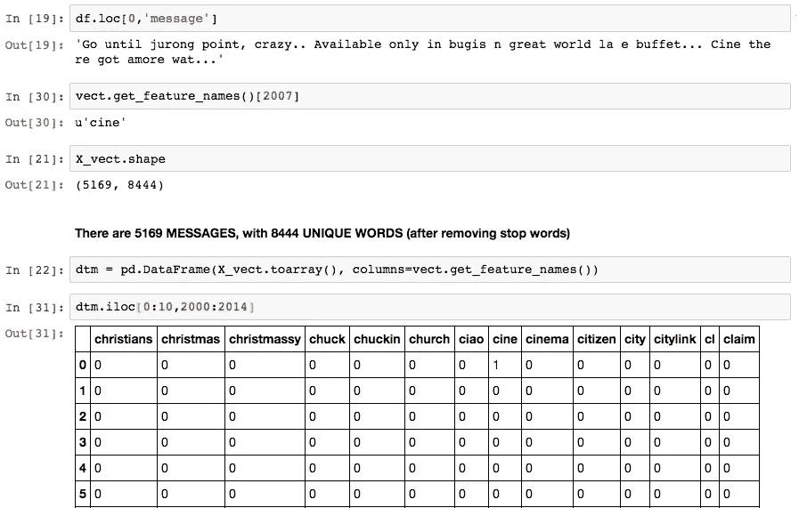
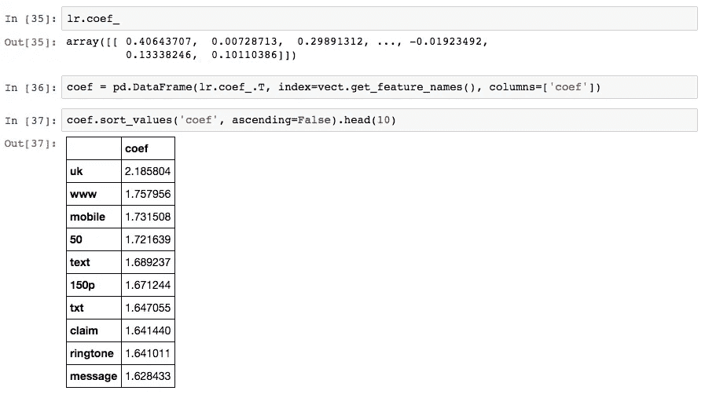
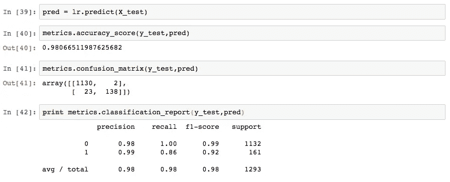

# 垃圾邮件、嘻哈音乐和自然语言处理

> 原文：<https://towardsdatascience.com/spam-hip-hop-natural-language-processing-156780b9210b?source=collection_archive---------4----------------------->

## 了解 NLP 的基础知识以及如何构建一个简单的垃圾邮件过滤器。

由于大会为期 12 周的数据科学沉浸式计划节奏很快，我们在 5 周内已经覆盖了很多地方。为了在这样的项目中取得成功，我们每个人都必须融合自己的学习风格。对于我们处理的每一个新话题，我的方法是把话题浓缩成我能理解的要点。对基础知识有了扎实的理解后，我发现我对材料的整体记忆更强了，而且我可以很快积累关于该主题的额外细节的知识。我读到过[埃隆·马斯克也有类似的方法](https://www.reddit.com/r/IAmA/comments/2rgsan/i_am_elon_musk_ceocto_of_a_rocket_company_ama/)，所以我一定是做对了什么！

这周我被介绍给了 NLP。从未听说过它，我承认这个缩写本身就让我望而生畏。NLP 代表自然语言处理。都清理好了吗？没有吗？好吧，如果我告诉你“自然语言”是一堆单词。一条短信。一封邮件。一次演讲。歌词。一本小说。会议纪要。更好，对吗？

好了，现在是最后一部分:加工。我们所说的处理是什么意思？我们需要一组基于文本的文档(例如书籍),并将内容分解成最适用的块(单词、句子、短语等)。).这个将我们的文本文档分割成小块或大块的过程被称为*标记化*。从那里，如果有必要，我们还可以做一些进一步的操作来更好地组织这些块。例如，如果我们在处理单词，我们可能想要识别词类(形容词、名词、动词等。)或将单词简化为基本形式或词根形式。在后一个叫做*的词汇化*过程中，“穿梭”变成了“穿梭”，“狼”变成了“狼”

一旦我们的语言块被组织起来，更先进的自然语言处理技术可以被应用于理解语言。也许我们想探究一部作品中是否有共同的主题。或者，我们可能想分析一个著名公众人物的一系列演讲的意图或真实性。我们正在分析的语言的情绪是另一个调查的候选对象，就像确定关于一家公司的推文主要是正面的还是负面的。

以下是 NLP 在实践中的一些例子:

*   这本书是谁写的？帕特里克·尤拉使用自然语言处理技术来量化单词长度的分布，最常见的单词，以及其他写作风格的选择，当他帮助确定 JK·罗琳是《布谷鸟的呼唤》的作者时
*   [哪些说唱歌手词汇量最大？](https://pudding.cool/2017/02/vocabulary/)马特·丹尼尔斯利用自然语言处理技术筛选嘻哈歌词，根据专辑中的词汇种类对艺术家进行排名，并对他们的风格选择提出一些理论。

Outkast’s Deep Vocabulary & Unique Style Confirmed with NLP.

*   [谷歌搜索和其他谷歌项目。](https://research.google.com/pubs/NaturalLanguageProcessing.html)谷歌的人在不断调整和改进他们的自然语言处理技术，这样他们就可以通过你的随机搜索，如“我的蛋奶酥不会膨胀”或“为什么我在阳光下打喷嚏？”来弄清楚你到底在问什么

除了 Google 之外，NLP 还有一个我们大多数人认为理所当然的常见用途:垃圾邮件过滤器。在本文的剩余部分，让我们深入探讨如何为文本消息构建一个简单的垃圾邮件过滤器——同样的方法也适用于电子邮件垃圾邮件过滤器。我的 Jupyter 笔记本中描述这个练习的全部内容可以在我的公共 Github 库[这里](https://github.com/eversdyk/spam-filter-nlp-countvectorization)找到。

步骤 1:获取、导入和浏览数据。

像往常一样，获取数据通常是最困难的部分。幸运的是，在这个练习中，我们可以访问垃圾短信收集库，这是一个超过 5000 条短信的集合，每条短信都标有“ham”(合法短信)或“Spam”(不请自来或不受欢迎的短信)。为了收集这些数据，进行了大量的工作，这些数据从多个来源进行了整理，包括新加坡国立大学计算机科学系、José María Gómez Hidalgo 和 Caroline Tagg 等人的个人努力。

我使用熊猫导入文件。我们可以看到前 5 行是什么样子——基本上只是每条短信的内容以及它是否是垃圾邮件。

请记住，我们的目标是从内容中预测消息是否是垃圾邮件。为此，我们将所有“垃圾”消息设为 1，将“垃圾”消息设为 0。

使用 1 和 0 来表示 spam vs ham 允许我们做一些有趣的事情。例如，现在我们可以取该列的平均值，以获得垃圾邮件占邮件总数的百分比。从 100%中减去 86.6%，也就是说 86.6%的消息是合法的。

这将成为我们模型的基线，因为我们可以随机猜测一封邮件不是垃圾邮件，我们的正确率为 86.6%。这列 1 和 0 现在将成为我们二元分类模型(如逻辑回归)的目标特征。

步骤 2:为建模准备数据并使用计数矢量化提取要素。

在仔细阅读短信时，我们注意到有重复的内容——多条内容完全相同的短信。这些重复不会增加任何额外的价值，所以我们可以用一个简单的命令删除它们。请注意，这稍微影响了我们的基线，将其增加到 87%多一点:

好了，真正的奇迹发生了。使用 sci-kit learn 的特征提取库，有一个函数叫做 CountVectorizer。CountVectorizer 转换我们的文本消息数据，对每条文本消息中的每个单词进行分离和分类，并为整个文本消息正文中的每个唯一单词创建一个特征列！结果就是所谓的稀疏矩阵。

可以将稀疏矩阵视为在大部分为零的表中存储数据的有效方式。它不是记录所有这些零，而是记录非零值的位置和值。在我们的例子中，该表有 5169 行——每条文本消息占一行，8444 列——在我们的文本消息正文中出现的每个唯一的单词占一列。在一个常规的表格中，总计超过 4300 万个单元格，但是稀疏矩阵只需要记录其中的 4 万个。计数矢量器将数字 1 放入这 4 万个单元格中的每一个，其中文本消息实际上包含 8444 个单词中的一个。

为了更好地形象化，让我们看看数据集的第一条文本消息中的单词“cine”。我已经把我们的稀疏矩阵转换成一个数据帧，用于探索目的。我们可以看到在稀疏矩阵的第一行中，单词“cine”的值是 1。

我们还可以查看其他特征，如文本中的总字数、美元符号($)等特殊字符的出现次数，以及其他可以帮助我们确定短信是否为垃圾邮件的项目。然而，现在让我们使用我们的稀疏单词矩阵作为特征，看看它们是否能帮助我们预测火腿或垃圾邮件。

Fun Fact — Spam musubi is a popular snack in Hawaii. Photo Cred: [Joey Rozier](https://www.flickr.com/photos/mrjoro/8065327258/in/photostream/)

第三步:创建一个模型，看看它是否超过我们的基线。

由于这是一个二元分类问题，逻辑回归是一个模型的合理选择。在我上周的文章中，我检验了线性回归来预测爱荷华州埃姆斯的房屋销售价格。逻辑回归与线性回归的不同之处在于，尽管两种方法都为不同的特征变量分配权重，但逻辑回归模型并不预测连续变量的*值*。相反，它预测只有两个选项的结果的*概率*，比如抛硬币，正面或反面。

好的，让我们继续分割我们的数据，并将训练数据输入逻辑回归求解器。

Sci-kit learn 完成了繁重的工作，我们现在有了一个模型！换句话说，我们现在有了每个独特单词的最佳系数，来帮助我们判断一条消息是否是垃圾邮件。我们可以通过将系数放入数据帧来查看这些权重。通过对这些值进行排序，我们可以看到最有可能出现在垃圾邮件中的 10 个单词:

之前我们留出了一些数据用于测试。让我们使用我们模型对测试数据应用我们新奇的垃圾邮件过滤器，看看结果:

我们的准确率是 98%，这让我们的基线相形见绌。我们对此感觉良好，但我们需要意识到我们的假阳性和假阴性。详细的分析表明，我们错误地过滤掉了 2 封有效的垃圾邮件，而另一方面，有 23 封垃圾邮件被遗漏，并意外地被标记为垃圾邮件。这些值可以接受吗？最终这取决于客户。如果我们为电子邮件提供商设计过滤器，他们可能会提出更严格的要求。

第四步:改进模型或尝试另一种技术…？

上面描述的方法实际上在幕后结合了几个额外的参数。我调整了停用词，即在标记化过程中被忽略的词。功能的最大数量限于 5000 个最常出现的单词。只考虑出现在至少两个文档中的单词。所有这些参数都是特定于 CountVectorizer 类的。

我们还可以做很多其他的改进。我们可以使用 TF-IFD(术语频率，逆文档频率)矢量器对每个单词进行加权，而不是简单地对每个单词进行计数，以强调在一个文档中出现频率高于整个文档中其他部分的单词。我们还可以添加前面讨论过的其他特性，如消息长度、特殊字符或其他我们认为可能预测垃圾邮件的项目。这些额外的功能将与我们的术语矢量化过程分开管理，它们肯定有可能影响我们的模型。

作为最后一个想法，肯定有更多的 NLP 方法还没有出现在我的工具包中。有人在课堂上建议，多项式朴素贝叶斯方法可能更适合这种应用。我不熟悉这个概念，但我的初步研究表明，它可以让我们根据字数而不是单词出现次数来调整我们的模型计算。如果我发现自己参与了类似的 NLP 项目，我会花一些时间消化 McCallum 和 Nigam 对朴素贝叶斯文本分类事件模型的比较，期望它能改进我的模型。