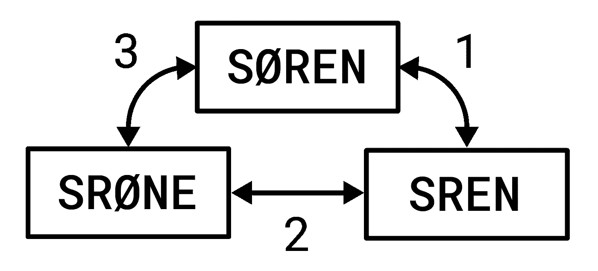

# 虚拟现实中的语音输入

> 原文：<https://towardsdatascience.com/speech-as-input-in-virtual-reality-bb892f9bb41?source=collection_archive---------14----------------------->

Photo credit: [Jason Rosewell](https://unsplash.com/@jasonrosewell?utm_source=medium&utm_medium=referral)

## 为更动态的虚拟环境使用语音和自然语言处理。

人们很久以来就一直想和计算机对话。由于深度学习，语音识别变得明显更加强大，而且明显不那么令人沮丧——即使是对于不太受欢迎的语言。

在 [Kanda](https://www.kanda.dk/) ，我们开始研究语音识别和自然语言处理(NLP)技术，为增强现实(AR) &虚拟现实(VR)制作流畅的对话界面。丹麦语。

[T3 丹麦语是出了名的难学。人类和机器都是如此。这是我们一路走来获得的一些见解。](https://www.youtube.com/watch?v=s-mOy8VUEBk)

# 语音识别的现状

语音识别是人类非常擅长的一项任务。基于理查德·李普曼 1997 年的论文*“机器和人类的语音识别”*【1】，人类水平的语音识别经常被引用为测量的 **4%的单词错误率**。

另一项研究发现，使用仔细的多重转录，人类转录者之间平均有 4.5%的不一致。当要求执行快速转录时(转录大约。仅 5 小时 1 小时英语音频)，**不同意上升至 9.6%**【2】。这些是我们可以用来评估自动语音识别系统有效性的基线。

当李普曼在 1997 年发表他的论文时，他注意到语音识别技术已经取得了很大的进步，在理想情况下错误率已经低于 10%。然而，在自发语音或嘈杂条件下，错误率会增加到 30-40%。

> **快进到 2018 年。**(嗖！)

在这一点上，我们已经习惯了每天与我们的设备对话。想想 Alexa，想想 Cortana，想想 Siri。2017 年，微软宣布他们已经达到了比人类水平略好的机器转录错误率**——在 [Switchboard 数据集](https://www.isip.piconepress.com/projects/switchboard/)【3】上为 5.8% vs 5.9%。**

****

**Photo credit: [Bence Boros](https://unsplash.com/@benceboros?utm_source=medium&utm_medium=referral)**

# **小生境语言**

**所有这些都很棒。但是这些结果是针对英语的，英语是世界上最常用的语言之一。神田总部设在丹麦，我们的客户来自丹麦。我们说丹麦语。于是就有了那个。**

**语音转文本(STT)是您希望避免为其构建自己的模型的任务之一——任务的普遍性与您成功所需的庞大数据量相结合，使得依赖于一个公共提供商成为理想选择。**

**幸运的是，微软 Azure 和谷歌云都提供了丹麦 STT API。但是由于缺乏全面的学术研究和测试结果，我们需要自己评估这些 API 的准确性。**

> **为了这个任务，我们设计了自己的小测试。**

**我们准备并转录了一些丹麦的演讲录音。有些是对着笔记本电脑麦克风大声朗读的新闻文章和电影评论，有些是对着耳机大声朗读的电影对白，还有一些是发音模糊或音频质量下降的自由格式视频博客。**

**我们试图覆盖广泛的场景，尽管测试的规模确实非常小。首先，[谷歌云 STT API](https://cloud.google.com/speech-to-text/) 的表现远远超过了 [Azure STT API](https://azure.microsoft.com/en-us/services/cognitive-services/speech-to-text/) 。所以我们将暂时依赖 Google API。**

**即使这样，结果也远远低于我们在英语中看到的 STT 5-6%的错误率。**在我们的丹麦测试中，谷歌云 STT API 的平均错误率为 28%** 在良好的录制条件下，结构化内容的错误率约为 10%，在嘈杂的条件下，非结构化语音的错误率高达 60%。这实际上可与 1997 年 STT 的英语表演相媲美。出于好奇，一些测试结果如下所示:**

**A selection of results from our Google Cloud SST tests.**

# **指挥与控制**

**所以，也许丹麦语流畅的会话语音界面还有一段路要走。但是，如果我们将范围缩小到关键字驱动的方法，并采取适当的措施来强化和验证输入，**【命令和控制】类型的接口在具有广泛可用的工具和服务的 VR 中是可能的。****

****当你考虑到这是自 70 年代以来基于文本的叙事游戏进行交互的方式时，这种方法可能看起来有点古老。然而，能够以说话的方式与虚拟环境进行交互可以为 VR 体验增加一层新的物理性、熟悉性和可信度。****

> ****这种互动不一定是明确的，比如“去北方”、“玩五分钱游戏”或“拿起物品”。我们可以倾听玩家在体验过程中的自发话语，如命名实体、感兴趣的领域或情绪指标，并让虚拟环境对此做出反应。****

********

****Photo credit: [Lux Interaction](https://unsplash.com/@luxinteraction?utm_source=medium&utm_medium=referral)****

# ****这都是关于环境的****

****当你开始记录语音并观察 STT 模型所犯的错误时，你会意识到许多听起来非常相似的语言特征在不同的上下文中意味着完全不同的东西。这些字叫做[同音字](https://www.youtube.com/watch?v=oUa4FqVn2pA)。****

****上下文可能意味着之前出现的单词，我们正在谈论的话题或者我们正在交谈的人。因此，语境决定了我们正在听的和期望可能听到的单词。****

****[谷歌 STT API 支持可选输入***speech context***](https://cloud.google.com/speech-to-text/docs/reference/rest/v1/RecognitionConfig#SpeechContext)，其中可以包含一些单词和短语，以便在结果中进行优先排序。当听的时候，谷歌 STT 模型会产生一些可能的选项。 ***言语语境*** 用于确定这些选项中哪些最有可能是正确的，**我们期望听到什么。******

********

****Context is used to select the best candidate among words that sound the same.****

****另一个问题是，当在 STT 转录寻找关键字时，可能会出现小的语法错误，例如错误地将“计算机的”转录为“计算机”或“计算机”。如果这个变化没有改变单词的意思，我们仍然应该试着去发现它并做出反应。****

****我们的可用 NLP 工具列表是有限的，因为大多数不支持丹麦语。然而，对小的语法和打字错误的一个补救方法是做 [**模糊字符串搜索**](https://en.wikipedia.org/wiki/Approximate_string_matching) :测量*近似*(而不是*精确* ) 关键词匹配。近似关键词匹配的一个度量是[**Levenshtein distance**](https://en.wikipedia.org/wiki/Levenshtein_distance)，这是一种衡量 **word 编辑距离的方式。******

********

****Levenshtein distance measures the number of edits necessary to change one string to another.****

****Levenshtein 方法通过测量将一个字符串更改为另一个字符串需要多少次编辑来确定两个字符串之间的距离。有效性可以是字符的改变、插入或删除。使用可能编辑的最大数量(等于最长字符串的长度)，可以计算归一化单词距离度量。****

****使用上下文和模糊字符串搜索，我们能够显著降低预定关键字的错误率。经过多次测试，**我们能够以 12%的错误率检测出丹麦关键词**，这是我们最初测试的两倍多。****

****基于这些结果，我们认为丹麦的语音识别服务现在可以实际应用了。至少对于基于关键字的界面是这样。****

********

****Photo credit: [Adam Solomon](https://unsplash.com/@solomac?utm_source=medium&utm_medium=referral)****

# ****走向****

****随着语音识别、NLP 和深度学习领域的所有重大举措，很高兴看到不太受欢迎的语言开始得到支持。****

> ****“外国”语言模型的性能落后于目前可能的英语，但通过一些额外的工具和技巧，**丹麦语语音识别可以用于生产。******

****在像丹麦语这样的语言中，我们仍然在等待能够可靠地应用真正聪明的自然语言处理技术*。就我个人而言，我想知道改进的机器翻译是否可以通过在其他语言中提供英语 NLP 工具箱来帮助我们更好地理解语言。*****

****从积极的方面来看，虚拟现实中流畅的对话式语音界面似乎并不遥远。即使是晦涩、怪异、难学的语言，比如丹麦语。****

> ******现在，我们可以开始使用关键词检测来使虚拟环境更加动态和反应灵敏。******

# ****参考****

****[1] [李普曼，R.P .，1997。机器和人类的语音识别。*言语交际*， *22* (1)，第 1–15 页。](https://www.sciencedirect.com/science/article/abs/pii/S0167639397000216)****

****[2] [Glenn，M.L .，Strassel，s .，Lee，h .，Maeda，k .，Zakhary，r .和 Li，x .，2010 年 5 月。一致性、容量和效率的转录方法。在 *LREC* 。](https://www.researchgate.net/publication/220746404_Transcription_Methods_for_Consistency_Volume_and_Efficiency)****

****[3] [熊，w .，Droppo，j .，黄，x .，塞德，f .，萨尔茨，m .，斯托尔克，a .，于，d .，茨威格，g .，2016。在会话语音识别中实现人类对等。 *arXiv 预印本 arXiv:1610.05256* 。](https://arxiv.org/abs/1610.05256)****