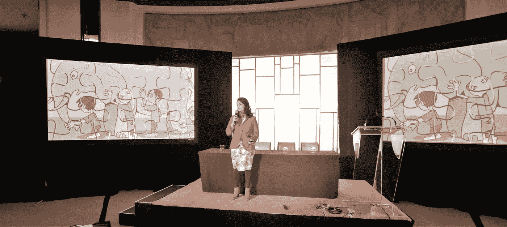
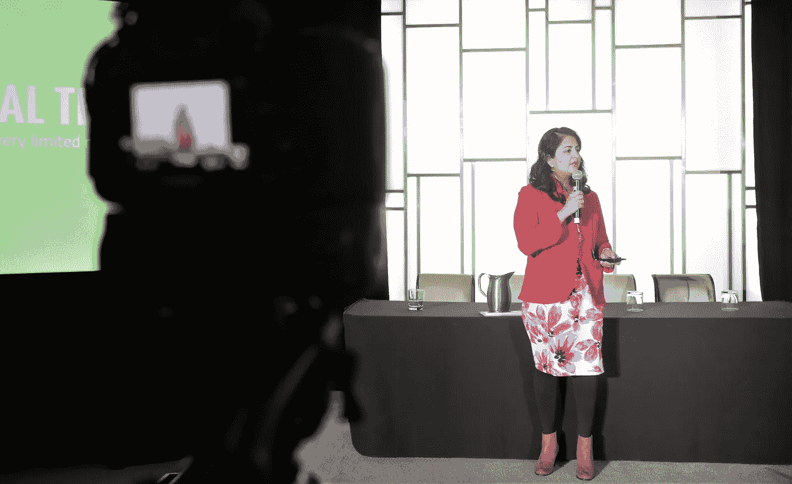
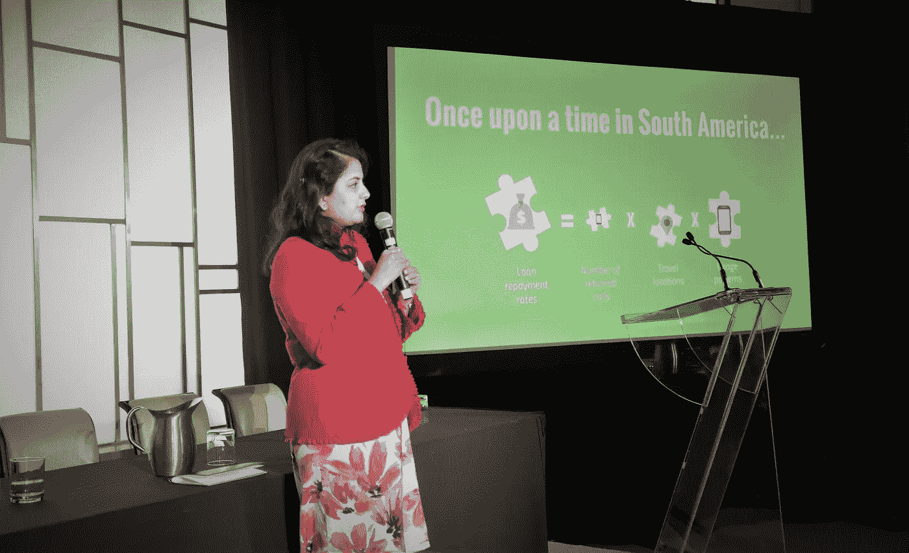
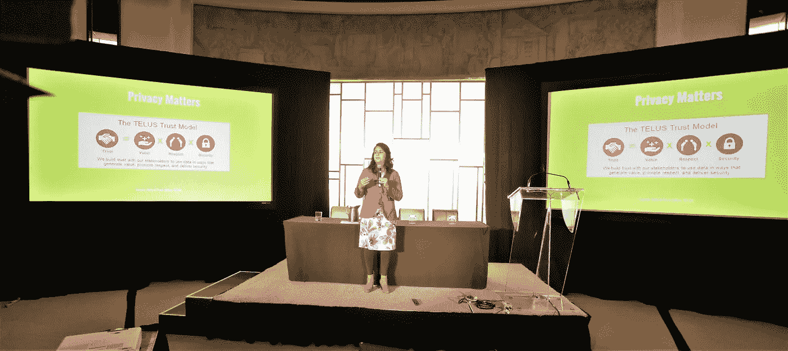
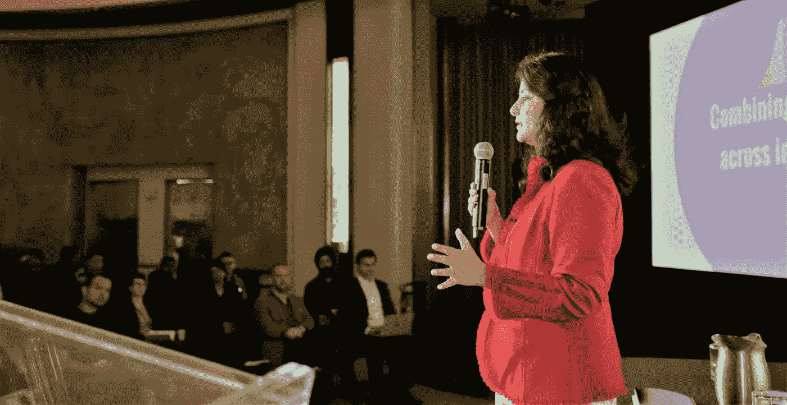

# 演讲:跨行业大数据分析的承诺

> 原文：<https://towardsdatascience.com/speech-the-promise-of-cross-industry-big-data-analytics-73fbec8e4d0?source=collection_archive---------16----------------------->

*我最近在* [*多伦多机器学习峰会 2018*](https://torontomachinelearning.com) *上发表了一篇演讲(* [*幻灯片*](https://prezi.com/dashboard/next/#/details/4u14jizapyc9/) *)。*

………………………………….

下面的文章紧跟在演讲之后。

我是普拉杰克塔，普拉杰克塔·哈尔卡·尼甘。我是一名训练有素的经济学家，不知何故，我成功地催眠了三个不同大陆的三家央行，让它们相信我是一个好央行。一路走来，我写了两本书，搬到了加拿大，成为了一名母亲，然后我做了意想不到的事情——我跳上了大数据和机器学习的潮流。

我在 TELUS，目前专注于数据估值和人工智能生态系统战略。我今天要分享的观察和见解从我在 TELUS 的研究和互动中受益匪浅。然而，本文所表达的观点是我个人的，并不代表我过去或现在的雇主的官方立场。

………………………………………..

这是一个满是盲人的房间。如果不是，我们怎么会错过“房间里的大象？”你能看见它吗？你呢。你呢。没有吗？

我用一个比喻来解释。你听说过六个盲人和大象吗？这个寓言起源于古印度文献，它出现在我上学时的一本语言教科书中，并且一直伴随着我。

引用约翰·萨克斯的诗，

*“有六个印度尼西亚人
很有学问
他们去看大象
虽然他们都是盲人
但是每个人的观察
都可以满足他的心灵”*

据说，一个遥远国度的国王想知道大象长什么样。所以他宣布奖励任何能准确描述他的人。六个盲人决定试试他们的运气，他们去寻找一头大象。当他们遇到一个，他们试图破译它看起来像什么。因为他们是盲人，他们不得不用手抓住大象。然而事实是，因为大象太大了，他们每个人只能抓住一部分——一个抓住象牙，另一个抓住尾巴，还有一个抓住腿，等等。每个人都很高兴，并返回告诉国王，急于为自己要求奖励。每个盲人都确信自己发现了大象的全部真相，并小心翼翼地保护自己的发现不被其他五个人发现。回到皇家法庭，他们轮流描述大象。抓着象牙的人说大象光滑而锋利，摸着腿的人说它多毛、粗壮，抓着尾巴的人说它短小但细长而敏捷。国王完全糊涂了。他认定他们都在愚弄他，他们中没有一个人真的找到了一头大象——他以不诚实为由把他们都关了起来。

**大数据使得打破行业垂直市场的幻想成为可能**

这个房间里的所有人都是瞎子，就像这个寓言中的六个人。我们都为不同垂直行业的公司工作。因此，我们经常陷入孤立考虑客户的陷阱。我们敏锐地观察我们的目标细分市场，但仅限于他们做出的与我们行业相关的选择。我为 TELUS 工作，我思考如何让客户享受并增加他们的移动互联网使用。你可能为一家银行工作，你会考虑是什么让客户申请一张新的信用卡或办理抵押贷款。零售业的其他人想知道为什么顾客会在特定的地点购买特定的商品等等。

我们忽略了一个微妙的事实，那就是我的客户也是你的客户——购买移动套餐的人还需要抵押贷款，还需要购买食品杂货，还需要购买去夏威夷的机票。在一些基本的神经经济学层面，这个人基于一些有限的经验法则、信念和固有的思维方式做出所有这些决定。大数据使得揭示客户行为世界背后的这些信念和经验法则成为可能。

所以当我说这是一个盲人的房间时，我的意思是我们对完整的顾客视而不见，就像六个人对整头大象视而不见一样。

我们的顾客在寓言中用大象来象征，她就是这个房间里的大象。我们对她的描述不够充分，因为我们对她的了解只是部分真相。

**部分真相是有用的，但作用非常有限。**

我们的信息和数据，无论是关于客户的位置、行为还是他们使用的网络，都只能告诉我们客户生活的一小部分。我们的数据庞大、专有且极具价值，但我们能够得出的见解仅限于一种背景。

Predicament of our partially understood customers

我们如何利用大数据更全面地了解客户？线索在于结合来自不同来源、背景和行业的数据集。我在 TELUS 工作的核心是数据评估框架。我的一个重要收获是，我们在模型中使用的数据集越不相关，尤其是在预测模型中，它们就越有可能揭示不同环境下客户行为之间意想不到的相关性。这些意想不到的相关性让我们越来越接近客户使用的有限经验法则。

顺便说一下，我在这里提到客户数据只是因为它是最广泛可用的，但这个原则适用于员工数据、供应商数据、基础设施数据、流行病学数据等等。

**在大数据分析中，1 +1 = 11**

当我偶然看到一项关于国际发展的研究时，我对从不相关的数据集中发现真知灼见的前景产生了兴趣。

布朗大学的经济学家丹尼尔·bjrkegren 和创业金融实验室(EFL)的达雷尔·格里森在 2015 年进行了一项研究，并发表了一篇论文。他们发现，在他们研究的一个中等收入的南美国家，手机通话行为是预测商业贷款还款概率的一种极其准确的方式。他们对超过 5000 个申请贷款的企业家的移动使用相关行为指标和一个财务记录不佳的个人样本进行了机器学习模型训练，预测的还款率优于征信机构的模型。他们的方法构成了向这些人群提供新形式信贷的产品设计的基础。

这很直观-

1.  一个负责任的借款人可能会小心地管理他们的余额，以便更顺利地使用。
2.  一个电话被回复的人可能有更强的社会联系
3.  如果企业家在许多不同的地方使用她的电话，那么她很可能是在招揽生意

耐人寻味不是吗？虽然大多数加拿大人都有丰富的金融历史，但这项实验仍然与我们公司感兴趣的加拿大市场的特定部分超级相关——新移民、刚进入劳动力市场的大学毕业生、企业家和中小企业，以及其他不容易直接建立信用风险档案的人。

另一个超级有趣的案例是谷歌购买万事达卡交易数据，数据混合帮助公司更好地了解客户。谷歌一直在追踪点击谷歌广告导致的在线销售，那里没有新闻。然而，当我看到广告时，我并不总是立即买东西。你通常会在逛商场时认出某样东西，因为两天前你在电子邮件旁边看到了它的广告。那么，如果你在网下的商场里购买，谷歌怎么会知道呢？向谷歌付费的广告商又怎么会知道这种客户行为呢？今年 8 月，谷歌和万事达卡提出了一种分析数据的方法，以建立用户档案，并将它们与线下交易数据进行匹配，以获得线下销售的准确图像。他们不在个人层面跟踪交易，而是依赖用户档案。

答对了。现在，公司可以利用一个全新的信息宇宙，了解不同客户群体在观看谷歌广告后的离线行为，从而更好地调整他们的产品，以适应市场口味。

在大数据分析中，1+1 不等于 2，它等于 11。

类似的方法可用于获取位置数据，并在总体水平上预测国际旅行模式。或支付趋势，以预测哪些客户群更有可能在支付每月抵押贷款时面临现金流挑战。金融和移动使用信息也可以预测生活事件的概率，从而允许零售商有针对性地提供优惠。分析的可能性数不胜数…

**通过合作，而不是竞争，看到全部真相**

数据是一种非常有价值的资产，通常受到严密保护，这不仅是出于隐私原因，也是出于竞争原因。跨行业的数据协作并不常见，因为我们都在努力保守我们的秘方。让我们再一次用这个比喻来看看我们这样做错过了什么。

在大象的比喻中，六个瞎子是在说谎吗？不，他们只是没有意识到自己认知的局限性。他们每个人都有一部分真理，实际上是六分之一的真理。如果我们改变这个比喻，这样六个人中的每一个都可以互相分享他们对大象的了解，并对大象的长相给出一个整体的定义，那该多好？他们本可以非常准确地描述一个。

记住这六个盲人指的是谁——他们是你和我，这个房间里的盲人。合作，而不是竞争，会使盲人将他们的部分真理结合成整体真理！

**还有一件事……**

我一直在说——让我们和房间里的大象说话吧……但是有没有人问过大象她到底想不想被人说话呢？

我们这里的大象指的是“消费者”。消费者希望他们的信息被与他们交易的组织知道吗？组织如何利用这些信息为股东释放商业价值？可能是，也可能不是…这取决于组织使用这些信息的方式。

在 TELUS，我们以“设计隐私”为生活准则，这是一种从概念开始就将隐私融入我们的模型和流程的原则和方法。我们不仅在为
大数据和其他数据用途开发数据治理模型，并在其中构建最佳实践，还在我们的设计流程中构建这些治理机制。我们特别关注去识别模型和再识别风险管理。这里有一个 TELUS 信任模型的快照，它是我们处理客户数据的基础。

这种跨行业的数据协作在保护客户隐私的同时是可能的，其中协作者承诺在收集、共享和分析数据时是透明的、负责任的和合乎道德的。需要明确数据的使用方式和时间，以及对这些数据使用的控制措施。在这样做的时候，作为一个公司或组织这样做是不够的。因此，在构建跨行业数据协作时，要小心选择合作对象。维护所有相关方对数据隐私的高水平承诺至关重要。

我们行业中围绕隐私的所有工作都基于这样一个假设，即客户不希望他们的数据被收集。这是真的，但也只是半真半假。事实的另一半是，只要他们的信息将被使用或共享的方式以及目的是透明的，客户实际上就会喜欢精心策划的个性化推荐、产品和服务。业界和学术界围绕不同的隐私模型开展了大量工作。这项工作有望最大限度地保护隐私，同时还能与分析相平衡。

**所以我把这个留给你们:**

更好地了解我们的客户、我们的行业和我们的世界不仅有利可图；我们有责任了解它们；在他们允许的范围内。我们还能怎样把顾客放在第一位？我们还能如何从尊重和理解的角度来解决这些问题呢？

*“于是，印度尼西亚的六个男人
吵了很久
各持己见
异常强硬
他们每个人都是对的
所有人都是错的。”*

**很乐意继续谈话。问我一个问题或写信给我。**