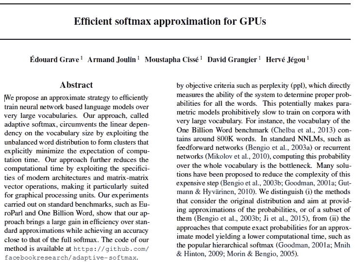

# 使用自适应 softmax，第 1 部分，将深度学习语言模型的速度提高 1000%

> 原文：<https://towardsdatascience.com/speed-up-your-deep-learning-language-model-up-to-1000-with-the-adaptive-softmax-part-1-e7cc1f89fcc9?source=collection_archive---------5----------------------->

您希望将语言建模(LM)任务的速度提高 1000%，而准确性几乎没有下降吗？最近，[脸书人工智能研究小组(FAIR)](https://research.fb.com/category/facebook-ai-research/) 的一篇论文，作者是[格雷夫等人(2017)](https://arxiv.org/abs/1609.04309) ，名为“GPU 的高效 softmax 近似”，展示了如何通过他们的“自适应 softmax”，在语言建模最耗时的方面之一，计算繁重的 softmax 步骤中获得大规模加速。使用 adaptive softmax 带来的巨大加速只带来了最小的准确性成本，因此任何正在进行语言建模的人都应该考虑使用它。在这篇博文的第 1 部分，我将全面解释自适应 softmax，然后在[第 2 部分](https://medium.com/@dwbressler/speed-up-your-deep-learning-language-model-up-to-1000-with-the-adaptive-softmax-part-2-pytorch-d47fe9a56152)我将带你一步一步地完成 Pytorch 实现(附带 [Jupyter 笔记本](https://github.com/DavidWBressler/bressler_public_code/blob/master/Adaptive_softmax_example.ipynb)，它使用 Pytorch 的内置[AdaptiveLogSoftmaxWithLoss](https://pytorch.org/docs/stable/_modules/torch/nn/modules/adaptive.html#AdaptiveLogSoftmaxWithLoss)函数。

In my experiment (see [Part 2](https://medium.com/@dwbressler/speed-up-your-deep-learning-language-model-up-to-1000-with-the-adaptive-softmax-part-2-pytorch-d47fe9a56152) of this blog), the adaptive softmax version of my model trained 3x faster than the same model using a traditional softmax. Final accuracy was nearly the same.

您可能知道，语言建模是自然语言处理(NLP)中最基本和最重要的任务之一。它包括创建一个模型，当给定一个单词序列作为输入时，该模型可以预测序列中的下一个单词(这就是在手机键盘上启用预测文本功能的原因)。为了做到这一点，语言模型中的最后一个计算步骤涉及从语言模型的词汇表中的大量单词中选择要选择的单词。由于词汇表通常包含 10 或 100 个成千上万的单词，这最后一步是非常计算和耗时的。

Predictive texting… Did you mean “auto cucumber” or “autocorrect”?

那么语言模型如何从词汇表中选择一个单词作为它的预测呢？在标记化/数值化预处理步骤之后，模型的典型输入可能是大小为 *[seq_length，bs]* 的张量，目标也可能是大小为 *[seq_length，bs]* (实际上是将输入移动到未来的一个时间点)，其中 *bs* 是给定迷你批次中的示例数量， *seq_length* 是任何给定示例的长度。在访问嵌入后(数据现在的大小为*【seq _ length，bs，emb _ SZ】*)，通常数据通过多层使用 LSTM 或 GRU 单元的递归神经网络(RNN)，得到大小为*【seq _ length，bs，NH】*的最终隐藏状态输出，其中 *nh* 是最终层的维度。目标是计算 *p(w|h)* …即给定最终隐藏状态 *h* 的单词 *w* 的概率(这里， *h* 是给定示例和时间点的最终隐藏状态输出，长度为 *nh* 的向量)。

从隐藏状态输出中获得预测的 softmax 解决方案包括首先使用完全连接的线性层转换输出，输出特征的数量等于词汇表的大小(因此从大小 *[seq_length，bs，nh]* 到大小 *[seq_length，bs，vs]* ，其中 vs 是词汇表的大小)。然后将 softmax 公式 *exp(x[i]) / sum(exp(x))* 应用于词汇表中的所有单词，为每个单词产生一个概率值(在 0 和 1 之间)。最后，通常使用负对数似然(NLL)损失将这些预测与目标进行比较。

Model design for a small RNN-network, with vs=25520 and nh=300\. Notice that the last step is a fully-connected linear layer, that transforms the dimensionality from 300 to 25520.

将输出从大小 *[seq_length，bs，nh]* 转换为大小 *[seq_length，bs，vs]* 的步骤非常庞大！这最后一步的计算成本与你的词汇量成线性关系，如前所述，如果你想要一个像样的语言模型，词汇量将会很大。对于 *nh* 和 *vs* 的典型值，此变换的权重矩阵可以是 size [1，000 x 200，000]，它应用于数据集中每个示例的每个时间步长。这一步主导了训练和测试时的计算，对于任何语言模型来说都是一个主要的耗时步骤。

Grave 等人的 adaptive softmax 是解决这个问题的一个非常好的解决方案。要理解它，你首先需要理解层次化的 softmax，这是之前加速 softmax 的尝试(例如 [Morin & Bengio，2005](https://www.researchgate.net/publication/228348202_Hierarchical_probabilistic_neural_network_language_model) )。你首先将每个单词 w 分配到一个唯一的簇 *C(w)* 。分层的 softmax 然后将 softmax 分成两个阶段:首先预测聚类 *C* ，然后对该聚类的所有单词进行 softmax。你可以将给定最终隐藏状态 *h* 的单词 w 的条件概率因式分解为 *p(w|h) = p* ₂ *(w | C(w)，h) * p* ₁ *( C(w) | h)* …即给定隐藏状态 *h* 的单词 *w* 的概率，就是给定 *C(w)* 的概率简单来说，首先只需预测簇，然后预测簇中的哪个单词。这将把计算时间从与词汇表大小成线性减少到词汇表大小的平方根数量级。

Grave et al., 2017

然而，正如 Grave 等人的论文中所解释的，分层的 softmax 实际上在 GPU 上并不工作得那么好(对此的解释超出了本文的范围)。他们的自适应 softmax 是为 GPU 定制的分层 softmax 的简单变体。它利用了 Zipf 定律…观察到在任何语料库中，单词分布的大部分概率质量只被一小部分词汇覆盖。例如，在 [Penn Treebank 数据集](https://catalog.ldc.upenn.edu/ldc99t42)中，文档中 87%的单词仅被 20%的词汇覆盖。adaptive softmax 利用这一信息，根据单词的常见程度将词汇表中的单词分配到聚类中。

为了理解这种方法，最好从最简单的自适应 softmax 开始，其中词汇表被划分为两个集群，Vᴴᴱᴬᴰ和 Vᵀᴬᴵᴸ.在你的语料库中，少量的最频繁出现的单词应该进入 Vᴴᴱᴬᴰ，而 Vᵀᴬᴵᴸ应该包含剩余的不频繁出现的单词。所以在你的语料库中，一个词出现在 Vᴴᴱᴬᴰ的可能性比出现在 Vᵀᴬᴵᴸ(即 p(Vᴴᴱᴬᴰ) > p(Vᵀᴬᴵᴸ的可能性大得多，但是 Vᵀᴬᴵᴸ的词应该比 Vᴴᴱᴬᴰ.的多得多

在这个 2-聚类示例中的第一步是计算头部中所有单词的 softmax，加上对应于选择尾部聚类的 1 个额外的“单词”。也就是说，首先对 Vᴴᴱᴬᴰ + 1 个单词进行 softmax，其中额外的“单词”是它属于尾簇的概率。对于 Vᴴᴱᴬᴰ的单词， *p(w|h)* 简单来说就是 *pᴴᴱᴬᴰ(w|h)* …也就是说，只要计算给定 *h* 的单词在 Vᴴᴱᴬᴰ出现的概率。如果选择了与尾类别相对应的“单词”,那么只需要对 Vᵀᴬᴵᴸ).中的所有单词进行额外的 softmax 对于这些单词， *p(w|h)是 pᴴᴱᴬᴰ(tail|h) * pᵀᴬᴵᴸ(w|h)* …即，如果 *pᴴᴱᴬᴰ(w|h)* 表示“尾簇”，则取“尾簇”在头部的概率，乘以所选单词在尾部的概率。对于仅使用这种双集群方法，Grave 等人观察到比完整的 softmax 快 5 倍！

但是，通过使用更多的集群，您可以获得更大的收益…最佳组合似乎是 2-5 个集群。该方法与 2-聚类示例相同，除了第一个 softmax 将覆盖头部中的所有单词，再加上表示尾部聚类的许多附加“单词”。例如，对于 5 个集群的实现，初始 softmax 将超过 Vᴴᴱᴬᴰ + 4 个字。如果在初始 softmax 中选择了尾部聚类“单词”中的一个，那么将只在所选尾部中的单词上计算额外的 softmax。使用与上述相同的原理，最频繁的单词被分配到最小的簇中…头部和第一个尾部将具有更频繁的单词但具有更小的词汇量，最后一个尾部将具有不太频繁的单词和更大的词汇量。

Figure 3 from Grave et al., 2017\. This figure shows a clustering with 4 clusters: a head and 3 tails. The head contains a small number of the most frequent words, whereas the tails contain larger numbers of less frequent words.

还有一个以最小的准确性代价提高速度的窍门，那就是每个集群被赋予不同的容量。以上， *nh* 是最终隐藏状态输出容量的度量。您需要高容量来正确预测最频繁出现的单词。然而，根据定义，生僻字只出现几次，因此无法通过您的模型很好地学习……为这些字使用高容量是一种浪费。因此，Grave 等人通过应用一个投影矩阵，将每个额外的尾部聚类的维数减少了 4 倍，从而减少了尾部聚类的 softmax 的最终隐藏状态输入的维数(一旦我们通过这篇博客文章的[第 2 部分](https://medium.com/@dwbressler/speed-up-your-deep-learning-language-model-up-to-1000-with-the-adaptive-softmax-part-2-pytorch-d47fe9a56152)中的示例实现，这将变得更加清楚)。

就是这样！您可以使用上面概述的原则(或通过使用动态编程)，试验聚类的数量和单词在聚类之间的分布，以找出哪些单词最适合您的数据集。总体而言，自适应 softmax 提供了巨大的速度提升(高达 10 倍！)在整个 softmax 上，以最小的精度代价。[查看我在 CNN 的博客文章，它也可以加速 NLP 的训练]。当你需要从大量可能的类别中进行选择时，自适应 softmax 会很有帮助，其中一些类别比其他类别更常见。这不仅适用于语言建模，也适用于许多其他 NLP 任务(神经机器翻译(NMT)、语音到文本等)。)，可能对于许多非语言应用程序也是如此。查看这篇博文的[第 2 部分](https://medium.com/@dwbressler/speed-up-your-deep-learning-language-model-up-to-1000-with-the-adaptive-softmax-part-2-pytorch-d47fe9a56152)来一步步了解自适应 softmax 的 [Pytorch 实现](https://github.com/DavidWBressler/bressler_public_code/blob/master/Adaptive_softmax_example.ipynb)，它使用了 Pytorch 的内置[AdaptiveLogSoftmaxWithLoss](https://pytorch.org/docs/stable/_modules/torch/nn/modules/adaptive.html#AdaptiveLogSoftmaxWithLoss)函数。

# 参考资料:

[Grave，Edouard 等人，“GPU 的高效 softmax 近似”arXiv 预印本 arXiv:1609.04309v3 (2017)。](https://arxiv.org/abs/1609.04309)

莫兰，弗雷德里克，约舒厄·本吉奥。"分层概率神经网络语言模型."Aistats。第五卷。2005.