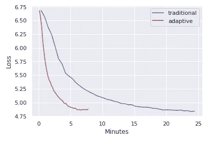
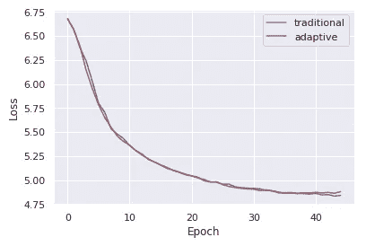

# 使用自适应 softmax，第 2 部分:Pytorch 实现，将深度学习语言模型的速度提高 1000%

> 原文：<https://towardsdatascience.com/speed-up-your-deep-learning-language-model-up-to-1000-with-the-adaptive-softmax-part-2-pytorch-d47fe9a56152?source=collection_archive---------6----------------------->


在这篇博文的第一部分中，我解释了自适应 softmax 是如何工作的，以及它是如何将你的语言模型加速 1000%的。在第 2 部分中，我将带您一步一步地完成 Pytorch 实现(附带一个 [Jupyter 笔记本](https://github.com/DavidWBressler/bressler_public_code/blob/master/Adaptive_softmax_example.ipynb)，它使用 Pytorch 的内置[AdaptiveLogSoftmaxWithLoss](https://pytorch.org/docs/stable/_modules/torch/nn/modules/adaptive.html#AdaptiveLogSoftmaxWithLoss)函数。

对于预处理，你将需要 fastai(见[https://docs.fast.ai/](https://docs.fast.ai/))，一个运行在 Pytorch 之上的深度学习库，它简化了训练神经网络。【对于想学习最前沿深度学习技术的人，我强烈推荐网上免费提供的杰瑞米·霍华德的 fast.ai 课程:[https://course.fast.ai/](https://course.fast.ai/)】。我决定使用 [Wikitext-2 数据集](https://einstein.ai/research/blog/the-wikitext-long-term-dependency-language-modeling-dataset)，这是一个相对较小的数据集，包含大约 200 万个令牌和大约 3.3 万个词汇。一旦数据被下载并正确格式化为 csv 文件，fastai 就可以轻松地快速标记、数字化并创建一个用于训练的数据加载器。我还下载了 [GloVe 预训练单词向量](https://nlp.stanford.edu/projects/glove/)，用于模型的单词嵌入。最后，我创建了一个处理训练的 modeler 类。

对于模型，我创建了一个简单版本的准递归神经网络(QRNN)，它比传统的递归神经网络(RNNs)具有更好的预测精度，并且速度快 16 倍(参见 Bradbury 等人，2016)。我构建的网络相对较小，只有 4 层，每层有 300 个隐藏单元…我的目的是创建一个可以相对较快地达到一个不错的(如果不是最先进的)结果的网络。梯度裁剪的使用允许使用大的学习率( *lr* =1)，这与[内斯特罗夫的动量](http://cs231n.github.io/neural-networks-3/#sgd)一起帮助训练快速收敛。

[第 1 部分](https://medium.com/@dwbressler/speed-up-your-deep-learning-language-model-up-to-1000-with-the-adaptive-softmax-part-1-e7cc1f89fcc9)描述了数据如何通过网络传输。最后一个 QRNN 层的输出 *x* 的大小为*【seq _ length = 70，bs=50，NH = 300】*，其中 *seq_length* 为序列的长度， *bs* 为批量大小， *nh* 为最后一层的维数。

```
x, new_h = self.rnn(x, self.hidden)
```

# 常规 Softmax

对于常规的 softmax，最后一个 QRNN 层之后的下一步是完全连接的线性层(这里称为 *fc1* )，它将输出转换为具有与词汇表大小相等的多个输出特征(因此从大小*【seq _ length，bs，nh】】到大小*【seq _ length，bs，vs】*，其中 *vs* 是您的词汇表大小)。对于大多数语言模型来说，计算时间由这个操作决定。*

```
#self.fc1 = nn.Linear(nh, vs)
x= self.fc1(x)
```

然后，模型输出这些值的 log-softmax，负 log-likelihood 用于计算损失。

```
return F.log_softmax(x.view(-1,vs),dim=1)
...
loss = self.criterion(output, target)
```

# 自适应 Softmax

自适应 softmax 的方法略有不同。最后一个 QRNN 层的输出 *x* 仍然是大小*【序列长度=70，bs=50，NH = 300】*。然后将输出调整到 *[seq_length*bs，nh]* ，并输入到[AdaptiveLogSoftmaxWithLoss](https://pytorch.org/docs/stable/_modules/torch/nn/modules/adaptive.html#AdaptiveLogSoftmaxWithLoss)函数，该函数为您计算损失。

```
x,new_h = self.rnn(x, self.hidden)
x=x.view(-1,x.size()[2])
#self.out=nn.AdaptiveLogSoftmaxWithLoss(nh, vs, cutoffs=[round(vs/15), 3*round(vs/15)], div_value=4)
return self.out(x,target)
...
loss= output.loss
```

让我们看看 AdaptiveLogSoftmaxWithLoss 函数是做什么的。你可以看到我指定了截止值= [round(vs/15)，3*round(vs/15)]。这意味着我将把我的 25520 个单词分成 3 组。头部聚类包含 1701 个最常见的单词(即，词汇表的 1/15)，加上两个“单词”来指示两个尾部聚类的可能性，总共 1703 个单词。第一个尾簇包含接下来的 3402 个最常用的单词(即词汇表的 2/15)，第二个尾簇包含剩余的 20417 个最不常用的单词(即词汇表的 12/15)。为了做到这一点，我需要确保我的词汇表(这里称为 *itos* )是按照从最常见到最不常见的单词的顺序组织的。

正如我在[第 1 部分](https://medium.com/@dwbressler/speed-up-your-deep-learning-language-model-up-to-1000-with-the-adaptive-softmax-part-1-e7cc1f89fcc9)中提到的，这些集群中的每一个都被赋予了不同的容量，其相对大小由赋予 AdaptiveLogSoftmaxWithLoss 函数的 *div_value* 指定。为 4 的 *div_value* 意味着每个附加集群的容量将比前一个集群小 4 倍。在这种情况下，首簇的容量为 300，第一个尾簇的容量为 75，第二个尾簇的容量仅为 18。这意味着对于头部聚类中最常见的单词，它将直接将维度从 300 转换为 1703 输出特征(因为 1703 是头部中词汇单词的数量)。然而，对于第一个尾部聚类，在第二个线性层将维度转换为 3402 个输出特征之前，初始线性层将首先将维度减少到 75 个特征。维度的初始减少加快了处理时间(与从 300 个输入要素到 3402 个输出要素的直接线性变换相比)。对于最后一个尾部聚类中最不常用的单词，发生类似的过程。

```
(out): AdaptiveLogSoftmaxWithLoss(
    (head): Linear(in_features=300, out_features=1703, bias=False)
    (tail): ModuleList(
      (0): Sequential(
        (0): Linear(in_features=300, out_features=75, bias=False)
        (1): Linear(in_features=75, out_features=3402, bias=False)
      )
      (1): Sequential(
        (0): Linear(in_features=300, out_features=18, bias=False)
        (1): Linear(in_features=18, out_features=20417, bias=False)
      )
    )
```

# 结果

传统 softmax 网络的最终损耗为 4.84(困惑度= 127)，而自适应 softmax 网络的最终损耗为 4.88(困惑度= 132)。这是不到 1%的最终损失差异(和 4%的困惑差异)。另一方面，自适应 softmax 网络在 7.80 分钟(7 分 48 秒)完成计算，而传统 softmax 网络在 24.55 分钟完成计算。因此，两种方法的结果在准确性方面非常相似，但自适应 softmax 网络的运行速度快 3 倍！这些结果与 Grave 等人在 Text8 数据集(与我使用的 Wikitext-2 数据集大小相似)上的实验相匹配…与完整的 softmax 相比，最终损失几乎相同，但加速几乎是 3 倍。



Plotting time vs loss for the two approaches. Even though the final result is nearly the same, the adaptive softmax network completes training 3x quicker than an identical traditional softmax network.



Plotting epoch vs loss for the traditional and adaptive softmax approaches. Training proceeds almost identically between the two approaches, although the traditional softmax network completes with a 1% lower loss than the adaptive softmax network.

那么自适应的 softmax 相比传统的 softmax 有多好呢？如果我决定进行更多时期的训练，很可能最终的损失会更大。然而，Grave 等人(2017)和其他 NLP 研究人员(例如 Dauphin 等人，2016)表明，他们实际上能够使用 adaptive softmax 在各种数据集上实现最先进的语言建模结果。因此，您应该考虑将自适应 softmax 添加到您的语言建模工具箱中，因为它以最小的准确性成本提供了超过完整 softmax 的巨大速度。参见[第 1 部分](https://medium.com/@dwbressler/speed-up-your-deep-learning-language-model-up-to-1000-with-the-adaptive-softmax-part-1-e7cc1f89fcc9)了解自适应 softmax 如何工作的完整解释。

# 参考资料:

布拉德伯里，詹姆斯，等。“准递归神经网络。”arXiv 预印本 arXiv:1611.01576 (2016)。

[多芬，扬恩 n .等人，《用门控卷积网络进行语言建模》arXiv 预印本 arXiv:1612.08083 (2016)。](https://arxiv.org/abs/1612.08083)

[格雷夫，爱德华，等，“GPU 的有效软最大近似”arXiv 预印本 arXiv:1609.04309v3 (2017)。](https://arxiv.org/abs/1609.04309)