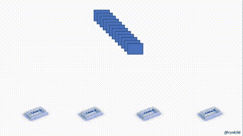

# 使用并行技术的快速计算机视觉流水线

> 原文：<https://towardsdatascience.com/speedy-cv-pipelines-using-parallelism-d7bebad2ff5f?source=collection_archive---------12----------------------->

如果你曾经使用 OpenCV、MoviePy 或任何其他海量的库编写过自己的代码来处理视频，你可能会面临处理速度非常慢的问题。

Unfortunate is ze who has to wait 20 minutes to watermark a 5 minute 4k video

这是因为我们编写的代码基本上是为了在单核上运行而编写的。我们有一个庞大的任务，需要处理大量的数据，没有现成的解决方案可以简化我们的生活。然而，我们想要的是一个完全不同的故事。蠢朋克的一些歌词最好地概括了这一点

> 努力吧，努力吧…..更难、更好、更快、更强

看到*更快这个词，*你脑子里第一个想到的可能就是排比。当我们考虑并行视频处理时，这是必须的，对吗？

# 方法 1

我们可以将帧一个接一个地分配给空闲的内核。似乎是一个简单而明显的解决方案，不是吗？

First thoughts: How to NOT parallelize video processing across cores

然而不幸的是，这并不十分奏效。事实上，在很多情况下，这最终会比我们简单的单核代码的性能更差。要了解原因，我们必须深入了解视频本身是如何存储的。由于视频编码是顺序的，当一个内核解码一帧时，其他内核必须处于空闲状态。他们不能开始处理下一帧，直到该核心解码了前一帧([这里是](https://www.youtube.com/watch?v=qbGQBT2Vwvc)一个关于视频压缩如何工作的技术快速介绍)。

像`joblib`这样的库也试图以类似的方式并行化作业，因此没有提供我们希望看到的那种加速。这意味着我们必须寻找更好的替代方案

# 方法 2

聪明的阿德里安在他的博客中强调了另一种加速视频处理的方法。在这篇博文中，他讨论了将帧解码过程转移到另一个线程，并存储解码后的帧，直到主处理线程需要检索它。

New frames are decoded in a dedicated thread and enqueued to the back of a Queue. They are then dequeued from the front of the list as and when needed by the main processing thread (source: [pyimagesearch](https://www.pyimagesearch.com/2017/02/06/faster-video-file-fps-with-cv2-videocapture-and-opencv/))

尽管这本身是一个绝妙的想法，但是这种方法的一个很大的局限性是它只能同时利用机器的两个线程/内核。此外，出于某种原因，Adrian 博客中的代码似乎没有直接扩展到 Python 3(参见帖子上的评论。或许 Python 改变了他们的`multithreading`库的内部工作方式？)不管怎样，如果我们朝这个方向努力，我们应该能够达到一个水平，至少比我们开始的时候稍微好一点。

但是仍然没有达到我们期望的速度。我们希望让 Threadripper 或 Xeon 在同一视频中大规模分配工作负载。为了能够做到这一点，让我们回头看看方法 1。我们第一种方法的主要问题是内核之间的相互依赖。这是不可避免的，因为视频编码从根本上来说是“分块”的。

然而，从逻辑上讲，通过强制内核在完全不同的预分配片段上工作，应该很容易解决这个问题。这是我们最后的方法

# 方法 3

为了做到这一点，我们所要做的就是让每个内核寻找视频的一个完全不同的片段，并对其进行操作

A better way to distribute video processing across your cores

假设我们有 10，000 帧和 4 个内核，这意味着我们将每个内核专用于这 10，000 帧中固定的**连续**季度(=2500)。这样，内核就不必相互等待来处理下一帧。在此之后，剩下的唯一任务是以正确的顺序重新组装已处理的帧。遵循这种方法可以让我们轻松地并行处理我们的视频处理流水线

在 Python 中做到这一点非常简单。作为参考，这可能是您的普通视频处理代码的样子:

A normal code to perform an operation on a video

如果我们必须并行化这段代码，我们必须使用 python `multiprocessing`库

Parallelizing the video processing by distributing video fragments across cores

大部分已经完成了。然而，仍然遗漏了一个重要的部分。我们只剩下加工过的碎片。我们仍然需要合并这些碎片。这可以通过以下方式使用`ffmpeg`轻松完成:

Merging the video fragments that are generated by our parallel processing code

我们做到了！一种并行化视频处理管道的方法，可根据我们投入的内核数量进行扩展。

A speed-up of **6x** is observed with 6 cores and **2x** with 2 cores for the simple task of video blurring

你不必相信我的话，:D。自己试试吧，在下面的评论中告诉我。所有的代码都可以在 https://github.com/rsnk96/fast-cv 的 GitHub 中找到

**备注:**

*   如果你想知道`cv2.set(CAP_PROP_POS_FRAMES)`如何跳到一个特定的帧，而不必使用前面的帧解码，这是因为它跳到了最近的关键帧。查看视频链接，更好地理解这一点
*   `cv2.set(CAP_PROP_POS_FRAMES)` [已知](https://github.com/opencv/opencv/issues/9053)没有准确寻找指定帧。这可能是因为它寻找最近的关键帧。这意味着在视频片段的地方可能会有几帧重复。所以不建议对关键帧用例采用这种方法。
*   最佳性能实际上可能通过方法 2 和 3 的组合来获得。但是要把它编码起来需要更多的努力。如果有人设法拼凑出一个代码，请在评论中告诉我！:)
*   **:包含对`if ret==False: break`的检查是正常的做法，但是为了简单起见，我在这里避免了它
*   这篇文章是我最近在 Pysangamam 和 Pycon India 发表的演讲的摘要。[https://www.youtube.com/watch?v=v29nBvfikcE](https://www.youtube.com/watch?v=v29nBvfikcE)