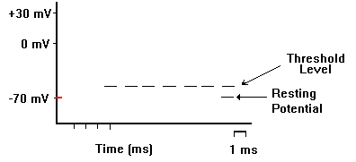
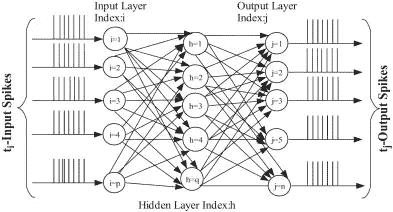

# 脉冲神经网络，下一代机器学习

> 原文：<https://towardsdatascience.com/spiking-neural-networks-the-next-generation-of-machine-learning-84e167f4eb2b?source=collection_archive---------1----------------------->

每个远程关注机器学习最新进展的人都听说过当前用于机器学习的第二代人工神经网络。这些一般都是全连接的，接受连续值，输出连续值。虽然它们让我们在许多领域取得了突破性进展，但它们在生物学上是不准确的，并没有真正模仿我们大脑神经元的实际机制。

第三代神经网络，即脉冲神经网络，旨在弥合神经科学和机器学习之间的差距，使用生物逼真的神经元模型来执行计算。一个脉冲神经网络(SNN)从根本上不同于机器学习社区所知道的神经网络。snn 使用尖峰信号运行，尖峰信号是在时间点发生的离散事件，而不是连续值。锋电位的出现是由代表各种生物过程的微分方程决定的，其中最重要的是神经元的膜电位。本质上，一旦神经元达到某个电位，它就会出现尖峰，该神经元的电位就会被重置。最常见的模型是泄漏集成点火(LIF)模型。此外，snn 通常稀疏连接，并利用专门的网络拓扑。

Differential equation for membrane potential in the LIF model

Membrane potential behavior during a spike

Spike trains for a network of 3 neurons

A full spiking neural network

乍一看，这似乎是一种倒退。我们已经从连续输出转向二进制输出，这些尖峰脉冲串不太好解释。然而，尖峰脉冲序列为我们提供了处理时空数据的增强能力，换句话说，就是现实世界的感官数据。空间方面指的是这样一个事实，即神经元只连接到它们本地的神经元，所以这些神经元天生就单独处理输入的大块(类似于 CNN 使用过滤器的方式)。时间方面指的是尖峰脉冲序列随着时间的推移而出现，因此我们在二进制编码中失去的，是尖峰脉冲的时间信息。这允许我们自然地处理时态数据，而没有 RNNs 增加的额外复杂性。事实上，已经证明，脉冲神经元从根本上来说是比传统人工神经元更强大的*计算单元。*

鉴于这些社交网络在理论上比第二代网络更强大，人们很自然会想为什么我们看不到它们的广泛使用。当前 SNNs 实际使用中的主要问题是*训练*的问题。虽然我们有无监督的生物学习方法，如赫比学习和 STDP，但没有已知的有效的监督训练方法，用于 SNNs，提供比第二代网络更高的性能。由于尖峰序列是不可微的，我们不能使用梯度下降训练 snn 而不丢失尖峰序列中的精确时间信息。因此，为了将 SNNs 正确地用于现实世界的任务，我们需要开发一种有效的监督学习方法。鉴于这些网络中的生物现实主义，这是一项非常困难的任务，因为这样做将涉及确定人类大脑实际上是如何学习的。

我们即将解决的另一个问题是，在普通硬件上模拟 SNNs 是非常计算密集型的，因为它需要模拟微分方程。然而，神经形态硬件，如 IBM 的 TrueNorth，旨在通过使用专门的硬件模拟神经元来解决这一问题，这些硬件可以利用神经元尖峰行为的离散和稀疏特性。

因此，社交网络的未来仍不明朗。一方面，它们是我们当前神经网络的自然继承者，但另一方面，它们远不是大多数任务的实用工具。在实时图像和音频处理中有一些当前真实世界的 SNNs 应用，但是关于实际应用的文献仍然很少。大多数关于 SNNs 的论文要么是理论性的，要么显示了在简单的全连接第二代网络下的性能。然而，有许多团队致力于开发 SNN 监督学习规则，我对社交网络的未来保持乐观。