# 用 R +谷歌云机器学习进行 App Store 评论挖掘

> 原文：<https://towardsdatascience.com/spotify-app-review-mining-with-r-google-cloud-machine-learning-feb6f9c3b75f?source=collection_archive---------8----------------------->

*这篇文章描述了如何用 R 和 itunesr(由* [*阿卜杜勒马耶德拉贾*](https://datascienceplus.com/author/abdulmajed-raja/) *)从 iTunes 中导出数据，然后是可视化的评分和评论。它还涵盖了如何在进行基本的情感分析之前，通过使用 Google Cloud 机器学习 API 进行语言处理，使用 googleLanguageR 来翻译评论。*

## 为什么要在意 app 评分和评论？

评论包含了关于什么有效，什么无效的有价值的见解，因此应该被视为一座金矿。评论可能是一个应用程序性能不佳的唯一信息来源。因此，如果有人问为什么要关心免费、有价值和主动提供的用户反馈 2018，你最好确保你在正确的地方。只要跟随你的网购行为，你就会找到答案。

关于应用评级和评论重要性的关键见解:

*   [85%的消费者对在线评论的信任程度不亚于个人推荐](https://www.brightlocal.com/learn/local-consumer-review-survey/)
*   如果用户感到沮丧或有不好的体验，他们更有可能写评论
*   应用评论不仅会指出未来需要改进的方面，还会让用户感到参与和有影响力
*   Apptentive 进行的一项研究表明[移动应用可以积极影响一个品牌的声誉](https://www.apptentive.com/blog/2016/06/23/mobile-ratings-good-bad-ugly/)。
*   用户下载未知品牌高评分应用的可能性是已知品牌低评分应用的 8 倍。
*   评分和评论会影响你的应用在应用搜索结果(ASO)中的排名。

> 用户共享意味着公司关怀


## 购买非定制的应用分析工具或构建定制平台

处理评论挖掘可能具有挑战性，但会给你提供有价值的见解，有助于创造更好的服务，并有望提高用户忠诚度。为了获得积极的效果，你需要一种工作方法。不幸的是，随着时间的推移，App Store 无法帮助你区分正面和负面评论。此外，您需要定义一个系统化的流程，在对类似的反馈进行分析之前对其进行分组。对正面和负面的评论、合格的 UX 改进中的错误或者更大的特性建议进行分类，将会提高效率并促进未来的优先级。

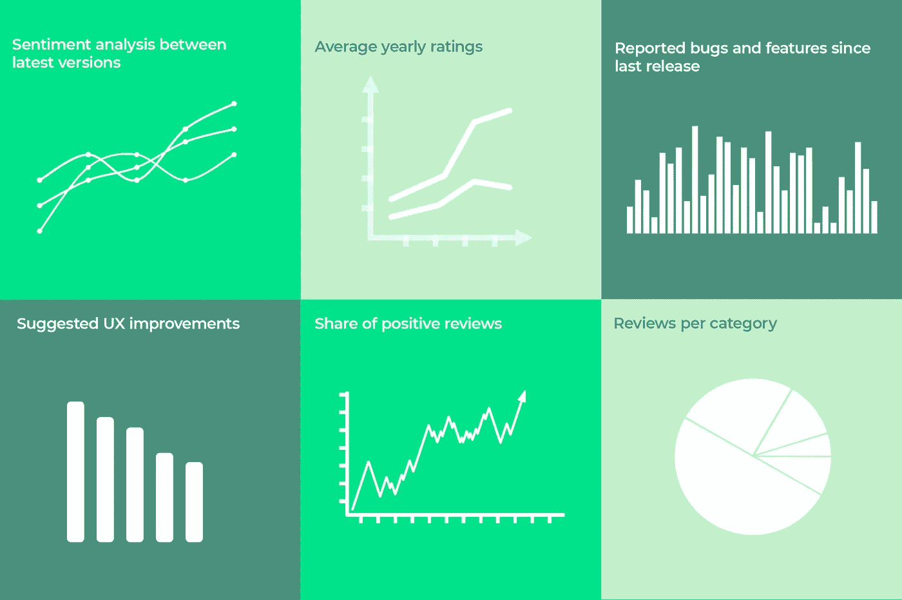

那么，从哪里开始呢？你可以选择使用 Appbot、MobileAction、App Annie 或 SensorTower 等非定制但功能强大的工具支付有时很昂贵的订阅费用，或者自己创建一个定制的解决方案并节省数千美元。相反，我会使用这些工具导出历史数据，然后在 Tableau 中构建我的个人挖掘解决方案，或者在 r。

***免责声明:****App Store Connect 的一个缺点是，你只能导出每个国家/市场的最新 500 条评论，并且只能导出与评论相关的评分。这将影响所有的汇总报告，因为美国的最后 500 个评论可以在一周内收集，但像匈牙利这样的较小市场可能涵盖前 12 个月的观察。可以每天或每周转换数据以保存历史数据。如果不是，小心你的发现。*

创建灵活的解决方案的好处是有机会交叉检查数据，并根据不同的场景安排自动化任务。此外，通过减少代码和可视化的数量，您可以在一秒钟内对应用程序进行免费的基准研究。

## 用 R 和 itunesr 查看分析

为什么选择 R？r 是一种用于定性和定量分析的统计编程语言，由科学家开发，具有大量用于统计、机器学习和数据科学的库。R 的一个巨大优势是可以用 R Markdown 创建交互式 web 应用程序。因此，这是在组织中快速、交互式地分发数据的有效方式。如果你对 R 完全陌生，可以在 Coursera 上看看 R 编程课程。

我的灵感来自阿卜杜勒·马耶德·拉吉，他也是 itunesr 软件包的作者，在阅读了分析 iOS 应用商店 iTunes 评论的[之后。Gregory E Kanevsky 的文章](https://datascienceplus.com/analysing-ios-app-store-itunes-reviews-in-r/)[分析了 PodCruncher 应用程序在 iTunes 上的评分和评论](https://rpubs.com/grigory/PodCruncher)，这是另一个很好的启发。

今天，我使用 itunesr 获取应用洞察，以进行基准测试和确定未来发展的优先顺序。而且还可以通过 Slackr 将负面评价自动化并直接推送到 Slack。我希望你能找到自己的创造性的方法，在你的组织内分发评审数据。

*我还是一个 R 的新手用户，所以就冒昧的拉伸一下干巴巴(不要重复自己)的原则。请耐心等待。*


Selected tools and packages for analysis and visualization *(iTunes, RStudio, Google Translate API, Google Cloud, ggplot2 & dplyr.)*

## 我们到底在找什么？

探索性评论可以通过多种方式和技术来完成。我们的目的是通过分析来熟悉每个市场的实际表现:

*   应用评级分布
*   用户感受(负面/正面)
*   每个应用版本的平均评分
*   每月每天的平均评分
*   平均评论字符长度
*   使用 googleLanguageR 进行文本翻译
*   文本情感分析

# 1.RStudio 中的准备工作

从下载 [R](https://www.r-project.org/) 和 IDE[R studio](https://www.rstudio.com/)开始。其次，我们需要为我们的市场可视化收集所有需要的 [Apple Store 国家代码](https://gist.github.com/daFish/5990634)的列表。要获取应用程序数据，我们需要 iOS 应用程序 ID，它可以在 iTunes URL 中找到。只需谷歌你喜欢的应用程序，并复制 ID。

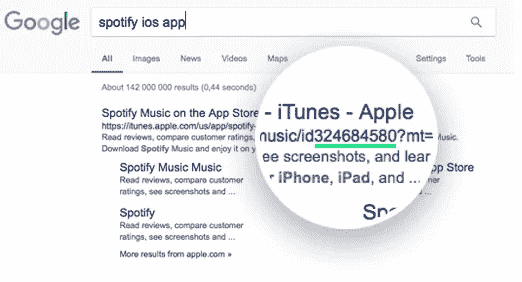

现在，安装并加载所需的库。您可以通过编写 Install (- library)在源代码中完成此操作，或者从 CRAN 存储库中单击 Packages > Install。itunesr 可以直接从 CRAN 安装，但是我确实推荐从 [Github](https://github.com/amrrs/itunesr) 安装最新的开发版本。

```
# Install and load libraries
devtools::install_github("amrrs/itunesr")
remotes::install_github("ropensci/googleLanguageR")library(itunesr)
library(googleLanguageR)
library(openxlsx)
library(ggplot2)
library(writexl)
library(tidyr)
library(dplyr)
library(sentimentr)
library(scales)
library(tidyverse)
library(tidytext)
library(DataExplorer)# Spotify iOS App ID
appstoreID = 324684580# Get information about the Spotify App
getAttributes(appstoreID,'se')# Create this df for later purpose
df_App_allMarkets = NULL
```

函数`getAttributes`在我们的 RStudio 控制台中显示应用程序、开发者、包、URL 和类别的标题。

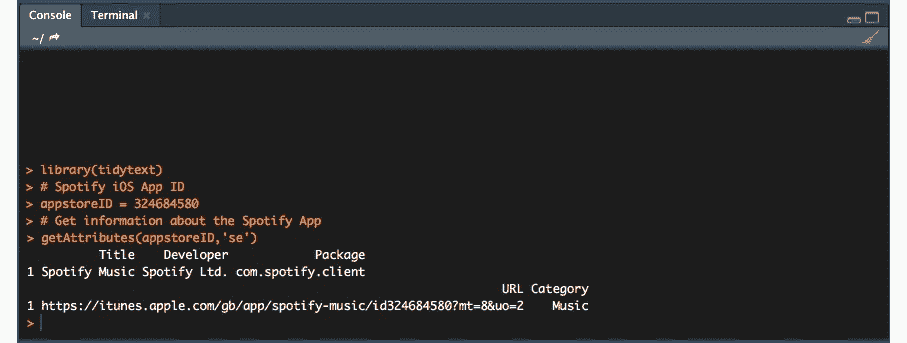

# 2.收集市场评论和评级

好吧，让我们踢它！接下来，我们将创建一个空数据框，用于保存 Apple 允许我们导入的最后 500 条评论。 *(Spotify 在* [*65 个市场*](https://newsroom.spotify.com/companyinfo/) *都有存在，但对于这个例子，我只用了其中的 12 个)*。然后我们为 iTunes 中的第二个和最后一个评论页面设置变量，然后创建一个 for 循环，该循环将遍历每个市场的所有评论，并将它们绑定到一个主数据框架中。

```
## 1\. Prepare to loop through last 500 reviews per market# Spotify App Store Country Codes 
appMarketsSpotify <- c("se", "us", "dk", "de", "hu", "it", "nl", "no", "br", "ca", "ch")# Each page has 51 reviews between each pagination
no_ratings <- 500 #500
no_reviews_per_page <- 51
ratings <- no_ratings/no_reviews_per_page# Round up pagination & set variables for second and last page
ratings <- ceiling(ratings) #round up to 10
reviewStartPage <- 2
reviewEndPage <- ratings
```

在合并之前，下一段代码将遍历给定市场的每个评论页面。然后，我们将变量`df_App$Date`从默认的 POSIXt 转换为 Date，在最后创建本地市场数据框之前，按索引对列进行排序和重新排序。最后，我们使用`rbind(df_App_allMarkets, df_App_Market).`将所有数据框绑定在一起，因为您可能会收到重复的评论，所以有必要使用命令`unique(data frame)`删除它们，这取决于评论和市场的数量，脚本可能需要几分钟时间。☕

```
## 2\. Loop through all App markets and bind them together
for (appMarket in appMarketsSpotify) {

# Creates a df with first review page (1)                        
df_App <- getReviews(appstoreID,appMarket,1)# Create a for loop and merge all tables in to one single df
for (page in reviewStartPage:reviewEndPage){
  df_App <- rbind(df_App, getReviews(appstoreID,appMarket, page))
}# Convert 'Date' from POSIXt to Date and sort df by date (ascending)
df_App$Date <- as.Date(df_App$Date)
df_App <- df_App[order(df_App$Date),]# Reorder columns in our df by column index and add market suffix 
df_App <- df_App[c(7, 4, 5, 1, 6, 2, 3)]
df_App$Market=appMarket# Create df for each local market
df_App_Market <- print(appMarket)
df_App_Market <- df_App# Bind all markets together into one single df
df_App_allMarkets <- rbind(df_App_allMarkets, df_App_Market)# Remove dublicated reviews
df_App_allMarkets <- unique(df_App_allMarkets)### End loop
}
```

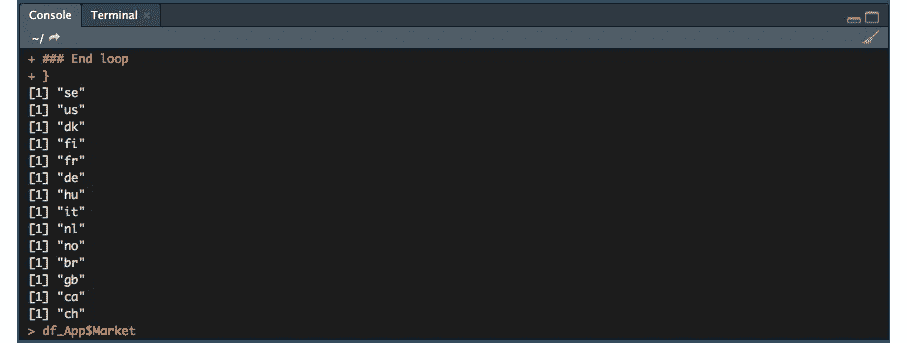

Loop through each market and bind all data frames to one

在可视化我们的数据框之前，让我们检查输入数据集的维度，以了解我们正在处理的内容。我使用库 DataExplorer 通过编写对我们的数据框架进行快速 EDA。`plot_str(df_App_allMarkets)`

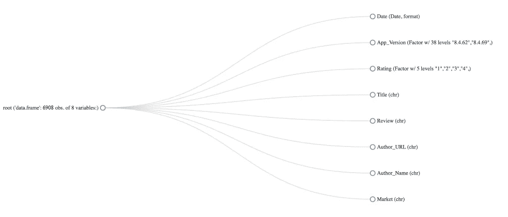

Explore your variables with DataExplorer

现在，让我们简单地通过编写`View(df_App$Market)`并按回车键来预览和探索我们的聚合数据框架`df_App$Market`。在 RStudio GUI 中的全局环境下，我们可以研究我们的数据框，看到有 6908 个收集的观察值，分为 8 列。


Master data frame including all ratings and reviews in RStudio

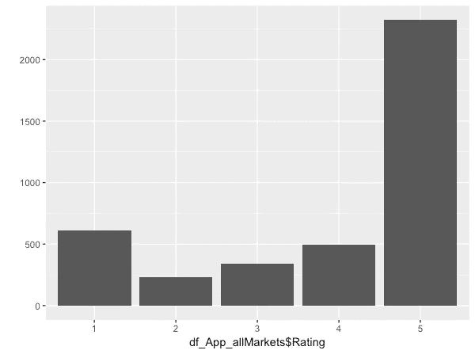

Simple qplot showing the distribution of ratings

要了解每个市场的评论数量，请使用`table(df_App_allMarkets$Market)`或`table(df_App_allMarkets$Rating)`查看评分分布。用`qplot(df_App_allMarkets$Rating)`进行图形可视化绘图审查。

## 2.1 将数据框导出到 Excel

我们可能需要稍后返回并处理我们的数据框，因此，与其偶尔重新运行上面的脚本，不如将所有检查导出到 SQL 数据库、Excel 或 CSV 文件中，这样会更有效。在此之前，我们需要做一些小的调整，例如，将国家后缀改为国家名称。

```
# Sort df by rating 1-5
df_App_allMarkets$Rating <- factor(df_App_allMarkets$Rating, 
levels = c("1", "2", "3", "4", "5"))# Convert data types & rename country codes before visualization 
df_App_allMarkets$Rating <- as.numeric(df_App_allMarkets$Rating)
df_App_allMarkets$Date <- as.Date(df_App_allMarkets$Date)df_App_allMarkets$Market <- revalue(df_App_allMarkets$Market, 
  c("se" = "Sweden", 
    "us" = "USA", 
    "de" = "Germany",
    "hu" = "Hungary",
    "it" = "Italy",
    "nl" = "Netherlands",
    "no" = "Norway",
    "br" = "Brazil",
    "ch" = "Switzerland",
    "gb" = "Great Britain",
    "ca" = "Canada",
    "dk" = "Denmark"))
```

现在，让我们使用 R 包`openxlsx`将 df 导出为 Excel 文件。文件 *AppStoreReviews.xlsx* 将存储在您的本地工作目录中。如果你不确定你的归途，写下`getwd()`并按回车键。

```
#Save as Excel to back up collected reviews
write_xlsx(df_App_allMarkets, path = ("AppStoreReviews.xlsx"), col_names = TRUE)
```


Save a local XLSX file as a backup for the future

现在，我们甚至可以在 R 中创建预定任务，并在我们的主电子表格中添加新的评论，无论是在本地还是在 Google Drive 上。

**恭喜**，您刚刚为自己节省了数百美元，因为您没有购买一个或多或少做同样事情的工具。

## 2.2 可视化评级和评论

现在是可视化的时候了，我们将使用 ggplot2 进一步探索，并希望从我们收集的评论中获得一些有价值的见解。**注意**我们只处理每个市场最新的 500 条评论，所有评分都与一条评论配对。Spotify 音乐在 App Store 的评分是 4.7 星。这比平均评分为 3.9 的点评高出 20 %，`mean(df_App_allMarkets$Rating)`如前所述，撰写点评的用户通常比那些只给出评分的用户更不满意。

## 2.3 缺乏足够的数据

由于每个市场内提交 Spotify 应用评论的时间段不同，你不能根据最近 500 条评论得出任何重要结论。如果我们继续我们的主数据框架，我们会注意到，用户评论和评级更频繁的市场将比那些评论较少的市场分布相对不均匀。因此，在汇总所有市场的数据时，我们需要小心我们的假设。让我们通过`qplot(df_App_allMarkets$Date).`来形象化这个模式

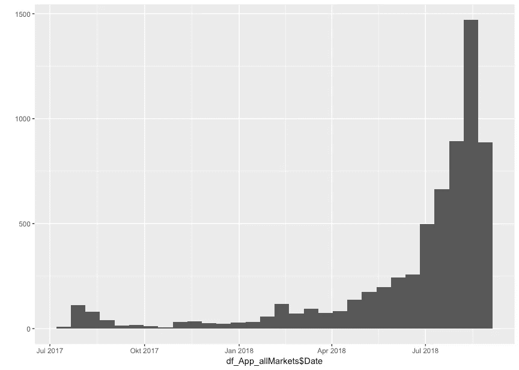

Reviews by date

很明显，大多数审查是在过去 60 天内进行的。实际上只有在美国，在过去的 7 天里有+500 条评论。(但这不是一个普通的应用程序，🇸🇪).加油

如果你在每个市场总共只有大约 200 条评论，那么你是安全的，但是在我们的情况下，我们在过去的 365 天里有 166，952 条评论和 2，858，871 个评级，因此我们被敦促收集更多的数据。因为这篇文章的目的是展示什么是可能的原则，而不是确切的数字，所以我把钱花在了昂贵的许可证以外的东西上。

# 3.审查数据分析

## 3.1 应用评级分布

**问题:**我们需要比较每个市场的收视率分布，以了解差异。关于评级的一个常见假设是，要么你是一个快乐的用户，要么是一个愤怒的批评者，这将反映出图表中你看到大量的 1 星和 5 星评级。

**解法:**让我们用`geom_bar.`来绘制分布图

```
### App rating distribution per marketggplot(df_App_allMarkets, aes(x=as.factor(Rating), fill=as.factor(Rating))) +
geom_bar(col="white")+
    theme_bw() +
    labs(title="App rating distrubution per market", 
    x="Ratings 1-5", y="No of Ratings")+theme(plot.title = element_text(family = "Circular Std",     color="black", face="bold", size=22, hjust=0))+scale_fill_manual("Ratings", values = c("1" = "#DA393B", "2" = "#EE6D45", "3" = "#F7E458", "4" = "#68E194", "5" = "#5F9CEF"))+
facet_wrap(~Market, scales = 'free_x')
```

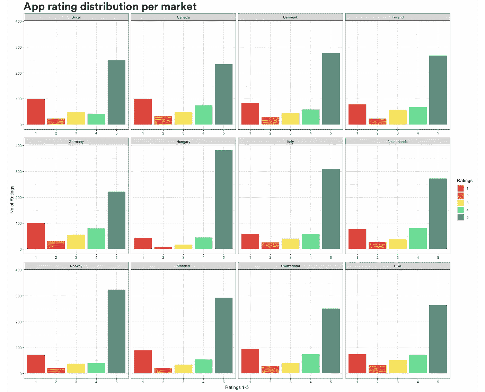

App rating (1–5) distribution per market

**见解:** 1 星或 5 星评级似乎是最受欢迎的评级。最满意的用户来自匈牙利、瑞典、挪威和意大利。然而，大多数不满意的用户是在巴西、加拿大、德国和瑞士。我会分析为什么这么多匈牙利用户乐于给出 5 星评级，并对德国所有 1 星评级进行关键字分析。此外，用每周的平均评分绘制一个线形图，以了解历史发展情况。

## 3.2 用户感受(负面/正面)

**问题:**在同一个地块上用 1-5 颗星来比较 12 个不同的市场可能很难读懂。因此，让我们去掉所有中性的 3 星评级，将其分解为负面(1-2 星)和正面(4-5 星)评级。

**解决方案:**首先基于`df_App_allMarkets.`创建一个新的数据框，接下来我们将变量 Rating 从数值转换为字符，然后用正负字符替换 ratings。最后，将结果绘制为每个市场的总份额。

```
### User feeling for each market# Create a new df based on df_App_allMarkets
df_Ratings_Simplified <- data.frame("Date" = df_App_allMarkets$Date, "Rating" = df_App_allMarkets$Rating, "AppVersion" = df_App_allMarkets$App_Version, "Market" = df_App_allMarkets$Market)# Convert ratings to vector and replace ratings with text
df_Ratings_Simplified$Rating <- as.character(df_Ratings_Simplified$Rating)# Remove all ratings with 3-stars from df
df_Ratings_Simplified <- df_Ratings_Simplified[!df_Ratings_Simplified$Rating == "3", ]# Replace 1-2 star ratings with text Negative, and 4-5 stars with text Positivedf_Ratings_Simplified$Rating[df_Ratings_Simplified$Rating == '1'] 
<- 'Negative'+df_Ratings_Simplified$Rating[df_Ratings_Simplified$Rating == '2'] 
<- 'Negative'+df_Ratings_Simplified$Rating[df_Ratings_Simplified$Rating == '4'] 
<- 'Positive'+df_Ratings_Simplified$Rating[df_Ratings_Simplified$Rating == '5'] 
<- 'Positive'# Plot user feelings for each market
ggplot(df_Ratings_Simplified, aes(Rating, group = Market)) + 
geom_bar(aes(y = ..prop.., fill = factor(..x..)), stat="count") + 
geom_text(aes( label = scales::percent(..prop..), y= ..prop.. ), size = 4, stat= "count", vjust = -0.4) +theme_bw() +
theme(legend.position="none")+
scale_fill_manual("Ratings", values = c("1" = "#ED5540", "2" = "#68E194"))+
labs(y = "Rating", fill="Rating") +
scale_y_continuous(labels=scales::percent, limits = c(0, 1)) +ylab("relative frequencies") +
xlab("Procent") +  labs(title="User feeling per market", x="Reviews", y="Amount")+
labs(caption = "(Negative = 1-2 stars, Positive = 4-5 stars)")+facet_wrap(~Market, scales = 'free_x')
```

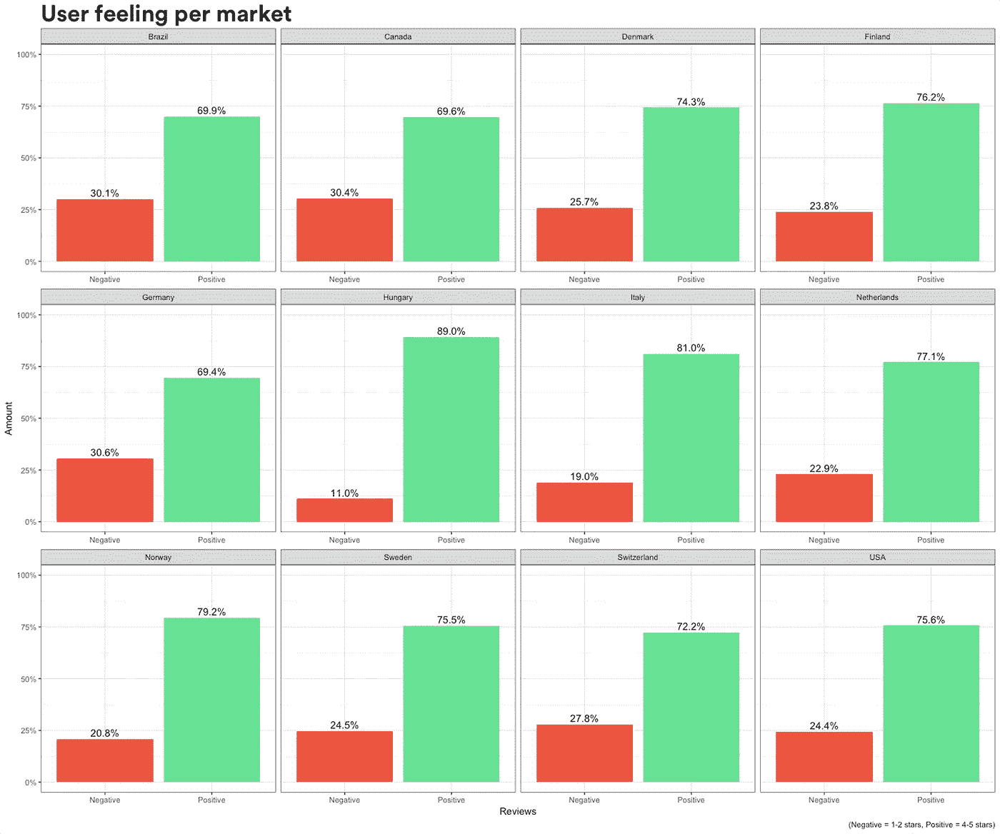

Distribution between negative and positive ratings

**见解:**理解满意和失望用户的动机和区别同样重要。除了美国、加拿大、巴西和德国的用户更不满意之外，每个市场的结果似乎是一样的。通过分析这些评论，你可能会发现相似之处。

## 3.3 每个工作日的用户感受

**问题:**正面或负面的评级可以很容易地分割，以报告每月、每周或每周的数据。如果我们需要了解评论何时发布，以及用户在一周中的感受有何不同，我们可以通过可视化每个工作日的感受来做到这一点。

**解决方案:**首先，我们将可变日期(2018–08–23)转换为工作日，例如周六。然后我们用一个堆叠的条形图来绘制结果，显示正面和负面评论的数量，包括总数。如果你需要比较市场的不同，只需取消下面最后一行的注释。

```
### Plot feelings by weekday 
df_Ratings_Feeling_Week <- df_Ratings_Simplified
df_Ratings_Feeling_Week$Date <- format(as.Date(df_Ratings_Feeling_Week$Date), '%A')ggplot(df_Ratings_Feeling_Week, aes(x = as.factor(Date), fill = Rating, label = Rating)) +
  geom_bar(stat = "count")+
  theme_bw() +
  scale_fill_manual("Ratings", values = c("Positive" = "#68E194", "Negative" = "#ED5540"))+
   theme(plot.title = element_text(family = "Circular Std", color="black", face="bold", size=26, hjust=0)) +ylab("relative frequencies")+
  xlab("Procent")+ 
  labs(title="User feeling per weekday", x="Weekday", y="Ratings")+
  labs(caption = "(Negative = 1-2 stars, Positive = 4-5 stars)")+
     scale_x_discrete(limits=c("Måndag","Tisdag","Onsdag","Torsdag","Fredag","Lördag","Söndag"))#facet_wrap(~Market, scales = 'free_x')
```


见解:工作日的分布是均匀的。评论的数量在周三和周日给出，负面和正面评论的份额在周一有一个小的例外。

## 3.4 每个应用版本的平均评分

**问题:**为了了解用户对每个版本及其功能的接受程度，我们可以按市场绘制每个应用版本的平均评分。

**解决方案:**首先，我们汇总每个应用版本的所有评分，并计算平均评分。然后，我们重命名列，并按升序排列等级。最后，删除评分为零的行，在我们的例子中是第 10、11、12、16、22 和 38 行。然后画出结果。

```
### Average ratings per App version
# Creates a df with mean values for each app version
df_MeanRatingsVersion <- aggregate(df_App_allMarkets$Rating ~ df_App_allMarkets$App_Version, df_App_allMarkets, mean)# Rename df columns
names(df_MeanRatingsVersion)[1]<- "Version"
names(df_MeanRatingsVersion)[2]<- "Rating"# Sort by ratings ascending
df_MeanRatingsVersion$Version <- factor(df_MeanRatingsVersion$Version, levels = df_MeanRatingsVersion$Version[order(-df_MeanRatingsVersion$Rating)])# Strip specific rows and round mean values
df_MeanRatingsVersion <- 
df_MeanRatingsVersion[-c(10, 11, 12, 16,22,38), ]df_MeanRatingsVersion$Rating <- 
round(df_MeanRatingsVersion$Rating, digits = 2)# Plot average ratings for each app version
ggplot(df_MeanRatingsVersion, aes(x = Version, y = Rating, label=Rating)) +
  geom_bar(fill = "#29E58E", stat = "identity")+
  geom_text(position = 'identity', stat = 'identity', size = 4, vjust = -0.4)+

theme_bw() +
  labs(title="Average ratings for each App Version", size=60) +
  labs(x="App Version", y="Avg. Rating")
```

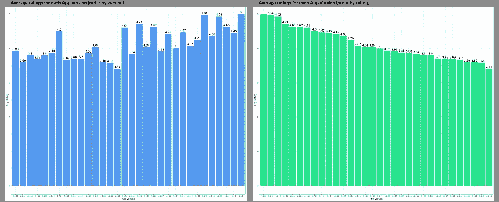

Plot showing App average rating sorted both by version and rating

**见解:**基于上述数据的故事，希望由 Spotify 内部的人讲述会比外部的人更好。无论如何，很难把握这个评级是与评论时的特定应用版本有关，还是更具一般性。但是，从长期角度来看平均评级，我们可以看到平均评级会随着时间的推移而提高。

## 3.5 每月每天的平均评分

**问题:**根据你的应用类别和对周期性行为的敏感度，了解平均评分在每个月是否有变化可能会很有趣。例如，研究高使用率和高/低收视率之间是否有关联是很有价值的？

**解决方案:**绘制该月每天的平均评分。开始计算平均评分和重命名列。然后，我们使用`POSIXlt`将日期转换为一个月中的某一天，并将日期和评级拆分到不同的列中。将评级四舍五入到 1 位数，然后绘制数据。

```
### Calculate average ratings for each day and change column names
df_MeanRatingsDays <- aggregate(df_App_allMarkets$Rating ~ df_App_allMarkets$Date, df_App_allMarkets, mean)
names(df_MeanRatingsDays)[1]<- "Date"
names(df_MeanRatingsDays)[2]<- "Rating"# Convert dates to day of  month
df_MeanRatingsDays$Date <- unclass(as.POSIXlt(df_MeanRatingsDays$Date))$mday# Split Day of month and avg. rating to separate columns 
df_MeanRatingsDays <- aggregate(df_MeanRatingsDays$Rating ~ df_MeanRatingsDays$Date, df_MeanRatingsDays, mean)
names(df_MeanRatingsDays)[1]<- "Day"
names(df_MeanRatingsDays)[2]<- "Rating"# Round Ratings to 1 digit
df_MeanRatingsDays$Rating <- 
round(df_MeanRatingsDays$Rating, digits = 1)# Plot mean ratings for each day of month
ggplot(df_MeanRatingsDays, aes(x = Day, y = Rating, label = Rating))+
  geom_bar(fill = "#29E58E", stat = "identity")+
  theme_bw() +
  geom_text(position = 'identity', stat = 'identity', size = 4, vjust = -0.4)+labs(title="Average ratings by day of month", size=60) +
  theme(plot.title = element_text(family = "Circular Std", color="black", face="bold", size=26, hjust=0)) +
  labs(x="Day of Month", y="Avg. Rating")+scale_x_discrete(limits=df_MeanRatingsDays$Day)+
  scale_y_continuous(limits = c(0,5))
```

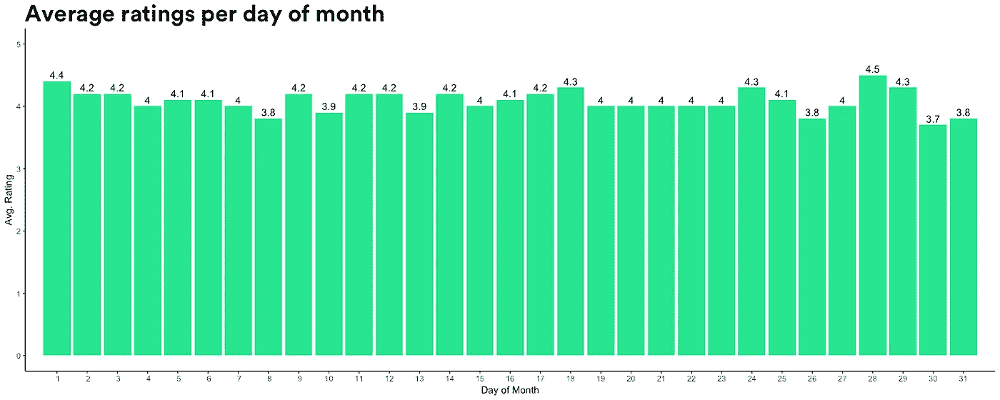

Plot showing how the monthly rating changes during the month

**见解:**除了相当均匀的分布(这只是一个月中某一天不会影响平均评级的标志)之外，没有令人惊叹的见解可以建立其他东西。如果你在金融或医疗行业，这种模式可能会有所不同。我还建议按时间、工作日和月份来研究评级。

## 3.6 平均评论字符长度

我们的下一个图可能更好地定义为 EDA(探索性数据分析),而不是解决问题，但我想通过查看密度和平均评论长度来了解每个市场的评论长度之间是否有任何差异。因为我们已经知道每个市场的评级分布，所以看看它是否与评论长度相关会很有趣。

所以让我们先统计一下每篇评论的时长，然后按市场统计平均时长。接下来，我们重命名我们的列，并将它们与我们的主数据框架合并在一起，然后对数字进行舍入，然后绘制评论密度，包括市场的平均长度。(现在你可以呼吸了)

```
### Count length of reviews and create a sorted df_App_allMarkets$Review <- as.character(df_App_allMarkets$Review)
df_App_allMarkets$ReviewLength <- nchar(df_App_allMarkets$Review)# Count the average review lenght for each market
df_MeanLengthMarket <- aggregate(df_App_allMarkets$ReviewLength ~ df_App_allMarkets$Market, df_App_allMarkets, mean)names(df_MeanLengthMarket)[1]<- "Market"
names(df_MeanLengthMarket)[2]<- "AvgReviewLength"df2_App_allMarkets <- 
merge(df_App_allMarkets,df_MeanLengthMarket, by  = "Market")# Round numbers before visualizing
df2_App_allMarkets$AvgReviewLength <- round(df2_App_allMarkets$AvgReviewLength, digits = 2)ggplot(data=df2_App_allMarkets, aes(x=ReviewLength)) + 
  geom_density(aes(y = ..count..), color="#1F3161", fill = "#68E193", alpha=0.6) +
  geom_vline(aes(xintercept = df2_App_allMarkets$AvgReviewLength), linetype = "dashed", size = 0.5)+

facet_wrap(~Market, scales = 'free')+
  geom_text(data=df2_App_allMarkets, mapping=aes(x=AvgReviewLength, y=2, label=AvgReviewLength), check_overlap = TRUE, size=5, angle=0, vjust=1, hjust=-0.5)+
    ylim(0,5)+
    xlim(5,600)+theme_minimal()+
    labs(title="Review Character Length", subtitle = "The average length per review for each market", x="Review Length", y="")+
     theme(plot.title = element_text(family = "Circular Std", color="black", face="bold", size=22, hjust=0)) +
     theme(axis.title = element_text(family = "Circular Std", color="black", face="bold", size=12)) +
     theme(plot.subtitle = element_text(family = "Helvetica", color="black", face="plain", size=14))+
     theme(strip.text = element_text(face="bold", size=12))  +
     theme(panel.border = element_blank(), panel.grid.major = element_blank(),
     panel.grid.minor = element_blank(), axis.line = element_line(colour = "black"))
```

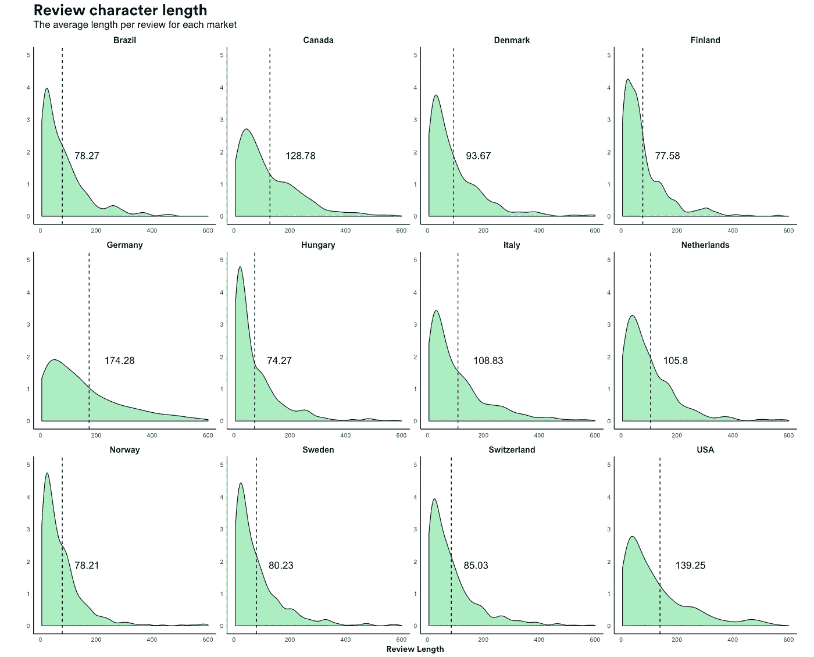

Plot split by market showing the average review length

而且没错，似乎是高收视率和人物少的搭配。我们之前知道的是，美国、加拿大、巴西和德国是最不满意的，并期望巴西是平均字符长度最高的市场。此外，我们匈牙利快乐的营员似乎除了“tkéletes”和“hibátlan”之外没有更多的话要说。

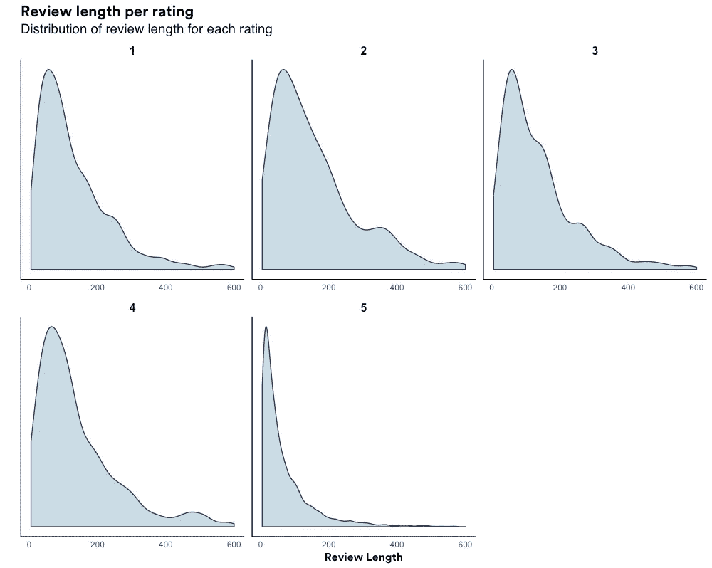

Distribution of review length for each rating

为了扩大假设，即消极用户有更多的事情要说，反之亦然，让我们删除`geom_vline`，从`facet_wrap`切换到`Rating`。

很明显，快乐的用户没什么可说的，尽管一星评分者写的单词更少，如“垃圾”、“劣质应用”等。给出 2-3-4 星的用户实际上是值得一读的，因为他们经常激励他们的评级。当分析一个不太受欢迎的应用程序时，请注意高评分的长评论。这些评论可能是假的。

# 4.文本情感分析

## 4.1 使用 googleLanguageR 翻译评论

在我们的书面评论中可以找到更多的黄金，而不仅仅是每个评级的平均长度。为了进行文本挖掘和基本情感分析，我们必须将所有 12 个市场的书面评论翻译成英语。这可以通过作者马克·埃德蒙森的 [googleLanguageR](https://code.markedmondson.me/googleLanguageR/) [包的谷歌云机器学习 API 来完成。在进一步操作之前，请遵循](http://markedmondson.me/)[认证指南](https://code.markedmondson.me/googleLanguageR/)。

谷歌是伟大的，但没有什么是免费的，所以在翻译+100.000 评论之前，请确保你知道成本。在我的情况下，我得到了一些免费的学分，但如果你没有，我会建议你从你的数据中随机选取一个样本，如下所示。

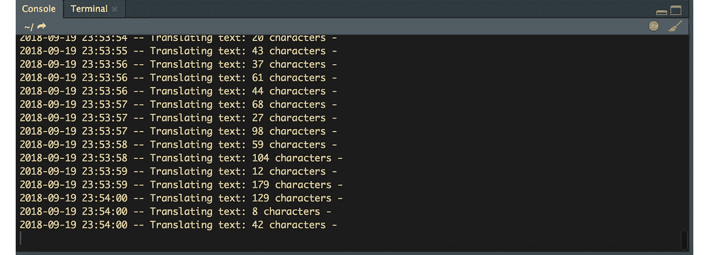

Translating reviews with Google Cloud Machine Learning API

首先加载并运行您的*。json 身份验证文件，然后选择一个样本大小，并创建一个新的向量，在翻译之前将对其进行翻译。(注意，这可能需要几分钟时间)。

```
### Prepare for translation of market reviews with Google Translate# Include Gooogle Cloud Service Identity
  gl_auth("API Translate-xxxxxxxxxxxx.json")# Sample 5000 random rows
  df2_App_allMarkets_sample <- sample_n(df2_App_allMarkets, 5000)
  View(df2_App_allMarkets_sample)# Convert Reviews to character vector
  text <- as.character(df2_App_allMarkets_sample$Review)# Create a new df from translated reviews (automatic lang.detection)
  df_Translation <- gl_translate(text, target = "en")# Add english translated reviews to original df
df2_App_allMarkets_sample$Review_translated <- df_Translation$translatedText
```

要预览和检查结果，请编写:`head(df2_App_allMarkets_sample$Review_translated, 10)`

## 4.2 使用 sentimentr 执行情感分析

sentimentr 旨在快速计算句子级别的文本极性情感，并选择性地按行聚合。让我们继续进行情感分析，对每篇翻译后的评论进行正面或负面评分。最后，我们将这些情绪得分与我们的主数据框架绑定在一起，用于未来的绘图。

```
## 4\. Perform sentiment analysis on each review

# Create a copy of df2_App_allMarkets_sample
  df_ReviewSentiment <- df2_App_allMarkets_sample

# Check  names of the columns and drop those not needed
  names(df_ReviewSentiment)
  df_ReviewSentiment <- subset(df_ReviewSentiment, select = -
  c(Author_URL, Author_Name, ReviewLength, Title))

# Add translated reviews in our data frame
df_ReviewSentiment$ReviewTranslated <-
  as.character(df2_App_allMarkets_sample$Review_translated)

# Perform sentiment analysis and round values
df_ReviewSentiment$reviews_sentiment <- reviews_sentiment %>%    
  sentiment_by(by=NULL)df_ReviewSentiment$reviews_sentiment <- 
  round(df_ReviewSentiment$reviews_sentiment, digits = 2)
```

查看情感评分最高:`head(df_ReviewSentiment$reviews_sentiment, 3)`和最低:`tail(df_ReviewSentiment$reviews_sentiment, 3).`的评论


Top 3 positive reviews and bottom 3 most negative

## 4.3 用星级评定验证情感得分

从上图来看，一切似乎都功能齐全，但进行情感分析远比这复杂。所以问题是——我们能在多大程度上根据客户的书面意见预测他们的评级？

让我们检查一下我们的评分是否与书面评论的平均情感分数相关。

```
# Correlate sentiment score with ratingsggplot(df_ReviewSentiment, aes(Rating, reviews_sentiment$ave_sentiment, group = Rating)) +
    geom_boxplot(fill="#29E58E") +
    theme_minimal()+
    labs(title="App reviews sentiment score per market", y="Average sentiment score")+
    geom_jitter(shape=16, size=0.7, position=position_jitter(0.3))
```

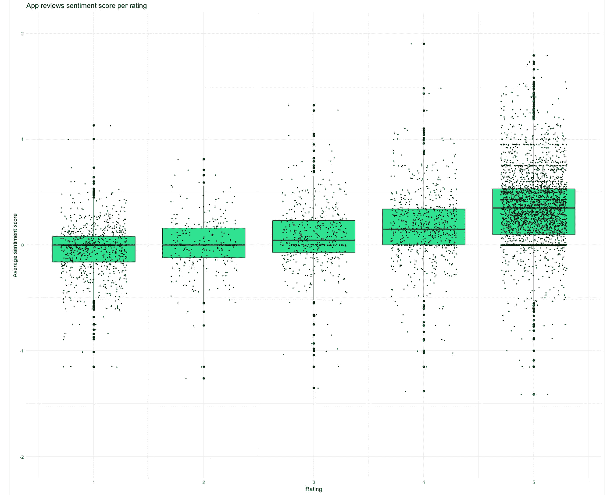

Boxplot showing the review distribution for each rating

箱线图是一种通过四分位数以图形方式描绘数字数据组的方法。它帮助我们将平均分和每个评论可视化为一个单独的点。它可能不适合挂在你的墙上，但结果是令人满意的。虽然我们有太多得分低于零的五星异常值，但平均得分与星级相关。还有，接近平均水平的评论分布清晰，这很好。

## 4.3 审查每个市场的情绪得分

为了全面了解应用的感知如何随着时间的推移而变化，我们可以将每个市场从第一次收集评论到最后一次收集评论的应用评论数据中的平均情绪得分可视化。如果这是你的 polestar 指标，我会建议监控平均情绪得分，并使用 Twitter 的 AnomalyDetection 包在得分下降到定义的具体阈值时发出警报。

*(注意:小心你的建议，因为每个市场的周期不同。提高声音前先检查 x 音阶)。*

```
# App reviews sentiment score
  ggplot(test, aes(x = Date, y = reviews_sentiment$ave_sentiment, fill=Market)) + 
    geom_smooth(colour="black", size=1) +
    theme_bw() +
    theme_minimal()+
    labs(title="App reviews sentiment score per market", 
          subtitle = "Time period differs due to the amount of reviews in the near future", 
          x="Date", 
          y="Reviews Sentiment Scores")+
    facet_wrap(~Market, scales = "free_x")
```

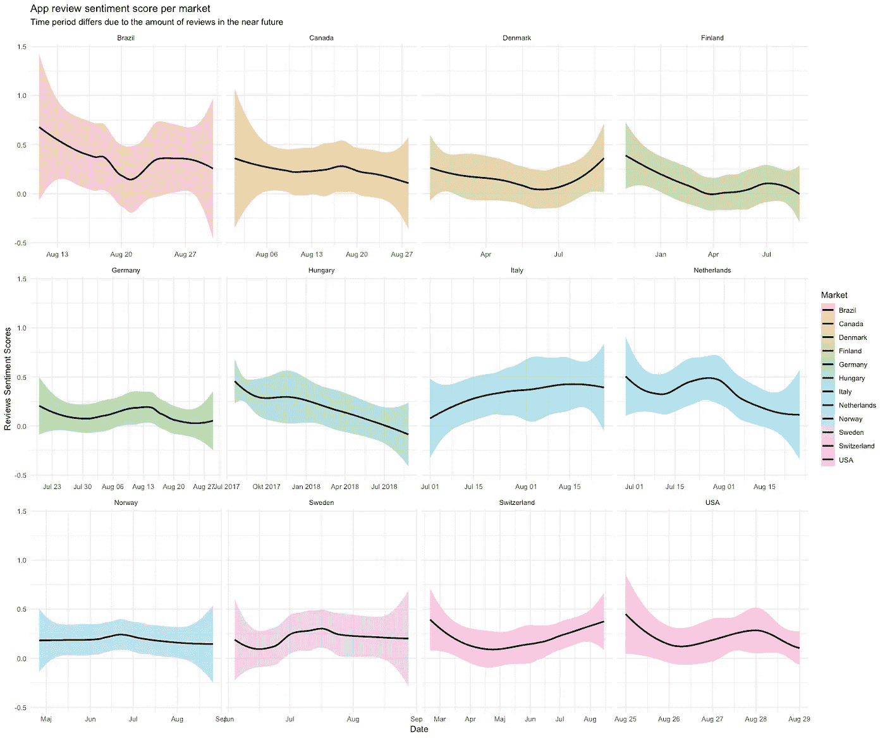

Visualization of the sentiment score by date and market

## 4.4 文本挖掘——如何将评论分解成有价值的见解

为了充分理解每个评论的核心，以及每个单词如何影响应用程序的整体感知，我们需要将评论句子分解成单词。这可以通过标记化来实现。在标记化的过程中，一些像标点符号和停用词的字符被丢弃，以将噪声变成信号。

我们想要实现的目标:

*   把句子分成单个的单词
*   删除停用词
*   画出 100 个最常见的单词
*   给单词添加情感分数
*   画出最消极和积极的单词
*   创建一个显示两极分化的词云

```
# Create a new data frame with only words
  TranslatedText <- as.vector(df_Translation$translatedText)
  TranslatedText <- data_frame(line = 1:5000, text = TranslatedText)# Split reviews to individual words - "Tokenization"
  tidy_df <- TranslatedText %>%
    unnest_tokens(word, text)

# Remove stop words
  data(stop_words)

  tidy_df <- tidy_df %>%
    anti_join(stop_words)

  tidy_df %>%
    count(word, sort = TRUE)
```

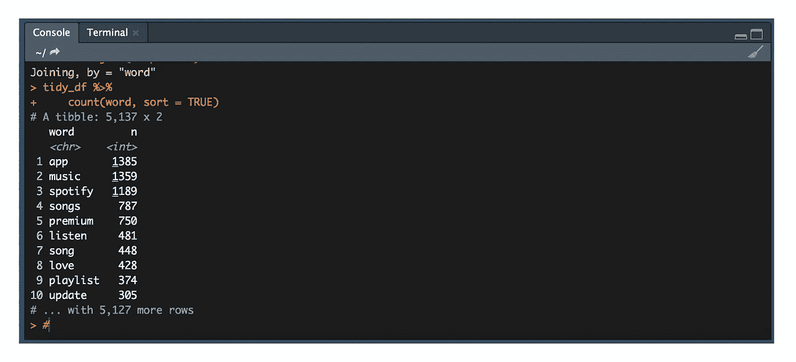

```
# Visualize words that occur +100 times
tidy_df %>%
count(word, sort = TRUE) %>%
  filter(n > 100) %>%
  mutate(word = reorder(word, n)) %>%

 ggplot(aes(word, n)) +
  theme_minimal()+
  labs(title="Words that occur more than 100 times", subtitle = "Occurring individual words in our sampled reviews", x="", y="Contribution to sentiment")+
  geom_col() +
  xlab(NULL) +
  coord_flip()
```

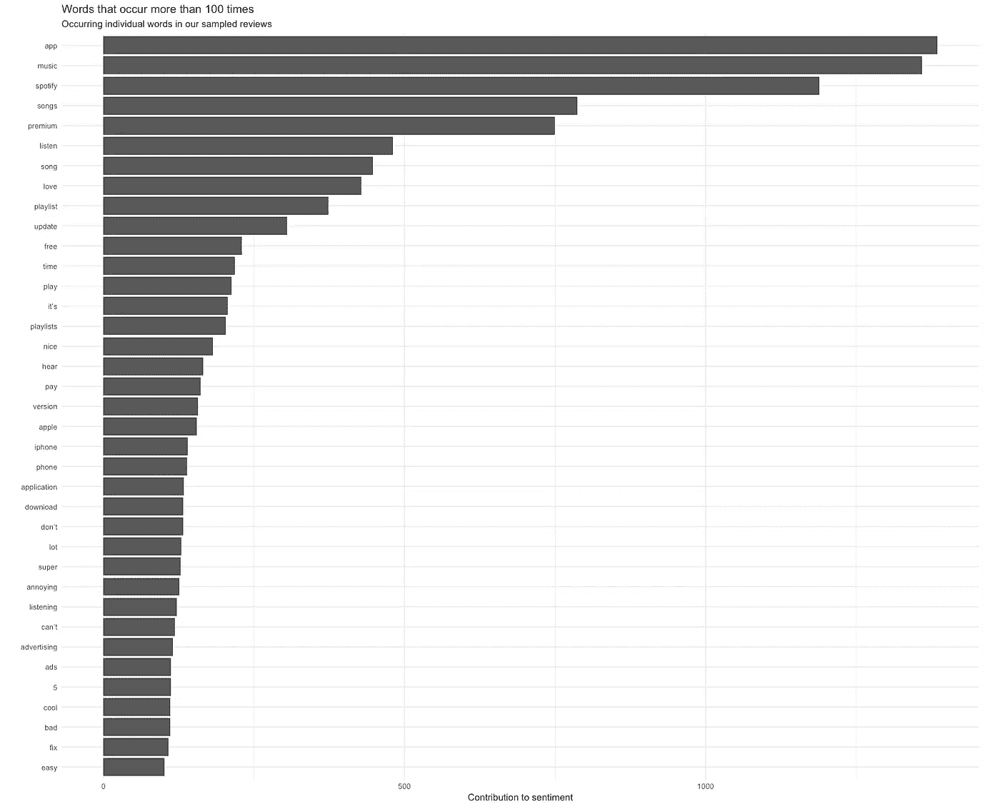

How often each word occur in the review

毫不奇怪，像“应用程序”、“音乐”、“Spotify”和“歌曲”这样的词出现得更频繁。但更有意思的是，“溢价”似乎和“付出”、“讨厌”一样，都是热门话题。我会过滤掉所有出现这些词的评论，然后进行进一步的分析。

现在，让我们在 bing 词典的帮助下，将这些单词分成两个独立的组，积极的和消极的。

```
# Add sentiment scores to each word
  get_sentiments("bing") 

  bing_word_counts <- tidy_df %>%
    inner_join(get_sentiments("bing")) %>%
    count(word, sentiment, sort = TRUE) %>%
  ungroup()

  bing_word_countsbing_word_counts %>%
    group_by(sentiment) %>%
    top_n(25) %>%
    ungroup() %>%
    mutate(word = reorder(word, n)) %>%# Visualize the distrubution of word sentiment
    ggplot(aes(word, n, fill = sentiment)) +
    geom_col(show.legend = FALSE) +
    theme_minimal()+
    labs(title="Distribution of word sentiment", subtitle = "Words that contribute to positive and negative sentiment", x="", y="Contribution to sentiment")+
    facet_wrap(~sentiment, scales = "free_y") +
  coord_flip()
```

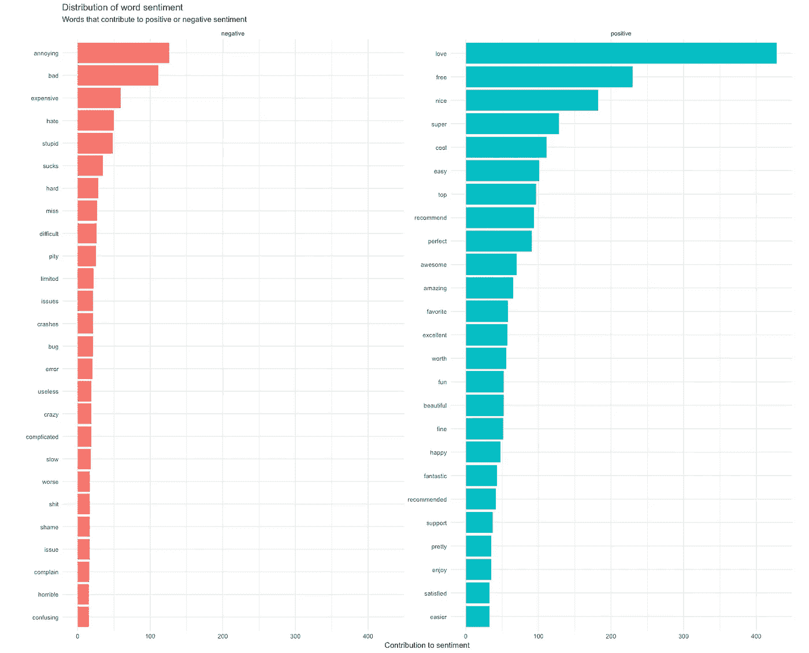

Plot showing the most frequent negative and positive words

我会让你分析这个，但有趣的是，人们对这个应用程序有着根本不同的看法。研究对立面并观察它们如何随着时间的推移而变化将会很有趣。

最后，我们将使用相同的数据，但使用一个词云的可视化，其中一个词的频率由大小反映。

```
library(reshape2)
library(wordcloud)

# Word cloud showing 200 words
 tidy_df %>%
    anti_join(stop_words) %>%
    count(word) %>%
    with(wordcloud(word, n, use.r.layout=FALSE,max.words = 200))# Word cloud showing 200 words by sentiment score
  tidy_df %>%
    inner_join(get_sentiments("bing")) %>%
    count(word, sentiment, sort = TRUE) %>%
    acast(word ~ sentiment, value.var = "n", fill = 0) %>%
    comparison.cloud(colors = c("#D9383A", "#68E193"),
                     use.r.layout=FALSE,
                     max.words = 200)
```


尽管每个单词的大小不同还有改进的空间，但是很容易理解哪些单词是最常用的。这些云可以按市场和/或应用程序版本划分，以跟踪变化和趋势。

是我中途把你弄丢了，还是你读完了整篇文章？无论如何，我真的很喜欢你关于评级和评论挖掘的反馈和想法。

**弗雷德里克·塞德洛夫**、
和*收藏家银行的数字分析主管&用户研究*