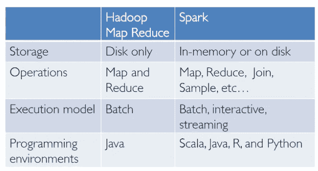
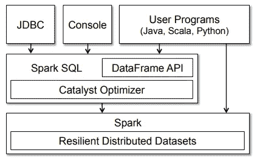
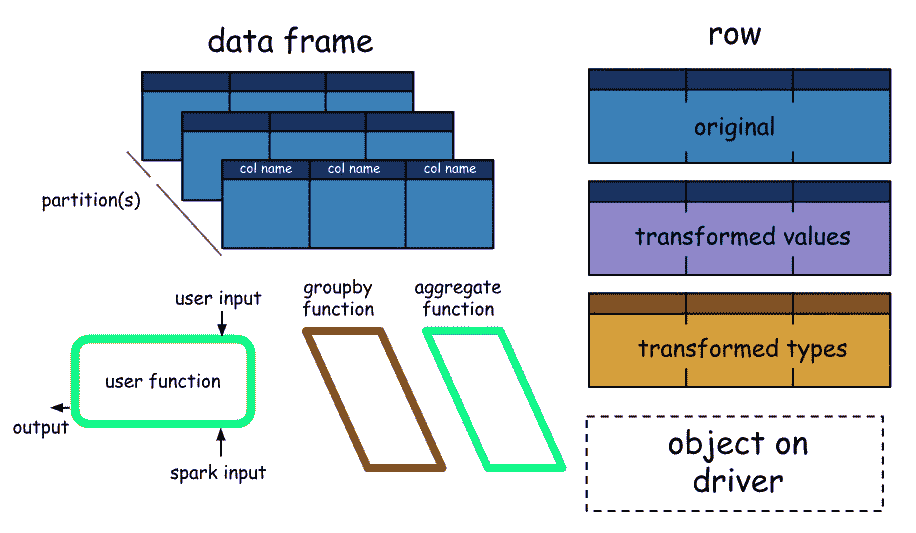
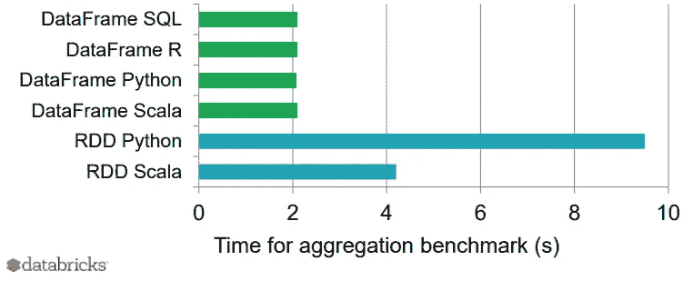
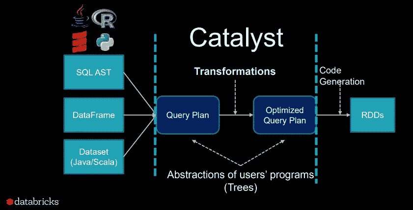
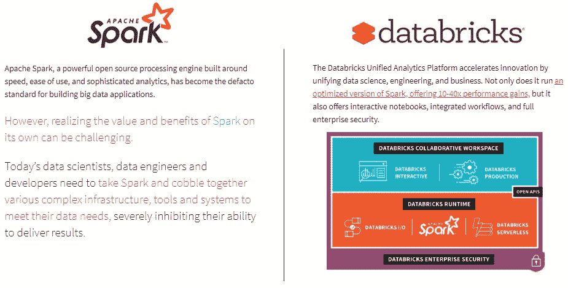
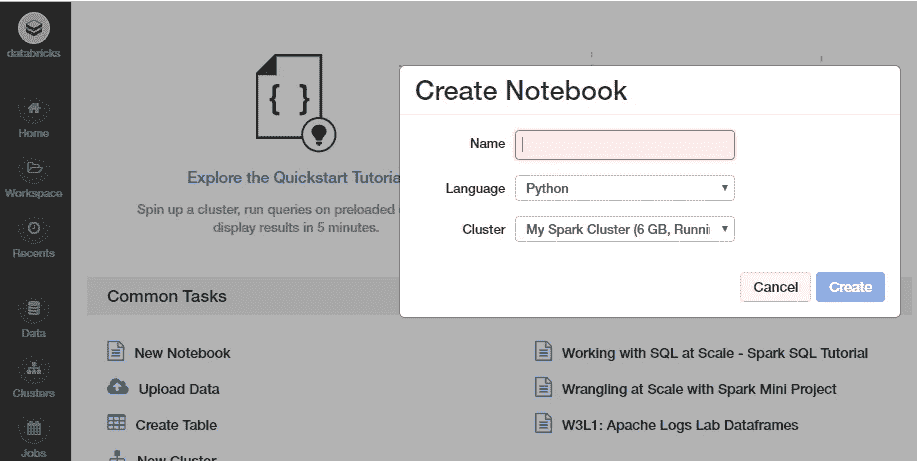
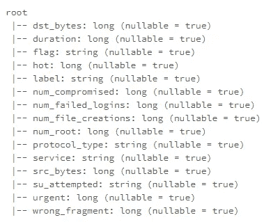
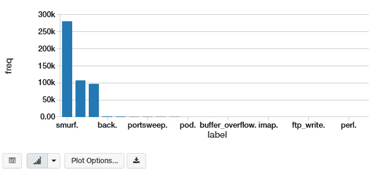

# 使用 Apache Spark SQL 和数据框架扩展 SQL——概念、架构和示例

> 原文：<https://towardsdatascience.com/sql-at-scale-with-apache-spark-sql-and-dataframes-concepts-architecture-and-examples-c567853a702f?source=collection_archive---------0----------------------->

## 使用您友好的 SQL，轻松地大规模辩论、聚合和过滤数据！


Source: Pixabay

# 注意

本文涵盖了与 Spark、SQL 和 DataFrames 相关的详细概念。除此之外，我们还将介绍一个使用 Spark SQL 和 DataFrames 大规模使用 SQL 的实践案例研究。如果第一眼看上去这篇文章有点让人不知所措或者很长，你可以在[opensource.com](https://opensource.com/)的以下链接中找到同样的内容

*   [**用 Apache Spark SQL 和 DataFrames 扩展关系数据库**](https://opensource.com/article/19/3/sql-scale-apache-spark-sql-and-dataframes)
*   [**如何使用 Spark SQL:动手教程**](https://opensource.com/article/19/3/apache-spark-and-dataframes-tutorial)

我希望这有助于您开始使用 Spark 和 SQL 的旅程！

# 介绍

不管宣传以及通常被称为*‘NoSQL’*数据库的新数据库的出现，关系数据库都将存在。原因很简单，这些数据库强制执行基本的结构和约束，并提供了一个很好的声明性语言来查询数据，这是我们喜欢的 SQL！然而，规模一直是关系数据库的一个问题。21 世纪的大多数企业都承载着丰富的数据存储和存储库，并希望最大限度地利用其“大数据”来获得可操作的见解。关系数据库可能很受欢迎，但除非我们投资适当的大数据管理策略，否则它们不会很好地扩展。这包括考虑潜在的数据源、数据量、约束、模式、ETL(提取-转换-加载)、访问和查询模式等等！


Large Scale Data Science in Apache Spark: [https://www.slideshare.net/databricks/largescale-data-science-in-apache-spark-20](https://www.slideshare.net/databricks/largescale-data-science-in-apache-spark-20)

本文将介绍在利用关系数据库的强大功能方面取得的一些优秀进展，但是是“大规模的”，使用 Apache Spark 的一些较新的组件——Spark SQL 和 DataFrames。最值得注意的是，我们将涵盖以下主题。

## 1.扩展关系数据库的动机和挑战

## 2.了解 Spark SQL 和数据框架

*   目标
*   架构和功能
*   表演

## 3.一个关于 Spark SQL 的真实案例研究，包含实际操作示例

因此，我们将着眼于人们努力工作的主要挑战和动机，并投入时间在 Apache Spark 中构建新的组件，以便我们可以大规模执行 SQL。我们还将了解 Spark SQL 和 DataFrames 的主要架构、接口、特性和性能基准。最后，也是最重要的一点，我们将通过利用 Spark 的 [*Databricks 云平台*](http://databricks.com) ，使用 Spark SQL 和 DataFrames，基于[***【KDD 99 杯赛数据***](http://kdd.ics.uci.edu/databases/kddcup99/kddcup99.html) 进行入侵攻击分析的真实案例研究！

# 为大数据扩展关系数据库的动机和挑战

关系数据存储易于构建和查询。此外，用户和开发人员通常更喜欢用类似人类的可读语言(如 SQL)编写易于解释的声明性查询。然而，随着数据的数量和种类开始增加，关系方法无法很好地扩展以构建大数据应用程序和分析系统。以下是一些主要挑战。

*   处理不同类型和来源的数据，可以是结构化的、半结构化的和非结构化的。
*   构建进出各种数据源的 ETL 管道，这可能会导致开发大量特定的定制代码，随着时间的推移，这会增加技术债务。
*   能够执行基于传统商业智能的分析和高级分析(机器学习、统计建模等)。)后者在关系系统中执行肯定是有挑战性的。

大数据分析不是昨天才发明的东西！借助 Hadoop 和 Map-Reduce 范式，我们在这一领域取得了成功。这是强大的，但通常很慢，而且给用户提供了一个低级的、过程化的编程接口，要求人们为非常简单的数据转换编写大量代码。然而，一旦 Spark 发布，它就真正改变了大数据分析的方式，专注于内存计算、容错、高级抽象和易用性。



从那时起，Hive、Pig 和 Shark(演变为 Spark SQL)等几个框架和系统为大数据存储提供了丰富的关系接口和声明式查询机制。挑战依然存在，这些工具要么是基于关系的，要么是基于过程的，我们不可能两全其美。

然而在现实世界中，大多数数据和分析管道可能包含关系代码和过程代码的组合。因此，强迫用户选择任何一个都会使事情复杂化，并增加用户开发、构建和维护不同应用程序和系统的工作量。Apache Spark SQL 建立在前面提到的 SQL-on-Spark 的基础上，称为 Shark。Spark SQL 不是强迫用户在关系型或过程型 API 之间做出选择，而是试图让用户无缝混合这两种 API，并在大数据上执行大规模数据查询、检索和分析。

# 了解 Spark SQL 和数据框架

Spark SQL 本质上试图通过两个主要组件来弥合我们之前提到的两个模型之间的差距——关系模型和过程模型。

*   Spark SQL 提供了一个 DataFrame API，可以在外部数据源和 Spark 内置的分布式集合上执行关系操作——大规模！
*   为了支持大数据中各种不同的数据源和算法，Spark SQL 引入了一种称为 Catalyst 的新型可扩展优化器，可以轻松添加数据源、优化规则和数据类型，以进行机器学习等高级分析。

本质上，Spark SQL 利用 Spark 的强大功能在大数据上执行大规模的分布式、健壮的内存计算。Spark SQL 提供了最先进的 SQL 性能，并且还保持了与所有现有结构和组件的兼容性，这些结构和组件由 **Apache Hive** (一个流行的大数据仓库框架)支持，包括数据格式、用户定义函数(UDF)和 metastore。除此之外，它还有助于从大数据源和企业数据仓库(如 JSON、Hive、Parquet 等)获取各种数据格式，并执行关系和过程操作的组合，以进行更复杂的高级分析。

## 目标

让我们来看看一些关于 Spark SQL 的有趣事实，它的用法、采用和目标，其中一些我将再次无耻地从 Spark 中关于 [*关系数据处理的优秀原创论文中复制。Spark SQL 于 2014 年 5 月首次发布，现在可能是 Spark 中开发最活跃的组件之一。Apache Spark 绝对是最活跃的大数据处理开源项目，有数百名贡献者。除了只是一个开源项目，Spark SQL 实际上已经开始被主流行业采用！它已经被部署在非常大规模的环境中。脸书提到了一个很好的案例研究，他们谈到了*](http://people.csail.mit.edu/matei/papers/2015/sigmod_spark_sql.pdf)*[***【Apache Spark @ Scale:一个 60 TB 以上的生产用例】***](https://code.fb.com/core-data/apache-spark-scale-a-60-tb-production-use-case)***—***在这里，他们正在为实体排名做数据准备，他们的 Hive 工作过去需要几天时间并面临许多挑战，但他们能够使用 Spark 成功地扩展和提高性能。一定要看看他们在这次旅程中面临的有趣挑战！*

[](https://code.fb.com/core-data/apache-spark-scale-a-60-tb-production-use-case/) [## Apache Spark @Scale:一个 60 TB 以上的生产用例——脸书代码

### 脸书经常使用数据驱动的决策分析。在过去几年中，用户和产品的增长…

code.fb.com](https://code.fb.com/core-data/apache-spark-scale-a-60-tb-production-use-case/) 

另一个有趣的事实是，Databricks Cloud(运行 Spark 的托管服务)的 2/3 客户在其他编程语言中使用 Spark SQL。在本文中，我们还将展示一个在数据块上使用 Spark SQL 的实际案例研究。敬请关注！Spark SQL 的创建者定义的主要目标如下。

1.  使用一个程序员友好的 API 支持 Spark 程序(在本地 rdd 上)和外部数据源中的关系处理。
2.  使用已建立的 DBMS 技术提供高性能。
3.  轻松支持新的数据源，包括半结构化数据和服从查询联合的外部数据库。
4.  借助图形处理和机器学习等高级分析算法实现扩展。

## 架构和功能

我们现在来看看 Spark SQL 和 DataFrames 的关键特性和架构。这里需要记住的一些关键概念是围绕着 Spark 生态系统的，这个生态系统一直在不断发展。


RDDs 或“弹性分布式数据集”也许是 Spark 所有成功故事背后的最大贡献者。它基本上是一种数据结构，或者更准确地说，是一种分布式内存抽象，允许程序员在大型分布式集群上执行内存计算，同时保留容错等方面。您还可以并行处理大量计算和转换，并跟踪整个转换过程，这有助于高效地重新计算丢失的数据。Spark 爱好者确实读过关于 RDDs 的优秀论文， [*【弹性分布式数据集:内存集群计算的容错抽象】*](https://www2.eecs.berkeley.edu/Pubs/TechRpts/2011/EECS-2011-82.pdf) *。*此外，Spark 还使用了驱动程序和工人的概念，如下图所示。


您通常可以通过从文件、数据库读入数据、并行化现有集合甚至转换来创建 RDD。通常情况下,**转换**是根据我们处理数据的方式将数据转换成不同方面和维度的操作。它们也被延迟评估，这意味着即使你定义了一个转换，结果也不会被计算，直到你应用了一个**动作**，这通常需要一个结果被返回到驱动程序(然后它计算了所有应用的转换！).


向数据科学家同行和朋友 [Favio Vázquez](https://towardsdatascience.com/@faviovazquez?source=post_header_lockup) 和他关于使用 Apache Spark 进行深度学习的优秀 [***文章大声疾呼***](/deep-learning-with-apache-spark-part-1-6d397c16abd) 从中我获得了一些优秀的想法和内容，包括上图。一定要去看看！

[](/deep-learning-with-apache-spark-part-1-6d397c16abd) [## 使用 Apache Spark 进行深度学习—第 1 部分

### 第一部分全面讨论了如何使用 Apache Spark 进行分布式深度学习。这一部分:什么是火花…

towardsdatascience.com](/deep-learning-with-apache-spark-part-1-6d397c16abd) 

现在我们已经了解了 Spark 工作的一般架构，让我们更深入地了解一下 Spark SQL。通常， **Spark SQL** 作为一个库运行在 Spark 之上，正如我们在覆盖 Spark 生态系统的图中所看到的。下图更详细地展示了 Spark SQL 的典型架构和接口。



该图清楚地向我们展示了各种 SQL 接口，可以通过 JDBC/ODBC 或命令行控制台访问，以及集成到 Spark 支持的编程语言中的 DataFrame API(我们将使用 Python！).DataFrame API 非常强大，允许用户 ***最后*** 混合程序和关系代码！像 UDF(用户定义函数)这样的高级函数也可以在 SQL 中公开，供 BI 工具使用。

Spark 数据框架非常有趣，可以帮助我们利用 Spark SQL 的强大功能，并根据需要组合其过程范例。Spark 数据帧基本上是具有相同模式的行(行类型)的分布式集合。它基本上是将 [***Spark 数据集***](https://databricks.com/blog/2016/01/04/introducing-apache-spark-datasets.html) 组织成命名列。这里要注意的一点是， [***数据集***](https://databricks.com/glossary/what-are-datasets) ，是 DataFrame API 的扩展，提供了一个*类型安全、面向对象的编程接口。*因此，它们只在 Java 和 Scala 中可用，因此我们将关注数据帧。



Source: PySpark-Pictures — Jeffrey Thompson

DataFrame 相当于关系数据库中的一个表(但是有更多的优化)，也可以用类似于 Spark (RDDs)中“本地”分布式集合的方式进行操作。Spark 数据帧有一些有趣的属性，下面会提到其中一些。

1.  与 rdd 不同，数据帧通常跟踪它们的模式，并支持各种关系操作，从而实现更优化的执行。
2.  数据帧可以从表中构造，就像您的大数据基础架构中现有的 Hive 表一样，甚至可以从现有的 rdd 中构造。
3.  数据帧可以通过直接的 SQL 查询进行操作，也可以使用数据帧 DSL(特定于域的语言),其中我们可以使用各种关系运算符和转换器，比如 where 和 groupBy
4.  此外，每个数据帧也可以被视为行对象的 RDD，允许用户调用过程化 Spark APIs，如 map
5.  最后，给定但要记住的一点是，与传统的数据帧 API(pandas)不同，Spark 数据帧是懒惰的，因为每个数据帧对象代表一个计算数据集的逻辑计划，但在用户调用特殊的“输出操作”如 save 之前不会执行。

这将使你对 Spark SQL、数据框架、基本特性、概念、架构和接口有足够的了解。让我们通过查看性能基准来结束这一部分。

## 表演

发布一个没有正确优化的新特性可能是致命的，而构建 Spark 的人做了大量的性能测试和基准测试！让我们来看看一些有趣的结果。展示一些结果的第一张图如下所示。


Performance of Shark, Impala and Spark SQL on Big Data benchmark queries

在这些实验中，他们使用 AMPLab 大数据基准测试比较了 Spark SQL 与 Shark 和 Impala 的性能，该基准测试使用了 Pavlo 等人开发的 web 分析工作负载。该基准测试包含四种类型的查询，使用不同的参数执行扫描、聚合、连接和基于 UDF 的 MapReduce 作业。使用柱状拼花格式压缩后，数据集的数据量为 110 GB。我们看到，在所有查询中，Spark SQL 都比 Shark 快得多，总体上与 Impala 相当。Catalyst optimizer 负责这一点，这减少了 CPU 开销(我们将简要介绍这一点)。这个特性使得 Spark SQL 在许多查询中与基于 C++和 LLVM 的 Impala 引擎竞争。与 Impala 最大的差距是在`**query 3a**`中，Impala 选择了一个更好的连接计划，因为查询的选择性使得其中一个表非常小。

下图显示了数据帧和常规 Spark APIs 以及 Spark + SQL 的更多性能基准。


Spark DataFrames vs RDDs and SQL

最后，下图显示了不同语言中数据帧与 rdd 的一个很好的基准测试结果，这从一个有趣的角度展示了数据帧可以优化到什么程度！



Comparing Spark DataFrames and RDDs

## 性能秘诀——催化剂优化器

为什么 Spark SQL 这么快，这么优化？原因是，基于 Scala 中的函数式编程结构，有了新的可扩展优化器 Catalyst。虽然我们不会在这里详细讨论 Catalyst，但它值得一提，因为它有助于优化数据帧操作和查询。


Catalyst 的可扩展设计有两个目的。

*   使向 Spark SQL 添加新的优化技术和功能变得容易，特别是解决围绕“大数据”、半结构化数据和高级分析的各种问题。
*   能够轻松扩展优化器—例如，通过添加特定于数据源的规则，可以将过滤或聚合推到外部存储系统中，或者支持新的数据类型。

Catalyst 支持基于规则和基于成本的优化。虽然在过去已经提出了可扩展的优化器，但是它们通常需要复杂的特定于领域的语言来指定规则。通常，这导致了很长的学习曲线和维护负担。相比之下，Catalyst 使用 Scala 编程语言的标准特性，例如模式匹配，让开发人员可以使用完整的编程语言，同时仍然可以轻松地指定规则。



Catalyst 的核心包含一个通用库，用于表示树并应用规则来操作它们。在这个框架之上，它有特定于关系查询处理的库(例如，表达式、逻辑查询计划)，以及处理查询执行的不同阶段的几组规则:分析、逻辑优化、物理规划，以及将部分查询编译成 Java 字节码的代码生成。有兴趣了解关于 Catalyst 的更多细节并深入了解吗？你可以从 Databricks 查看 [***的一篇优秀文章！***](https://databricks.com/blog/2015/04/13/deep-dive-into-spark-sqls-catalyst-optimizer.html)

[](https://databricks.com/blog/2015/04/13/deep-dive-into-spark-sqls-catalyst-optimizer.html) [## 深入了解 Spark SQL 的 Catalyst 优化器

### Spark SQL 是 Spark 最新的、技术含量最高的组件之一。它支持 SQL 查询和…

databricks.com](https://databricks.com/blog/2015/04/13/deep-dive-into-spark-sqls-catalyst-optimizer.html) 

# Spark SQL 实践案例研究

我们现在将基于真实世界的数据集做一个简单的教程，看看如何使用 Spark SQL。我们将使用 Spark 数据框架，但重点将更多地放在使用 SQL 上。我将在另一篇文章中详细讨论 Spark 数据帧和常见操作。我喜欢使用云服务来满足我的机器学习、深度学习甚至大数据分析需求。与其痛苦地建立自己的 Spark 集群，不如使用云中最好的一个！我们将使用 Databricks 平台来满足我们的 Spark 需求！Databricks 是由 Apache Spark 的创始人创办的一家公司，旨在帮助客户使用 Spark 进行基于云的大数据处理。



最简单的方法(也是免费的)是去 [***试用数据块页面***](https://databricks.com/try-databricks) 和 [*注册*](https://databricks.com/signup#signup/community) 使用 [***社区版***](https://databricks.com/signup#signup/community) 的账户，在那里你可以获得一个基于云的集群，这是一个单节点集群，有 6 GB 和无限的笔记本，对于一个免费版本来说还不错！如果您有分析大数据的迫切需求，我绝对推荐您使用 Databricks 平台！

现在让我们开始我们的案例研究，如下面的快照所示，您可以在 Databricks 的主屏幕或自己的 Spark 集群中随意创建一个新笔记本。



你也可以导入我的笔记本，里面有整个教程，但是一定要运行每一个单元，玩它，探索它，而不只是通读它。不确定如何在数据块上使用 Spark？跟随 [***这篇简短却有用的教程***](https://databricks.com/spark/getting-started-with-apache-spark) 今天就开始吧！

[](https://databricks.com/spark/getting-started-with-apache-spark) [## Apache Spark 教程:Apache Spark 入门教程

### Apache Spark 是一个强大的开源处理引擎，围绕速度、易用性和复杂的分析而构建…

databricks.com](https://databricks.com/spark/getting-started-with-apache-spark) 

本教程将使您熟悉基本的 Spark 功能，以处理经常从数据库或平面文件中获得的结构化数据。我们将通过 Spark 利用 DataFrames 和 SQL 的概念来探索查询和聚合关系数据的典型方法。我们将处理来自 1999 年 KDD 杯的一个有趣的数据集，并尝试使用 dataframe 之类的高级抽象来查询数据，data frame 已经在 R 和 Python 之类的流行数据分析工具中获得成功。我们还将了解使用您已经学习过的 SQL 语言构建数据查询有多容易，并从我们的数据中检索有见地的信息。由于 Spark 在后端高效地分发这些数据结构，这使得我们的查询尽可能地可伸缩和高效，因此这也可以大规模发生，而无需我们做更多的工作。我们首先加载一些基本的依赖项。

```
**import pandas as pd
import matplotlib.pyplot as plt
plt.style.use('fivethirtyeight')**
```

## 资料检索

我们将使用来自 1999 年 KDD 杯[](http://kdd.ics.uci.edu/databases/kddcup99/kddcup99.html)*的数据，这是用于第三届国际知识发现和数据挖掘工具竞赛的数据集，该竞赛与 KDD-99 第五届知识发现和数据挖掘国际会议同时举行。竞赛任务是建立一个网络入侵检测器，一个能够区分*不良连接(称为入侵或攻击)和 ***良好、正常连接*** 的预测模型。该数据库包含一组要审计的标准数据，其中包括在军事网络环境中模拟的各种入侵。**

**我们将使用包含近 50 万个网络交互的精简数据集`**kddcup.data_10_percent.gz**`,因为我们将从 web 本地下载这个 Gzip 文件，然后对其进行处理。如果您有一个良好、稳定的互联网连接，请随意下载并使用作为`**kddcup.data.gz**` **的完整数据集。****

## **使用来自 web 的数据**

**在数据块中处理从网上检索的数据集可能有点棘手。幸运的是，我们有一些优秀的实用程序包，比如`**dbutils**`，可以帮助我们简化工作。让我们快速看一下本模块的一些基本功能。**

```
****dbutils.help()** This module provides various utilities for users to interact with the rest of Databricks.**fs: DbfsUtils** -> Manipulates the Databricks filesystem (DBFS) from the console
**meta: MetaUtils** -> Methods to hook into the compiler (EXPERIMENTAL)
**notebook: NotebookUtils** -> Utilities for the control flow of a notebook (EXPERIMENTAL)
**preview: Preview** -> Utilities under preview category
**secrets: SecretUtils** -> Provides utilities for leveraging secrets within notebooks
**widgets: WidgetsUtils** -> Methods to create and get bound value of input widgets inside notebooks**
```

## **在数据块中检索和存储数据**

**我们现在将利用 python `**urllib**`库从他们的 web 存储库中提取 KDD 杯 99 数据，将其存储在一个临时位置，然后将其移动到 Databricks 文件系统，这样可以方便地访问这些数据进行分析**

> ****注意:**如果你跳过这一步直接下载数据，你可能会得到一个`**InvalidInputException: Input path does not exist**`错误**

****

## **构建 KDD 数据集**

**现在，我们已经将数据存储在 Databricks 文件系统中，让我们将数据从磁盘加载到 Spark 的传统抽象数据结构中，即[弹性分布式数据集(RDD)](https://spark.apache.org/docs/latest/rdd-programming-guide.html#resilient-distributed-datasets-rdds)**

****

**您还可以使用下面的代码来验证我们的数据(RDD)的数据结构的类型。**

```
****type(raw_rdd)****
```

****

## **在我们的数据上建立一个火花数据框架**

**Spark 数据帧是一种有趣的数据结构，表示分布式数据集合。通常，Spark 中所有 SQL 功能的入口点是`**SQLContext**`类。为了创建这个调用的一个基本实例，我们只需要一个`**SparkContext**`引用。在 Databricks 中，这个全局上下文对象作为`**sc**`可用于此目的。**

****

## **分割 CSV 数据**

**RDD 中的每个条目都是逗号分隔的数据行，在解析和构建数据帧之前，我们首先需要对其进行拆分。**

****

## **检查特征(列)的总数**

**我们可以使用下面的代码来检查数据集中潜在列的总数。**

```
****len(csv_rdd.take(1)[0])****Out[57]: 42****
```

## **数据理解和解析**

**KDD 99 杯赛数据由从连接数据中捕获的不同属性组成。数据中属性的完整列表可在此处[](http://kdd.ics.uci.edu/databases/kddcup99/kddcup.names)*获得，有关每个属性\列描述的更多细节可在此处[](http://kdd.ics.uci.edu/databases/kddcup99/task.html)*找到。我们将只使用数据集中的一些特定列，其细节如下所述。****

***我们将根据它们在每个数据点(行)中的位置提取下面的列，并构建一个新的 RDD，如下所示。***

******

## ***构建数据框架***

***现在我们的数据已经被干净利落地解析和格式化了，让我们构建我们的数据框架吧！***

******

***您现在还可以使用下面的代码来检查我们的 dataframe 的模式。***

```
*****df.printSchema()*****
```

******

## ***构建临时表***

***我们可以利用`registerTempTable()`函数构建一个临时表，在我们的数据帧上大规模运行 SQL 命令！需要记住的一点是，这个临时表的生命周期是与会话联系在一起的。它创建一个内存中的表，该表的作用域是创建它的集群。数据使用 Hive 高度优化的内存列格式存储。***

***您还可以查看`saveAsTable()`,它使用 Parquet 格式创建了一个永久的物理表，存储在 S3。所有集群都可以访问该表。包括文件位置的表元数据存储在 Hive metastore 中。***

```
*****help(df.registerTempTable)*****
```

******

```
*****df.registerTempTable("connections")*****
```

# ***大规模执行 SQL***

***让我们看几个例子，看看如何基于数据帧在表上运行 SQL 查询。在本教程中，我们将从一些简单的查询开始，然后查看聚合、过滤器、排序、子查询和透视。***

## ***基于协议类型的连接***

***让我们看看如何根据连接协议的类型获得连接总数。首先，我们将使用正常的 DataFrame DSL 语法来执行聚合，从而获得这些信息。***

******

***我们是否也可以使用 SQL 来执行相同的聚合？是的，我们可以利用我们之前为此构建的表！***

******

***你可以清楚地看到，你得到相同的结果，你不需要担心你的后台基础设施或代码是如何执行的。只写简单的 SQL！***

## ***基于好坏(攻击类型)签名的连接***

***我们现在将运行一个简单的聚合来检查基于良好(正常)或不良(入侵攻击)类型的连接总数。***

******

***我们有许多不同的攻击类型。我们可以用条形图的形式把它形象化。最简单的方法就是使用 Databricks 笔记本本身的优秀界面选项！***

******

***这给了我们以下好看的条形图！您可以根据需要点击`**Plot Options**`进行进一步定制。***

******

***另一种方法是自己写代码来做。您可以将聚合数据提取为 pandas DataFrame，然后将其绘制为常规条形图。***

******

# ***基于协议和攻击的连接***

***让我们根据下面的 SQL 查询来看看现在哪些协议最容易受到攻击。***

******

***嗯，看起来 ICMP 连接和 TCP 连接受到的攻击最多！***

## ***基于协议和攻击的连接统计***

***让我们看一下与这些协议和对我们的连接请求的攻击相关的一些统计测量。***

******

***看起来 TCP 请求中传输的平均数据量要高得多，这并不奇怪。有趣的是，攻击从源传输到目的地的平均数据负载要高得多。***

## ***根据 TCP 协议按服务和攻击类型过滤连接统计信息***

***让我们更仔细地看看 TCP 攻击，因为我们有更多相关的数据和统计数据。我们现在将根据服务、攻击类型汇总不同类型的 TCP 攻击，并观察不同的指标。***

******

***有许多攻击类型，前面的输出显示了其中的一个特定部分。***

## ***根据 TCP 协议按服务和攻击类型过滤连接统计信息***

***现在，我们将根据查询中的持续时间、文件创建和根用户访问施加一些限制，来过滤一些攻击类型。***

******

***有趣的是， [*多跳攻击*](https://attack.mitre.org/techniques/T1188/) 能够获得对目的主机的根访问权限！***

## **基于服务过滤 TCP 攻击类型的子查询**

**让我们尝试基于服务和攻击类型获取所有 TCP 攻击，使得这些攻击的总体平均持续时间大于零(`**> 0**`)。为此，我们可以使用所有聚合统计信息进行内部查询，然后提取相关查询，并在外部查询中应用平均持续时间过滤器，如下所示。**

****

**这真好！现在，查看这些数据的一种有趣方式是使用一个数据透视表，其中一个属性表示行，另一个属性表示列。让我们看看是否可以利用 Spark 数据帧来做到这一点！**

## **从聚合数据构建数据透视表**

**在这里，我们将基于之前获得的 DataFrame 对象，基于类型和服务来聚合攻击。为此，我们可以利用 Spark 数据帧和数据帧 DSL 的强大功能。**

****

**我们得到了一个漂亮整洁的数据透视表，显示了基于服务和攻击类型的所有事件！**

# **后续步骤**

**我鼓励你出去玩玩 Spark SQL 和 DataFrames，你甚至可以 [***导入我的笔记本***](https://databricks-prod-cloudfront.cloud.databricks.com/public/4027ec902e239c93eaaa8714f173bcfc/3137082781873852/3704545280501166/1264763342038607/latest.html) 在你自己的账户里自己玩。**

**关于本文中使用的所有代码和笔记本，请随意参考我的 GitHub 资源库 。我们在这里没有涉及的内容包括以下内容。**

*   **连接**
*   **窗口功能**
*   **Spark 数据帧的详细操作和转换**

**网上有很多文章/教程，所以我建议你去看看。您可以查看一些有用的资源，包括来自 Databricks 的 [***Spark SQL 完整指南。***](https://docs.databricks.com/spark/latest/spark-sql/index.html)**

 **[## SQL 指南-数据块文档

### 查看 Azure 数据块文档 Azure 文档

docs.databricks.com](https://docs.databricks.com/spark/latest/spark-sql/index.html)** 

**考虑使用 JSON 数据，但不确定是否使用 Spark SQL。他们支持！查看这篇关于 Spark SQL 中的 [***JSON 支持的优秀指南。***](https://databricks.com/blog/2015/02/02/an-introduction-to-json-support-in-spark-sql.html)**

**[](https://databricks.com/blog/2015/02/02/an-introduction-to-json-support-in-spark-sql.html) [## Spark SQL 中的 JSON 支持简介

### 在这篇博客文章中，我们介绍了 Spark SQL 的 JSON 支持，这是我们在 Databricks 上一直致力于开发的一项功能，旨在使它…

databricks.com](https://databricks.com/blog/2015/02/02/an-introduction-to-json-support-in-spark-sql.html) 

对 SQL 中的窗口函数和秩等高级概念感兴趣？看看这篇关于 Spark SQL 中 [***窗口函数的精彩文章***](https://databricks.com/blog/2015/07/15/introducing-window-functions-in-spark-sql.html)

[](https://databricks.com/blog/2015/07/15/introducing-window-functions-in-spark-sql.html) [## Spark SQL 中的窗口函数介绍

### 在这篇博文中，我们介绍了 Apache Spark 1.4 中添加的新窗口函数特性。窗口功能…

databricks.com](https://databricks.com/blog/2015/07/15/introducing-window-functions-in-spark-sql.html) 

我还将写一篇后续文章，以直观的方式介绍其中的一些概念，这对你来说应该很容易理解。敬请期待！

你可以通过 [***这个链接***](https://databricks-prod-cloudfront.cloud.databricks.com/public/4027ec902e239c93eaaa8714f173bcfc/3137082781873852/3704545280501166/1264763342038607/latest.html) 直接进入我在 Databricks 上的笔记本，然后直接导入并摆弄它

 [## 大规模使用 SQL-Spark SQL 教程-数据块

### 迪潘然(DJ)萨卡尔

databricks-prod-cloudfront.cloud.databricks.com](https://databricks-prod-cloudfront.cloud.databricks.com/public/4027ec902e239c93eaaa8714f173bcfc/3137082781873852/3704545280501166/1264763342038607/latest.html) 

本教程的所有代码和资源都可以在 [***我的 GitHub***上找到](https://github.com/dipanjanS/data_science_for_all/tree/master/tds_spark_sql_intro)

[](https://github.com/dipanjanS/data_science_for_all/tree/master/tds_spark_sql_intro) [## 全民数据科学

### 我的博客和文章的代码和资源，与大家分享数据科学和人工智能的知识和学习…

github.com](https://github.com/dipanjanS/data_science_for_all/tree/master/tds_spark_sql_intro) 

你也可以访问我的教程作为一个 [***Jupyter 笔记本***](http://nbviewer.jupyter.org/github/dipanjanS/data_science_for_all/blob/master/tds_spark_sql_intro/Working%20with%20SQL%20at%20Scale%20-%20Spark%20SQL%20Tutorial.ipynb) 以防你想离线使用。

[](http://nbviewer.jupyter.org/github/dipanjanS/data_science_for_all/blob/master/tds_spark_sql_intro/Working%20with%20SQL%20at%20Scale%20-%20Spark%20SQL%20Tutorial.ipynb) [## Jupyter 笔记本浏览器

### Spark SQL 为 Spark 带来了对 SQL 的原生支持，并简化了查询存储在 RDDs

nbviewer.jupyter.org](http://nbviewer.jupyter.org/github/dipanjanS/data_science_for_all/blob/master/tds_spark_sql_intro/Working%20with%20SQL%20at%20Scale%20-%20Spark%20SQL%20Tutorial.ipynb) 

有反馈给我吗？或者有兴趣和我一起从事研究、数据科学、人工智能甚至发表一篇关于[***TDS***](https://towardsdatascience.com/)的文章？你可以在[**LinkedIn**](https://www.linkedin.com/in/dipanzan/)**联系我。**

[](https://www.linkedin.com/in/dipanzan/) [## Dipanjan Sarkar —数据科学家—英特尔公司| LinkedIn

### 查看 Dipanjan Sarkar 在世界最大的职业社区 LinkedIn 上的个人资料。Dipanjan 有 6 份工作列在…

www.linkedin.com](https://www.linkedin.com/in/dipanzan/) 

感谢 [*Durba*](https://www.linkedin.com/in/durba-dutta-bhaumik-44532ab1/) 编辑此文。**