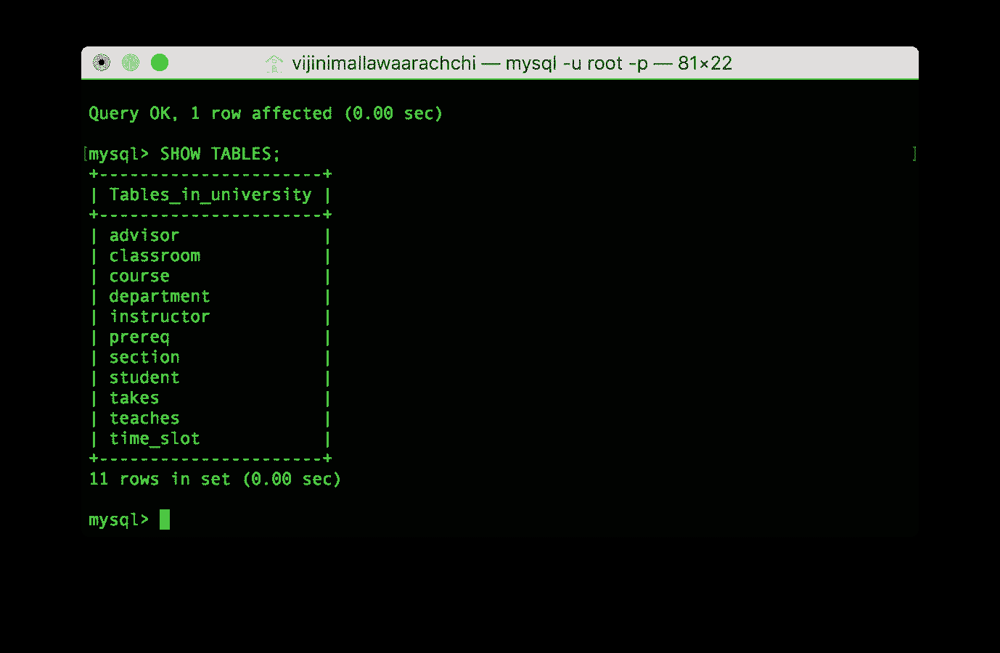
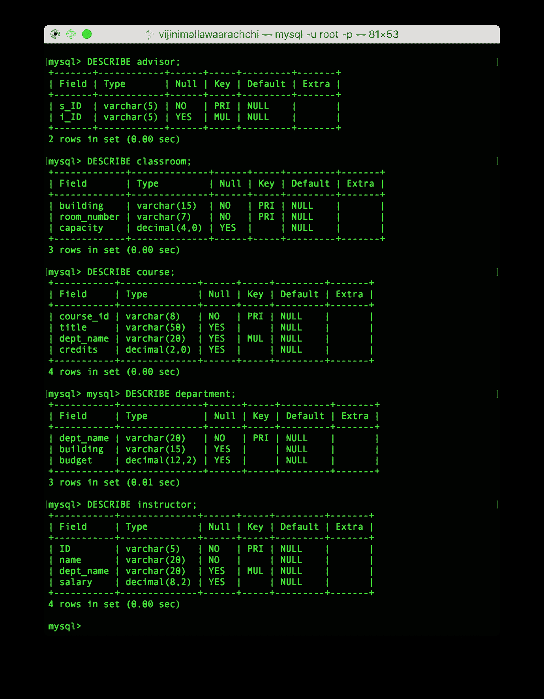
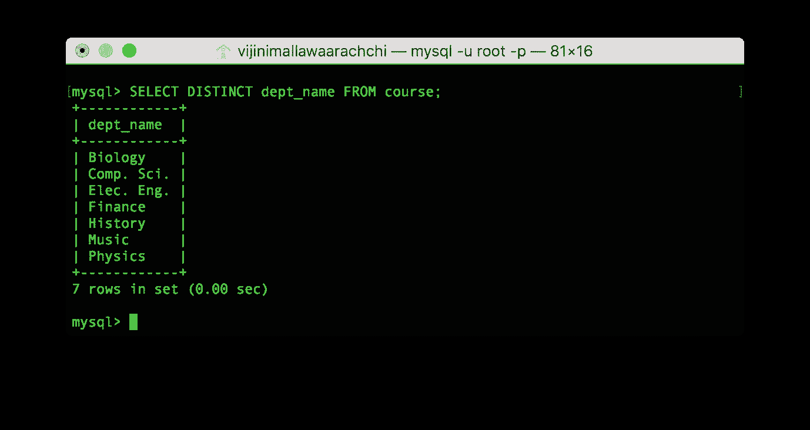
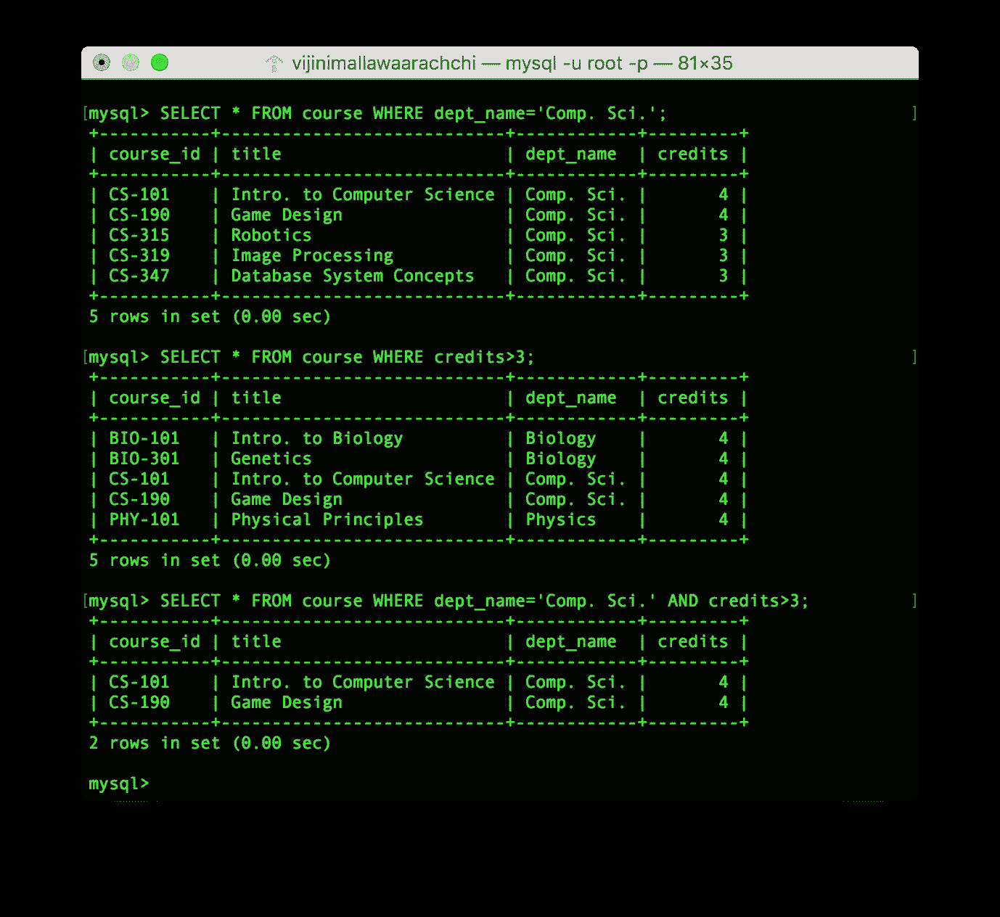
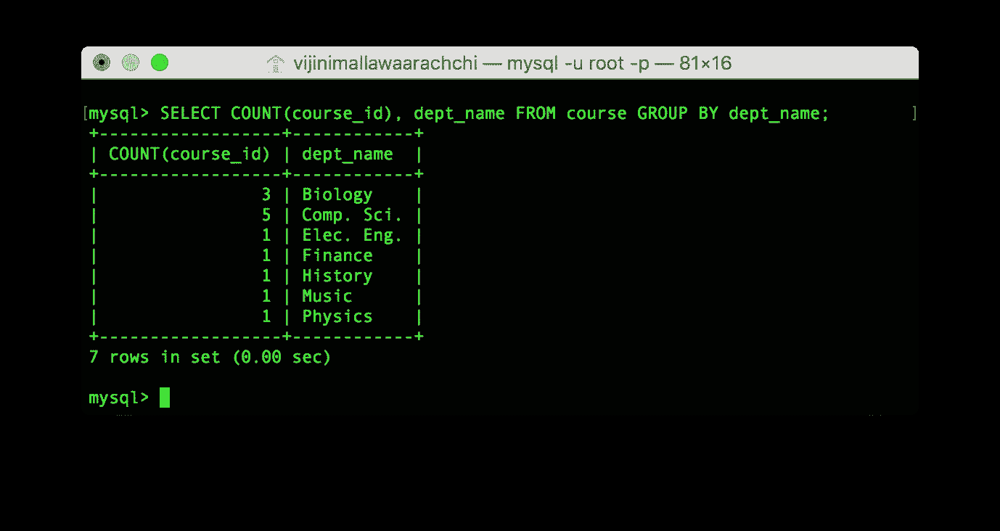
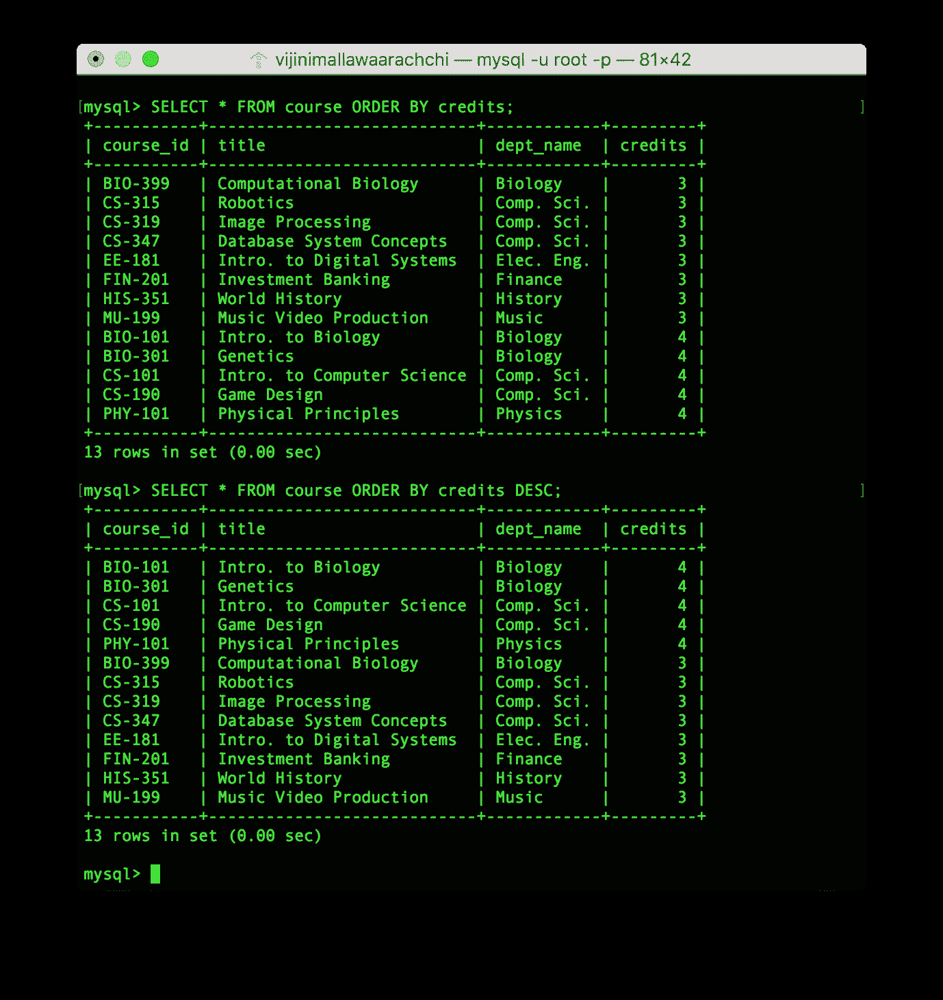
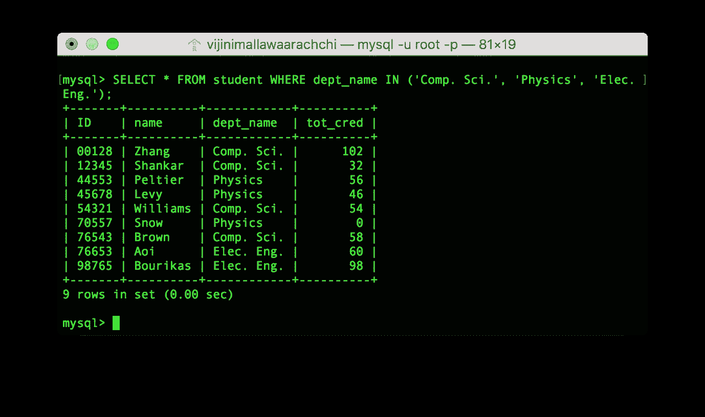
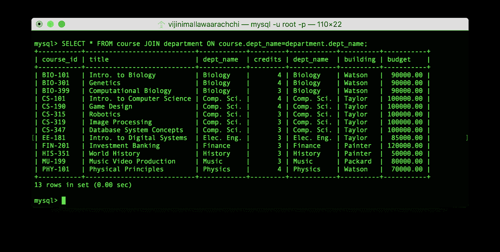
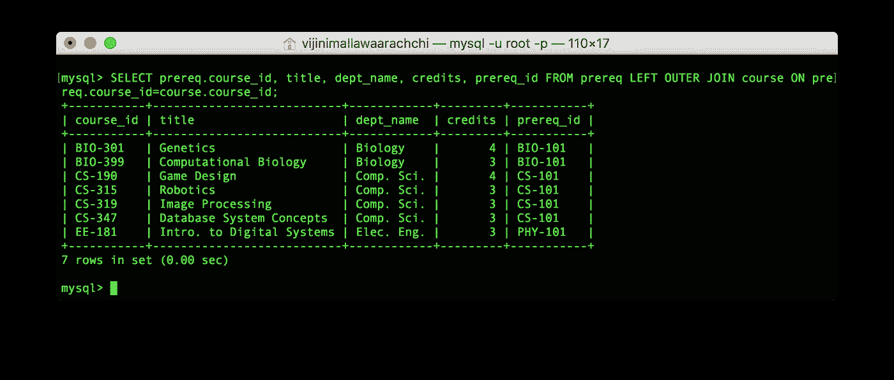
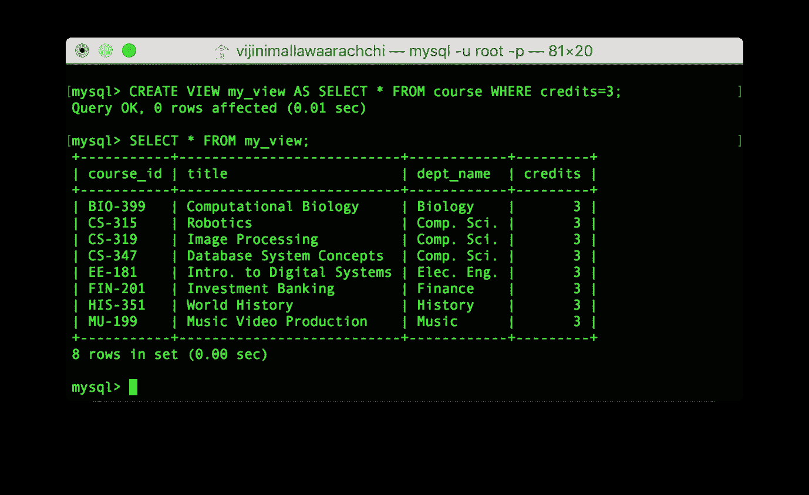

# 面试的 SQL 摘要

> 原文：<https://towardsdatascience.com/sql-cheat-sheet-for-interviews-6e5981fa797b?source=collection_archive---------0----------------------->

## 用例子和样本代码 DIY

**SQL** 或**结构化查询语言**是一种设计用于管理**关系数据库管理系统(RDBMS)** 中数据的语言。在本文中，我将带您了解每个程序员都应该知道的常用 SQL 命令。如果你需要为面试而温习 SQL 知识，这篇文章是完美的。你所要做的就是尝试给出的例子，并刷新你很久以前在数据库系统课上所学的内容。😉

**注意:**一些数据库系统要求在每条语句的末尾插入一个分号。分号是指示每个 SQL 语句结尾的标准方式。我将使用 **MySQL** 作为例子，它要求在每个语句的末尾有一个分号。

# 设置示例数据库

示例数据库将用于演示每个命令。您可以通过单击链接找到两个 SQL 脚本 [DLL.sql](https://drive.google.com/file/d/0B_oq3-doZhC-ME1lUlR3a3pYRU0/view?usp=sharing&resourcekey=0-flfPMq0i6E6-i5BX27Se4g) 和 [InsertStatements.sql](https://drive.google.com/file/d/0B_oq3-doZhC-TV9ud1JubkVDaXM/view?usp=sharing&resourcekey=0-CToHONw06G5QQ6DuRf68Ng) 。

将文件保存到本地机器后，打开终端，使用以下命令登录到 MySQL 控制台。(我假设你已经安装了 MySQL。)

```
mysql -u root -p
```

然后会提示您输入密码。

现在执行以下命令。我们将把我们的数据库命名为“ ***大学*** ”。

```
**CREATE DATABASE** university;**USE** university;**SOURCE** <*path_of_DLL.sql_file>;***SOURCE** <*path_of_InsertStatements.sql_file>;*
```


Figure 1: Executed queries to setup the database

现在让我们开始刷新我们以前学过的 SQL 命令。

# **数据库相关命令**

# 1.查看当前可用的数据库

```
**SHOW DATABASES**;
```

# 2.创建新的数据库

```
**CREATE DATABASE** <*database_name*>;
```

# 3.选择要使用的数据库

```
**USE** <*database_name*>;
```

# 4.从导入 SQL 命令。sql 文件

```
**SOURCE** <*path_of_.sql_file>;*
```

# 5.删除数据库

```
**DROP DATABASE** <*database_name*>;
```

# 与表格相关的命令

# 6.查看数据库中当前可用的表

```
**SHOW TABLES**;
```



Figure 2: Tables in **university** database

# 7.创建新表格

```
**CREATE TABLE** <*table_name1*> (
    <*col_name1*> <*col_type1*>, 
    <*col_name2*> <*col_type2*>, 
    <*col_name3*> <*col_type3*>
    **PRIMARY KEY** (<*col_name1*>),
   ** FOREIGN KEY** (<*col_name2*>) **REFERENCES** <*table_name2*>(<*col_name2*>)
);
```

***完整性约束创建表***

您可能需要为表中的某些列设置约束。创建表时可以施加以下约束。

*   **不为空**
*   **主键** ( *列名 1，列名 2，…* )
*   **外键** ( *col_namex1* ，…， *col_namexn* ) **引用** *表名(col_namex1* ，…， *col_namexn)*

您可以包含多个主键，这将创建一个**复合**或**串联** **主键**。

## **例子**

创建表格讲师。

```
CREATE TABLE instructor (
    ID CHAR(5),
    name VARCHAR(20) NOT NULL,
    dept_name VARCHAR(20),
    salary NUMERIC(8,2), 
    PRIMARY KEY (ID),
    FOREIGN KEY (dept_name) REFERENCES department(dept_name))
```

# 8.描述表格的列

您可以使用下面给出的命令来查看表的列，包括类型和键等详细信息。图 3 显示了几个例子。

```
**DESCRIBE** <*table_name*>;
```



Figure 3: Details of table columns

# 9.插入表中

```
**INSERT INTO** <*table_name>* (<*col_name1>*, *<col_name2>*, *<col_name3>*, …)
    **VALUES** (<*value1>*, *<value2>*, *<value3>*, …);
```

如果要将值插入到表的所有列中，则不需要在开头指定列名。

```
**INSERT INTO** <*table_name>*
    **VALUES** (<*value1>*, *<value2>*, *<value3>*, …);
```

# 10.更新表格

```
**UPDATE** <*table_name>*
    **SET** <*col_name1>* = *<value1>*, *<col_name2>* = *<value2>*, ...
    **WHERE** <*condition>*;
```

# 11.删除表格的所有内容

```
**DELETE FROM** <*table_name*>;
```

# 12.删除表格

```
**DROP TABLE** <*table_name*>;
```

# 查询相关命令

# 13.挑选

**SELECT** 语句用于从特定的表中选择数据。

```
**SELECT** <*col_name1>*, *<col_name2>, …*
     **FROM** <*table_name>*;
```

您可以选择表格的所有内容，如下所示。也参考图 4。

```
**SELECT * FROM** <*table_name*>;
```


Figure 4: Select all from ***department*** and **course** tables

# 14.选择不同

表中的一列可能经常包含重复值。**选择不同的**允许您检索不同的值。

```
**SELECT DISTINCT** <*col_name1>*, *<col_name2>, …*
     **FROM** <*table_name>*;
```



Figure 5: **SELECT DISTINCT** example

# 15.在哪里

您可以在 **SELECT** 语句中使用 **WHERE** 关键字，以便为您的数据包含条件。

```
**SELECT** <*col_name1>*, *<col_name2>, …*
     **FROM** <*table_name>
*     **WHERE** <*condition*>;
```

您可以包含以下条件:

*   比较**文本**
*   **数字的比较**
*   逻辑运算包括**与**、**或**与**非**。

## **例子**

浏览下面的示例语句。请注意条件是如何包含在 **WHERE** 子句中的。

```
SELECT * FROM course WHERE dept_name=’Comp. Sci.’;
SELECT * FROM course WHERE credits>3;
SELECT * FROM course WHERE dept_name='Comp. Sci.' AND credits>3;
```



Figure 6: Usage of **WHERE** in **SELECT**

# 16.分组依据

**GROUP BY** 语句通常与**聚合函数**一起使用，如 **COUNT** 、 **MAX** 、 **MIN** 、 **SUM** 和 **AVG** 对结果集进行分组。

```
**SELECT** <*col_name1>*, *<col_name2>, …*
     **FROM** <*table_name>*
     **GROUP BY** <*col_namex>*;
```

## **示例**

列出每个系的课程数量。

```
SELECT COUNT(course_id), dept_name 
     FROM course 
     GROUP BY dept_name;
```



Figure 7: **Number of courses** for each **department**

# 17.拥有

具有子句的**被引入 SQL，因为 **WHERE** 关键字不能用于比较**聚合函数**的值。**

```
**SELECT** <*col_name1>,* <*col_name2>, ...*
    **FROM** <*table_name>*
    **GROUP BY** <*column_namex>* **HAVING** <*condition>*
```

## **示例**

列出提供一门以上课程的每个系的课程数量。

```
SELECT COUNT(course_id), dept_name 
    FROM course 
    GROUP BY dept_name 
    HAVING COUNT(course_id)>1;
```


Figure 8: **Departments** offering more than one **course**

# **18。排序依据**

**ORDER BY** 用于**对结果集进行升序或降序排序**。如果不指定 ASC 或 DESC，ORDER BY 将按升序排序。

```
**SELECT** <*col_name1>*,<*col_name2>, …*
**FROM** <*table_name>*
**ORDER BY** <*col_name1>,* <*col_name2>, …* **ASC**|**DESC**;
```

## **示例**

按照学分的升序和降序列出课程。

```
SELECT * FROM course ORDER BY credits;
SELECT * FROM course ORDER BY credits DESC;
```



Figure 9: **Courses** sorted according to **credits**

# 19.在...之间

**与**之间的子句用于**选择给定范围内的数据**。这些值可以是数字、文本甚至日期。

```
**SELECT** <*col_name1>*,<*col_name2>, …*
    **FROM** <*table_name>*
    **WHERE** <*col_namex>* **BETWEEN** <*value1>* **AND** <*value2>;*
```

## **例子**

列出薪水在 50 000 到 100 000 之间的教师。

```
SELECT * FROM instructor 
    WHERE salary BETWEEN 50000 AND 100000;
```


Figure 10: **Instructors** who get a salary in between 50 000 and 100 000

# 20.喜欢

在 **WHERE** 子句中使用 **LIKE** 运算符来搜索文本中的**指定模式。**

LIKE 使用了两个通配符运算符。

*   **%** (零个、一个或多个字符)
*   **_** (单个字符)

```
**SELECT** <*col_name1>,* <*col_name2>, …*
    **FROM** <*table_name>*
    **WHERE** <*col_namex>* **LIKE** <*pattern>*;
```

## 例子

列出课程名称包含“to”的课程以及课程 id 以“CS-”开头的课程。

```
SELECT * FROM course WHERE title LIKE ‘%to%’;
SELECT * FROM course WHERE course_id LIKE 'CS-___';
```


Figure 11: Use of **wildcard operators** with **LIKE**

# 21.在…里

在子句中使用**，可以允许**在一个 WHERE 子句**中有多个值。**

```
**SELECT** <*col_name1>,* <*col_name2>, …*
    **FROM** <*table_name>*
    **WHERE** <*col_namen>* **IN** (<*value1>*, *<value2>*, …);
```

## 例子

列出计算机系的学生。Sci。、物理和电子。英语。

```
SELECT * FROM student 
    WHERE dept_name IN (‘Comp. Sci.’, ‘Physics’, ‘Elec. Eng.’);
```



Figure 12: **Students** in the **departments** of Comp. Sci., Physics, and Elec. Eng

# 22.加入

**JOIN** 用于根据两个或多个表中的公共属性合并它们的值。下面的图 13 描述了不同类型的 SQL 连接。注意**左外接头**和**右外接头**的区别。


Figure 13: Types of joins (Source: [http://files.zeroturnaround.com/pdf/zt_sql_cheat_sheet.pdf](http://files.zeroturnaround.com/pdf/zt_sql_cheat_sheet.pdf))

```
**SELECT** <*col_name1>,* <*col_name2>, …*
    **FROM** <*table_name1>*
    **JOIN** <*table_name2>* **ON** <*table_name1.col_namex>* = *<table2.col_namex>*;
```

## 示例 1

选择所有包含相关部门详细信息的课程。

```
SELECT * FROM course 
    **JOIN** department 
    ON course.dept_name=department.dept_name;
```



Figure 14: All the **courses** with **department** details

## 示例 2

选择所有先修课程及其课程详细信息。

```
SELECT prereq.course_id, title, dept_name, credits, prereq_id 
    FROM prereq 
   ** LEFT OUTER JOIN** course 
    ON prereq.course_id=course.course_id;
```



Figure 15: All the **prerequisite** courses with their **course** details

## 示例 3

选择所有课程及其课程详细信息，无论它们是否有先决条件。

```
SELECT course.course_id, title, dept_name, credits, prereq_id 
    FROM prereq 
    **RIGHT OUTER JOIN** course 
    ON prereq.course_id=course.course_id;
```


Figure 16: All the **courses** with their course details, regardless of whether or not they have **prerequisites**

# 23.视图

视图是使用语句的结果集创建的虚拟 SQL 表。它包含行和列，非常类似于一般的 SQL 表。视图总是显示数据库中的最新数据。

## 创建视图

```
**CREATE VIEW** <*view_name*> **AS**
    **SELECT** <*col_name1>*, <*col_name2>*, …
    **FROM** <*table_name*>
    **WHERE** <*condition*>;
```

## 删除视图

```
**DROP VIEW** <*view_name*>;
```

## 例子

创建由 3 个学分的课程组成的视图。



Figure 17: A **view** consisting of **courses** with **3 credits**

# 24.聚合函数

这些函数用于获得与正在考虑的数据相关的累积结果。以下是常用的聚合函数。

*   **COUNT(col_name)** —返回行数
*   **SUM(col_name)** —返回给定列中值的总和
*   **AVG(列名)** —返回给定列的平均值
*   **MIN(col_name)** —返回给定列的最小值
*   **MAX(col_name)** —返回给定列的最大值

# 25.嵌套子查询

嵌套子查询是包含嵌套在另一个查询中的 **SELECT-FROM-WHERE** 表达式的 SQL 查询。

## 例子

查找 2009 年秋季和 2010 年春季提供的课程。

```
**SELECT DISTINCT** course_id 
    **FROM** section 
    **WHERE** semester = ‘Fall’ **AND** year= 2009 **AND** course_id **IN** (
        **SELECT** course_id 
            **FROM** section 
            **WHERE** semester = ‘Spring’ **AND** year= 2010
    );
```


Figure 18: **Courses** offered in **Fall 2009** and in **Spring 2010**

希望这篇文章对你有用。

感谢大家的阅读！😃

> 祝你面试好运！