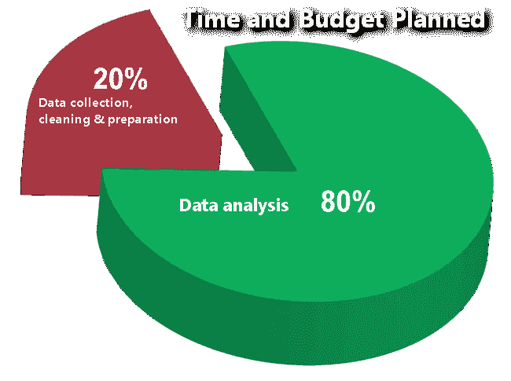
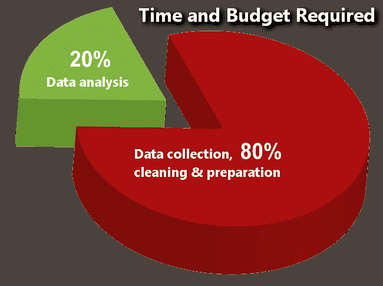

# 从问题开始您的数据探索

> 原文：<https://towardsdatascience.com/start-your-data-exploration-with-questions-2f1d42cff29e?source=collection_archive---------8----------------------->

大多数已经经营了一段时间的公司已经积累了大量的数据，这些数据通常分布在多个数据库或数据存储中，并且具有多种格式，有些是结构化的，有些是自由格式的。

在数据分析和机器学习提供新工具和方法的时代，现有数据显然代表着一个机会。可以收集到哪些新的见解？可以从哪些机构流程中吸取经验并加以改进？哪些运营效率或机会被忽略了？

但是在数据收集过程中还存在许多障碍。很难知道哪些数据是最重要的。即使在结构化数据库中，数据的格式也可能随着需求的变化而改变。正如我在之前的文章中所描述的，[数据挖掘——注意差距，](https://medium.com/towards-data-science/data-mining-mind-the-gaps-4086e0e2fe2a)数据之间的关系可能并不明显，可能无法通过加载和规范化过程。

在加载任何数据之前，应该有一个活跃的步骤，我称之为头脑风暴提问。一群知识渊博的人应该提出他们可能想知道的关于数据的问题。这里的重点不是回答问题，甚至不是预测什么问题真的会被问到。相反，我们的目标是探索回答每种类型的问题需要哪些联系。

如果项目的目的主要是数据分析，问题通常应该是分析性的。与劳动密集型项目相比，我们在资本密集型项目上取得了哪些成功？这种成功会随着时间而改变吗？某些人参与了最成功或最不成功的项目吗？与收入增长相比，每个部门的员工增长率是多少？

如果目的更多的是认知性的，问题可能更多的是对话性的和定性的？我们团队中的哪些人主动提出了建议？与那些沉默寡言的人相比，他们有什么样的建议？当某个特定产品的销量下降时，什么样的信息会向公众发布，什么样的信息会在内部发布？在我们公司内使用任何特定的短语是否倾向于暗示某项计划的成功或失败？

下面的简短视频展示了在数据分析之前使用的这一过程的简化快照。该演示基于一组真实的 Lotus Notes 数据库，其中包含业务合作伙伴可以向 IBM 报告的可能的错误报告，IBM 将对这些报告做出响应。注意，即使对于这个简单的系统，每个 bug 和 IBM 的响应都在由父子层次结构关联的单独文档中。修复列表数据库是一个独立的数据库，没有以任何明显的方式链接，但可以通过关键字进行搜索。有丰富的文本与自由形式的问题和答案。

关键的想法是，通过在开始挖掘之前提出问题，可以弄清楚哪些关系需要保留。您还可以决定在数据分析中将来自不同地方的信息汇总到一个“记录”中。

请记住，在实际准备和清理数据的过程中，任何可以节省的时间都是值得的。

因此，在你开始将数据加载到你的数据或认知分析系统之前，计划时间问一些自由形式的问题。它们可以帮助你理解你所拥有的数据，并确保你加载、规范化和准备数据的努力将导致一个系统来回答你还没有想到的问题。