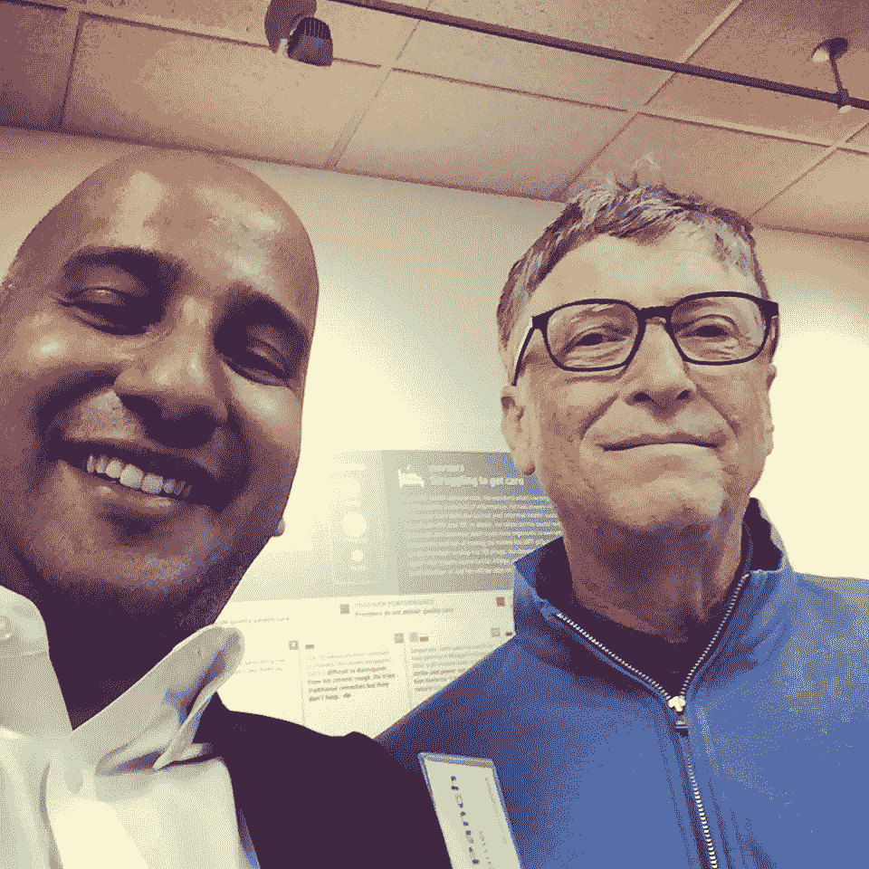
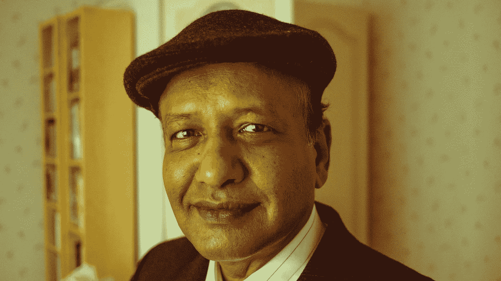

# 州

> 原文：<https://towardsdatascience.com/states-70fab9ba479?source=collection_archive---------5----------------------->

I don’t think he was quite as excited about this as I was.

我一直在思考我想写些什么。上一次我有机会以这种方式思考是在大约一年前，在来自默克公司的 grand incredible Priya Agrawal 的帮助下，我有机会向比尔和梅林达盖茨以及盖茨基金会的董事会介绍数字技术在全球卫生系统发展中的作用。

这是一次有趣的经历，它让我有机会以一种自 Wellframe 成立以来从未有过的方式整理思绪。还是在有孩子之前？

无论如何，我主要对两件事感兴趣

1.  人类系统中存在的信息系统和激励网络。比我最初想象的更多的事情是信息处理任务。计算机不仅仅是一台机器，而是信息处理的隐喻。我有时甚至会说，计算机是自然存在的形式，但当我醒来时，我最终得出结论，计算机只是(几乎无处不在的)信息处理任务的最方便的隐喻。
2.  如何使用计算机通过创造人机混合系统来改善物质事物的组织——人类和计算机一起工作来放大彼此。

多年来，我发现图灵机的简单模型是思考健康和社会其他系统的一种有趣方式。事实上，几年前我非常喜欢艾伦·图灵，以至于我想用他的名字给我们的第一个女儿取名，但是我找不到一个和他名字一样的女性衍生词。现在我重新认识了睡眠的全部好处，我们不太可能再要孩子了，但就我所见，这将是生男孩的主要好处。

卫生系统中的病人就像某种图灵机——每个人都经历一系列不同的状态，其中的转变就是卫生系统的行动。从这个角度来看，医院(或者可以说是任何医疗服务单位)在一般意义上从事信息处理和计算的业务，就像从事医疗服务一样。当然，我并不是说关心的因素不重要(我花了 10 年时间试图证明它们是重要的)，也不是说医学知识(这些隐喻程序中的真理)是完美的，但为了便于讨论，将这些东西抽象出来会更方便。

剩下的是两个核心计算任务:诊断(推理)和管理(基本上是带有一些推理的规则的应用，以使这一切不那么干净)。目前，诊断主要受到缺乏结构化数据的限制，这首先是一个传感问题，这实际上是基础科学领域的一个问题——在大多数情况下，我们需要更好的传感器来提供一些客观的可比性，否则就会受到人们如何使用语言描述发生在他们身上和他人身上的事情的变化的影响。有了大量的结构化数据(当然，现在也有结构化数据存在的领域)，诊断问题变成了一个非常有趣的推理问题，机器学习，特别是计算的认知方法的深刻飞跃可以发挥作用。

许多更有资格的人已经写了这方面的文章，所以没有必要贬低他们的基础工作。在没有结构化数据的情况下，人类在许多情况下实际上是最擅长诊断的，因为我们能够更有效地解释歧义，产生启发，并快速地以有时不明显的方式利用它们(我想是 House MD)。这些人看起来很像现在的临床医生，当然，尽管他们很有价值，但却难以培训，维护起来成本高昂，因此很难在需要他们的地方找到他们。随着更好的感知、学习和自我优化算法，很明显我们可以增加每个临床医生的杠杆作用，但这仍需要几年时间。

在未来的一篇文章中，在获得许可之前，我将写一写我的朋友 Sid 和 Michal 以及他们的公司，他们使用手机和微型化学技术，以现有成本的一小部分，将实验室测试带给各地的患者。他们目前正在通过 FDA 的许可，但最有趣的是，他们已经有数万家诊所在印度成功使用他们的测试——在剑桥和我们一起在麻省理工学院 CSAIL 的黑暗洞穴中开始之后。它有时被称为逆向创新，这是一个非常令人讨厌的术语，但稍后会有更多的介绍。

回到故事上来，我认为管理问题在短期内更容易解决。这在很大程度上是一个感知患者健康状态的问题(在随后的帖子中会详细介绍如何做到这一点)，并根据该健康状态确定最合适的干预措施，以使患者在通往理想健康状态的道路上达到下一个最佳健康状态——健康目标。同样，感知状态并基于该状态确定干预的能力在历史上一直是系统中的约束，但随着移动电话和云计算的出现，这些约束现在被有效地解除了。这是 Wellframe 运营的地方。

从管理问题来看，很明显，医学上并不缺乏规则，只是众所周知，它们没有得到应用，因为在资源、努力和直接不便方面的成本都非常高。我认为，通过使现有规则对患者来说更容易访问和用户友好，并利用这个机会使用生成的数据来定义至少对临床医生来说不明显的领域中的新规则，可以创造很多价值——即“体验”维度及其剪裁。

我认为，支撑这一切的是一种强制性的认识，即病人创造他们自己的“健康”,而我们只是为这种创造提供一些原材料和一些必要知识的供应商。考虑到这一点，我们采用了一种非常古怪的方式，这在任何其他制造流程中都是完全不可接受的，我们真的需要做得更好。我认为，如果我们围绕患者以这种方式重新构建任务，并意识到管理挑战是一种迭代的状态感知和转换，这是一项计算机非常擅长的任务，那么就可以节省更多的人类时间和精力，将它们花在人们真正擅长而计算机真正不擅长的事情上——让其他人感到被关心。

七年前，我非常幸运，在麻省理工学院和周围的一些不可思议的人一起工作了几年，他们仍然是我的朋友，他们向我介绍了这些想法，并从根本上改变了我的生活，或者至少改变了我对一个人的可能性的看法。

这个博客的目的是回到那种惊奇的感觉，并在我的才能和时间的限制下，传达它。我会试着在下面的帖子中包含更多的细节和具体的例子来进一步发展我的想法。

很多这样的想法都是着眼于长远，当然空白的事实是(至少现在是这样；)从长远来看，令人沮丧的是，我们都会死。遗憾的是，这比我想的要早得多，因为我那了不起的叔叔 Sithamparanathan Sivagnanam 最近去世了。他轻轻地踩在地上，把它变成了一个更好的地方。他是一个“做梦的傻瓜”,人类的所有进步都建立在这样的事情上。

作为纪念。

T

