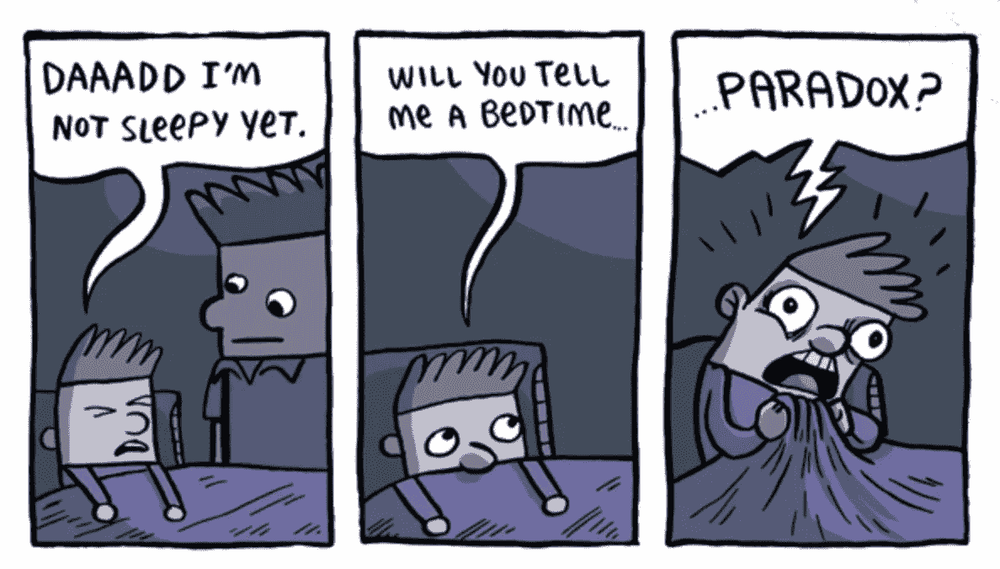
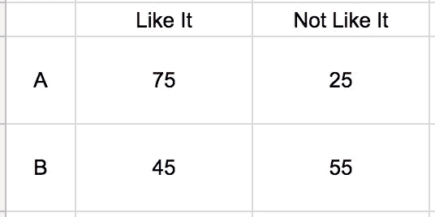
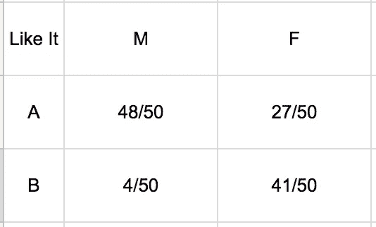
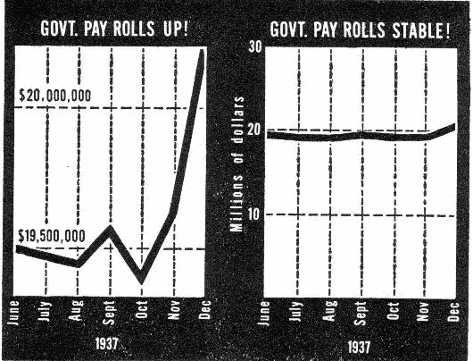
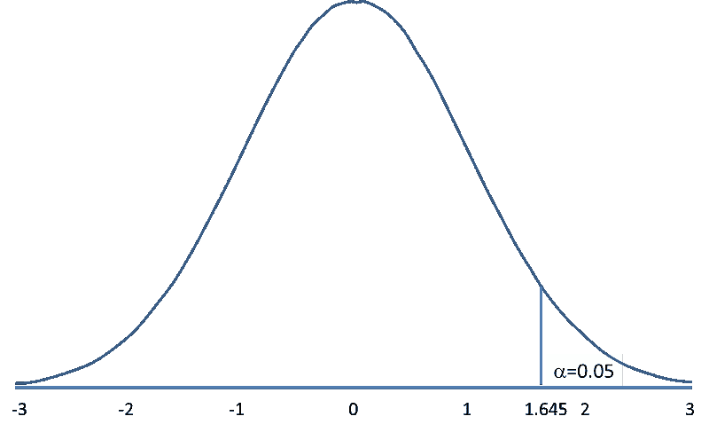
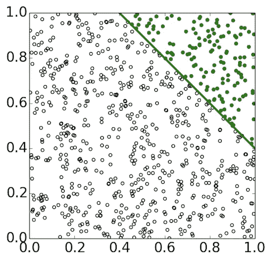

# “统计学”成就了我的一天，是吗？

> 原文：<https://towardsdatascience.com/statistic-has-made-my-day-or-has-it-982c7d527410?source=collection_archive---------8----------------------->

Bedtime Paradox cartoon

A 几乎所有的活动都必须与数据相关，数据可以通过多种不同的方式收集。自从 19 世纪初统计学被广泛使用和知晓以来，数据收集变得流行起来。由于统计数据的功能，它被用来使用有限的数据来解释一种现象，例如一个业务用例或者仅仅是一场赌博。它帮助了许多商人、经纪人、赌徒，尤其是现在的电子商务或科技公司，它们在短时间内产生许多数据。

由于[对统计学家](https://qz.com/1181278/statistician-is-one-of-the-fastest-growing-jobs-for-the-future/)的高需求，许多人将他们的职业道路转变为能够做好统计的“数据向导”。目前，通过博客、文章或这里的“媒介”，甚至询问*【大师】*，就可以很容易地了解这些统计数据。每个人都可以使用它，每个人都可以教它，而且每个人都可能是错的，这就是问题所在。统计是一种工具，作为另一种有有限用途的工具，它也有许多假设和不同的解释。这里有一些在做统计分析时可以发现的悖论或谬误。

**辛普森悖论**

这个简单的统计数字不会伤害任何人，也不会让每个人都破产。然而，基于简单统计的错误输出的决策可能导致一个国家的毁灭。众所周知，统计学中的一个悖论会误导统计学家，这个悖论叫做*辛普森悖论。*

这是使用 A/B 测试的观察者或想要比较产品的研究者通常会遇到的矛盾。辛普森悖论是这样一种悖论，当不同组的数据被合并时，不同组中出现的趋势消失了，这是英国统计学家 Udny Yule 在 1903 年首次提到的。

Simple Simpson’s Paradox

这个悖论有很多不同的例子。在一个著名的例子中，研究人员得出结论，一种新的治疗肾结石的方法比传统手术更有效，但是后来发现这种新的治疗方法更常用于小肾结石。在研究人员根据肾结石的大小进行分割后，这一发现出现了。

此外，这在企业案例中也经常发生。例如，假设公司生产两种产品，并想知道哪一种是最好的。公司随机选择 200 个不同的好顾客作为样本来试用新产品，其中 100 个顾客试用产品 A，另外 100 个顾客得到产品 b。每个顾客必须给出对产品的意见，“喜欢还是不喜欢”。这是实验的结果，

Initial Result

很容易计算出，这些数据明显表明产品 A 比产品 b 更容易被客户接受。但是，如果公司知道并拥有关于性别的数据，并且研究人员将数据分为两种类型的客户，那么上面的报告将变为下表(具有相同的性别比例)。

Gender Centrist Result

简单的比例计算表明，只有对女性顾客来说，产品 B 比产品 A 更有利。

如果研究人员不在乎进行分割，上面的简单实验可能会导致错误的方向。为了防止这种情况发生，需要对每个调查进行适当的分组。然而，帕夫利德斯和帕尔曼的一篇论文证明了辛普森悖论发生的概率正好是 1/60。

**啧啧嗖图**

一幅画，总的来说，可以操纵任何观众，这幅画有许多不同的解读。因此，任何人创建的表格中的简单图表都可能改变研究人员甚至领导的决定。操纵数据解释视角的方法之一是 Gee Whiz 图。

那是什么？请注意下面的图表。

Famous Example of Gee Whiz Graph

左边的图表显示了“政府支出”的显著增长。1937 年 10 月以后，显示这一点的报纸似乎终究是反对政府的。同时，对于相同的数据，右边的线在同一个月之后没有显示出显著的差异。如果两个人一眼看到这些图表，他们可能会有不同的观点。

**选择阿尔法**

*“用α0.05，假设检验表明..”* 这句话通常写在研究论文或很多统计学教材上，问题是*假设检验是否应该用 alpha 等于 0.05？。使用 0.05 作为显著性水平(α)似乎是不可否认的，并成为每个假设检验的强制性要求。然而，[假设检验](https://www.thoughtco.com/introduction-to-hypothesis-testing-3126336)或统计显著性检验通常具有显著性水平。*

假设检验中的显著性水平或通常写为 Alpha 是当假设检验或统计检验中的零假设为真时拒绝零假设的概率(假阳性的概率)。这意味着阿尔法值越小，拒绝真零假设的可能性就越小。它被用作确定是否拒绝零假设的基准。由于它的作用，α的值应该取决于情况和要处理的问题。如果研究者有兴趣拒绝一个真正的零假设，那么他可以使用一个更大的α，反之亦然。

Z-value of Alpha

尽管α值允许使用 0 到 1 之间的所有实数，但从理论上讲，用于统计测试是不实际的。通常，α的值是 0.01、0.05 或 0.1，即使没有数学定理表明这些是唯一可以使用的显著水平。因此，有必要为每一个显著性检验提供α值，并且每次阅读统计研究时都要小心。

**伯克森悖论**

这个悖论也被称为伯克森偏差或伯克森谬误，非常接近辛普森悖论。伯克森悖论是一种情况，其中两个指标在统计上可能是负相关的，即使它们在总体中似乎是正相关的，甚至是不相关的。

这种情况可能是由于观察者在收集数据时的[选择偏差](https://catalogofbias.org/biases/selection-bias/)造成的。在这个悖论中，观察被限制在两个变量相加的地方。因为如果你知道 A+B 一定在某个范围内，那么 A 高导致 B 低，反之亦然。

例如，假设观察者想要分析订单值(OV)和某个电子商务上 VIP 客户的订单数量(N)之间的相关性。在本研究中，VIP 客户被定义为具有总标准化 OV 且标准化 N 高于某个基准 B_max 的客户。总体人口分布大致如下图所示，

Berkson’s Example

绿点(数据选择)在这些指标之间会有明显的负相关，因为在开始时有偏差选择。标准是“标准化 OV”+“标准化 N”≤B _ max，当 OV 较低时给出信息，则 N 的值由于其限制而必须较高。

上面的例子从一开始就有明显的错误，但是有一些情况很难被注意到有这种悖论，特别是在[医学](https://www.quora.com/What-is-the-Berksonian-bias-in-epidemiology)观察上，这种观察限制了获取样本的途径。另一个例子来自[教育领域](https://brilliant.org/wiki/berksons-paradox/)关于 GPA 和 SAT 成绩的相关性。

**后特设谬误**

Post Hoc 是“Post Hoc，Ergo Propter Hoc”的简称，意思是“在它之后，因此因为它”。这是一个逻辑谬误，认为第一个事件是紧随其后的第二个事件的原因。许多研究人员由于缺乏信息和经验而陷入这一悖论。此外，这是一个懒惰的答案，为研究者创造一个报告的研究结论。

Domino’s Cause and Effect

举一个我们熟悉的医学领域疾病及其治疗的例子。比方说，一个病人病了几天，然后他买了一种药来治疗，这种药能使他立即好转。之后，病人得出结论，由于药物的作用，疾病已经消失。然后，他会买同样的药，或者建议人们如果疾病感染了他们就买这种药。

并不是每一个事后谬误都会像上面的例子一样带来好的结果，大多数都不会有好的结局。例如，社交媒体、恶作剧和仇恨言论大多使用这种逻辑谬误来传播仇恨，从而在现实世界中制造冲突和混乱。这种现象通常发生在总统竞选期间，在社会中引发不同的群体。

在统计学中，这种谬误不是由错误的公式或公式的错误使用引起的，而是发生在观察者产生结果的方式上。这确实与观点偏见和观察者的经验有关。作为一名统计学家或数据分析人员，有[多种统计测试](http://www.statisticshowto.com/post-hoc/)来确定两组或多组数据的事后效应，如*霍尔姆-邦费罗尼方法*、*图基检验*或*邓尼特校正*。

**结束注释**

从数据中获得洞察力离不开统计，如果偏见(或个人观点)仍然存在，统计就无法给出最佳结果。如果观察者或“统计学家”不能理解公式中变量的含义，这也是一个自食其果的工具。不仅在使用统计数据时，而且观察者也必须注意在从公式中获得所有数字后再陈述结论。