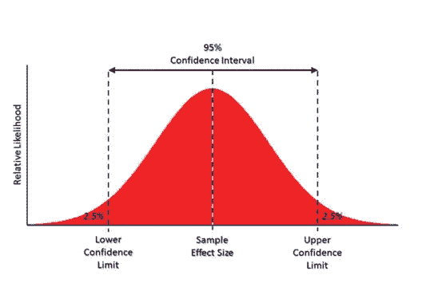
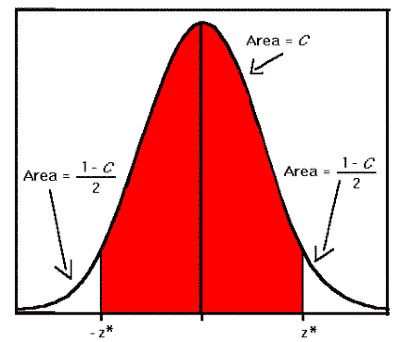

# 5 分钟内为数据科学家提供统计数据

> 原文：<https://towardsdatascience.com/statistics-for-data-scientists-f2456d26c5a5?source=collection_archive---------10----------------------->

事实是顽固的东西，但统计数字是柔韧的。―马克·吐温

Photo by Mike Kononov on Unsplash

## 总体参数与样本统计

研究者的目标不是得出关于样本的结论，而是从提供的样本中得出关于总体的结论。因此，研究人员必须使用样本的统计数据来推断人口中的数值。总体中的这些值称为参数。参数是整个总体的未知特征，如总体均值和中位数。样本统计描述了作为样本的一部分人口的特征。样本均值和中位数是固定的和已知的。

## 抽样误差

假设，我有 3000 人去公园散步。我可以得到他们的平均体重和人口平均值，这是平均身高的精确表示。实际上，计算真实平均值并不是每次都可行。因此，我们将从 3000 总人口中抽取一部分，即 1000 人。如果样本是随机选择的，而不是观察到的，那么期望均值与真实均值相似。然而，由于它是一个随机样本，平均值可能与真实平均值不同。样本均值和真实均值之间的差异称为抽样误差。

## 标准误差

指的是所有均值的标准差。它显示了一组样本的平均值之间的差异。

假设，我们想观察 3 天内有多少销售额。通过计算每天的销售额，我们可以得到平均销售额。然而，有许多外部因素影响销售，如折扣、假期等。因此，我们不是取一天的平均值，而是取三天的平均值。

平均值的标准误差现在是指每次不同观察的平均值的变化。

如果我们测量一个数据集的多个样本，均值将不会相同，并且会扩散。样本的标准差是样本平均值的标准偏差，它为我们提供了一个衡量分布的标准。

## 置信区间和置信水平

“根据一项调查，在 96%的置信度下，果园中的橙子重量在(132-139 克)之间”。

(132–139 GM)是置信区间。这是一个真正的价值所在的价值范围。CI 用于表示我们确定总体参数所在的范围。每当我们想表达一个总体参数的估计时，最好是说明它的置信区间。CI 的宽度告诉我们许多关于从收集的样本中得到的总体的确定性。当你不太了解总体的行为时，你需要使用 t 分布来寻找置信区间。

96%的置信水平意味着，如果在相同的条件下一次又一次地重复调查或民意测验，调查的结果将在 96%的时间里与实际人口的结果相匹配。
影响置信区间(CI)的两个因素是变异和样本量:-
**变异**:如果总体中的所有值都相似，那么样本的变异很小。人口中的每一个样本都是相似的。

*   **低变异**导致**相似样本**导致**窄 CI**
*   **高变化**导致**样本变化**导致**CI 变宽**

样本量:如果我们取小样本，我们没有任何发现可以作为我们推断的基础。小样本彼此不同，细节较少，导致 CI 较宽

*   **大样本**尺寸导致**更多细节**导致**CI 狭窄**
*   **小样本**尺寸导致**细节较少**导致**CI 较宽**

## 误差幅度

调查是基于从样本中收集的事实，而不是整个人口。当我们不得不根据样本推断真实的统计数据时，一定会出现一些误差，比如抽样误差，这是因为没有考虑到每个人。误差幅度用来衡量样本结果与实际总体结果的最大差异。它衡量的是准确性，而不是偏差量。
*误差幅度=临界值*标准误差*

例证:我们知道 49%的人会在选举中投票给迪克斯，信任度为+/-2。这意味着我有信心 47%(49%-2%)到 51%(49%+2%)的人会投她的票。

## 假设检验

主要目的是测试调查和投票的结果，以检查结果是否有意义和可重复，而不是随机的。这是我们是否可以接受或拒绝一个索赔使用统计数据。它检验了关于人口的两种说法。例:治头疼的药不会有效，还是男女生身高有差异？一般语句的形式是“If(对自变量这样)，then(对因变量也会这样)”。

## 无效假设和替代假设

零假设(H0)，通常是样本观察结果纯属偶然的假设。这是众所周知的事实。研究人员努力拒绝它。这个想法是没有关系，无论是反映在采样误差的结果。它认为在一组给定的观察值中不存在统计学意义。分析或统计程序的 ***功效*** 是指当零假设 H0 实际上为假时，它能够显示该假设为假。

另一个假设(H1 或哈)，是样本观察值受一些非随机原因影响的假设。这个想法是样本中的关系反映了总体中的关系。例子:
H0:地球是平的。人口与医管局有一定的关系。
替代假设:地球是圆的

## 第一类和第二类错误

**I 型错误**表示拒绝真零假设，接受备选假设。这是一个假阳性。没有烟雾时探测烟雾的烟雾探测器。
**第二类错误**是指当替代假设为真时接受零假设。这是一个假阴性。当火警未能探测到火灾时。

## 阿尔法和贝塔水平

z indicates the alpha level in a two-tailed test

**α水平**也称为显著性水平，α。它是作出错误决定的概率，即当假设为真时拒绝零假设。低α水平意味着我们需要强有力的证据来拒绝零假设。这意味着 1%的阿尔法水平需要比 5%更多的统计证据。

**为什么这么普遍地用 5%作为显著性水平？** α水平越小，拒绝真零假设的机会就越小。而且，由于面积很小，拒绝虚假零假设的机会也就越小。你越是试图避免第一类错误，你就越有可能犯第二类错误。

一个**置信水平**是 1- α，这意味着当它为真时接受零假设。

**β水平**表示犯 II 型错误的概率，即当替代假设为真时拒绝该假设。

## p 值

所有假设检验都使用它来检查总体以数据形式提供的证据的强度。这是反对零假设的证据。该值介于 0 和 1 之间:

较小的 p 值(≤ 0.05)表明有强有力的证据反对零假设，因此您拒绝零假设。这意味着样本结果与为真的零假设不一致。

大的 p 值(> 0.05)表明反对零假设的证据很弱，因此您无法拒绝零假设。这意味着样本结果与为真的零假设一致。

如果 p 值小于或等于α水平，我们拒绝零假设。

[*如果你想了解******峰度*** *，点击这里。***](https://codeburst.io/2-important-statistics-terms-you-need-to-know-in-data-science-skewness-and-kurtosis-388fef94eeaa)

**[*如果你想获得一个* ***机器学习入门*** *，点击这里。*](/machine-learning-intuition-for-beginners-ba07a640d928)**

***感谢阅读！* **这里也可以给支持:**https**://**[buymeacoffee.com/divadugar](http://buymeacoffee.com/divadugar)**