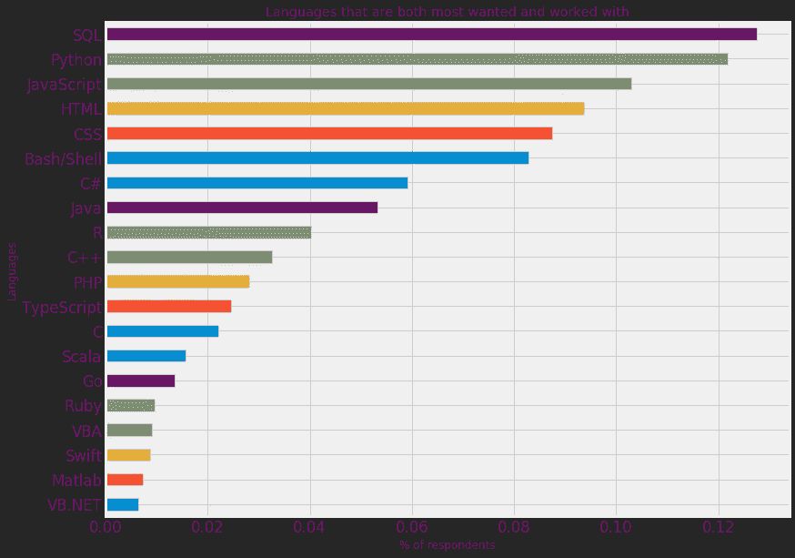
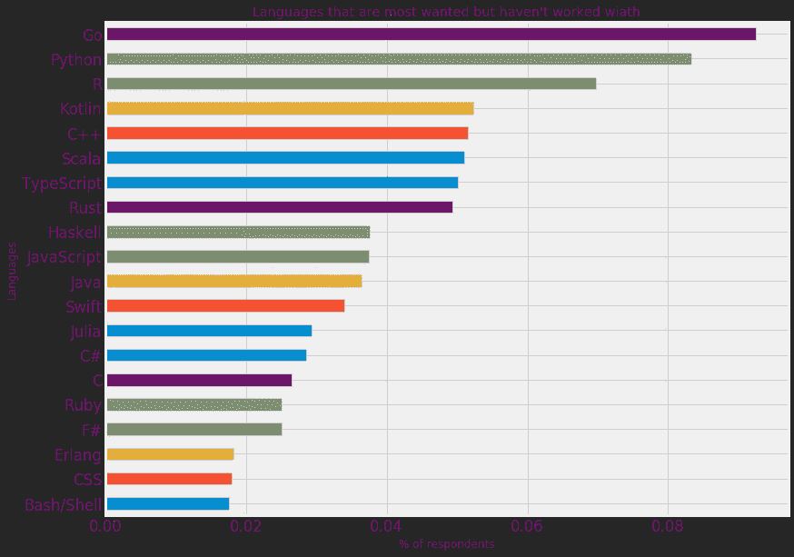
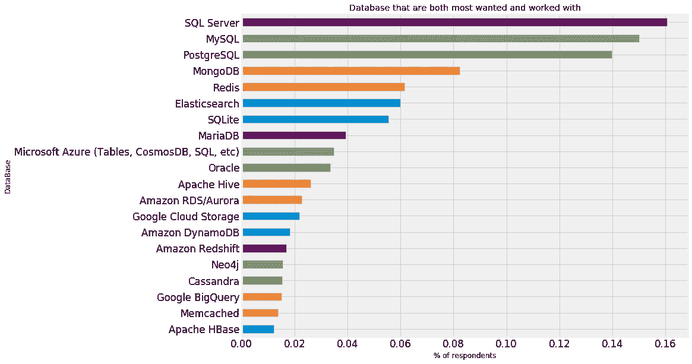
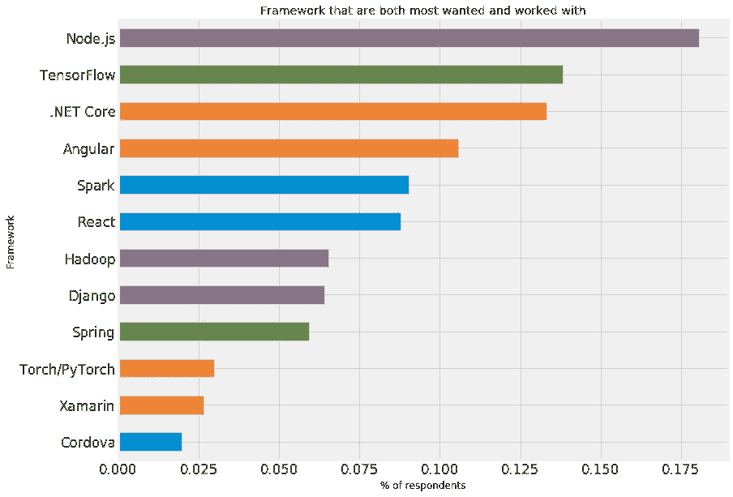
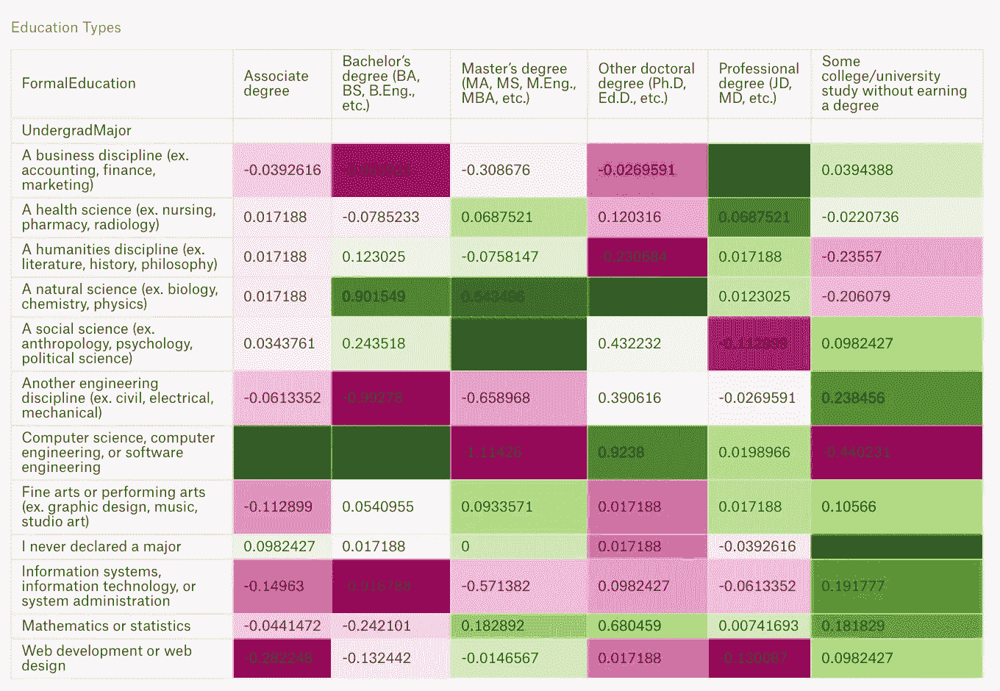
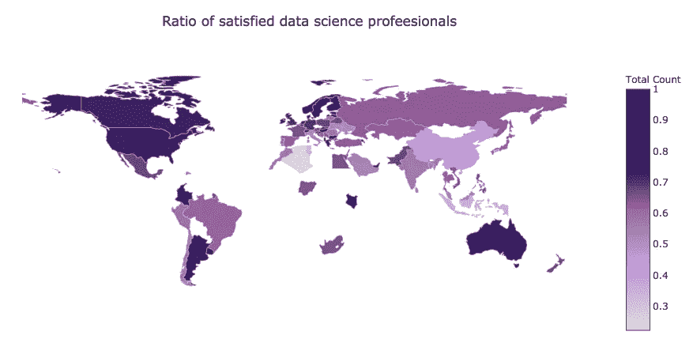
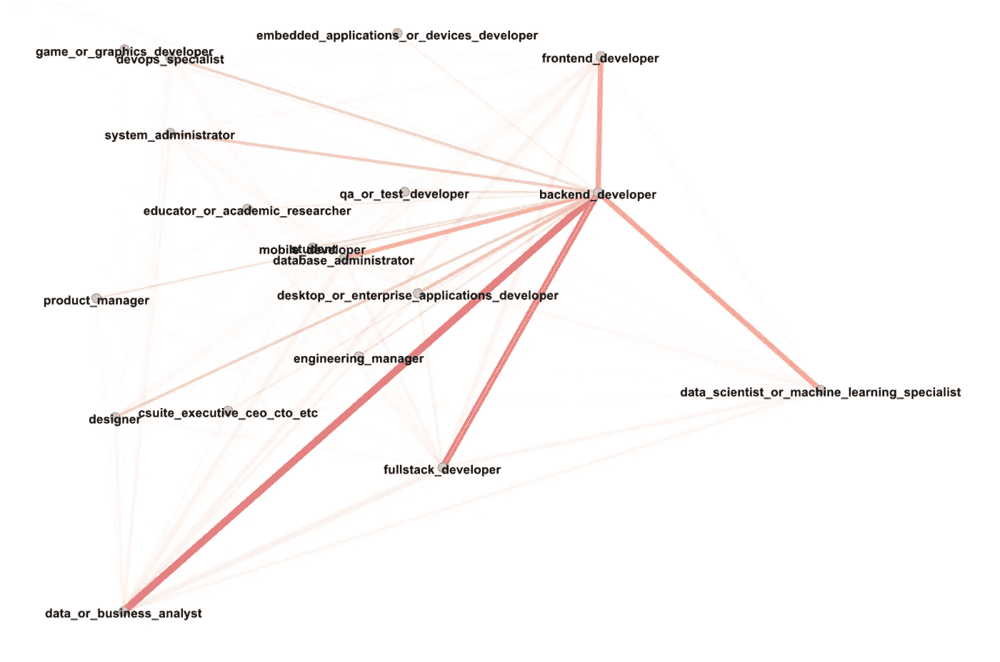
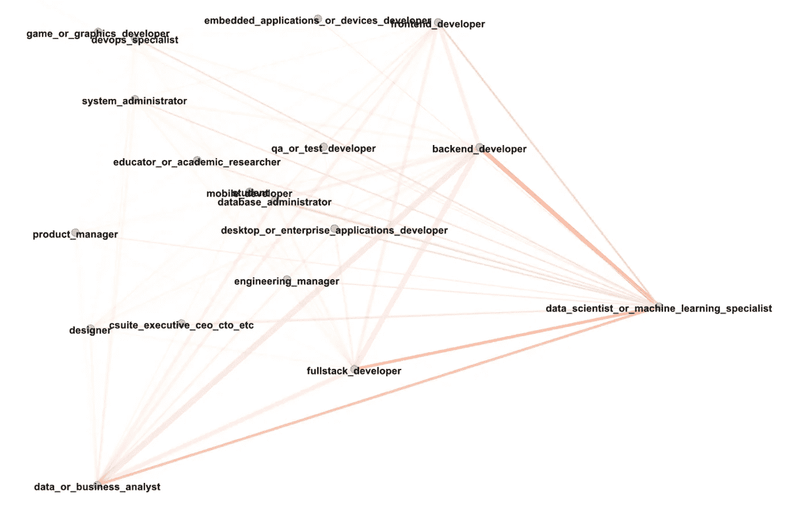
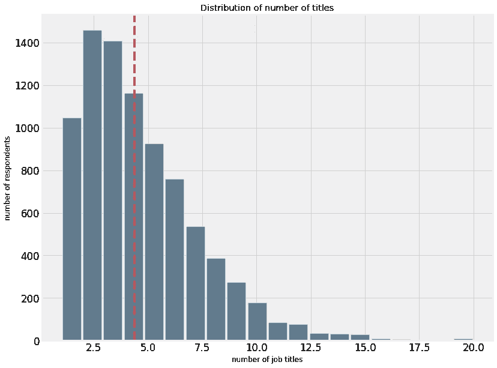
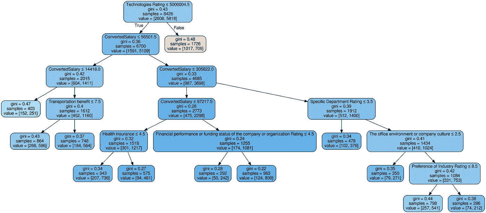

# 保持饥饿，保持愚蠢——深入了解 StackOverflow 2018 年调查

> 原文：<https://towardsdatascience.com/stay-hunger-stay-foolish-deep-dive-in-stackoverflow-2018-survey-e542b733e1f6?source=collection_archive---------14----------------------->

# 介绍

根据今年年初的 StackOverflow 调查，在 98，855 名开发人员中，有 11，971 人认为自己是数据科学专业人员。到目前为止，大约 65%的人对自己的职业感到满意，比开发人员社区高出 10%。作为一名 ML 人员，我对发现哪些技术将成为数据科学社区的趋势以及挖掘使数据科学专业人员对其职业满意的因素很感兴趣。

# 关于数据集

*   中位数工资约为 6.8 万英镑，平均工资为 11.5 万英镑
*   其中 75%是白人
*   其中 41%拥有高等学位(不限于计算机科学)
*   大约 50%的人拥有计算机科学学士学位
*   其中只有 6%是女性
*   他们中的一半大约在 25-34 岁之间

# 假设

*   Stack overflow 的数据是数据科学家群体的代表
*   所有列出的薪水都是以美元计算的(有关他们如何将受访者使用的当地货币转换为美元的信息，请参见他们的方法)
*   全职/兼职员工的抽样调查对象
*   本分析考虑了答卷人数超过 100 人的国家
*   数据科学家/数据分析师/业务分析师等开发类型被视为数据科学专业人员

# 目标

总体目标是深入了解数据科学家的职业生涯。特别关注影响数据科学家职业满意度的因素以及数据科学家使用的工具。我通过 4 个问题来实现总体目标:

1.  他们熟悉哪种语言、数据库或框架，他们正在寻找的另一个软件堆栈是什么？Python 和 R 无疑是数据科学社区的流行语言。然而，随着大数据成为一种新型的企业资产，数据科学专业人员可能必须更加熟悉 Scala 等其他语言，并开始从事并行编程工作。
2.  他们的简介是什么样的？学历影响职业满意度吗？数据科学专业人员位于何处，位置如何影响？
3.  “权力越大，责任越大”的观念是否让他们对自己的工作感到满意？换句话说，当专业人士成为任何数据的关键人物时，职业满意度是什么样的？
4.  工作环境或薪酬如何推动职业满意度？有太多的故事表明数据科学是 21 世纪最性感的工作，作为一名数据科学家，你可以赚很多钱，这看起来绝对是一份理想的工作。金钱真的是职业满意度的重中之重吗？

# 分析和总结

**Q1 —首先，Python 是数据科学专业人士的通用语言。其次，由于非结构化数据的增加，数据科学专业人员热衷于学习非 SQL 数据库中的技术，如 Elasticsearch。最后，与前端和深度学习相关的框架，这可能表明数据科学界对探索黑盒更感兴趣。**

在本节中，如果我们只查看每一栏中的整体技术，那么我们将忽略一些关系，例如**最想使用并且与**合作过的技术，或者**最想使用但是没有与**合作过的技术。所以我以**集**的形式对比了数据科学专业人士现在和明年在做的技术，这样我们就能找到两个问题的区别和交集。

## 编程语言图表摘要

*   Python、SQL、Javascript 在当前的数据科学专业人士中很流行，这种编程语言的需求也是存在的。

*   Go 是一种数据科学专业人员还没有机会接触但却很想探索的语言。
*   不管数据科学专业人员是否使用过 Python 语言，python 都很受欢迎。

## 数据库图表摘要

*   通过比较这些图，可以发现从 SQL 数据库到非 SQL 数据库的转变。
*   由于文本挖掘的需求，弹性搜索变得越来越流行

## 框架图概要

*   有趣的是，我们发现想要学习 pyTorch 的数据科学专业人士的数量正在增加。
*   数据科学专业更倾向于在**前端**和**深度学习**中学习框架。这是一个有趣的趋势，因为前端与可视化更相关。我想知道这些专业人士是否希望解耦黑盒算法。这也导致了一个结论，即数据科学专业人员希望学会以简单而有意义的方式交流和展示研究结果)

**Q2:目前为止，非计算机科学相关专业(工程、社会科学)的博士对自己的职业不太满意；基于 x 检验的结果，国家可以被认为是影响职业满意度的因素之一。**

## 教育类型

crosstab between education type and undergraduate major for the difference of career statisfication ratio

上表显示了各组之间的比率差异(满意与不满意)，除了统计学和自然科学背景之外，拥有非计算机科学本科专业博士学位的专业人士对他们的状况不太满意。另一方面，到目前为止，拥有硕士学位的计算机科学专业的受访者对他们的职业不太满意。更好地了解他们对工作不满意的原因。我想调查他们未来工作的下一步是什么。

## 地理

The darker the color means that more data science professionals are more satisfied with their career.

北美和北欧国家的数据科学专业人员似乎比其他国家多，约占调查受访者的 12%。(比率按国家标准化。)如地理图表所示，我们可以发现大多数国家的数据科学专业人员普遍对自己的职业感到满意。

*最后*，X 值为 311.13，p 值低于 0.05，因此，我会发现这是一个令人信服的证据，表明国家和职业满意度之间可能存在关系。

**Q3 —通过实施网络分析法，可视化了职称之间的共现关系。结果显示，数据科学专业人士认为自己平均属于四种不同的工作类型。程度中心性和接近中心性是解释受访者日常任务的指标。**

通过计算共生矩阵来创建网络。我们可以看到职称之间的加权优势。出现矩阵在自然语言处理中被广泛应用于单词表示。步骤如下:首先我们要清洗数据，考虑每个标题都是一个单词。其次，我们计算回答者的标题出现的次数。最后，我们通过乘以它的转置矩阵来计算共生矩阵。最后，我们将对角元素设置为零，因此网络中没有自循环

Co-occurrence network between job titles

上图是用网络分析软件 Gephi 应用网络分析探究职称关系的结果。**度中心性和接近中心性**是这里衡量的两个关键因素。通常，这两个因素用于衡量信息在网络中的共享程度。**度中心性**用于衡量职位如何连接在一起，而**接近中心性**一个节点越中心，它与所有其他节点的同现度就越低。再者，**后端开发人员**、**前端开发人员**、**数据或业务分析师**、**数据科学家或 ML 专员**等职位联系紧密，是学历较高的职位。另一方面，**市场营销或销售专业人员**具有最高的**亲密度中心性**，这表明这在数据科学专业人员中并不常见。与**后端开发人员**和**数据科学家或 ML 专家**头衔相关的更多细节见解将相应介绍。

Backend Developer

如上图所示，后端开发人员与数据或业务分析师的同现性更强。我认为他们的日常工作更多的是商业情报工作。我感到惊讶的是，数据分析师之间的权重比全栈开发人员之间的权重更大。虽然这里的权重可能是数据分析师认为自己是后端开发人员，或者相反，但权重仍然提供了大多数数据科学专业人员是跨职能的见解。

Data Scientist or Machine Learning Specialist

如上图所示，数据科学家或机器学习专家与后端工程师的同现度略强。然而，它几乎与每个标题都有联系。为了更好地理解，我们可以研究一下调查对象中头衔数量的分布。

如上图所示，职称的平均值介于 4 和 5 之间，中位数为 4。换句话说，大多数数据科学专业人员都认为自己是多重角色。可能是不同类型的开发人员或分析师。t 检验的结果表明 p 值接近于 0，从而拒绝了等均值的零假设。因此，头衔的数量也应该被认为是影响职业满意度的一个因素。

**Q4——正在使用与工作环境和薪酬相关的功能对决策树模型进行训练。结果表明，公司的技术等级比其他因素更重要。然而，很难说这是最重要的问题，因为开发人员档案还没有包含在模型中**

本节将使用决策树模型构建一个决策树模型，通过与工作环境和薪酬相关的特征来评估实现职业满意度的关键路径。

根据我们的模型，第一标准是技术评级，然后是工资。有趣的是，当工资低于 97217.5%时，受访者更关心基本生活福利，而不是办公环境。然而，上述结果不能作为数据科学专业人士的偏好，因为还有其他因素，如开发人员概况，技术不包括在该模式中。该模型可用于评估工作福利工作评估问卷的结果

正如你所看到的，数据科学家或机器学习专家拥有内向、外向、理性和情感技能的良好组合。更重要的是，数据科学是一个不断变化的领域。虽然基础知识——如数学背景或您必须使用的语言(Python、SQL、R、bash)——被认为是常青树知识，但新的方法、工具、技巧和解决方案每年都会出现。因此，如果你想找一份数据科学家的工作，学习是你必须享受的第一件事。