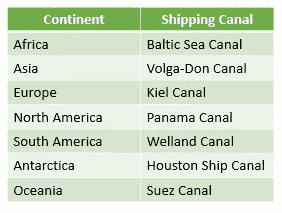
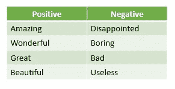
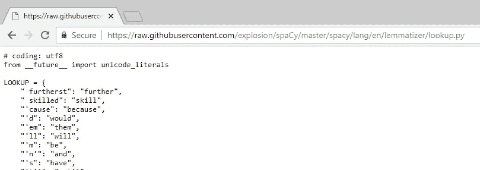

# 走出面向特征工程的正则表达式

> 原文：<https://towardsdatascience.com/step-out-from-regular-expression-for-feature-engineering-134e594f542c?source=collection_archive---------10----------------------->

“woman holding book” by [Eliabe Costa](https://unsplash.com/@eliabevces?utm_source=medium&utm_medium=referral) on [Unsplash](https://unsplash.com?utm_source=medium&utm_medium=referral)

在之前的博客中，我介绍了基于[模式的识别](/pattern-based-recognition-did-help-in-nlp-5c54b4e7a962)方法，它在某些情况下很有帮助。我们有其他方法来解决类似的问题吗？是的，我们也可以使用基于词典的方法。

现在，许多人也提到无词典方法来解决分类问题。如果你有训练数据，你应该选择无词典方法来建立深度学习模型。如果没有训练数据怎么办？您可以使用基于模式的方法(正则表达式)或基于词典的方法来准备初始数据集。

看完这篇文章，你会明白:

*   什么是基于词典的识别？
*   我们如何在特征工程阶段利用词典？
*   谁使用基于词汇的方法？
*   拿走

# 什么是基于词典的识别？

词汇在不同的语境下有不同的含义。在自然语言处理上下文中，词典是一个预定义的词汇列表。它可以是任何词汇，如位置、名称等。但是它很少跨越不同类别形成。例如，它可以是位置词典、命名词典，但是除非有某种意义，否则不能将不同类别项目混合在一起。

Photo: [https://pixabay.com/en/planning-housebuilding-pre-project-3536758/](https://pixabay.com/en/planning-housebuilding-pre-project-3536758/)

对于位置，它可以是位置列表，例如香港、东京。我们也可以有一个运河词典，其中包括“波罗的海运河”，“巴拿马运河”。不知何故，我们可以使用正则表达式来识别它，但我们不会这样做，因为它可能会引入很多错误，例如它可能很容易与命名组织混淆。

# 我们如何在特征工程阶段利用词典？

***直言特征***

在进行传统的机器学习时，我们必须手动构建大量的特征。在这种情况下，词典确实很有帮助。

根据以前的经验，我必须从文章中提取大洲。代替训练 NER，我可以简单地构建一个预定义的海洋列表，并使用精确匹配来构建特征。由于地球上只有七大洲，所以可以非常快地完成。

当然，也有一定的局限性。如果文章内容涉及旅行，我会有麻烦，因为“欧洲铁路”是一家公司，但它可能会标记为一个大洲。

***二元特征***

另一个著名的用例与情感分类问题有关。我们可以建立一个积极和消极的情绪词典来对评论的意义进行分类。

例如，“好的”和“漂亮的”可以从积极情感词汇中找到，而“坏的”、“无用的”是消极情感词汇。给定一个预定义的列表，我们不需要建立任何模型，只需要对正面和负面情感词汇的总得分进行求和。

同样，有一些限制，即否定和花费大量时间来建立列表。例如，评论可以是“它不好”。有一个否定词，它可以改变意思相反。对于积极和消极情感词典，建立高覆盖率词典并不容易。

# 谁使用基于词汇的方法？

有时你可能已经使用了基于词汇的方法，但你可能已经意识到了。下面将展示哪个库使用基于词典的方法来处理任务。

在空间上，它使用基于词典的方法来处理一些异常。

Capture from spaCy source code

Ghosh 等人[1]在 2017 年提出使用情感词典来解决情感分类问题。在预处理阶段，它们执行标准任务，包括归一化和去除。该功能建立在手工词典和预定义词典基础上，是 Senti-WordNet 和意见词典。

以下是部分功能:

*   Senti-WordNet 匹配的单词数
*   与意见词典匹配的单词数
*   与英语情感词匹配的单词数

# 拿走

*   不要认为基于词典的方法是一种肮脏的方法，并努力避免这种方法。在某些情况下，它甚至比其他方法更有效。
*   **初期可以采用**，建议尽快用另一种方式替代。
*   在大多数情况下，你**需要有** **一个完整的列表(或者接近完整的列表)**，这样它才能像预期的那样工作。

# 关于我

我是湾区的数据科学家。专注于数据科学、人工智能，尤其是 NLP 和平台相关领域的最新发展。你可以通过[媒体博客](http://medium.com/@makcedward/)、 [LinkedIn](https://www.linkedin.com/in/edwardma1026) 或 [Github](https://github.com/makcedward) 联系我。

# 参考

[1] Ghosh Souvick、Ghosh Satanu 和 Das Dipankar。“代码混合社交媒体文本中的情感识别”。2017 年 7 月 4 日。[https://arxiv.org/pdf/1707.01184.pdf](https://arxiv.org/pdf/1707.01184.pdf)

[2]爱森斯坦·雅各布。“基于词典分类的无监督学习”。2016 年 11 月 21 日。[https://arxiv.org/pdf/1611.06933.pdf](https://arxiv.org/pdf/1611.06933.pdf)

[3]科尔奇纳。奥尔加，苏萨·塔西斯，菲利普·C。“Twitter 情感分析:词典方法、机器学习方法及其组合”。2015 年 9 月 18 日。[https://arxiv.org/pdf/1507.00955.pdf](https://arxiv.org/pdf/1507.00955.pdf)