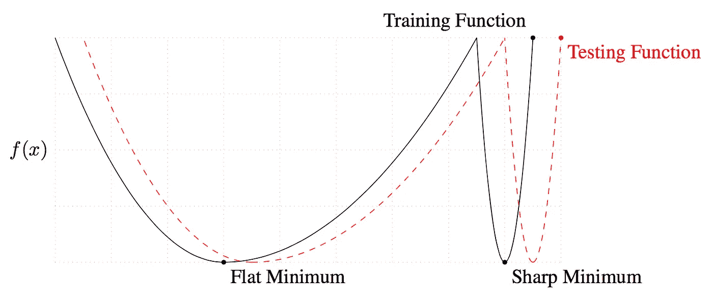

# 随机加权平均——一种获得深度学习最新结果的新方法

> 原文：<https://towardsdatascience.com/stochastic-weight-averaging-a-new-way-to-get-state-of-the-art-results-in-deep-learning-c639ccf36a?source=collection_archive---------2----------------------->

**更新**:你现在可以在我的个人博客上欣赏这篇文章[，这里的数学排版要好得多(Medium 不支持数学渲染，尽管有很多请求)。](https://pechyonkin.me/stochastic-weight-averaging/)

在这篇文章中，我将讨论两篇有趣的近期论文，它们提供了一种简单的方法，通过使用一种智能的集成方法来提高任何给定神经网络的性能。它们是:

1.  [损失表面、模式连接和 dnn 的快速组装](https://arxiv.org/abs/1802.10026)。铝
2.  伊兹迈洛夫等人的“平均权重导致更宽的最优值和更好的泛化能力”。铝

额外的先决条件阅读将使这篇文章的内容更容易理解:

*   Vitaly Bushaev 的“提高学习率，改进我们的工作方式”

# 神经网络的传统集成

传统的集成将几个不同的模型结合起来，并使它们对相同的输入进行预测。然后使用某种平均方法来确定系综的最终预测。它可以是简单的投票、平均或者甚至是基于集合中模型的输入来学习预测正确值或标签的另一个模型。岭回归是一种结合几种预测的特殊方法，被获奖的机器学习实践者使用。

Snapshot Ensemble is created by saving a model each time the learning rate cycle is at the end. Then the saved models are used together during prediction. [Source](https://arxiv.org/abs/1704.00109).

当应用于深度学习时，集成可用于组合几个神经网络的预测，以产生一个最终预测。通常，在集成中使用不同架构的神经网络是一个好主意，因为它们可能会在不同的训练样本上出错，因此集成的好处会更大。

Snapshot ensemble uses cyclical learning rates with annealing. [Source](https://techburst.io/improving-the-way-we-work-with-learning-rate-5e99554f163b).

然而，你也可以用相同的架构集合模型，它会给出令人惊讶的好结果。在[快照集成论文](https://arxiv.org/abs/1704.00109)中提出了一个利用这种方法的非常酷的技巧。作者在训练相同的网络时拍摄权重快照，然后在训练后创建具有相同架构但不同权重的网络集合。这可以提高测试性能，而且这也是一种非常便宜的方法，因为你只需训练一个模型一次，只是不时地节省重量。

更多细节可以参考[这篇牛逼的帖子](https://techburst.io/improving-the-way-we-work-with-learning-rate-5e99554f163b)。如果你还没有使用循环学习率，那么你肯定应该使用，因为它已经成为标准的最先进的训练技术，非常简单，计算量不大，并且几乎不需要额外的成本就可以获得显著的收益。

上面所有的例子都是模型空间中的**集合，因为它们组合了几个模型，然后使用模型的预测来产生最终的预测。**

然而，在我在这篇文章中讨论的论文中，作者提议在权重空间中使用一个**小说集合。这种方法通过**组合同一网络在不同训练阶段的权重**来产生一个集成，然后使用这个具有组合权重的模型来进行预测。这种方法有两个好处:**

*   当组合权重时，我们最终仍然得到一个模型，这加快了预测的速度
*   事实证明，这种方法胜过当前最先进的快照集合

让我们看看它是如何工作的。但是首先我们需要了解一些关于损失曲面和广义解的重要事实。

# 重量空间中的解决方案

第一个重要的见解是，一个经过训练的网络是多维权重空间中的一个**点。对于给定的体系结构，每个不同的网络权重组合都会产生一个单独的模型。由于任何给定的架构都有无限多种权重组合，因此会有无限多种解决方案。训练神经网络的目标是找到特定的解决方案(权重空间中的点),该解决方案将在训练和测试数据集上提供损失函数的低值。**

在训练过程中，通过改变权值，训练算法改变网络并在权值空间中行进。梯度下降算法在该空间中的损失平面上行进，其中平面高程由损失函数值给出。

# 窄和宽最优

很难想象和理解多维权重空间的几何形状。同时，理解它是非常重要的，因为随机梯度下降本质上是在训练时遍历这个高维空间中的一个损失面，并试图找到一个好的解——损失面上损失值较低的“点”。众所周知[这样的曲面有很多局部最优](https://arxiv.org/abs/1412.0233)。但事实证明，并不是所有的都一样好。

> 辛顿:“要处理 14 维空间中的超平面，想象一个 3 维空间，大声对自己说‘14’。大家都这么干。”([来源](https://www.coursera.org/learn/neural-networks/lecture/sPEhK/a-geometrical-view-of-perceptrons-6-min))

Narrow and wide optima. Flat minimum will produce similar loss during training and testing. Narrow loss, however, will give very different results during training and testing. In other words, wide minimum is more generalizable than narrow. [Source](https://arxiv.org/abs/1609.04836).

一个可以区分好的解决方案和坏的解决方案的度量是它的*平坦度*。想法是训练数据集和测试数据集将产生相似但不完全相同的损失表面。你可以想象一个测试表面会相对于火车表面移动一点。对于狭窄的解决方案，在测试期间，由于这种偏移，给出低损耗的点可能具有大的损耗。这意味着这种“狭隘”的解决方案不能很好地推广——训练损失低，而测试损失大。另一方面，对于“宽”和扁平的解决方案，这种转变将导致培训和测试损失彼此接近。

我解释了窄解和宽解之间的区别，因为这篇文章的重点是新的方法，它可以产生好的宽解。

# 快照集成

最初，SGD 将在重量空间进行大的跳跃。然后，随着学习速率由于余弦退火而变得更小，SGD 将收敛到某个局部解，并且算法将通过将模型添加到集成来拍摄模型的“快照”。然后，速率再次被重置为高值，SGD 在收敛到某个不同的局部解之前再次进行大的跳跃。

快照集合方法中的周期长度是 20 到 40 个历元。长学习率周期的想法是能够在权重空间中找到足够不同的模型。如果模型过于相似，那么集合中独立网络的预测将会过于接近，集合的好处将会忽略不计。

快照集合工作得非常好，并且提高了模型性能，但是快速几何集合工作得更好。

# 快速几何装配(FGE)

[快速几何组合](https://arxiv.org/abs/1802.10026)与快照组合非常相似，但有一些区别特征。它使用线性分段循环学习率调度代替余弦。其次，FGE 的周期长度要短得多——每个周期只有 2 到 4 个时期。乍一看，短周期是错误的，因为每个周期结束时的模型会彼此靠近，因此将它们组合在一起不会带来任何好处。然而，正如作者所发现的，因为在足够不同的模型之间存在低损耗的连接路径，所以有可能沿着这些路径以小步骤行进，并且沿途遇到的模型将足够不同，从而允许以良好的结果集合它们。因此， **FGE 显示出与快照集相比的改进，并且需要更小的步骤来找到模型**(这使得训练更快)。

LEFT: Traditional intuition is that good local minima are separated by regions of high loss. This is true if we travel along the lines connecting local minima. MIDDLE and RIGHT: However, there exist paths between local minima, such that loss stays low on these paths. FGE takes snapshots along these paths and creates an ensemble out of the snapshots. [Source](https://arxiv.org/abs/1802.10026).

为了从快照集成或 FGE 中受益，需要存储多个模型，然后在对最终预测进行平均之前对所有模型进行预测。因此，对于系综的额外性能，需要付出更高的计算量。所以那里没有免费的午餐。还是有？这就是随机加权平均的新论文的用武之地。

# 随机加权平均法

[**随机加权平均**](https://arxiv.org/abs/1803.05407) **非常接近快速几何集合，但计算损失很小**。SWA 可以应用于任何体系结构和数据集，并在所有的体系结构和数据集上都显示出良好的效果。这篇论文表明 SWA 导致了更宽的最小值，我在上面讨论了它的好处。SWA 不是传统意义上的合奏。在训练结束时，你得到一个模型，但它的性能胜过快照集，接近 FGE。

LEFT: W1, W2 and W3 represent 3 independently trained networks, Wswa is the average of them. MIDDLE: Wswa provides superior performance on the test set as compared to SGD. RIGHT: Note that even though Wswa shows worse loss during training, it generalizes better. [Source](https://arxiv.org/abs/1803.05407).

SWA 的直觉来自经验观察，即在每个学习率周期结束时，局部最小值倾向于在损失值较低的损失表面区域的边界处累积(点 W1、W2 和 W3 位于上图左面的红色低损失区域的边界处)。通过取几个这样的点的平均值，有可能以更低的损失获得广泛的、可概括的解决方案(上图左图中的 Wswa)。

这是它的工作原理。您只需要两个模型，而不是许多模型的集合:

*   存储模型权重的移动平均值的第一个模型(公式中的 w_swa)。这将是训练结束后用于预测的最终模型。
*   第二个模型(公式中的 w)将遍历权重空间，通过使用循环学习率时间表来探索它。

Stochastic Weight Average weight update equation. [Source](https://arxiv.org/abs/1803.05407).

在每个学习率周期结束时，第二个模型的当前权重将用于更新运行平均模型的权重，方法是在旧的运行平均权重和第二个模型的新权重集之间取加权平均值(左图中提供了公式)。按照这种方法，您只需要训练一个模型，并且在训练期间只在内存中存储两个模型。对于预测，您只需要运行平均模型，对其进行预测比使用上述集成快得多，在集成中，您使用许多模型进行预测，然后对结果进行平均。

# 履行

论文作者提供了他们自己在 PyTorch 中的实现。

此外，SWA 在每个人都应该使用的[超棒的 fast.ai 库](https://github.com/fastai/fastai/pull/276/commits)中实现。如果你还没看过他们的课程，那么[跟随](http://www.fast.ai/)[链接](https://github.com/fastai/fastai)。

# 感谢阅读！如果你喜欢，点击下面的按钮[在](https://pechyonkin.me/subscribe/)[我的网站](https://pechyonkin.me/)上订阅更新！这对我意义重大，鼓励我写更多这样的故事。

*可以在 Twitter 上* [*关注我*](https://twitter.com/max_pechyonkin) *。下面我们也连线上*[*LinkedIn*](https://www.linkedin.com/in/maxim-pechyonkin-phd/)*。*