# Python 中的股票预测

> 原文：<https://towardsdatascience.com/stock-prediction-in-python-b66555171a2?source=collection_archive---------0----------------------->


**学习真正的蟒蛇时制造(和失去)假财富**

试图预测股市对数据科学家来说是一个诱人的前景，他们的动机与其说是为了物质利益，不如说是为了挑战。我们看到市场每天的涨跌，想象一定有我们或我们的模型可以学习的模式，以击败那些有商业学位的日内交易者。自然，当我开始使用可加模型进行时间序列预测时，我必须在股票市场的试验场用模拟资金测试该方法。不可避免的是，我加入了那些试图日复一日战胜市场却失败的人的行列。然而，在这个过程中，我学到了大量的 Python，包括面向对象编程、数据操作、建模和可视化。我也发现了为什么我们应该避免在不损失一美元的情况下玩每日股票市场(我只能说玩长线游戏)！

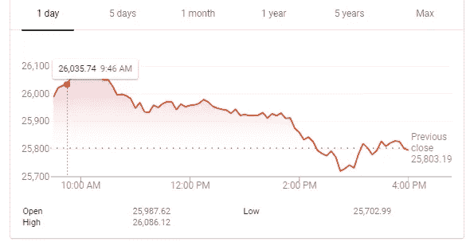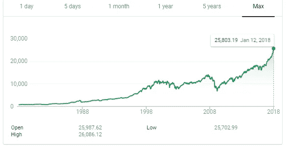

One day vs 30 years: which would you rather put your money on?

当我们在任何任务中，而不仅仅是在数据科学中，没有立即获得成功时，我们有三个选择:

1.  调整结果，让它看起来像我们成功了
2.  隐藏结果，这样没人会注意到
3.  展示我们所有的成果和方法，以便他人(和我们自己)可以学习如何把事情做得更好

虽然第三种选择在个人和社区层面上是最好的选择，但实施起来需要最大的勇气。当我的模型带来可观的利润时，我可以有选择地选择范围，或者我可以扔掉它，假装我从来没有花时间在它上面。这似乎太天真了！我们通过反复失败和学习来进步，而不仅仅是促进我们的成功。而且，为一个困难任务写的 Python 代码，不是白写的 Python 代码！

这篇文章记录了我用 Python 开发的“股票浏览器”工具 Stocker 的预测能力。[在之前的文章](/stock-analysis-in-python-a0054e2c1a4c)中，我展示了如何使用 Stocker 进行分析，GitHub 上的[完整代码可供任何想要自己使用或为项目做出贡献的人使用。](https://github.com/WillKoehrsen/Data-Analysis/tree/master/stocker)

# 预测用储料器

Stocker 是一个用于股票探索的 Python 工具。一旦我们安装了所需的库(查看文档),我们就可以在与脚本相同的文件夹中启动一个 Jupyter 笔记本，并导入 Stocker 类:

```
from stocker import Stocker
```

现在可以在我们的会话中访问该类。我们通过向 Stocker 类传递任何有效的股票行情自动收录器来构造一个对象( **bold** 是输出):

```
amazon = Stocker('AMZN')**AMZN Stocker Initialized. Data covers 1997-05-16 to 2018-01-18.**
```

就像我们有 20 年的每日亚马逊股票数据要探索一样！Stocker 建立在 Quandl 金融图书馆的基础上，有 3000 多种股票可供使用。我们可以使用`plot_stock`方法绘制一个简单的股票历史图:

```
amazon.plot_stock()**Maximum Adj. Close = 1305.20 on 2018-01-12.
Minimum Adj. Close = 1.40 on 1997-05-22.
Current Adj. Close = 1293.32.**
```


Stocker 的分析功能可用于发现数据中的总体趋势和模式，但我们将专注于预测未来价格。Stocker 中的预测是使用加法模型做出的[，该模型将时间序列视为不同时间尺度(如每日、每周和每月)上的总体趋势和季节性的组合。Stocker 使用脸书开发的 prophet 软件包进行附加建模。使用 Stocker 可以在一行中创建模型并做出预测:](/stock-analysis-in-python-a0054e2c1a4c)

```
# predict days into the future
model, model_data = amazon.create_prophet_model(days=90)**Predicted Price on 2018-04-18 = $1336.98**
```

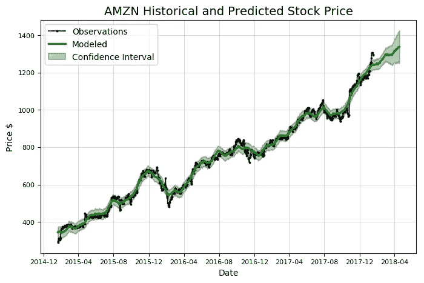

请注意，预测中的绿线包含一个置信区间。这代表了模型在预测中的不确定性。在这种情况下，置信区间宽度被设置为 80%，这意味着我们期望这个范围在 80%的时间内包含实际值。置信区间随着时间的推移变得越来越宽，因为估计值随着远离数据而具有更多的不确定性。任何时候我们做预测都必须包括一个置信区间。虽然大多数人倾向于想要一个关于未来的简单答案，但我们的预测必须反映出我们生活在一个不确定的世界中！

任何人都可以进行股票预测:简单地选择一个数字，这就是你的估计(我可能是错的，但我很确定这是华尔街所有人都做的)。为了让我们相信我们的模型，我们需要评估它的准确性。Stocker 中有许多评估模型准确性的方法。

# 评估预测

为了计算准确度，我们需要一个测试集和一个训练集。我们需要知道测试集的答案——实际的股票价格，因此我们将使用过去一年的历史数据(在我们的例子中是 2017 年)。训练时，我们不让模型看到测试集的答案，所以我们使用测试时间范围(2014-2016)之前三年的数据。监督学习的基本思想是模型从训练集中学习数据中的模式和关系，然后能够正确地为测试数据重现它们。

我们需要量化我们的准确性，因此我们使用测试集的预测和实际值，我们计算指标，包括测试和训练集的平均美元误差、我们正确预测价格变化方向的时间百分比，以及实际价格落在预测的 80%置信区间内的时间百分比。所有这些计算都是由 Stocker 以直观的方式自动完成的:

```
amazon.evaluate_prediction()**Prediction Range: 2017-01-18 to 2018-01-18.

Predicted price on 2018-01-17 = $814.77.
Actual price on    2018-01-17 = $1295.00.

Average Absolute Error on Training Data = $18.21.
Average Absolute Error on Testing  Data = $183.86.

When the model predicted an increase, the price increased 57.66% of the time.
When the model predicted a  decrease, the price decreased  44.64% of the time.

The actual value was within the 80% confidence interval 20.00% of the time.**
```

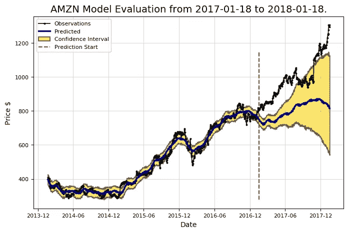

这些都是糟糕的数据！我们还不如抛硬币呢。如果我们用这笔钱来投资，我们可能会更好地购买一些明智的东西，如彩票。然而，不要放弃这个模型。我们通常认为第一个模型相当糟糕，因为我们使用的是默认设置(称为超参数)。如果我们最初的尝试不成功，我们可以调整这些旋钮来制造更好的模型。在 Prophet 模型中有许多不同的设置需要调整，其中最重要的是 changepoint prior scale，它控制模型在数据趋势变化中所占的权重。

# 变点优先选择

变点表示时间序列从增加到减少或从缓慢增加到快速增加(反之亦然)。它们出现在时间序列中[变化率最大的地方。变点先验比例表示模型中变点的强调程度。这用于控制](https://facebook.github.io/prophet/docs/trend_changepoints.html)[过拟合与欠拟合](http://scikit-learn.org/stable/auto_examples/model_selection/plot_underfitting_overfitting.html)(也称为偏差与方差权衡)。

更高的先验创建的模型在变点上具有更大的权重和更灵活的拟合。这可能会导致过度拟合，因为模型会紧密地粘着训练数据，而不能推广到新的测试数据。降低先验会降低模型的灵活性，这会导致相反的问题:拟合不足。当我们的模型没有足够紧密地跟踪训练数据，并且未能学习底层模式时，就会发生这种情况。找出适当的设置来实现正确的平衡更多的是一个工程问题，而不是理论问题，在这里我们必须依靠经验结果。Stocker 类包含两种不同的方法来选择合适的先验:直观的和定量的。我们可以从图解法开始:

```
# changepoint priors is the list of changepoints to evaluate
amazon.changepoint_prior_analysis(changepoint_priors=[0.001, 0.05, 0.1, 0.2])
```


在这里，我们根据三年的数据进行训练，然后显示六个月的预测。我们在这里没有量化预测，因为我们只是试图理解变点先验的作用。这张图很好地说明了欠拟合和过拟合！最低的先验，蓝线，没有非常紧密地跟随训练数据，即黑色的观察值。它有点像是在做自己的事情，在数据的大致范围内选择一条路线。相比之下，最高的先验(黄线)尽可能接近地坚持训练观察。变点先验的默认值是 0.05，介于两个极端值之间。

还要注意先验不确定性(阴影区间)的差异。最低先验对*训练*数据的不确定性最大，但对*测试*数据的不确定性最小。相反，最高先验在*训练*数据上具有最小的不确定性，但是在*测试*数据上具有最大的不确定性。先验越高，它对训练数据就越有信心，因为它紧密地跟随每个观察。然而，当涉及到测试数据时，由于没有任何数据点来锚定，过拟合模型会丢失。由于股票有相当多的可变性，我们可能需要一个比默认模型更灵活的模型，以便该模型可以捕捉尽可能多的模式。

既然我们对先验的影响有了一个概念，我们可以使用一个训练和验证集对不同的值进行数值评估:

```
amazon.changepoint_prior_validation(start_date='2016-01-04', end_date='2017-01-03', changepoint_priors=[0.001, 0.05, 0.1, 0.2])**Validation Range 2016-01-04 to 2017-01-03.

  cps  train_err  train_range    test_err  test_range
0.001  44.507495   152.673436  149.443609  153.341861
0.050  11.207666    35.840138  151.735924  141.033870
0.100  10.717128    34.537544  153.260198  166.390896
0.200   9.653979    31.735506  129.227310  342.205583**
```

在这里，我们必须小心，我们的验证数据和我们的测试数据是不一样的。如果是这种情况，我们将为测试数据创建最佳模型，但这样我们将会过度拟合测试数据，并且我们的模型不能转化为真实世界的数据。总的来说，正如数据科学中通常所做的那样，我们使用三个不同的数据集:训练集(2013-2015)，验证集(2016)，测试集(2017)。

我们用四个度量标准评估了四个先验:训练误差、训练范围(置信区间)、测试误差和测试范围(置信区间)，所有值都用美元表示。正如我们在图中看到的，先验越高，训练误差越低，训练数据的不确定性越低。我们还看到，更高的先验降低了我们的测试误差，支持了我们的直觉，即紧密拟合数据是股票的一个好主意。作为对测试集更高准确性的交换，随着先验的增加，我们在测试数据上获得了更大范围的不确定性。

“储料器优先验证”还显示了说明这些点的两个图表:

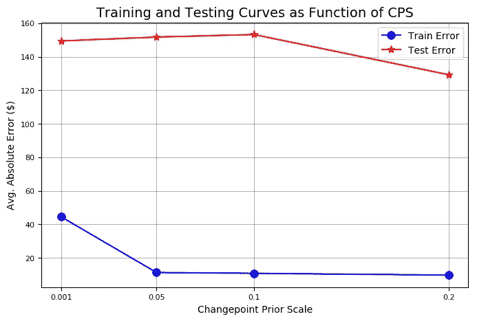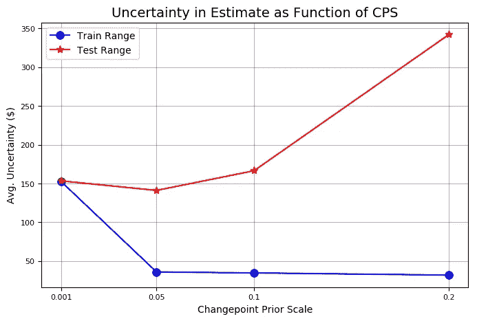

Training and Testing Accuracy Curves and Uncertainty for Different Changepoint Prior Scales

由于最高的先验产生最低的测试误差，我们应该尝试将先验增加得更高，看看我们是否能获得更好的性能。我们可以通过向验证方法传递额外的值来改进我们的搜索:

```
# test more changepoint priors on same validation range
amazon.changepoint_prior_validation(start_date='2016-01-04', end_date='2017-01-03', changepoint_priors=[0.15, 0.2, 0.25,0.4, 0.5, 0.6])
```

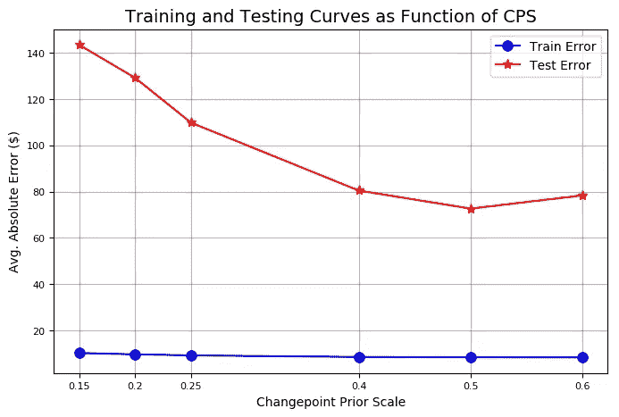

Refined Training and Testing Curves

测试集误差在先验值为 0.5 时最小。我们将适当地设置 Stocker 对象的 changepoint prior 属性。

```
amazon.changepoint_prior_scale = 0.5
```

我们可以调整模型的其他设置，例如我们期望看到的模式，或者模型使用的数据的训练年数。寻找最佳组合只需要用许多不同的值重复上述过程。请随意尝试任何设置！

## 评估精炼模型

既然我们的模型已经优化，我们可以再次评估它:

```
amazon.evaluate_prediction()**Prediction Range: 2017-01-18 to 2018-01-18.

Predicted price on 2018-01-17 = $1164.10.
Actual price on    2018-01-17 = $1295.00.

Average Absolute Error on Training Data = $10.22.
Average Absolute Error on Testing  Data = $101.19.

When the model predicted an increase, the price increased 57.99% of the time.
When the model predicted a  decrease, the price decreased  46.25% of the time.

The actual value was within the 80% confidence interval 95.20% of the time.**
```

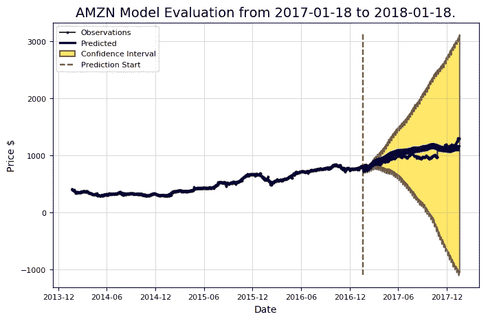

这样看起来更好！由此可见[模型优化](/improving-random-forest-in-python-part-1-893916666cd)的重要性。使用默认值提供了一个合理的初步猜测，但我们需要确保我们使用的是正确的模型“设置”，就像我们试图通过调整平衡和渐变来优化立体声的声音一样(很抱歉使用了过时的参考)。

# 玩股票市场

做预测是一项有趣的工作，但真正有趣的是观察这些预测在实际市场中的表现。使用`evaluate_prediction`方法，我们可以在评估期内使用我们的模型“玩”股票市场。我们将使用我们的模型提供的策略，然后我们可以将其与在整个期间购买和持有股票的简单策略进行比较。

我们策略的规则很简单:

1.  模型预测股票每天都会上涨，我们在当天开始时买入股票，在当天结束时卖出。当模型预测价格下降时，我们不买任何股票。
2.  如果我们买了股票，价格在一天内上涨，我们就把涨幅乘以我们买的股票数量。
3.  如果我们买了股票，价格下跌，我们损失的是下跌的股票数量。

我们在整个评估期间每天都播放这个，在我们的情况下是 2017 年。若要播放，请将份额数添加到方法调用中。斯托克会用数字和图表告诉我们这个策略是如何实施的:

```
# Going big 
amazon.evaluate_prediction(nshares=1000)**You played the stock market in AMZN from 2017-01-18 to 2018-01-18 with 1000 shares.

When the model predicted an increase, the price increased 57.99% of the time.
When the model predicted a  decrease, the price decreased  46.25% of the time.

The total profit using the Prophet model = $299580.00.
The Buy and Hold strategy profit =         $487520.00.

Thanks for playing the stock market!**
```

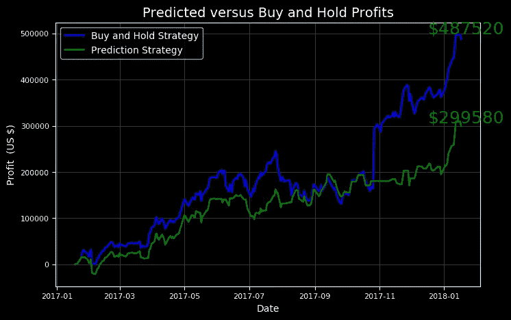

这给我们上了宝贵的一课:买入并持有！虽然按照我们的策略，我们会赚到一大笔钱，但更好的选择是进行长期投资。

我们可以尝试其他的测试期，看看我们的模型策略是否能战胜买入并持有法。我们的策略相当保守，因为当我们预测市场下跌时，我们不参与，所以当股票下跌时，我们可能期望比持有策略做得更好。

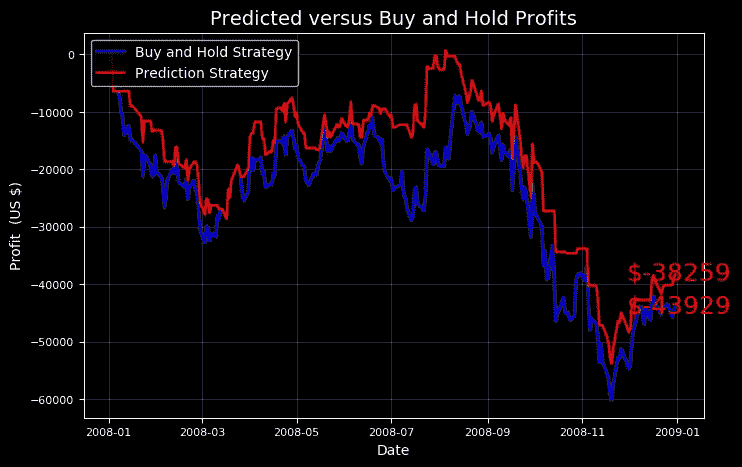

Always play with fake money!

我就知道我们的模特能行！然而，我们的模型只有在我们有后知之明选择测试期时才跑赢市场。

## 未来预测

既然我们对自己有一个像样的模型感到满意，我们可以使用`predict_future()`方法进行未来预测。

```
amazon.predict_future(days=10)
amazon.predict_future(days=100)
```

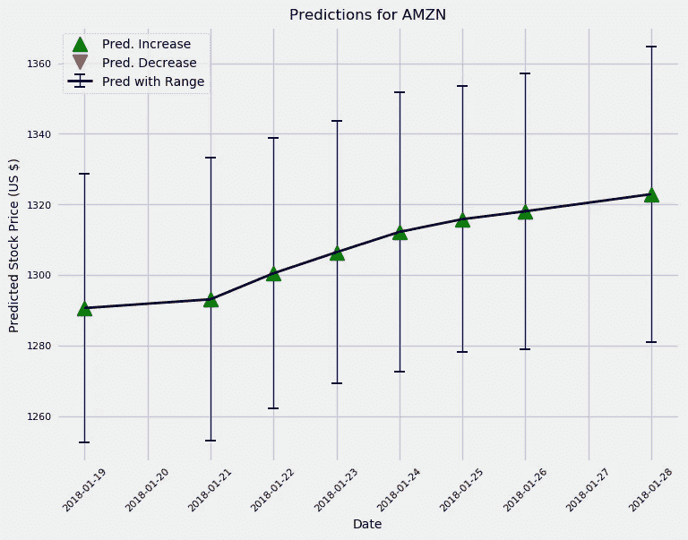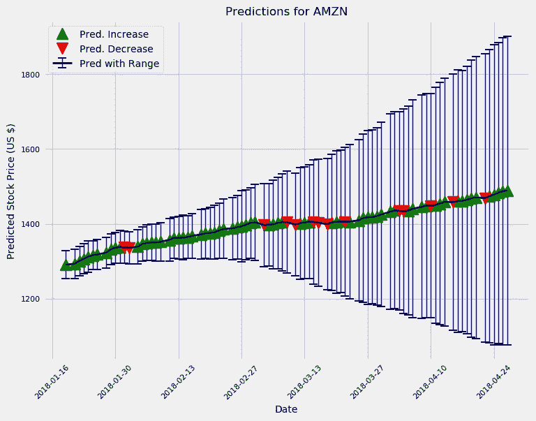

Predictions for the next 10 and 100 days

该模型总体上看好亚马逊，就像[大多数“专业人士”一样](http://markets.businessinsider.com/stock/amzn-Quote)此外，随着我们按照预期进行评估，不确定性会越来越大。实际上，如果我们使用这个模型进行积极的交易，我们将每天训练一个新的模型，并对未来最多一天进行预测。

虽然我们可能不会从 Stocker 工具中变得富有，但好处在于开发而不是最终结果！直到我们尝试了，我们才知道我们是否能解决问题，但是尝试过但失败了总比从来没有尝试过好！对于任何有兴趣查看代码或自己使用 Stocker 的人来说，GitHub 上有[。](https://github.com/WillKoehrsen/Data-Analysis/tree/master/stocker)

一如既往，我喜欢反馈和建设性的批评。我可以通过推特 [@koehrsen_will](https://twitter.com/koehrsen_will) 联系到。