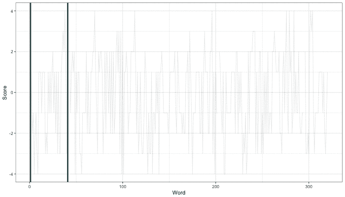
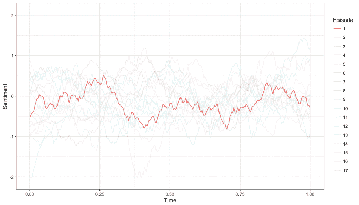
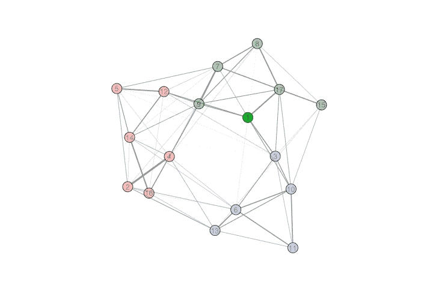

# 奇怪的事情:分析和交流数据的五个教训

> 原文：<https://towardsdatascience.com/stranger-things-five-lessons-for-analyzing-and-communicating-data-6f957ffffb15?source=collection_archive---------4----------------------->

作为一名统计领域的研究生，我很快意识到，不与数据打交道的人对*统计*这个词通常会有两种反应:“哦，我讨厌那门课！”和“你一定很喜欢数学！”

几年后，我从这些对话中感觉到，虽然许多人认为统计学和数据科学很重要，但大多数人认为这些技术太过深奥，无法解决他们在自己生活中遇到的问题或好奇心。

我最近尝试了两种方法来打破这种观点:1)使用数据来调查非统计学家可能会感兴趣的问题；2)以吸引人且易于理解的可视化方式呈现数据。

我最近参与的一个[项目](https://medium.freecodecamp.org/a-statistical-curiosity-voyage-through-the-emotion-of-stranger-things-e7bc8b2a6395)就是这两种努力的一个很好的例子。在这个项目中，我使用了广受欢迎的科幻节目[的公开脚本，试图理解该节目的创作者如何使用情感，以及这种情感如何影响观众的体验。一路上，我学到了一些关于如何有效地获取、分析和交流数据的东西。](https://en.wikipedia.org/wiki/Stranger_Things)

**1。数据是存在的，但它可能是混乱的**

互联网的兴起和用于分析大量数据集的方法的快速增长，往往使得任何问题似乎都可以通过足够的网络搜索和正确的工具来回答。事实往往要复杂一点。我通常发现，虽然很多数据可以在网上免费找到，但你常常不得不做出一些牺牲。

当我着手分析《陌生事物》的剧本时，我设想了一个丰富的数据集，里面有这部剧的所有台词，标有说这些台词的角色和台词发生的时间。我希望看到每个角色的发言时间，每个角色在每集中的个人情绪特征，甚至任何两个角色之间的对话模式。相反，这是我唯一能找到的:

我平静地接受了缺少说话者信息的事实，但仍然决心探究情感是如何在剧集中发展的。幸运的是，统计学找到了方法。我将每集中的单词串成长向量，并根据公开可用的词典为每个单词指定一个情感值。瞧，我有我的时间流的情感。不幸的是，网飞不够善良，无法在对话中说出所有角色的情绪，角色也不够可预测，无法从一种情绪平稳过渡到另一种情绪。这让我有了下一个认识:

**2。不要害怕半武断的决定**

与精心策划的私有数据集不同，公共数据的使用通常需要分析师在通往结果的道路上做出许多(有时是主观的)决策。有了包括非对话信息(“Joyce 咯咯笑”、“Mike 喘息”)和从单词到单词的快速情绪转换的情节向量，两个这样的决定几乎立即出现。

首先，我包括没有说的单词吗？我认为，是的，像咯咯笑和喘息这样的词包含了相关的信息。第二，我如何平滑轨迹，使它们更容易解释？我决定使用滑动窗口方法(如下图所示)，并选择了 40 个单词的窗口宽度。为什么是 40？嗯，剧集通常有 350 到 400 个词，有一个已知的情感分数，所以使用大约 10%的剧集数据似乎是一个很好的折中方案，介于使用太少数据和出现剧烈波动之间，以及使用太多数据和忽略重要的小规模变化之间。

像这样的决定可能是有风险的，所以根据情况，通常有两个好的选择来处理它们。对于重要的分析，最好尝试几个选项，以确保您的选择不会彻底改变您的结果。如果是这样，这可能是一个信号，表明应该以一种不那么武断的方式做出决定。对于不太重要的分析(比如，一个关于电视节目的周末项目)，最好至少让你的读者知道你的决定。在这两种情况下，提前做出这些决定可以为新的想法和技术打开大门。

在我的帖子中，我成功地提到了我选择的窗口宽度，这成为了与一位读者进行有趣的电话交谈的话题，尽管我忘记了包括我对非对话线索的决定，但另一位细心的读者[很好奇，问了](https://medium.com/@srikramanam/a-very-entertaining-and-enlightening-read-d1aab590e979)。在这两种情况下，读者对这些决定的意识导致了有价值的讨论和对未来研究的想法。

**3。丑陋的数字掩盖了有趣的结果**

许多统计学家和数据科学家都非常擅长数据可视化，但许多人在分析完成和最终产品创建完成之前，不会花时间让视觉效果变得有吸引力。有了清理过的情绪数据在手，那就是我被误导的方法。

我对数据的第一印象是一个意大利面条图，所有 17 条情感轨迹相互叠加。在仔细观察了每一个之后，我得出结论，它们似乎都在移动，但没有任何明显的模式。我很快按季节给它们涂上颜色，看看这两季是否倾向于显示不同的剧集轨迹，但两季的模式似乎大多是随机的。

幸运的是，在继续之前，我决定即使轨迹本身并没有提供太多信息，读者也可能希望有机会看看它们。因为堆叠的轨迹很难看到，所以我制作了一个动画，一次突出一集。

在看了几集之后，我开始注意到在轨迹上似乎有一些共同的模式。在根据两两相似性创建了剧集网络之后，我对数据应用了基于网络的聚类技术，发现了三组高度可解释的剧集:一组以高音开始，以低音结束，一组围绕中性波动，一组以低音开始，以高音结束。

这成为最有趣的发现之一，如果我没有在分析过程的早期花时间制作一个视觉上吸引人的数据表示，它可能会被错过。虽然快速散点图和直方图有其时间和地点，但通常重要的是要记住，图形越好，就越容易理解数据想要表达的意思。按照这些思路:

**4。让你的数据讲述自己的故事(但要小心)**

当我着手这个项目时，我设想了一项研究，研究剧集的情感特征如何与它们被批判性接受的方式相关联。我选择使用 [AV 俱乐部的评分](https://www.avclub.com/c/tv-review/stranger-things)，因为他们是最知名的发布每集评分的机构。不幸的是，他们当时还没有发布他们的最后两篇评论，这意味着我要等几天才能进行这些测试。在我等待的时候，我制作了一个网络结构的动画，看着剧集来回跳动，并注意到在每集之间网络上似乎有惊人的大跳跃。

相邻情节之间的这种明显不同成为一项分析的灵感，该分析显示相邻情节之间的相似性明显低于你预期的随机发生。这个结果让我推测，改变剧集的情感结构可能是一种让观众参与进来的写作或导演策略。最终，情感轨迹与 AV 俱乐部的评级没有明显的关系，但“让观众着迷于变化的轨迹”的发现很快成为读者的最爱，尽管我在开始分析时并没有想到这个测试。

然而，我把“但是要小心”放在这一节的标题中是有原因的。也就是说，尝试任何仅仅因为其他分析没有结果而看起来有希望的测试从来都不是一个好主意，因为在让数据讲述它们的故事和要求数据讲述不存在的故事之间有一条细微但重要的线。如果数据看起来不像有故事可讲，不要继续挖掘积极的结果。相反，想想你的假设可能有缺陷的地方，并写下你的负面结果。你永远不知道那些负面的结果会对其他人产生什么样的影响。但也许最重要的是:

**5。记住你的听众**

回顾这个项目，我不得不承认，尽管我有意识地努力让我的作品为广大观众所理解，但我认为我并不成功。虽然这项工作在数据科学家和统计学家中很受欢迎，但非统计领域的密友承认，他们不太能理解我的分析，而且这篇文章通常被认为是相当技术性的。

如果我能再做一次，有些事情我会做得不同。首先，我会花更多的时间来考虑我的作品希望接触到哪些人群，并仔细评估这个群体中的某个人对什么感兴趣，什么不感兴趣(甚至不可读)。第二，虽然不总是可能的，但我会致力于创建一个单独的部分来更详细地描述我的方法，从而在主帖子中腾出空间来进行更多概念性的解释和说明。

总的来说，这个项目是一次奇妙的学习经历，也是一次与程序员、数据科学家和陌生事物爱好者见面和分享想法的好机会。如果在这个过程中，我能够启发更多的非统计学家考虑统计在日常生活中的相关性，或者向数据分析师介绍他们可以用于自己研究的新方法，那么这些时间是非常值得的。

**探索项目**[此处](https://medium.freecodecamp.org/a-statistical-curiosity-voyage-through-the-emotion-of-stranger-things-e7bc8b2a6395) **。**

*原载于*[*datadrivenjournalism.net*](http://datadrivenjournalism.net/featured_projects/stranger_things_analyzing_scripts_to_understand_emotion)*。*