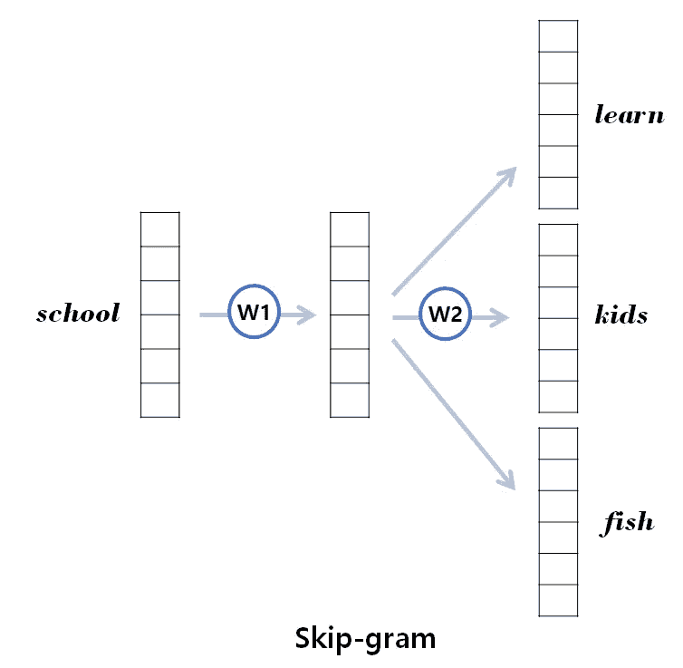
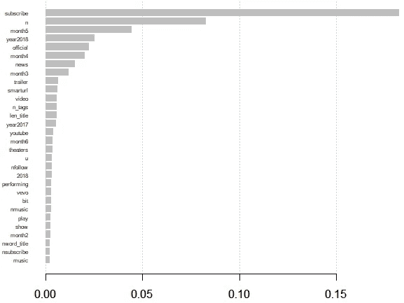

# 成为成功 Youtube 的策略:广泛的 Youtube 探索性分析(第二部分)

> 原文：<https://towardsdatascience.com/strategies-to-be-a-successful-youtuber-extensive-youtube-exploratory-analysis-part-2-2-6862cd4f40be?source=collection_archive---------17----------------------->

关于文字嵌入和预测 Youtube 上的浏览量的初学者指南


这是为 Youtubers 开发数据驱动策略的文章的第二部分。在之前的帖子中，我们对 Youtube 的统计数据进行了深入的数据分析。如果你还没有查看第一部分的话，请花点时间看看成为一名成功的优步者的策略是什么。对于第二部分，正如我之前提到的，我们将基于视频内容预测视图。我也将在简单的英语中揭开单词嵌入的神秘面纱。这个项目的数据集和完整代码可以在我的 [Github](https://github.com/jjone36/Youtube) 上找到。好吧！该机器学习了。

# 从一键编码到单词嵌入

机器学习算法主要处理数值变量。他们对文字没有概念。就像一个除了哭什么都不知道的婴儿(在这种情况下可能是错误信息)，他们对“苹果”、“狗”或“我”、“我”和“你”没有任何概念。因此，当我们处理文本数据时，当我们要教他们人类语言时，我们必须将数据转换成数字类型。这是贯穿所有自然语言处理的基本概念。

那么我们如何将单词转换成数字形式呢？我们能想到的第一种方法是把它们当作一个二元因素变量。这就是一热编码的由来。我们制作一个包含 1 和许多 0 的稀疏矩阵来表示一个单词在句子中的存在。如果你不熟悉 one-hot-encoding，请查看[我之前的帖子](/hands-off-keyboard-warrior-text-mining-with-toxic-comments-6603ee3bc12e)。它逐步涵盖了文本挖掘的基础。然而，这种方法的局限性是没有语义信息。它对单词“猫”和“狗”、“是”和“我”都一视同仁。我们想要的不止于此。我们希望机器理解语言的真正含义。那怎么才能把课文的意思教给我们天真的宝宝呢？

# 欢迎来到世界的向量空间

老实说，我不擅长记名字。每当我有话要说，但找不到合适的词时，我总是这样说，“那是什么？”？“那是什么？”。有趣的是，我从来没有立刻得到确切的单词，而是像在黑暗中一样不断摸索，当我想说“猫鼬”时，我会说类似的话，如“松鼠”或“狐狸”这就是我们大脑的工作方式。相关的单词被紧密地放置在我们的“大脑空间”中。

单词嵌入也以同样的方式工作。让我们想象有一个很大的空白板。这是一个坐标平面，一个向量空间。我们手里有单词卡。这是我们的文本数据，术语。我们将以一种“有意义”的方式将这些卡片贴在板上。怎么会？简单！将语义相似的单词放在一起。


让我们看一个简单的例子。我们有 ***猫、狗、女王、国王、女人、*** 和 ***男人*** 的字卡。我们可以把群体做成像 ***猫******狗******女王******国王******女人*** 和*男人* 这样的群体。还可以有更大的群体，像[ ***猫，狗*** ]和[ ***qeen，king，woman，man*** 。然后我们可以像上面一样把它们放到平面上。

当我们把单词放在坐标平面上时，我们给了它们位置或坐标。本例中， ***皇后***at(8，2)***国王*** at (6，4)***女子*** at (6，1)***男子*** at (4，3)。你注意到这里有一个窍门吗？ ***女王*** 和 ***国王*** 之间的距离与 ***女人*** 和 ***男人*** 之间的距离相同。这就是单词嵌入的真正威力所在。在向量空间中，单词之间的距离是关键点，语义存在于其中。我们甚至可以计算这类问题:什么是 ***王*——*男* + *女*？**答案是， ***女王*** ！


这是一个简单的向量空间，你做的是向量计算。现在，我们正在向机器教授真正的人类语言。他们似乎能理解一些单词的意思。但是还有一个问题。如何才能判定单词之间的相似度？你不能随心所欲地摆放它们。我们需要一个逻辑计算机制，不是吗？

# 物以类聚，人以群分

计算单词间相似度的一种方法是计算共现次数。一个词 ***A*** 伴随一个词 ***B*** 出现的频率有多高。如果他们经常一起出现，他们有很高的相似度。如果很少一起出现，则相似度低。喜欢..就像你和你的朋友一样。让我们以这句话为例。


我们要数一数 ***女王*** 和 ***国王*** 聚在一起的频率或者 ***女王*** 和 ***城堡*** 出现在邻居家的频率。你觉得 ***皇后*** 和 ***国王*** 近到可以称之为邻居吗？那么 ***女王*** 和 ***城堡*** 呢？是的，你用什么标准会不一样。我们称之为窗口函数和窗口大小。


***女王*** 是我们的重点词。在这种情况下，我们只接受焦点单词两边的一个单词。****原来是*** 。于是 ***女王*** 就对应于此。*

**

*这次让我们把窗户开大一点。我的意思是增加窗口大小。我们会接受两边各两个字。因此 ***城堡*** 和 ***美丽的*** 也可以成为 ***女王*** 的邻居。*

**

*上下文窗口将不断切换焦点词，扫描它的邻居。如果我们把结果做成一个矩阵，我们会得到这个矩阵。*

**

*这是窗口大小为 2 的共生矩阵。根据矩阵， ***城堡*** 对应【1，1，0，1，1，0，0，0，0】，而 ***对应【0，1，1，0，1，2，1，1】。我们现在可以知道哪些词经常出现在一起，这意味着上下文相似度很高。****

# *你是在预测还是在计算？*

*向量化单词意味着给它们在向量空间中一个位置。通过这样做，我们可以将语义嵌入到向量中，并通过距离进行推理。矢量化有两种不同的方法，Word2vec 和 GloVe。*

*Word2vec 是一个“预测”模型，通过分析一个单词的邻居来确定该单词的含义。Word2vec 的一个例子是连续单词包，或 CBOW。它从周围的上下文单词中预测目标单词。*

**

*看一下上图。你能预测蓝色卡片后面的单词是什么吗？CBOW 就是这么运作的。它从当前上下文单词中预测一个单词。*

*Word2vec 的另一种情况是 skip-gram，预测的方向是相反的。它使用当前单词来预测其上下文单词。什么词可以作为它的邻居？*

**

*CBOW 和 Skip-gram 这两个模型由具有损失函数的浅层神经网络来训练。下图是 CBOW 和 Skip-gram 的简图。使用 CBOW 模型，我们输入类似于 ***learn*** 、 ***kids*** 和 ***fish*** 的上下文词，并期望在输出层获得 ***school*** 的矢量化值。相反，使用 Skip-gram 我们输入目标单词 ***学校*** 并得到输出 ***学习*** 、 ***孩子*** 和 ***鱼*** 。*

****

*另一方面，GloVe(代表全局向量)是一个“基于计数”的模型。他们使用整个语料库的共现矩阵，并计算一个单词 ***k*** 在另一个单词 ***w*** 的上下文中出现的频率。例如，我们通过条件概率 P( ***校***|**|*学*** )来统计 ***学*** 的上下文中 ***校***出现的频率。这些值将是包含单词间上下文关系的单词嵌入的结果。想象一下，考虑到 GloVe 与“全球”语料库一起工作，结果矩阵会有多大。它将是巨大的，具有高稀疏性。因此，我们需要分解矩阵，得到一个较低的维度。通过 LSA 或 LDA 等方法，我们对其进行因子分解，得到 DTM(文档-术语矩阵)或 TCM(术语共现矩阵)。*

*如果您感到困惑，请记住 Word2vec 是一个预测模型，它使用本地上下文窗口，而不是直接使用共现统计数据，而 GloVe 是一个基于计数的模型，具有全局共现统计数据。哪个更好？他们都擅长捕捉语义。您应该有的问题是哪一个将更恰当地表示您的数据。生成的向量显示数据的上下文含义的效果如何。因此，理解每种方法是如何嵌入语义的是至关重要的。对于那些想更深入地研究单词嵌入的人，我会在这篇文章的最后留下一些参考资料。*

# *用 R 嵌入单词*

*太好了！现在，我们准备将这一惊人的技术应用到我们的 Youtube 数据中。让我们先检查一下我们的数据。*

```
*# Importing data
us = read_csv('us.csv')
head(us)*
```

****

*为了让你更好的理解，我稍微改变了列的顺序。我们的数据集中总共有 40949 个视频和 2207 个不同的频道。所以`n`在这里表示每个频道的视频总数。首先，我将预处理文本数据(标题、标签和描述)。*

```
*# selecting text columns and combining into one
us_text = us %>%
  select(title, tags, description) %>%
  mutate(text = paste(title, tags, description))us_text$text = gsub(us_text$text, 
                    pattern = '[^[:alnum:]]', replacement = ' ')
us_text$text = tolower(us_text$text)*
```

*用 text2vec 包嵌入单词的过程如下:*

1.  *使用迭代器创建词汇表，词汇表是所有文档中唯一单词的列表。假设我们正在用训练集中的单词编写一本词典。*
2.  *删减词汇，因为会有很多无关紧要的词。*
3.  *向量化词汇，这是创造一个词的结构*
4.  *使用迭代器和矢量化词汇，制作 DTM。我们也可以应用 Tf-Idf，得到调整后的 DTM。*

```
*# creating an iterator and a vocabulary
it = itoken(iterable = us_text$text,
            tokenizer = word_tokenizer)v = create_vocabulary(it, stopwords = stopwords('en')) %>%
  prune_vocabulary(doc_proportion_max = .5, term_count_min = 5)vectorizer = vocab_vectorizer(v)
print(v)# casting into dtm with Tf-Idf
dtm = create_dtm(it, vectorizer)
tfidf = TfIdf$new()
dtm_tfidf = fit_transform(dtm, tfidf)dim(dtm_tfidf)*
```

*结果`dtm_tfidf`有 40949 行和 60966 列。是啊！我们成功了。整个文本数据被标记为 60966 列。你刚刚把单词的真正“含义”教给了机器！*

# *预测视图*

*将单词 vectors 给前面的模型是完全没问题的。但为了准确起见，我想添加其他功能。有三种特征，时间变量、二进制因子变量和数字计数变量。如下所示，我做了单独的特征工程。*

```
*# feature engineering with time variables
us_time = us_time %>%
  select(publish_time) %>%
  mutate(year = year(publish_time),
         month = month(publish_time), 
         day = day(publish_time), 
         hour = hour(publish_time), 
         wday = wday(publish_time)) %>%
  select(-publish_time) %>%
  mutate_all(factor)# encoding factor variables into integer
us_factor = us %>%
  select(comments_disabled, ratings_disabled,video_error_or_removed) %>%
  mutate_all(factor) %>%
  mutate_all(as.integer)# preprocessing numeric variables
us_count = us %>%
  select(channel_id, n, views, subscribe, len_title, nword_title, n_tags) %>%
  group_by(channel_id) %>%
  mutate(subscribe = log1p(mean(subscribe))) %>%
  ungroup() %>%
  select(-channel_id) %>%
  mutate(views = log1p(views))*
```

*每个频道的`subscribe`值不是恒定的，会有微小的波动。这可能是由于从网上抓取数据时的时间差，所以我把它们的平均值。另外，`subscribe`和`views`的分布是指数分布，所以我把它们转换成对数分布。我排除了`likes`、`dislikes`和`comment_counts`变量，因为它们发生在人们观看视频之后。因此不适合用它们来预测视图。*

```
*# binding by column
full = cbind(us_time, us_factor, us_count)# splitting data into train and test set
part = sample(x = nrow(full), size = nrow(full)*0.8)tr_te = full %>%
  select(-views) %>%
  model.matrix(~.-1, .) %>%
  cbind(dtm_tfidf)tr = tr_te[part, ]
tr_y = full$views[part]te = tr_te[-part, ]
actual = full$views[-part]*
```

*我把所有预处理过的数据合并成一个。为了确保随机性，我将整个集合进行了洗牌，并将其分为训练集和测试集。接下来，我将它们放入 DMatix 对象中。我使用了 Xgboost 并得到了如下的变量重要性图。哪些变量在预测中发挥了重要作用？*

```
*# putting into two seperate Dmatrixs objects
dtr = xgb.DMatrix(tr, label = tr_y)
dte = xgb.DMatrix(te)# fitting the model
myParam <- list(objective = "reg:linear",
                booster = "gbtree",
                eval_metric = "rmse",
                nthread = 6,
                eta = 0.05,
                max_depth = 8,              
                min_child_weight = 5,
                subsample = 0.7,
                colsample_bytree = 0.7)model_xgb = xgboost(dtr, tr_y, param = myParam, 
                    nrounds = 5000, print_every_n = 100, 
                    early_stopping_rounds = 100)# predicting
pred_xgb = predict(model_xgb, dte)# ploting the importance of the features
xgb.importance(feature_names = names(tr), model = model_xgb) %>% 
  xgb.plot.importance(top_n = 30)*
```

**

*订户号码是最关键的特征。频道`n`的视频数量紧随其后。我们还可以看到`month6`、`month4`或`month3`，分别表示发布于 6 月、4 月和 3 月的视频。我们可以得出这样的结论:用户数量、上传视频的时间、足够的标题长度以及对热点新闻的报道能够带来更多的关注。*

# *结论*

*如果你想得到一个更精确的模型，每个主题的模型会更好。由于每个主题的用户有不同的模式(就像我们上次看到的那样)，最好将每个主题的数据分开。有各种单词嵌入算法，它们是高级版本或以不同方式执行。因此，选择更好地表示数据的方法可以提高准确性。*

*我们可以在各种领域使用单词嵌入。它甚至可以应用于非 NLP 数据。在结束这篇笔记之前，我想给你介绍两个有趣的可以启发你的项目。一个是[使用 word2vec 进行音乐推荐](/using-word2vec-for-music-recommendations-bb9649ac2484)的 [Ramzi Karam](https://medium.com/u/f0b042f4ac2d?source=post_page-----6862cd4f40be--------------------------------) 另一个是[为学生量身定制数学练习](/a-non-nlp-application-of-word2vec-c637e35d3668)的 [Kwyk](https://medium.com/u/1354d75818ea?source=post_page-----6862cd4f40be--------------------------------) 。*

# *资源*

*   ***[**Suvro baner JEE**](https://medium.com/u/ac3247b15c91?source=post_page-----6862cd4f40be--------------------------------)对单词嵌入整体步骤的精彩讲解:[https://medium . com/explore-artificial-intelligence/word 2 vec-a-baby-step-in-deep-learning-but-a-giant-leap-forward-natural-language-processing-40 Fe 4 e 8602 ba](https://medium.com/explore-artificial-intelligence/word2vec-a-baby-step-in-deep-learning-but-a-giant-leap-towards-natural-language-processing-40fe4e8602ba)***
*   *****更多关于 word 2 vec**:[https://blog . acolyer . org/2016/04/21/the-amazing-power-of-word-vectors/](https://blog.acolyer.org/2016/04/21/the-amazing-power-of-word-vectors/)***
*   *****关于 GloVe 的更多信息**:[https://blog . acolyer . org/2016/04/22/GloVe-global-vectors-for-word-representation/](https://blog.acolyer.org/2016/04/22/glove-global-vectors-for-word-representation/)***
*   *****还在混淆 Word2Vec 和 GloVe 吗？**:[https://www.quora.com/How-is-GloVe-different-from-word2vec](https://www.quora.com/How-is-GloVe-different-from-word2vec)***
*   *****如何使用 text2vec 包**:[https://srdas.github.io/MLBook/Text2Vec.html](https://srdas.github.io/MLBook/Text2Vec.html)***

***感谢您的阅读，希望这篇文章对您有所帮助。如果有需要改正的地方，请分享你的见解！你的掌声让一个有抱负的数据科学家在地板上跳舞。👏 👏 👏我总是乐于交谈，所以请随时通过 LinkedIn 联系我。我将带来另一个激动人心的故事。在那之前，机器学习快乐。***