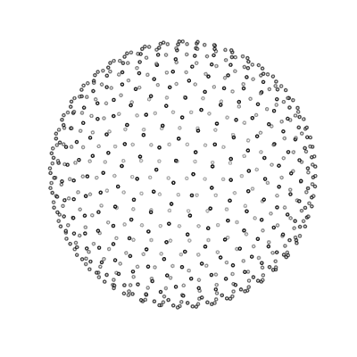

# 愚蠢的张量流技巧

> 原文：<https://towardsdatascience.com/stupid-tensorflow-tricks-3a837194b7a0?source=collection_archive---------2----------------------->

## 对一个老(汤姆逊)问题的新看法

谷歌的机器智能库 [TensorFlow](https://www.tensorflow.org/) (TF)，已经成为深度学习的代名词。尽管名字如此，深度学习只涉及几件简单的事情，复杂性来自于将这些简单的事情重复数百万次(具体来说，它是数百万个初等函数的组合)。要“解决”TF 中的一个问题，你需要找到某个函数的最小值。难的是 [*反推*](https://en.wikipedia.org/wiki/Backpropagation) 需要这个庞大函数的导数。这是 TF 的优势所在，因为它消除了算法微分的苦差事，并自动将计算转移到 GPU。这可以让你做出惊人的事情，比如写莎士比亚或者画猫。然而在实践中，该框架可以解决任何可微最小化问题。我想看看我能把这个想法推进到什么程度。

Electrostatic charge configuration for N=625 in equilibrium. Global minima? Probably not.

[汤姆逊问题](https://en.wikipedia.org/wiki/Thomson_problem)是一个经典的物理学问题，“单位球面上的 *N 个*正电荷的什么构型使能量最小？”。每对电荷的势能是 *1/r* ，所以我们试图最小化的函数是所有电荷的成对总和。

看起来很简单，对吧？对于 *N* 的低值，是。 *N=2* 将两个电荷放置在球体的两极对立处， *N=3* 将三个电荷放置在赤道上的同心环中， *N=4* 给出一个[四面体](https://en.wikipedia.org/wiki/Tetrahedron)。较大的 *N* 值，尤其是当 *N* 为质数时，打破这些好看的几何描述。 *N=11* 将电荷置于完全打破对称性的配置中——当电荷处于平衡状态时，它们的分布方式是一边比另一边多；它有净偶极矩！

在 TF 中解决这个问题出奇的容易。我们将输入变量设置为在单位球面上进行归一化，计算对称距离矩阵，并提取所有唯一的成对距离。势能是所有这些 *1/r* 距离的总和，所以我们用它作为目标函数。

运行模型和保存配置需要更多的工作。该项目的细节存储在这个 [github repo](https://github.com/thoppe/tf_thomson_charges) 中。

我们的模型效果如何？对于 *N* 的任何值，我们可以在几秒钟内收敛到稳定的解能量最小值，并且我们可以通过降低学习速率在几分钟内将其改进到完全浮点精度。随着 *N* 变大，我们发现越来越多的解是稳定的(梯度为零)，但不是*全局*最小值。我们可以将这些解决方案与发布在维基百科[上的解决方案进行比较，维基百科](https://en.wikipedia.org/wiki/Thomson_problem#Configurations_of_smallest_known_energy)列出了 470 种配置。对于 *N* 的低值，找到的第一个解是已知的最佳解。大约在 *N > 30，*这一过程会变慢，并且需要更长的时间才能找到已知解。这些“几乎”解在能量上非常接近全局解，但成为未经加工的钻石——这是一种罕见的特殊配置，使其区别于无数其他解决方案。

TensorFlow 在 GPU 上的计算在这里表现令人钦佩。使用大值 *N=2000，*我的GTX-980 *G* PU 每秒计算 38 次迭代而我可怜的 8 核 CPU 每秒只能计算 3.6 次迭代。这是令人印象深刻的 10 倍加速！

Minimal energy for N=100 charges, prettified.

即使我们知道这可能不是整体的最小值，视觉化的组态也能说明规则性和明显的对称性。在 python 绘图库 matplotlib 中这样做，真的是把它推到了绝对的极限！虽然 3D 可视化不是我的强项，但我发现你可以通过以正弦和余弦控制的速率旋转相机角度来获得不错的结果。

对我来说，这是一个有趣的项目；这是一个清晰而简单的过程，通过有形的回报可以获得新的知识。这就是低垂的果实的缩影。有多少其他简单的项目可以用算法差异和 GPU 加速来加速？

我们还可以用 TensorFlow 做什么？

留下评论或链接到其他一些愚蠢的 TensorFlow 技巧。