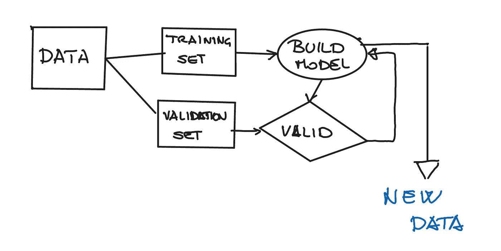
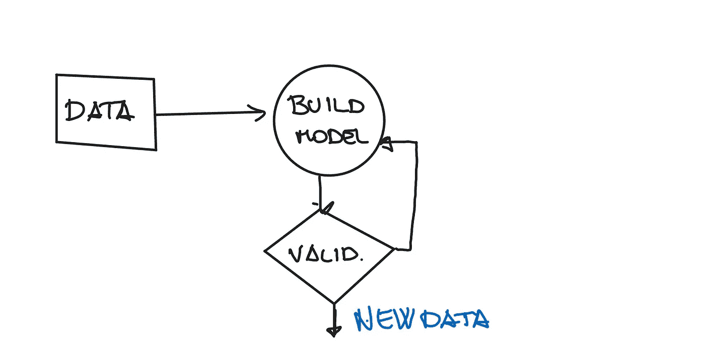

# 有监督、无监督和深度学习

> 原文：<https://towardsdatascience.com/supervised-unsupervised-and-deep-learning-aa61a0e5471c?source=collection_archive---------0----------------------->

机器学习已经成为，或者仅仅是，人工智能，特别是计算机科学的一个重要分支，所以数据科学家是一个非常受欢迎的职位。今天，每个人都可以使用一些机器学习工具，如 TensorFlow 或其他工具，开始编写代码，并说“Ehy 我编写了具有机器学习功能的 bla bla”，但如果不知道这些算法是如何工作的，就很容易犯下巨大的错误。因此，了解机器学习的基础知识，然后建立其他技能非常重要。

这篇介绍首先要让我记住这一点。

让我们从 be 基础知识开始:机器学习中的第一个概念之一是有监督的，无监督的和深度学习的区别。

## 监督学习

监督学习是最常见的机器学习形式。使用监督学习，在训练阶段将一组示例(训练集)作为输入提交给系统。每一个输入都标有一个期望的输出值，这样系统就知道输入来的时候输出如何。例如，考虑一些可以分为 N 个不同类别的实验观察。所以我们有一个训练集(一系列对){(x1，y1)，(x2，y2)…..其中是输入，yi 是相应输出的类。通过最小化特定的成本函数来执行训练，该成本函数表示来自输入 xi 和期望输出 yi 的界限。

Supervised learning schema

监督机器学习应用的一个典型例子是垃圾邮件检测器，这个算法是用一些垃圾邮件，而不是垃圾邮件以及它们属于哪个组来训练的。当您将邮件标记为“垃圾邮件”或当您将垃圾邮件文件夹中的邮件标记为“非垃圾邮件”时，此训练过程将继续。

## 无监督学习

另一方面，无监督学习，由系统提供的训练样本没有用所属类别来标记。因此，系统开发和组织数据，搜索它们之间的共同特征，并根据内部知识进行更改。

Unsupervised learning schema

无监督学习的一个例子是聚类分类:算法试图将相似的东西放在一个簇中，将不相似的东西放在另一个簇中，相似性的概念取决于相似性度量。

## 深度学习

深度学习(DL)技术代表了机器学习向前迈出的一大步。DL 是基于人类大脑处理信息和学习的方式。它存在于一个由若干级表示组成的机器学习模型中，其中每一级都使用来自前一级的信息进行深度学习。在这个模型中，每一层都对应于大脑皮层的一个不同区域，每一层都以与人脑相同的方式提取更多的信息。

Deep learning schema

*参考文献:*

*   *机器学习在行动——彼得·哈灵顿*
*   【TensorFlow 入门— Giancarlo Zaccone