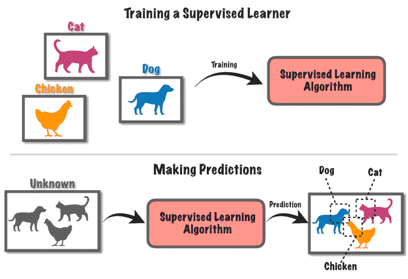
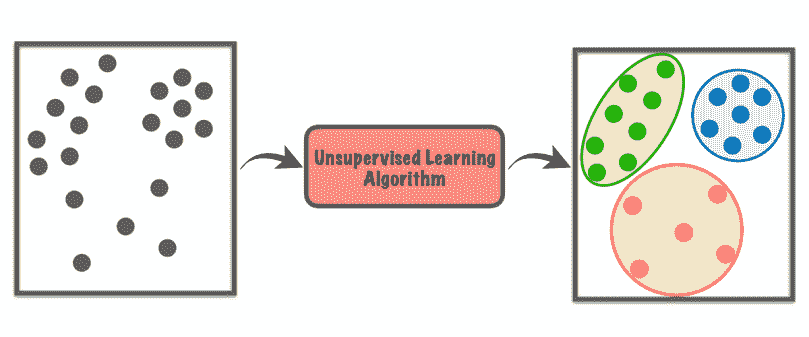

# 3 分钟内监督与非监督学习

> 原文：<https://towardsdatascience.com/supervised-vs-unsupervised-learning-in-2-minutes-72dad148f242?source=collection_archive---------8----------------------->

## 机器学习算法一般可以分为两类，*有监督的*或者*无监督的*。这是一个二分法的简要概述。

# 监督学习

监督学习算法获取数据集，并使用其特征来学习与相应标签集的某种关系。这个过程被称为训练，一旦完成，我们希望我们的算法能够很好地预测全新数据的标签，在这些数据中，算法没有真正标签的明确知识。例如，我们可以使用一组常见动物的图像以及它们相应的标签(例如，狗、猫、鸡)来训练一个受监督的算法。该算法将利用图像中的有用特征，如*腿的数量*或*颜色*，以找到将图像与其正确标签联系起来的有用模式。在成功训练后，我们可以使用完全训练的算法来尝试预测一组全新的未见过的图像的标签。我们通常通过算法在预测这些新的看不见的图像时的准确性来判断算法的性能。监督学习可以应用于广泛的问题，如垃圾邮件检测或股票价格预测。[决策树](/decision-trees-60707f06e836)是监督学习算法的一个例子。

# 无监督学习

另一方面，无监督学习算法处理没有明确标记的数据。相反，无监督算法试图在数据中找到某种潜在的结构。一些观察结果是否被分组？不同特性之间有没有有趣的关系？哪些特征携带了大部分信息？与监督学习不同，通常不需要训练无监督算法，因为它们可以直接应用于感兴趣的数据。此外，与监督学习相比，评估无监督学习算法的性能有些主观，并且很大程度上取决于任务的具体细节。无监督学习通常用于文本挖掘和降维等任务。 [K-means](/k-means-a-complete-introduction-1702af9cd8c) 是非监督学习算法的一个例子。

# 打破二分法

近年来，出现了许多不太适合监督和非监督标签的范例。**半监督学习**听起来就像是一种结合了一些标记数据和一些未标记数据的方法。标注通常是一个昂贵且耗时的过程，因此在很多情况下，我们希望使用来自少量已标注数据和大量未标注数据的信息。与这种情况相关的还有**主动学习**，其中学习算法可以询问用户来标记将添加最多信息的特定观察。一个稍微不同的情况是，我们希望算法从经验中学习。例如，在像国际象棋这样的游戏场景中，我们可能希望通过玩许多游戏并使用每场游戏结果的某种标签来学习算法。在一个非常高的层面上，我们可能希望好的举措会被贴上赢的标签，而坏的举措可能与输相关联。这被称为**强化学习**，近年来受到了很多关注。大多数机器学习方法在它们可以完成的任务方面都非常狭窄，而**元学习**关注的是通用性或*学会学习*。一个例子可能是一种算法，它应该识别图像中的动物，但只对猫和狗进行训练。在这种情况下，一个好的元学习算法将能够识别它尚未见过的全新动物。有很多其他的方法并不完全适合有监督或无监督的学习，但是我希望这篇文章对这个主题有一个有用的介绍。

*所有图片均为本人所有。*