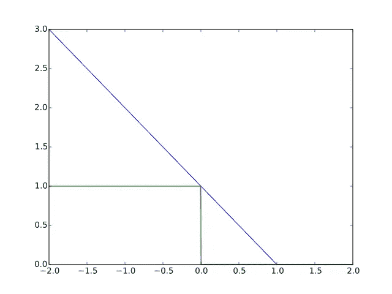
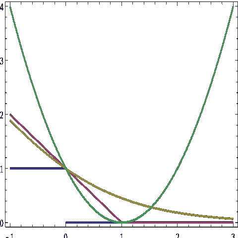

# 支持向量机(直观理解)——第一部分

> 原文：<https://towardsdatascience.com/support-vector-machines-intuitive-understanding-part-1-3fb049df4ba1?source=collection_archive---------2----------------------->

## 与逻辑回归和铰链损失的比较

网上关于这个话题的大部分材料都是用数学和很多细节来处理的，人们很容易失去对更广泛概念的理解。这里试图用很少的数学处理来直观地理解 SVM 的大部分细节。唯一的基本假设是，读者已经知道一些数学基础、逻辑回归以及机器学习的基本术语和概念。我计划在 3 个部分中涵盖这个主题"**支持向量机(直观理解)"**。在第一部分，我们将看看 SVM 的损失函数。

让我们从我们对逻辑回归的理解以及 SVM 与逻辑回归的区别开始。

在逻辑回归中，线 L1 定义了输入空间的概率分布。如果与 L2 线定义的分布相比，平均而言，L1 定义的分布在等级“-1”点较低，在等级“+1”点较高，则称 L1 线优于 L2 线。

SVM 的几个主要观点在概念上不同于逻辑回归—

**第一部分**:损失函数

**第 2 部分**:最大边际分类——在非常基本的层面上，在 SVM，如果 L1 的“边际”更大，即 L1 离这两个类别更远，则 L1 线被认为是比 L2 线更好的分类器。

**第三部分**:使用内核技巧的特征转换

让我们一个一个地看——

损失函数:首先，让我们从损失函数开始

让我们以一个简单的二元分类任务为例。然后，对于给定的输入特征“X”和目标“y”，SVM 算法的目标是为每次观察预测接近目标(“实际 y”)的值(“预测 y”)。来做这件事—

1.  我们对一个可以计算“预测 y”的方程感兴趣。该等式取决于输入 x 的一些加权值，可以写成:

***'预测 y ' = f(X 的加权值)。***

让我们用 w 来表示我们的重量。

1.  我们可以通过绘制随机决策边界(又名。这与预测“预测的 y”)的一些随机值是相同的，并且这正是当我们用随机值初始化上述等式中的权重时所发生的。
2.  确定成本/损失函数。损失函数的任务是量化“预测 y”和“实际 y”之间的误差。简而言之，这定义了您想要对错误分类的观察进行惩罚的数量。因此，直觉上，“预测的 y”离“实际的 y”越远，惩罚就应该越大，反之亦然。给定我们在特定迭代中产生的总误差量，我们试图通过调整下一次迭代的权重来减少该误差。这种情况一直持续到我们无法再最小化总误差/成本**。**总误差/成本函数如下:

***总误差/成本=迭代中每个观测值所有损失的总和。***

4.在所有迭代结束时，我们得到的最终权重形成了我们用于预测未知数据的最终模型。

因此，对于 SVM，使用了一个称为“铰链损失”的损失函数——参考下图(*来自维基百科)*。

**Plot of hinge loss on y-axis and ‘predicted *y’* on x-axis.**

注意，从上面的图(蓝线)可以看出，当

*   “预测的*y”*≥1 且
*   实际的 *y'* 和预测的*'*y '具有相同的符号(意味着‘预测的 *y'* 预测正确的类)

但当'实际 *y '，'预测*y '符号相反时，铰链损耗随 *y* 线性增加(单边误差)。

SVM 使用铰链损失作为逻辑回归，使用逻辑损失函数优化成本函数并得出权重。铰链损失不同于逻辑损失的方式可以从下面的图中理解(*来自维基百科——紫色是铰链损失，黄色是逻辑损失函数*)。

Plot of various loss functions — Purple is the hinge loss function. Yellow is the logistic loss function.

请注意，黄线逐渐向下弯曲，不像紫色线，紫色线的“预测 y”值≥1 时，损失为 0。通过观察上面的图表，曲线的这种性质揭示了逻辑损耗和铰链损耗之间的一些主要差异

*   请注意，逻辑损失比铰链损失发散得更快。所以，一般来说，它会对异常值更敏感——为什么？因为，假设在我们的数据中有一个异常值，逻辑损失(由于其发散的性质)与异常值的铰链损失相比将非常高。这意味着对我们的权重进行更大的调整。
*   请注意，即使该点被充分自信地分类，逻辑损失也不会变为零——水平轴是“预测 y”值的置信度，如果我们在 x 轴上取值为“1.5”，则相应的逻辑损失(黄线)仍会显示一些损失(从上面的图中接近 0.2，因此对我们的预测仍不太有信心)，而铰链损失为“0”(这意味着没有损失，我们对我们的预测更有信心)。逻辑损失的这种性质可能会导致准确性的轻微下降。
*   逻辑回归有更多的概率解释。

基于对 SVM 铰链损失函数的理解，让我们在成本中加入一个正则项(L2 范数)。正则化项背后的直觉是，如果权重值很高，我们会增加成本损失。因此，在尝试最小化成本的同时，我们不仅调整权重，还尝试最小化权重的值，从而减少对训练数据的过度拟合，并使模型对异常值不那么敏感。

因此，添加正则化项后，总成本函数最终看起来像:

***总成本= ||w ||/2 + C*(每次观测的所有损失之和)***

其中“C”是控制正则化量的超参数。

根据我们选择的“C”的值，我们可以有一个硬边界分类器和一个软边界分类器。

*   如果 C 选择得足够小，使得总成本中的第二项可以忽略，那么我们称之为硬边界分类器。在这种情况下，我们在每次迭代中只最小化第一项(||w ||/2)，以达到调整后的权重。
*   如果 C 选择得足够大，则第二项不能被忽略，并且我们得到软边缘分类器。

在下一部分，我们将看看到底是什么原因导致 SVM 超平面远离自己(又名。最大化边缘)以便实现最大边缘分类器的概念。我们还将了解保证金的价值。